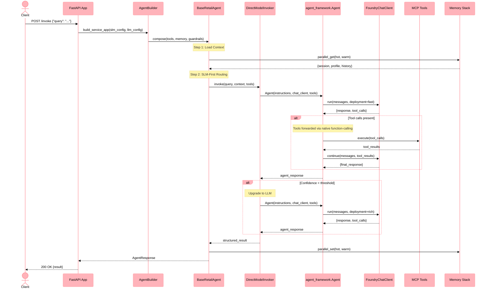

# Sequence Diagram: DirectModelInvoker Flow

This diagram illustrates the canonical agent invocation flow using the Microsoft Agent Framework (MAF) `DirectModelInvoker`, which constructs `agent_framework.Agent` in-process over a pluggable `ChatClient`.

## Flow Overview

1. **Request** → FastAPI endpoint receives invoke request
2. **Agent Build** → `AgentBuilder` composes agent with tools, memory, and model config
3. **Model Routing** → SLM-first assessment, optional upgrade to LLM
4. **MAF Invocation** -> `DirectModelInvoker` delegates to in-process `agent_framework.Agent`
5. **Tool Execution** -> Tools forwarded through native MAF function-calling
6. **Response** → Structured result returned through the agent pipeline

## Sequence Diagram

## Key Design Decisions

- **MAF direct-model runtime**: Tools are registered with the in-process `Agent` and forwarded through native MAF function-calling. No portal-managed Foundry Agent record is required at runtime.
- **Parallel memory I/O**: Hot and warm memory are read/written concurrently via `asyncio.gather`.
- **SLM-first with LLM upgrade**: Every request starts with the fast (SLM) model; only complex queries escalate to the rich (LLM) model.

## Related

- [ADR-010: Model Routing](../adrs/adr-010-model-routing.md)
- [Agent Library Reference](../components/libs/agents.md)
- [Components Overview](../components.md)
