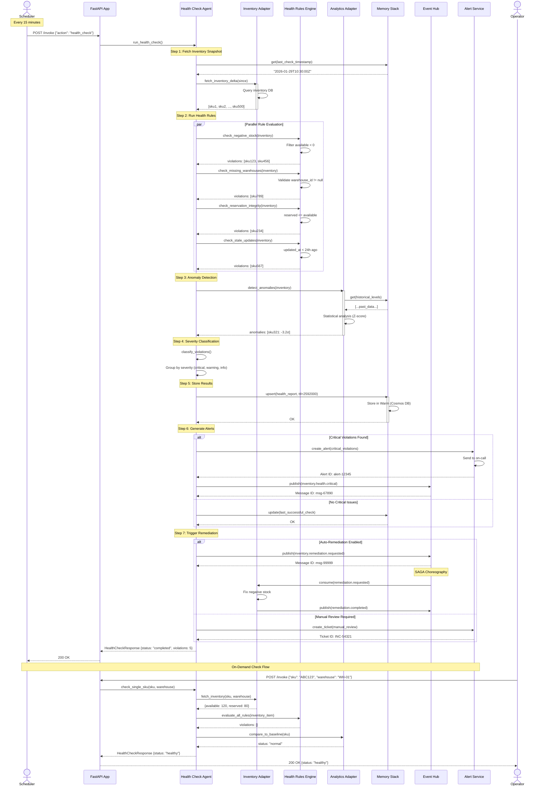

# Sequence Diagram: Inventory Health Check Flow

This diagram illustrates the inventory health validation process in the Holiday Peak Hub accelerator.

## Flow Overview

1. **Scheduled Trigger** → Health check job starts
2. **Inventory Fetch** → Pull current inventory snapshot
3. **Rule Evaluation** → Apply health rules (negative stock, missing warehouses, etc.)
4. **Anomaly Detection** → Identify outliers and trends
5. **Alert Generation** → Create notifications for violations
6. **Remediation** → Trigger corrective actions

## Sequence Diagram



## Health Rules

### 1. Negative Stock Check
```python
def check_negative_stock(inventory: list[InventoryItem]) -> list[Violation]:
    """Flag items with negative available quantity."""
    violations = []
    for item in inventory:
        if item.available < 0:
            violations.append(Violation(
                sku=item.sku,
                rule="negative_stock",
                severity="critical",
                message=f"Available quantity is {item.available}",
                current_value=item.available,
                expected_value=">= 0"
            ))
    return violations
```

### 2. Missing Warehouse Check
```python
def check_missing_warehouses(inventory: list[InventoryItem]) -> list[Violation]:
    """Flag items without warehouse assignment."""
    violations = []
    for item in inventory:
        if not item.warehouse_id:
            violations.append(Violation(
                sku=item.sku,
                rule="missing_warehouse",
                severity="warning",
                message="No warehouse assigned"
            ))
    return violations
```

### 3. Reservation Integrity Check
```python
def check_reservation_integrity(inventory: list[InventoryItem]) -> list[Violation]:
    """Flag items where reservations exceed availability."""
    violations = []
    for item in inventory:
        if item.reserved > item.available:
            violations.append(Violation(
                sku=item.sku,
                rule="invalid_reservation",
                severity="critical",
                message=f"Reserved ({item.reserved}) > Available ({item.available})",
                current_value=item.reserved,
                expected_value=f"<= {item.available}"
            ))
    return violations
```

### 4. Stale Data Check
```python
def check_stale_updates(inventory: list[InventoryItem]) -> list[Violation]:
    """Flag items not updated in 24 hours."""
    violations = []
    cutoff = datetime.now() - timedelta(hours=24)
    for item in inventory:
        if item.updated_at < cutoff:
            violations.append(Violation(
                sku=item.sku,
                rule="stale_data",
                severity="info",
                message=f"Last updated {item.updated_at}",
                current_value=item.updated_at.isoformat(),
                expected_value=f"> {cutoff.isoformat()}"
            ))
    return violations
```

## Anomaly Detection

### Statistical Approach (Z-Score)
```python
async def detect_anomalies(inventory: list[InventoryItem]) -> list[Anomaly]:
    """Detect statistical outliers in inventory levels."""
    anomalies = []
    
    for item in inventory:
        # Fetch 30-day history
        history = await memory.warm.query(
            "SELECT c.available FROM c WHERE c.sku = @sku AND c.timestamp > @cutoff",
            parameters=[("@sku", item.sku), ("@cutoff", thirty_days_ago)]
        )
        
        if len(history) < 10:
            continue  # Not enough data
        
        # Calculate Z-score
        mean = statistics.mean(h.available for h in history)
        stdev = statistics.stdev(h.available for h in history)
        z_score = (item.available - mean) / stdev if stdev > 0 else 0
        
        # Flag if > 3 standard deviations
        if abs(z_score) > 3:
            anomalies.append(Anomaly(
                sku=item.sku,
                z_score=z_score,
                current=item.available,
                mean=mean,
                stdev=stdev,
                severity="critical" if abs(z_score) > 5 else "warning"
            ))
    
    return anomalies
```

## Remediation Actions

### Auto-Fix: Negative Stock
```python
async def fix_negative_stock(sku: str, warehouse: str):
    """Set negative stock to 0 and log for investigation."""
    
    # Set to 0
    await inventory.update(sku, warehouse, available=0)
    
    # Log incident
    await memory.warm.upsert({
        "id": f"incident:{uuid4()}",
        "partition_key": "incidents",
        "type": "negative_stock_fixed",
        "sku": sku,
        "warehouse": warehouse,
        "timestamp": datetime.now().isoformat(),
        "action": "set_to_zero"
    })
    
    # Create ticket for root cause analysis
    await alerts.create_ticket(
        title=f"Investigate negative stock: {sku}",
        description=f"Auto-fixed negative stock for {sku} at {warehouse}",
        priority="medium"
    )
```

### Auto-Fix: Invalid Reservations
```python
async def fix_invalid_reservations(sku: str, warehouse: str):
    """Cap reservations at available quantity."""
    
    item = await inventory.fetch(sku, warehouse)
    
    if item.reserved > item.available:
        # Cap reservations
        await inventory.update(sku, warehouse, reserved=item.available)
        
        # Log discrepancy
        await memory.warm.upsert({
            "id": f"incident:{uuid4()}",
            "partition_key": "incidents",
            "type": "reservation_capped",
            "sku": sku,
            "warehouse": warehouse,
            "old_reserved": item.reserved,
            "new_reserved": item.available,
            "timestamp": datetime.now().isoformat()
        })
```

## Performance Characteristics

| Step | Target Latency | Volume |
|------|----------------|--------|
| Inventory fetch | < 2s | 10K SKUs |
| Rule evaluation | < 500ms | 10K SKUs |
| Anomaly detection | < 3s | 1K SKUs with history |
| Alert generation | < 200ms | Per alert |
| **Total (P95)** | **< 6s** | Full check |

## Observability

### Metrics Tracked
```python
# Health check metrics
metrics.counter("health_check.runs")
metrics.histogram("health_check.duration_ms", duration)
metrics.counter("health_check.violations", {"severity": "critical|warning|info"})
metrics.counter("health_check.anomalies")

# Remediation metrics
metrics.counter("remediation.triggered", {"type": "negative_stock|invalid_reservation"})
metrics.counter("remediation.success")
metrics.counter("remediation.failure")

# Inventory quality
metrics.gauge("inventory.negative_stock_count", count)
metrics.gauge("inventory.stale_items_count", count)
metrics.histogram("inventory.anomaly_z_score", abs(z_score))
```

### Alerts Configuration
```yaml
alerts:
  - name: CriticalInventoryViolations
    condition: violations.critical > 0
    severity: critical
    channels: [pagerduty, slack]
    
  - name: HighAnomalyRate
    condition: anomalies.count > 100
    severity: warning
    channels: [slack, email]
    
  - name: HealthCheckFailure
    condition: health_check.status == "failed"
    severity: critical
    channels: [pagerduty]
```

## Related Documentation
- [ADR-012: Adapter Boundaries](../adrs/adr-012-adapter-boundaries.md)
- [ADR-007: SAGA Choreography with Event Hubs](../adrs/adr-007-saga-choreography.md)
- [Inventory Health Check Component](../components/apps/inventory-health-check.md)
- [Playbook: Adapter Failure](../playbooks/playbook-adapter-failure.md)
