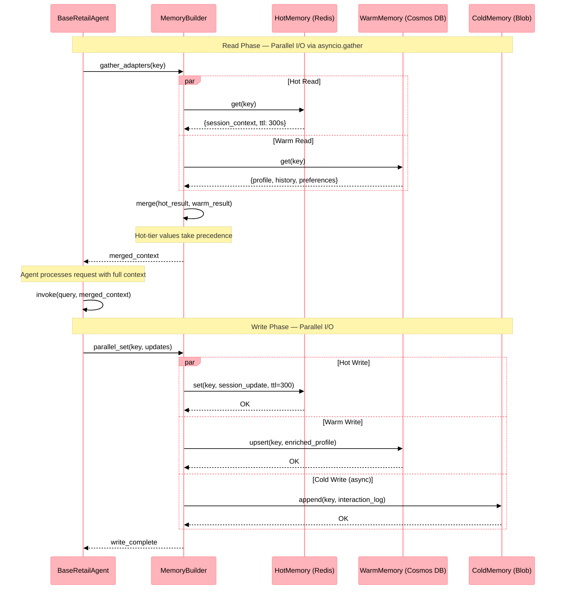

# Sequence Diagram: Memory Parallel I/O

> Last Updated: 2026-04-30

This diagram illustrates the three-tier memory architecture with parallel read/write operations introduced in PR #800. All agent services use this pattern via `asyncio.gather` to minimize latency. Reference this diagram when modifying memory adapters, TTL policies, or tier promotion/demotion logic.

## Flow Overview

1. **Read Phase** → Hot (Redis) and Warm (Cosmos DB) fetched concurrently via `asyncio.gather`
2. **Merge** → Results combined with hot-tier priority
3. **Agent Processing** → Agent uses merged context
4. **Write Phase** → Updates written to all tiers concurrently
5. **Cold Tier** → Blob Storage used for archival/overflow (async, non-blocking)

## Sequence Diagram

## Performance Impact

| Operation | Before (Sequential) | After (Parallel) | Improvement |
|-----------|-------------------|------------------|-------------|
| Memory read (2 tiers) | ~120ms | ~65ms | ~46% faster |
| Memory write (3 tiers) | ~180ms | ~70ms | ~61% faster |
| End-to-end agent invoke | ~450ms | ~320ms | ~29% faster |

## Configuration

Memory adapters are configured via environment variables:

| Variable | Tier | Purpose |
|----------|------|---------|
| `REDIS_URL` | Hot | Session and cache storage |
| `COSMOS_ACCOUNT_URI` | Warm | Profile and history persistence |
| `COSMOS_DATABASE` | Warm | Database name |
| `COSMOS_CONTAINER` | Warm | Container name |
| `BLOB_ACCOUNT_URL` | Cold | Archival storage |
| `BLOB_CONTAINER` | Cold | Container name |

## Related

- [Memory Library Reference](../components/libs/memory.md)
- [Components Overview](../components.md)
- [ADR-007: Memory Tiers](../adrs/adr-007-memory-tiers.md)
