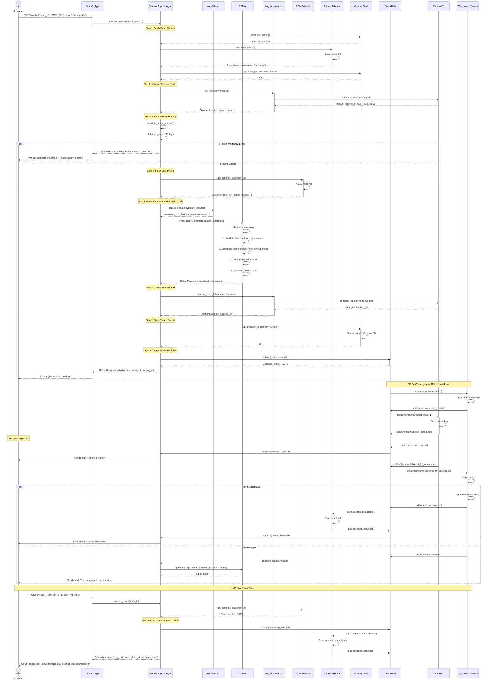

# Sequence Diagram: Logistics Returns Support Flow

This diagram illustrates the returns processing workflow in the Holiday Peak Hub accelerator.

## Flow Overview

1. **User Initiates Return** → Submit return request
2. **Shipment Validation** → Verify order and shipment status
3. **Policy Evaluation** → Check eligibility (time window, condition)
4. **LLM Guidance** → Generate natural language return instructions
5. **Label Generation** → Create return shipping label
6. **Orchestration** → Coordinate warehouse, carrier, refund

## Sequence Diagram



## Policy Evaluation Rules

### 1. Return Window Check
```python
def check_return_window(order: Order, shipment: Shipment) -> bool:
    """Validate return request is within allowed window."""
    delivered_date = shipment.events[-1].timestamp
    days_since_delivery = (datetime.now() - delivered_date).days
    
    # Standard: 30 days
    # VIP: 60 days
    # Electronics: 14 days
    window = {
        "standard": 30,
        "vip": 60,
        "electronics": 14
    }
    
    customer_tier = order.customer.tier
    category = order.items[0].category
    
    if category == "electronics":
        return days_since_delivery <= window["electronics"]
    elif customer_tier == "VIP":
        return days_since_delivery <= window["vip"]
    else:
        return days_since_delivery <= window["standard"]
```

### 2. Item Condition Check
```python
def check_item_condition(return_request: ReturnRequest) -> tuple[bool, str]:
    """Validate item meets return conditions."""
    
    # Non-returnable categories
    if return_request.category in ["perishable", "personalized", "intimate"]:
        return False, "Category not eligible for return"
    
    # Must have original packaging
    if not return_request.has_original_packaging:
        return False, "Original packaging required"
    
    # Must be unused (unless defective)
    if not return_request.unused and return_request.reason != "defective":
        return False, "Item must be unused"
    
    return True, "Eligible"
```

### 3. Return Reason Validation
```python
def validate_return_reason(reason: str, order: Order) -> tuple[bool, str]:
    """Check if return reason is valid."""
    
    valid_reasons = [
        "wrong_size",
        "wrong_item",
        "defective",
        "not_as_described",
        "changed_mind",
        "damaged_in_shipping"
    ]
    
    if reason not in valid_reasons:
        return False, "Invalid return reason"
    
    # Special handling for defective items
    if reason == "defective":
        # Auto-approve, no restocking fee
        return True, "Defect claim - expedited processing"
    
    # Restocking fee for "changed mind"
    if reason == "changed_mind":
        return True, "15% restocking fee applies"
    
    return True, "Standard return processing"
```

## LLM Return Guidance

### Prompt Template
```python
RETURN_GUIDANCE_PROMPT = """
You are a helpful returns specialist. Generate clear, empathetic return instructions for the customer.

Order Details:
- Order ID: {order_id}
- Items: {items}
- Total: ${total}
- Delivered: {delivery_date}

Return Request:
- Reason: {reason}
- Customer Message: {customer_message}

Customer Profile:
- Tier: {tier}
- Previous Returns: {return_history}

Shipment Info:
- Carrier: {carrier}
- Original Tracking: {tracking_id}

Generate:
1. A personalized greeting acknowledging their request
2. Step-by-step return instructions
3. Timeline for refund
4. Any fees or conditions
5. Contact info for questions

Tone: Professional, empathetic, clear
Length: 150-250 words
"""

async def generate_return_instructions(context: dict) -> str:
    """Use LLM to generate personalized return instructions."""
    prompt = RETURN_GUIDANCE_PROMPT.format(**context)
    response = await llm.invoke(prompt, max_tokens=500)
    return response.text
```

### Example Output
```
Hi Sarah,

We've received your return request for your recent order (#ORD-123). We're sorry the 
size wasn't quite right!

Here's how to return your items:

1. **Package Your Item**: Place the shoes back in the original box with all tags attached.

2. **Print Your Label**: Use the return label attached to this email. If you can't print, 
   visit any FedEx location and show them this email.

3. **Drop Off**: Take your package to any FedEx location. Find one near you at 
   fedex.com/locator.

4. **Track Your Return**: You'll receive tracking updates via email. Your return tracking 
   number is RTN-456789.

5. **Refund Timeline**: Once we receive your item (typically 5-7 business days), we'll 
   inspect it and process your refund within 2 business days. You'll receive $89.99 back 
   to your original payment method.

As a VIP member, we've waived the return shipping fee for you!

Questions? Reply to this email or call us at 1-800-RETAIL.

Thank you for shopping with us!
```

## SAGA Orchestration

### Event-Driven Workflow
```python
# Event definitions
@dataclass
class ReturnsInitiatedEvent:
    return_id: str
    order_id: str
    customer_id: str
    items: list[str]
    timestamp: str

@dataclass
class ReturnsAcceptedEvent:
    return_id: str
    inspection_notes: str
    timestamp: str

@dataclass
class ReturnsRefundedEvent:
    return_id: str
    amount: float
    refund_id: str
    timestamp: str

# Event handlers
async def handle_returns_initiated(event: ReturnsInitiatedEvent):
    """Warehouse handler: Create inbound receipt."""
    await wms.create_receipt(
        return_id=event.return_id,
        items=event.items,
        expected_date=datetime.now() + timedelta(days=7)
    )
    
    await event_hub.publish(ReturnsReceiptCreatedEvent(
        return_id=event.return_id,
        receipt_id=receipt_id
    ))

async def handle_returns_accepted(event: ReturnsAcceptedEvent):
    """Funnel handler: Process refund."""
    order = await get_order(event.return_id)
    
    refund = await payment_gateway.refund(
        transaction_id=order.payment.transaction_id,
        amount=order.total
    )
    
    await event_hub.publish(ReturnsRefundedEvent(
        return_id=event.return_id,
        amount=order.total,
        refund_id=refund.id
    ))
```

## Performance Characteristics

| Step | Target Latency | Optimization |
|------|----------------|--------------|
| Order fetch | < 200ms | Cached |
| Shipment validation | < 500ms | Carrier API |
| LLM guidance | < 3s | GPT-4o |
| Label generation | < 1s | Carrier API |
| Event publishing | < 100ms | Async |
| **Total (P95)** | **< 5s** | |

## Observability

### Metrics Tracked
```python
# Returns metrics
metrics.counter("returns.initiated")
metrics.counter("returns.approved")
metrics.counter("returns.rejected", {"reason": "expired|damaged|invalid"})
metrics.histogram("returns.processing_time_ms", duration)

# Policy metrics
metrics.counter("returns.policy_violation", {"type": "window|condition|category"})
metrics.gauge("returns.approval_rate", rate)

# Refund metrics
metrics.counter("returns.refunded", {"method": "standard|vip_fast_track"})
metrics.histogram("returns.refund_amount", amount)
metrics.histogram("returns.time_to_refund_days", days)

# LLM guidance
metrics.histogram("returns.llm_latency_ms", duration)
metrics.counter("returns.llm_fallback")
```

### Distributed Tracing
```python
with tracer.span(name="process_return") as span:
    span.add_attribute("order_id", order_id)
    span.add_attribute("customer_tier", customer.tier)
    
    with tracer.span(name="validate_eligibility"):
        eligible = await check_eligibility(order, shipment)
    
    if eligible:
        with tracer.span(name="generate_guidance"):
            instructions = await llm.generate(context)
        
        with tracer.span(name="create_label"):
            label = await logistics.create_label(order)
```

## Related Documentation
- [ADR-013: SLM-First Model Routing](../adrs/adr-013-model-routing.md)
- [ADR-007: SAGA Choreography with Event Hubs](../adrs/adr-007-saga-choreography.md)
- [Logistics Returns Support Component](../components/apps/logistics-returns-support.md)
- [Playbook: Tool Call Failures](../playbooks/playbook-tool-call-failures.md)
