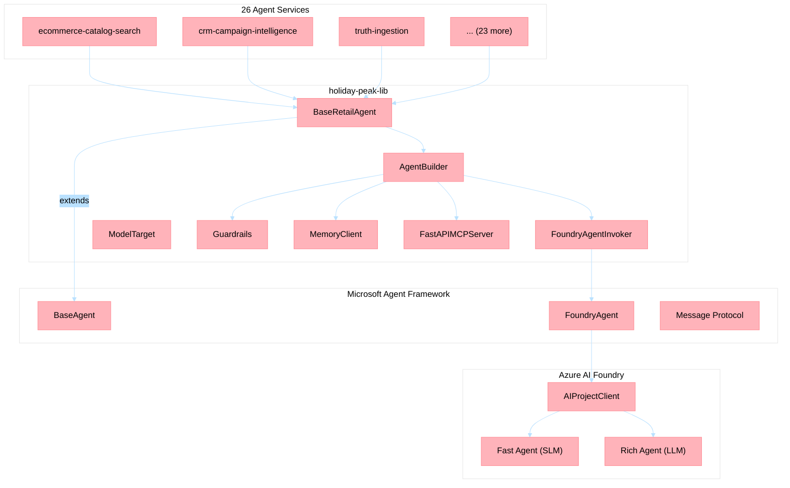

# Microsoft Agent Framework (MAF) Integration Rationale

**Version**: 1.0
**Last Updated**: 2026-04-12
**Status**: Implemented (PR #802, agent-framework>=1.0.1 GA)

---

## Executive Summary

Holiday Peak Hub uses [Microsoft Agent Framework](https://learn.microsoft.com/en-us/python/api/overview/azure/agent-framework) (MAF) as the runtime layer for all AI agent invocations. MAF is wrapped inside `holiday-peak-lib` rather than consumed directly by the 26 agent services. This document explains **why**, **how**, and **what trade-offs** this creates.

---

## Decision Context

### Problem Statement

Each of the 26 agent services needs to:
1. Invoke AI models via Azure AI Foundry (GPT-5, GPT-5-nano, etc.)
2. Forward tool definitions so the model can call MCP tools
3. Handle streaming and non-streaming responses
4. Integrate with the three-tier memory architecture
5. Emit structured telemetry to Azure Monitor

Without a shared abstraction, each service would independently:
- Depend on `agent-framework` and `azure-ai-projects` SDKs
- Implement tool registration and forwarding logic
- Handle SDK version migrations separately
- Duplicate error handling, retry, and telemetry code

### Decision

**Wrap MAF behind `FoundryAgentInvoker` in `holiday-peak-lib`, making the lib the single consumer of `agent-framework`.**

---

## Architecture



### Layer Responsibilities

| Layer | Responsibility | Package |
|-------|---------------|---------|
| **Agent Services** | Domain logic (`handle()` method), MCP tool definitions, event handlers | Each app's `src/` |
| **holiday-peak-lib** | Agent base class, builder, memory, guardrails, resilience, telemetry, MAF wrapping | `holiday-peak-lib>=0.2.0` |
| **Microsoft Agent Framework** | Foundry agent runtime, message protocol, tool forwarding middleware | `agent-framework>=1.0.1` |
| **Azure AI Foundry** | Model hosting, agent provisioning, Agents V2 API | `azure-ai-projects>=2.0.0b4` |

---

## Key Classes

### `FoundryAgentInvoker` (`agents/foundry.py`)

The core adapter between the lib's `ModelTarget` interface and MAF's `FoundryAgent` runtime:

```python
class FoundryAgentInvoker:
    """Wraps MAF FoundryAgent to produce ModelTarget-compatible invocations."""

    async def invoke(self, messages, *, tools=None, **kwargs):
        # 1. Create FoundryAgent with tools registered
        # 2. Send messages through MAF middleware
        # 3. Handle tool calls (forwarded by MAF, not dropped)
        # 4. Aggregate streaming chunks if FOUNDRY_STREAM=true
        # 5. Return normalized response
```

**Critical fix (PR #802)**: The legacy `FoundryInvoker` silently dropped tool definitions because it bypassed MAF's middleware layer. `FoundryAgentInvoker` routes through `FoundryAgent.create()`, which properly registers tools with the Foundry runtime.

### `BaseRetailAgent` (`agents/base_agent.py`)

Extends MAF's `BaseAgent` with retail-specific behavior:

- **SLM-first routing**: Every request starts with the fast (SLM) model; complex queries upgrade to the rich (LLM) model based on a configurable `complexity_threshold`
- **Memory injection**: Three-tier memory (hot/warm/cold) via `MemoryBuilder`
- **Provider policy**: `FoundryProviderPolicyStrategy` enforces Foundry-specific message sanitization
- **Tool delegation**: Tools are registered through `AgentBuilder` and forwarded to the invocation layer

### `AgentBuilder` (`agents/builder.py`)

Fluent builder for agent assembly:

```python
agent = (
    AgentBuilder()
    .with_agent(CatalogSearchAgent)
    .with_foundry_models(slm_config=slm, llm_config=llm, complexity_threshold=0.7)
    .with_memory_builder(memory_builder)
    .with_mcp(mcp_server)
    .with_tools(domain_tools)
    .build()
)
```

---

## Benefits Realized

### 1. Single-Pass SDK Migration

When migrating from `FoundryInvoker` to `FoundryAgentInvoker` (PR #802):
- **1 class changed** in `lib/src` → 27 services updated via dependency
- **0 application code changes** needed in any agent service
- **55 files touched** (mostly lockfile regeneration), but zero domain logic edits

### 2. Import Isolation

Agent services never import from `agent_framework` directly:

```python
# ✅ Correct — agent services import from lib
from holiday_peak_lib.agents import BaseRetailAgent, AgentBuilder

# ❌ Forbidden — no direct MAF imports in services
from agent_framework import BaseAgent  # NEVER
```

This is enforced by convention and validated in PR reviews.

### 3. Centralized Telemetry

`FoundryTracer` (in `utils/telemetry.py`) wraps OpenTelemetry with Foundry-aware attributes:
- Span names include agent ID and model deployment
- Tool call durations measured per tool
- Memory tier latencies tracked
- All traces flow to Azure Application Insights

### 4. Testability

Services test their `handle()` logic with mock `ModelTarget` invokers — no MAF runtime needed:

```python
async def mock_invoker(messages, **kwargs):
    return {"role": "assistant", "content": "mock response"}

agent.slm = ModelTarget(name="mock", model="test", invoker=mock_invoker)
```

This enables 1136 lib tests + 660 app tests to run without Azure credentials in CI.

---

## Trade-offs

| Trade-off | Impact | Mitigation |
|-----------|--------|------------|
| **Coupling to lib** | All services depend on `holiday-peak-lib` | Versioned releases, backward compatibility policy |
| **Indirection** | One additional layer between service and MAF | Minimal runtime overhead (<1ms per invocation) |
| **Feature lag** | New MAF features require lib update first | Single codebase, rapid turnaround (PR #802: 1 day) |
| **Monorepo assumption** | lib installed from Git path, not PyPI | Standard for reference architectures; could publish to PyPI if needed |

---

## Microsoft Reference Documentation

| Resource | URL |
|----------|-----|
| Microsoft Agent Framework Python API | https://learn.microsoft.com/en-us/python/api/overview/azure/agent-framework |
| Azure AI Foundry documentation | https://learn.microsoft.com/en-us/azure/ai-studio/ |
| Azure AI Foundry Agents quickstart | https://learn.microsoft.com/en-us/azure/ai-studio/how-to/develop/agents |
| AI Project Client SDK | https://learn.microsoft.com/en-us/python/api/azure-ai-projects/ |
| OpenTelemetry for Azure Monitor | https://learn.microsoft.com/en-us/azure/azure-monitor/app/opentelemetry-enable |

---

## Related ADRs

- [ADR-013: Model Routing](adrs/adr-013-model-routing.md)
- [ADR-008: Memory Tiers](adrs/adr-008-memory-tiers.md)
- [ADR-008: Circuit Breaker Pattern](adrs/adr-023-enterprise-resilience-patterns.md)
