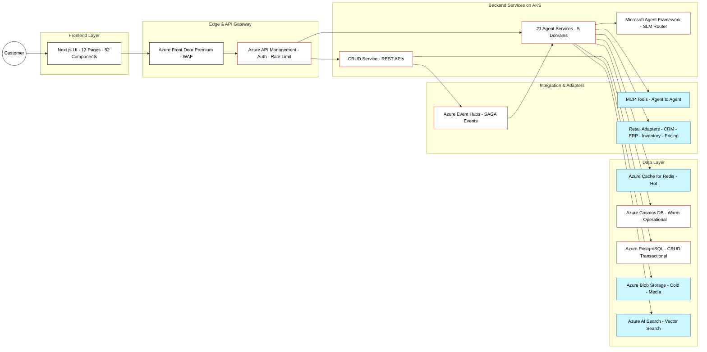

# Market Architecture - Agentic Shopping on Azure

## Purpose

This document captures a high-level, sellable market architecture for the agentic shopping concept. It aligns to the Holiday Peak Hub reference architecture and focuses on a clear story: one buyer experience, multiple personalized outcomes, and a tailored product view that changes based on the user request.

## Business Problem

Retailers need to deliver personalized shopping decisions in seconds while honoring inventory, pricing guardrails, and customer context. The architecture must:

- Scale for seasonal spikes without rewriting legacy systems.
- Provide consistent, trusted explanations for each recommendation.
- Adapt product detail views to the user request (speed, cost, fit, availability).
- Use secure, compliant Azure services with predictable operations.
- Support 21 domain-specific agents across 5 retail domains.

## Core Concepts (Simplified)

- **Web UI entry**: Next.js frontend provides the shopping experience.
- **API Gateway**: Azure APIM routes requests to CRUD service and agent services.
- **Agent runtime**: 21 domain-specific agents provide AI-powered capabilities.
- **Data adapters**: Connectors fetch inventory, pricing, customer context, and shipping.
- **Outcome rendering**: The UI shows different details depending on the user request.

## High-Level Architecture

### 1) Frontend + Edge

- Azure Front Door Premium for global entry, WAF, and traffic acceleration.
- Next.js 15 UI with 52 atomic design components (13 pages, 4 user roles).

### 2) API Gateway + Identity

- Azure API Management for request routing, rate limiting, and authentication.
- Microsoft Entra ID for JWT validation and RBAC (anonymous, customer, staff, admin).
- Azure Key Vault for secrets management with Managed Identity.

### 3) Backend Services (AKS)

- **CRUD Service**: Transactional REST APIs for products, orders, cart, checkout, reviews.
- **21 Agent Services**: Domain-specific agents across 5 domains (E-commerce, Product, CRM, Inventory, Logistics).
- **Microsoft Agent Framework**: Orchestration with SLM-first routing.
- **Azure AI Foundry**: Model hosting and agent deployments.

### 4) Integration Layer

- **MCP Tools**: Agent-to-agent communication via FastAPI-MCP servers.
- **Retail Adapters**: Pluggable connectors for CRM, ERP, inventory, pricing, and shipping systems.
- **Azure Event Hubs**: SAGA choreography for async workflows (5 topics: user, product, order, inventory, payment).

### 5) Data Layer

- **Azure Cache for Redis**: Hot memory (sub-50ms latency for agent context).
- **Azure Cosmos DB**: Warm memory (session history) + operational data (10 containers).
- **Azure Blob Storage**: Cold memory (archival) and media storage.
- **Azure AI Search**: Vector + hybrid search for semantic product discovery.

### 6) Observability

- Azure Monitor for metrics and alerts.
- Application Insights for distributed tracing.
- Log Analytics for centralized logging.

## Explanation Delivery (Personalized Economics)

The system generates different explanations per user query by combining agent intelligence with real-time data:

- User preferences, purchase history, and segment data are stored in Cosmos DB.
- Agents apply domain expertise (Stylist, Fit Advisor, Fulfillment) based on the user request.
- The response includes structured data rendered by the UI with adaptive product details.
- Product views highlight different attributes based on user intent (speed, cost, fit, availability).
- Evidence from inventory, pricing, and shipping systems provides trust and auditability.

## Mermaid Diagram (High-Level)

## Alignment Notes

- This architecture reflects the implemented Holiday Peak Hub stack documented in ADR-002 and the architecture overview.
- The system includes a production-ready CRUD service and 21 agent services across 5 domains.
- **CRUD service uses PostgreSQL (asyncpg + JSONB)** for transactional data; Cosmos DB is used by agents for warm-tier memory.
- Azure Event Hubs enables SAGA choreography across services.
- The diagram is intentionally high-level for marketing and proposal use.
