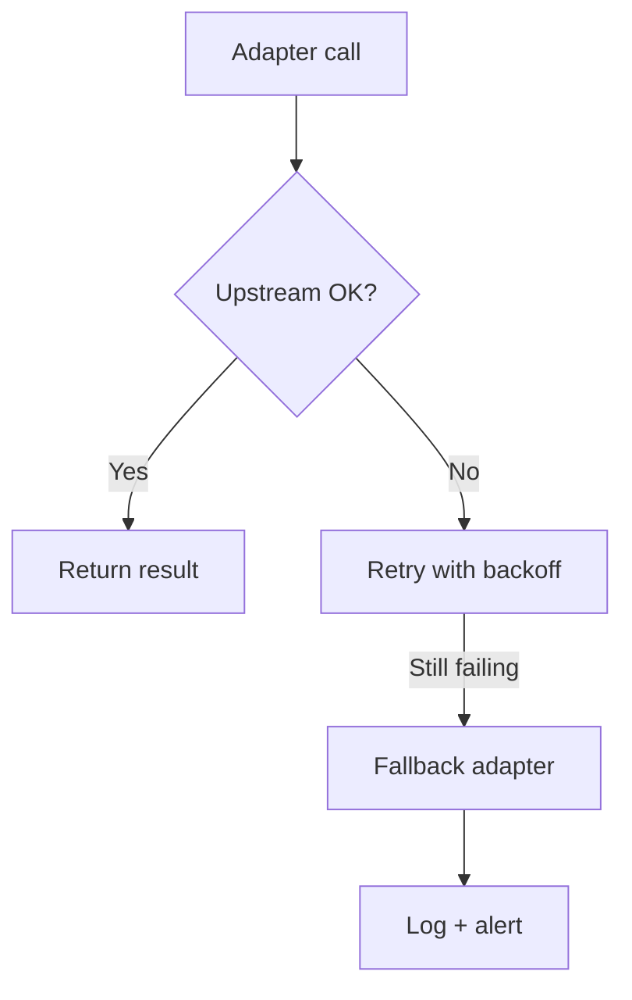

# Playbook: Adapter Failure

## Scope
Retailer adapters and upstream API integrations.

## Explanation
Adapter failures typically stem from upstream outages, credential issues, or schema changes. This playbook documents a resilient adapter pattern with retries and graceful fallback.

## Triggers
- Adapter error rate spike
- Upstream API outage

## Triage
1. Confirm upstream status and credentials.
2. Check rate limits and quota usage.
3. Validate adapter configuration and secrets.

## Mitigation
- Switch to mock adapter for non-critical flows.
- Add retries with exponential backoff.
- Reduce request volume temporarily.

## Prevention
- Health checks per adapter.
- Cache stable responses in hot memory.

## Implementation Steps
1. Implement adapter health check endpoint or probe.
2. Wrap adapter calls with retry + timeout logic.
3. Add a fallback adapter for non-critical paths.

## Code Examples

### Adapter with retry and timeout
```python
import asyncio
import aiohttp

class InventoryAdapter(BaseAdapter):
	async def _fetch_impl(self, query: dict):
		sku = query["sku"]
		for attempt in range(3):
			try:
				async with aiohttp.ClientSession() as session:
					async with session.get(f"{self.api_url}/stock/{sku}") as resp:
						resp.raise_for_status()
						return await resp.json()
			except Exception:
				if attempt == 2:
					raise
				await asyncio.sleep(0.5 * (2 ** attempt))
```

### Fallback adapter
```python
async def fetch_inventory(sku: str):
	try:
		return await real_adapter.fetch({"sku": sku})
	except Exception:
		return await mock_adapter.fetch({"sku": sku})
```

## Mermaid: Adapter Failure Flow


## Escalation
If upstream is down, notify retailer integration owner.
