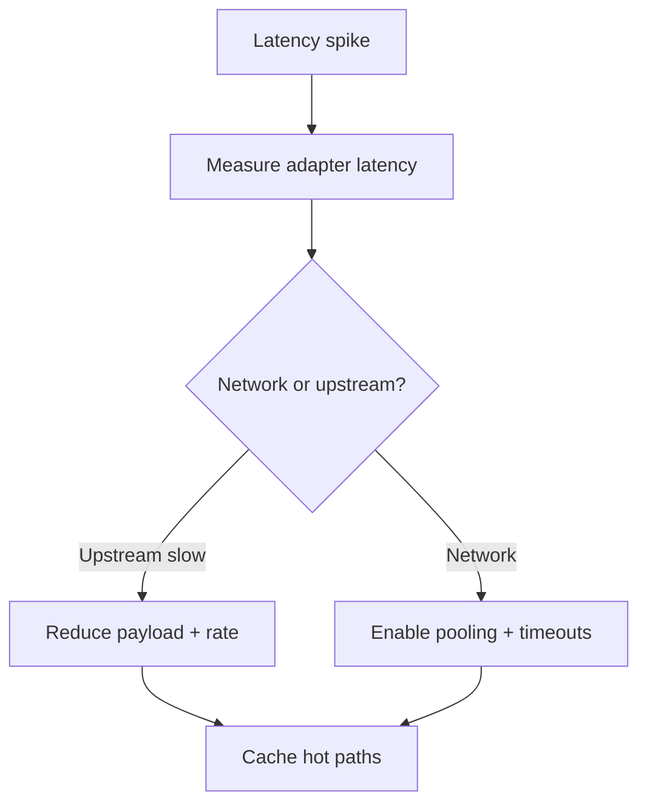

# Playbook: Adapter Latency Spikes

## Scope
Adapter calls to external retailer systems.

## Explanation
Adapter latency spikes are usually caused by upstream throttling, slow network paths, or lack of connection pooling. This playbook focuses on instrumentation and performance fixes.

## Triggers
- P95 adapter latency exceeds SLA

## Triage
1. Identify slow endpoints and payload sizes.
2. Check network path and DNS resolution.
3. Confirm rate limit or throttling signals.

## Mitigation
- Add caching for hot queries.
- Reduce payload size or request frequency.
- Parallelize independent calls.

## Prevention
- Reuse HTTP sessions with pooling.
- Set timeouts and circuit breakers.

## Implementation Steps
1. Add request-level latency logging.
2. Reuse HTTP sessions with a connection pool.
3. Cache hot queries in Redis.

## Code Examples

### Reuse HTTP session with pooling
```python
import aiohttp

class PooledAdapter(BaseAdapter):
	def __init__(self, api_url: str):
		super().__init__()
		self.api_url = api_url
		self.session = aiohttp.ClientSession(
			connector=aiohttp.TCPConnector(limit=100),
			timeout=aiohttp.ClientTimeout(total=5),
		)

	async def _fetch_impl(self, query: dict):
		async with self.session.get(f"{self.api_url}/item/{query['id']}") as resp:
			resp.raise_for_status()
			return await resp.json()
```

### Cache hot responses
```python
async def fetch_with_cache(sku: str):
	cache_key = f"inv:{sku}"
	cached = await hot_memory.get(cache_key)
	if cached:
		return cached
	value = await adapter.fetch({"sku": sku})
	await hot_memory.set(cache_key, value, ttl=300)
	return value
```

## Mermaid: Latency Mitigation


## Escalation
If latency persists, open a ticket with the upstream provider.
