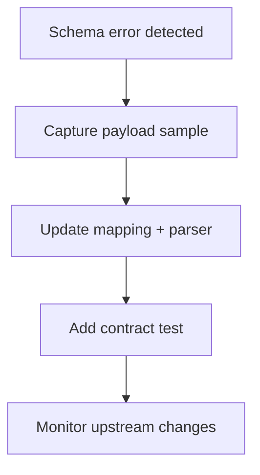

# Playbook: Adapter Schema Changes

## Scope
Adapters and connectors that map upstream payloads.

## Explanation
Schema changes cause parsing failures or incorrect mapping. This playbook emphasizes tolerant parsing, version pinning, and adapter-side mapping updates.

## Triggers
- Parsing errors or missing required fields
- Contract test failures

## Triage
1. Capture failing payload samples.
2. Compare with expected schema and mapping.
3. Identify version or field changes upstream.

## Mitigation
- Add tolerant parsing for optional fields.
- Apply mapping hotfix in adapter layer.
- Pin upstream API version if available.

## Prevention
- Add contract tests and schema validation.
- Monitor upstream change logs.

## Implementation Steps
1. Capture sample payloads in logs for failures.
2. Update mapping to handle optional/renamed fields.
3. Add contract tests to detect future drift.

## Code Examples

### Tolerant parsing with Pydantic
```python
from pydantic import BaseModel, ConfigDict

class ProductPayload(BaseModel):
	model_config = ConfigDict(extra="ignore")
	sku: str
	name: str
	price: float | None = None
```

### Adapter mapping fallback
```python
def map_product(payload: dict) -> dict:
	return {
		"sku": payload.get("sku") or payload.get("id"),
		"name": payload.get("name") or payload.get("title"),
		"price": payload.get("price") or payload.get("unit_price"),
	}
```

## Mermaid: Schema Change Handling


## Escalation
Notify integration owner with sample payload and impact.
