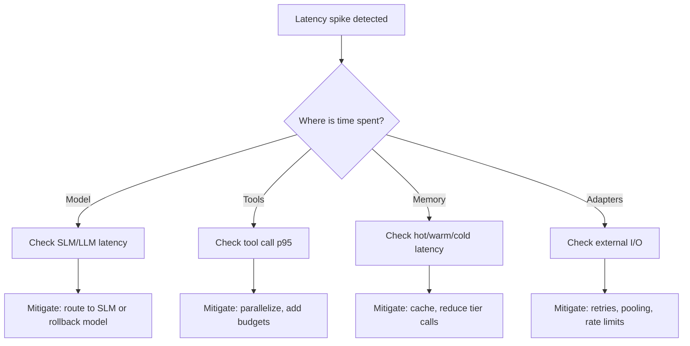

# Playbook: Agent Latency Spikes

## Scope
Agents built on `BaseRetailAgent` and Foundry integration.

## Explanation
Latency spikes usually come from one of four sources: model inference, tool calls, memory tier access, or adapter I/O. This playbook guides you to isolate the slow span and implement guardrails that keep p95/p99 within SLA.

## Triggers
- P95 or P99 latency exceeds SLA
- Spike in request timeouts

## Triage
1. Check model response time (SLM/LLM split).
2. Check tool-call latency and error rate.
3. Check memory tier latency (hot/warm/cold).
4. Check downstream adapter latency.

## Diagnosis Checklist
- Model selection skewed to LLM unexpectedly
- Tool calls running sequentially vs parallel
- Redis/Cosmos/Blob latency increases
- Rate limits or throttling from upstream systems

## Mitigation
- Temporarily raise `complexity_threshold` to favor SLM.
- Disable or defer non-critical tools for hot paths.
- Increase timeouts slightly only if upstream is healthy.
- Reduce payload size and prompt length.

## Prevention
- Add latency budgets per tool.
- Configure circuit breakers for slow tools.
- Add tracing to identify hot spans.

## Implementation Steps
1. Add per-tool latency measurement and budgets.
2. Parallelize independent tool calls.
3. Route to SLM for low-complexity queries.
4. Add timeouts around memory tier calls.

## Code Examples

### Per-tool latency budgets
```python
import asyncio
import time

async def call_tool_with_budget(tool, payload, budget_ms: int):
	start = time.time()
	result = await tool(payload)
	duration_ms = (time.time() - start) * 1000
	if duration_ms > budget_ms:
		logger.warning("tool budget exceeded", extra={"tool": tool.__name__, "ms": duration_ms})
	return result
```

### Parallel tool execution
```python
async def run_tools_parallel(tool_calls):
	return await asyncio.gather(*[tc() for tc in tool_calls])
```

### Model routing guardrail
```python
def should_use_slm(request: dict, threshold: float) -> bool:
	complexity = request.get("complexity_score", 0.0)
	return complexity < threshold
```

## Mermaid: Latency Triage Flow


## Escalation
If latency persists > 30 minutes, open incident with model provider and platform owner.
