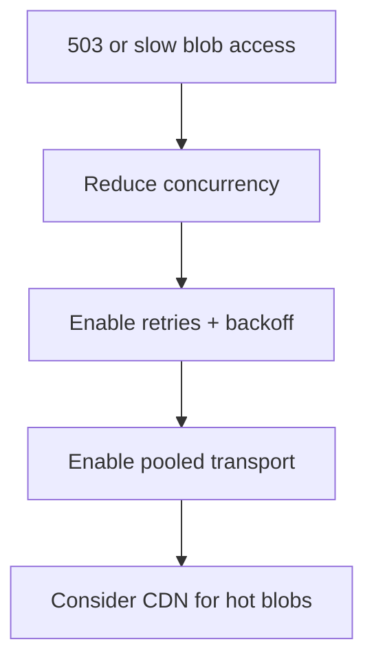

# Playbook: Blob Storage Throttling

## Scope
Cold memory tier.

## Explanation
Blob throttling usually appears as 503s during upload/download spikes. This playbook focuses on retry policies, transport pooling, and concurrency control.

## Triggers
- 503 errors
- Slow upload/download times

## Triage
1. Check storage account throttling metrics.
2. Identify high-concurrency workloads.
3. Confirm client timeouts and retries.

## Mitigation
- Add retry with exponential backoff.
- Reduce parallelism or batch requests.
- Use CDN for read-heavy blobs.

## Prevention
- Configure client pooling and timeouts.
- Separate hot paths from cold reads.

## Implementation Steps
1. Configure pooled transport for Blob client.
2. Add retry/backoff for transient errors.
3. Gate concurrency with semaphores.

## Code Examples

### Pooling and timeouts
```python
from holiday_peak_lib.agents.memory import ColdMemory

cold = ColdMemory(
	"https://storage.blob.core.windows.net",
	"container",
	connection_pool_size=50,
	connection_timeout=5.0,
	read_timeout=30.0,
)
```

### Concurrency gate
```python
import asyncio

semaphore = asyncio.Semaphore(10)

async def guarded_download(key: str):
	async with semaphore:
		return await cold.download_text(key)
```

## Mermaid: Blob Throttling Flow


## Escalation
If throttling persists, open a support ticket for storage capacity review.
