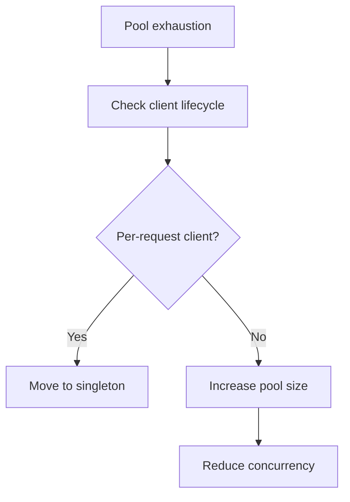

# Playbook: Connection Pool Exhaustion

## Scope
Redis/Cosmos/Blob client pools.

## Explanation
Pool exhaustion happens when clients are created per request or concurrency exceeds pool limits. This playbook focuses on singleton clients and pool sizing.

## Triggers
- "too many connections" errors
- Connection timeouts or stalled requests

## Triage
1. Check pool limits vs concurrent load.
2. Verify connections are reused.
3. Look for leaked sessions or clients.

## Mitigation
- Increase pool size temporarily.
- Restart services with clean pools.
- Reduce concurrency for heavy workloads.

## Prevention
- Reuse client instances (singleton per app).
- Configure sane pool sizes and timeouts.

## Implementation Steps
1. Create clients once at startup and reuse.
2. Size pools based on concurrency and throughput.
3. Add monitoring for pool utilization.

## Code Examples

### Singleton client pattern
```python
class Clients:
	hot = HotMemory("redis://localhost:6379", max_connections=50)
	warm = WarmMemory("https://account.documents.azure.com", "db", "container", connection_limit=50)
	cold = ColdMemory("https://storage.blob.core.windows.net", "container", connection_pool_size=50)
```

## Mermaid: Pool Exhaustion Response


## Escalation
If pool exhaustion repeats, review traffic patterns and adjust scaling.
