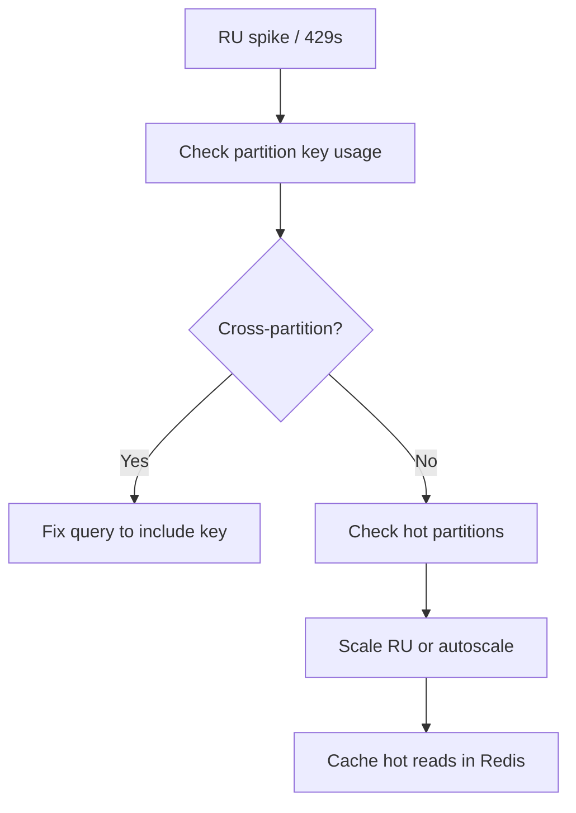

# Playbook: Cosmos High RU Consumption

## Scope
Warm memory tier.

## Explanation
RU spikes typically come from cross-partition queries, hot partitions, or large item reads/writes. This playbook focuses on partition-key usage and throttling handling.

## Triggers
- 429 throttling
- Sustained RU usage at or above provisioned limit

## Triage
1. Check RU metrics by container.
2. Identify hot partitions.
3. Review query patterns for cross-partition scans.

## Mitigation
- Scale RU or enable autoscale.
- Add partition key filters.
- Cache frequently read data in hot tier.

## Prevention
- Enforce partition-keyed queries.
- Batch writes and reduce fan-out.

## Implementation Steps
1. Verify all queries include partition key.
2. Add retry/backoff for 429 responses.
3. Cache hot reads in Redis to reduce RU.

## Code Examples

### Partition-keyed read
```python
async def read_profile(container, user_id: str):
	return await container.read_item(item=user_id, partition_key=user_id)
```

### Basic 429 retry
```python
import asyncio
from azure.cosmos.exceptions import CosmosHttpResponseError

async def read_with_retry(fn, retries=3):
	for attempt in range(retries):
		try:
			return await fn()
		except CosmosHttpResponseError as exc:
			if exc.status_code != 429 or attempt == retries - 1:
				raise
			await asyncio.sleep(0.5 * (2 ** attempt))
```

## Mermaid: RU Mitigation Flow


## Escalation
If throttling persists, engage data platform owner.
