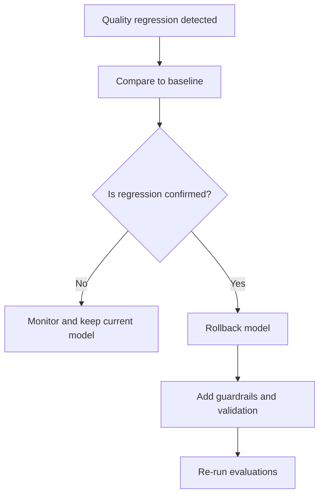

# Playbook: Model Degradation

## Scope
SLM/LLM targets configured via `AgentBuilder`.

## Explanation
Model degradation is a drop in quality, tool selection accuracy, or safety compliance. This playbook prioritizes rollback and guardrails to restore baseline behavior quickly.

## Triggers
- Quality regression in evaluation results
- Increase in hallucinations or incorrect tool usage

## Triage
1. Compare outputs against last known good baseline.
2. Check recent prompt or tool changes.
3. Review model deployment/version updates.

## Mitigation
- Roll back to last stable model deployment.
- Tighten instructions or add guardrails.
- Increase tool-result validation.

## Prevention
- Maintain golden test set with evaluations.
- Add regression gates for model changes.

## Implementation Steps
1. Maintain a last-known-good model deployment ID.
2. Add a regression suite for critical workflows.
3. Validate tool outputs for key tasks (schema + business rules).

## Code Examples

### Simple regression gate
```python
def regression_gate(results, max_error_rate=0.05):
	error_rate = sum(1 for r in results if not r.passed) / len(results)
	if error_rate > max_error_rate:
		raise RuntimeError("Model regression detected")
```

### Tool-output validation hook
```python
def validate_order_summary(summary: dict) -> bool:
	required = {"order_id", "status", "eta"}
	return required.issubset(summary.keys())
```

## Mermaid: Model Degradation Response


## Escalation
If impact is severe, switch to fallback model and notify AI governance owner.
