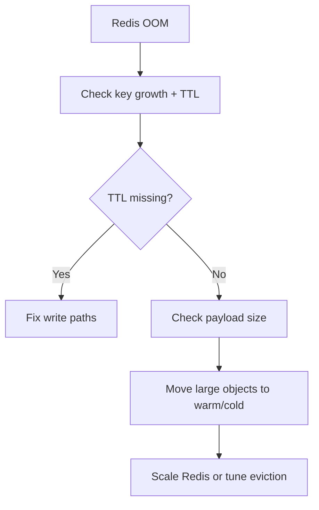

# Playbook: Redis OOM (Out of Memory)

## Scope
Hot memory tier.

## Explanation
Redis OOM events are usually caused by unbounded key growth, missing TTLs, or large payloads stored in hot memory. This playbook focuses on TTL enforcement and payload size limits.

## Triggers
- Redis evictions rising
- OOM errors or timeouts

## Triage
1. Check `used_memory` and `evicted_keys`.
2. Inspect TTL usage on hot keys.
3. Identify large payloads.

## Mitigation
- Scale Redis tier or memory.
- Enable/adjust eviction policy (e.g., `allkeys-lru`).
- Reduce hot TTLs or payload sizes.

## Prevention
- Enforce size limits for hot entries.
- Use warm tier for large objects.

## Implementation Steps
1. Enforce TTL in all hot memory writes.
2. Add payload size checks before writing to hot tier.
3. Configure Redis eviction policy.

## Code Examples

### Enforce TTL and size guard
```python
MAX_HOT_BYTES = 128 * 1024

async def hot_set(key: str, value: str, ttl: int = 300):
	if len(value.encode("utf-8")) > MAX_HOT_BYTES:
		raise ValueError("payload too large for hot tier")
	await hot_memory.set(key, value, ttl=ttl)
```

## Mermaid: OOM Mitigation Flow


## Escalation
If memory pressure persists, scale Redis and notify platform owner.
