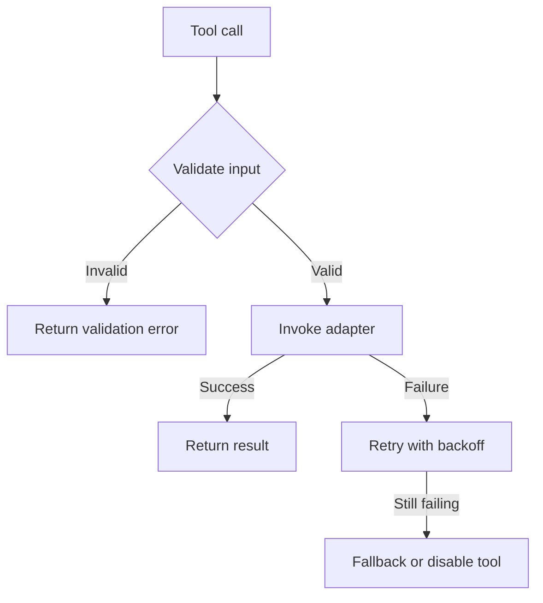

# Playbook: Tool Call Failures

## Scope
MCP tools and adapter-backed tools invoked by agents.

## Explanation
Tool failures can originate from invalid input, downstream adapter outages, or transient network errors. The playbook focuses on validating inputs at the MCP boundary, adding resilience, and providing safe fallbacks.

## Triggers
- Tool error rate > threshold
- Spike in 4xx/5xx from tool endpoints

## Triage
1. Identify failing tool(s) and recent deploys.
2. Check adapter health and credentials.
3. Validate payload schema and required fields.

## Mitigation
- Retry with backoff for transient failures.
- Route to fallback tool or mock adapter.
- Temporarily disable non-critical tools.

## Prevention
- Contract tests for tool schemas.
- Add input validation at tool boundary.
- Monitor tool error budgets.

## Implementation Steps
1. Validate input payloads before calling adapters.
2. Wrap tool invocation with retry and timeout policies.
3. Add fallback responses for non-critical tools.

## Code Examples

### Input validation guard
```python
from pydantic import BaseModel, ValidationError

class InventoryRequest(BaseModel):
	sku: str

async def check_inventory(payload: dict) -> dict:
	try:
		req = InventoryRequest(**payload)
	except ValidationError as exc:
		return {"error": "invalid_payload", "details": exc.errors()}
	return await inventory_adapter.fetch_stock(req.sku)
```

### Retry with exponential backoff
```python
import asyncio

async def call_with_retry(fn, retries=3, base_delay=0.5):
	for attempt in range(retries):
		try:
			return await fn()
		except Exception:
			if attempt == retries - 1:
				raise
			await asyncio.sleep(base_delay * (2 ** attempt))
```

## Mermaid: Tool Failure Handling


## Escalation
If failures impact core workflows, notify service owner and platform team.
