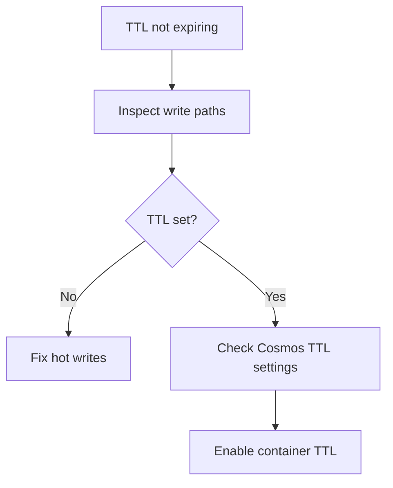

# Playbook: TTL Not Expiring

## Scope
Hot and warm memory tiers.

## Explanation
TTL issues lead to stale data and unbounded memory growth. This playbook ensures TTL is applied consistently in hot tier and enabled in Cosmos.

## Triggers
- Stale data served
- Memory growth with low eviction

## Triage
1. Verify TTL is set on write.
2. Check Redis key TTL and Cosmos TTL policy.
3. Identify keys missing TTL.

## Mitigation
- Fix TTL settings in write paths.
- Enable Cosmos container TTL if disabled.
- Run cleanup for stale keys.

## Prevention
- Add unit tests for TTL behavior.
- Enforce TTL defaults at builder level.

## Implementation Steps
1. Set TTL explicitly on all hot writes.
2. Enable TTL at the Cosmos container level.
3. Add tests verifying expiry.

## Code Examples

### Redis TTL write
```python
async def set_session(key: str, value: str):
	await hot_memory.set(key, value, ttl=300)
```

### TTL test
```python
import asyncio

async def test_ttl_expiry():
	await hot_memory.set("k", "v", ttl=1)
	await asyncio.sleep(2)
	assert await hot_memory.get("k") is None
```

## Mermaid: TTL Remediation Flow


## Escalation
If data growth threatens capacity, scale tiers and notify platform owner.
