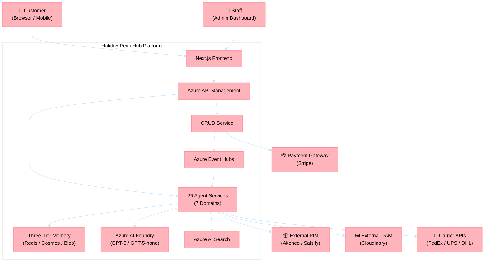
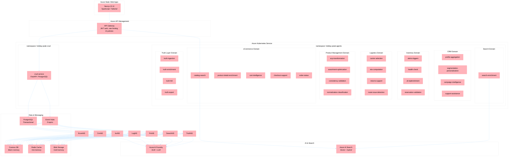
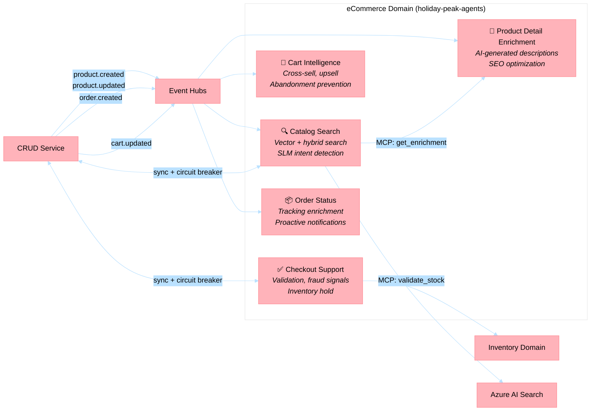
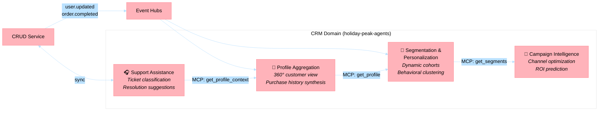
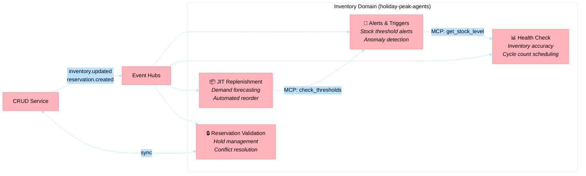
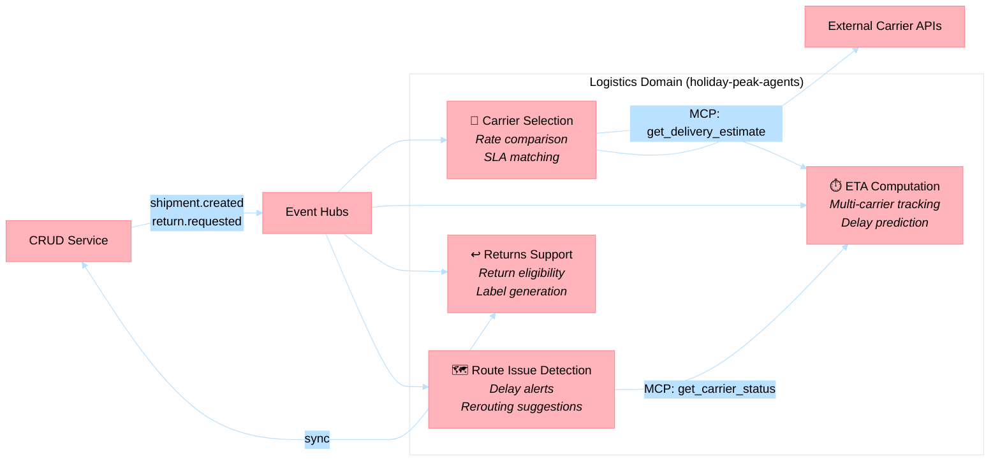
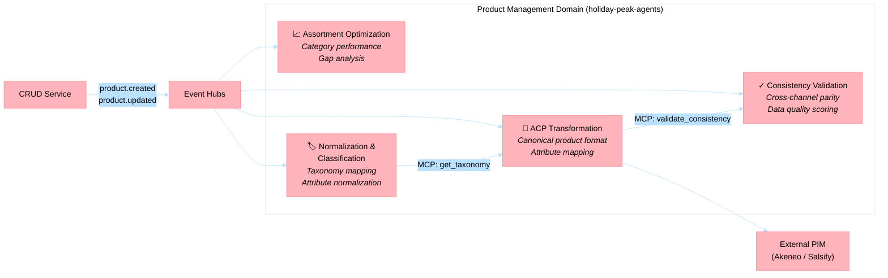
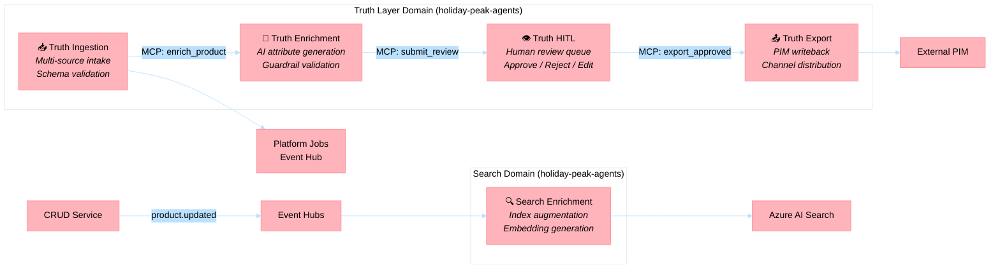
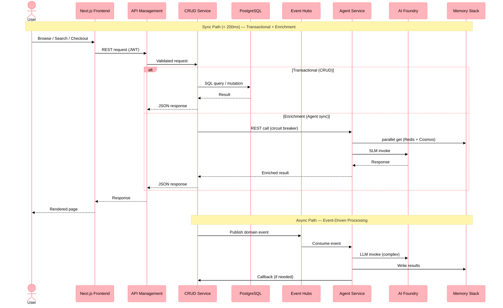

# Solution Architecture Diagrams

**Last Updated**: 2026-04-30

This document contains the system-level and per-domain Mermaid diagrams for the Holiday Peak Hub agentic microservices platform.

---

## 1. System Context (C4 Level 1)

External actors, channels, and the system boundary.

---

## 2. Container View (C4 Level 2)

Azure runtime composition across AKS, platform services, and external integrations.

---

## 3. eCommerce Domain

Five agents handling search, browsing, cart, checkout, and order tracking.

**Key Interactions:**
- `catalog-search` provides real-time search with SLM-first intent detection and vector search fallback
- `product-detail-enrichment` generates AI descriptions, triggered by product events
- `cart-intelligence` monitors cart state for cross-sell/upsell opportunities
- `checkout-support` orchestrates inventory holds and fraud signal checks
- `order-status` enriches tracking data with carrier intelligence

---

## 4. CRM Domain

Four agents handling customer profiles, segmentation, campaigns, and support.

---

## 5. Inventory Domain

Four agents handling stock monitoring, replenishment, reservations, and alerts.

---

## 6. Logistics Domain

Four agents handling carrier selection, ETA computation, returns, and route monitoring.

---

## 7. Product Management Domain

Four agents handling product data transformation, assortment, validation, and classification.

---

## 8. Search & Truth Layer Domains

Five agents handling search enrichment and the Product Truth Layer pipeline.

**Truth Layer Pipeline:**
1. **Ingestion** — Receives product data from external PIM systems, validates schema, creates truth candidates
2. **Enrichment** — AI generates missing attributes with guardrail validation (confidence thresholds, content policy)
3. **HITL** — Human reviewers approve, reject, or edit enriched products with audit trail
4. **Export** — Approved products written back to PIM and distributed to channels

---

## 9. Data Flow Overview

Complete request lifecycle showing sync and async paths.

---

## Related

- [Architecture Overview](architecture.md)
- [ADR Index](ADRs.md) — 35 architecture decision records
- [Agentic Microservices Reference](../agentic-microservices-reference.md) — Positioning document
- [MAF Integration Rationale](maf-integration-rationale.md) — Why MAF is wrapped in the lib
- [Standalone Deployment Guide](standalone-deployment-guide.md)
- [Diagrams Index](diagrams/README.md) — C4 draw.io and sequence diagrams
