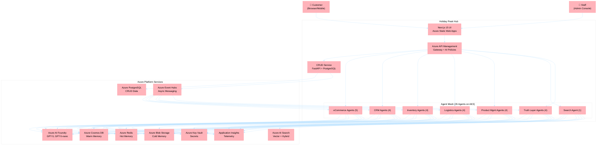
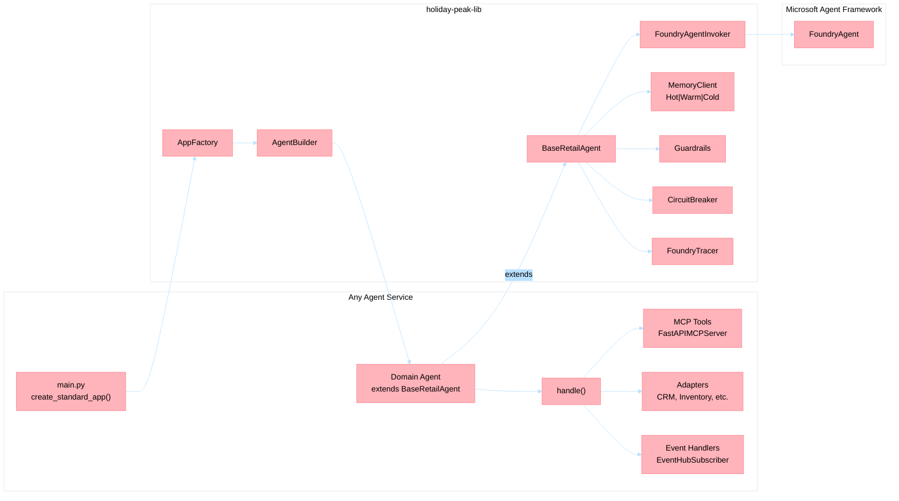
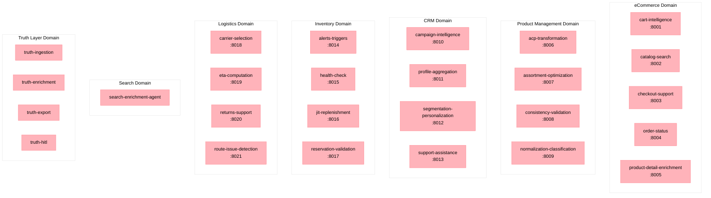
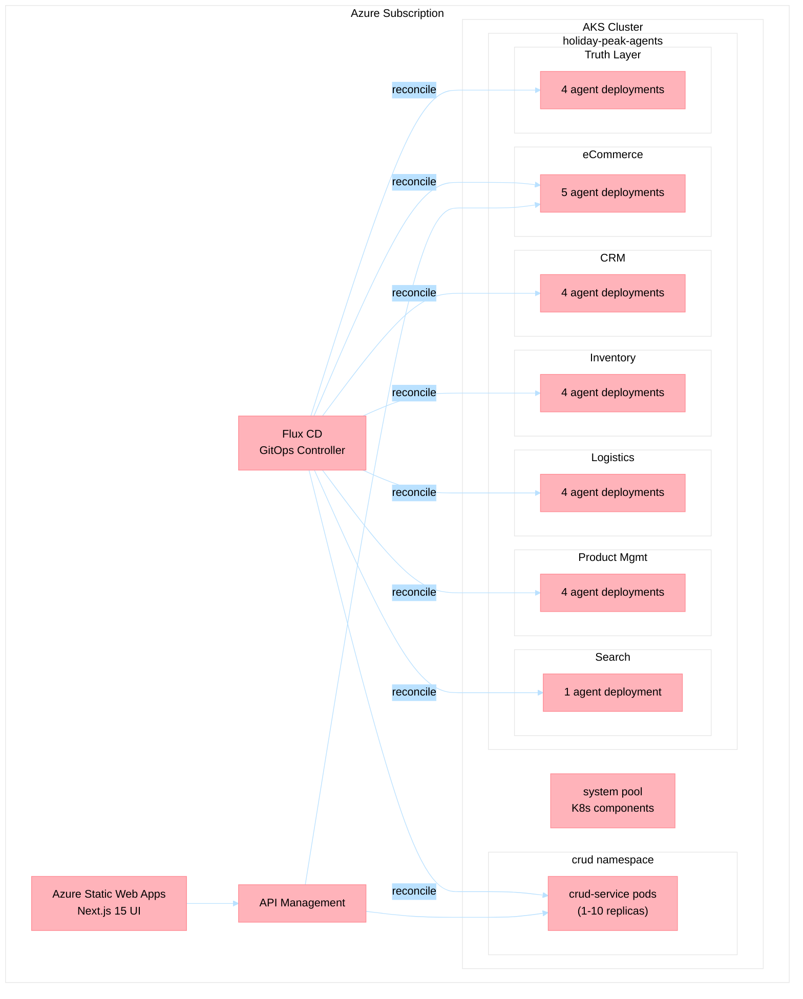

# Solution Architecture Overview

<!-- Last Updated: 2026-04-30 -->

This diagram presents the full Holiday Peak Hub architecture — a reference implementation for **Agentic Microservices** on Azure.

## System Context (C4 Level 1)



## Container View (C4 Level 2) — Agent Service Internals



## Domain Agent Map



## Data Flow Patterns

### Pattern 1: Transactional (Frontend → CRUD → Database)
```
Customer → UI → APIM → CRUD Service → PostgreSQL
                                    ↓
                              Event Hubs (async notification)
```

### Pattern 2: Agent-Enriched (CRUD → Agent → CRUD)
```
CRUD Service → Agent REST endpoint (circuit breaker, <200ms)
            → Agent invokes Foundry model
            → Agent reads memory context
            → Enriched response returned to CRUD
```

### Pattern 3: Async Processing (Event → Agent)
```
CRUD publishes event → Event Hubs
                    → Agent consumer group processes
                    → Agent writes to memory tiers
                    → Agent calls MCP tools on other agents
```

### Pattern 4: Agent-to-Agent (MCP Protocol)
```
Agent A → POST /mcp/tool_name on Agent B
       → Agent B processes with its domain context
       → Structured dict response returned
```

## Deployment Topology



## Related Documents

- [MAF Integration Rationale](maf-integration-rationale.md) — Why Microsoft Agent Framework lives in the lib
- [ADRs Index](ADRs.md) — All 27 Architecture Decision Records
- [Components Overview](components.md) — Detailed component responsibility matrix
- [Standalone Deployment Guide](standalone-deployment-guide.md) — How to deploy individual services
- [Infrastructure README](../../.infra/README.md) — Bicep and AKS provisioning
