# Backend Implementation Plan

**Version**: 1.0  
**Date**: 2026-01-30  
**Status**: Draft

---

## 📋 DETAILED TASK LIST & TRACKING

### Infrastructure Evaluation Summary

**Existing Infrastructure** (`.infra/` folder):
- ✅ CLI tool (`cli.py`) for generating Bicep modules and Dockerfiles from templates
- ✅ Bicep templates for per-agent services (21 agent modules generated)
- ✅ Dockerfile template using Python 3.13 with multi-stage builds (dev/prod)
- ✅ Kubernetes Helm chart structure (`.kubernetes/chart/`)
- ⚠️ **Current State**: Each agent creates its own Cosmos DB account, Redis cache, Storage account, Azure Search, OpenAI, and AKS cluster

**Architecture Decision: Hybrid "Pairwise" Approach**

We're taking a **hybrid approach** that balances cost optimization with agent independence:

**What's Shared** (Created by `.infra/modules/shared-infrastructure/`):
- ✅ **Single AKS cluster** with 3 node pools (system, agents, crud) - All services deploy here
- ✅ **Single Cosmos DB account** with:
  - 10 operational containers (Users, Products, Orders, etc. for CRUD service)
  - Agent-specific memory containers (created by agent modules)
- ✅ **Single Redis Cache** (Premium 6GB) - Agents use different databases (0-21)
- ✅ **Single Storage Account** - Agents use different blob containers
- ✅ **Single Event Hubs namespace** - All events flow through shared topics
- ✅ **Shared infrastructure**: ACR, Key Vault, APIM, Application Insights, Log Analytics, VNet, NSG, Private Endpoints

**What's Agent-Specific** (Kept in agent modules):
- 🔄 **Cosmos DB containers** - Each agent creates `warm-{agent-name}-chat-memory` in shared account
- 🔄 **Redis databases** - Each agent uses a dedicated database (0=CRUD, 1-21=agents)
- 🔄 **Blob containers** - Each agent creates `cold-{agent-name}-chat-memory` in shared storage
- 🔄 **Azure Search** - Only agents that need it (e.g., ecommerce-catalog-search)
- 🔄 **OpenAI deployments** - Only agents that need specific models

**Benefits**:
- 💰 **Cost savings**: ~85% reduction (from 21 AKS clusters + 21 Cosmos accounts → 1 AKS + 1 Cosmos)
- 🔒 **Agent isolation**: Each agent has its own memory containers (can't interfere with others)
- 🚀 **Easy deployment**: Agents can be deployed independently to the shared AKS cluster
- 📊 **Simplified ops**: Single cluster to manage, single monitoring dashboard

**Implementation Status**:
- ✅ **Shared infrastructure module created**: `.infra/modules/shared-infrastructure/`
- ✅ **Static Web App module created**: `.infra/modules/static-web-app/`
- 🔄 **Agent modules**: No refactoring needed! Keep existing modules, just update to reference shared accounts
- 🔄 **CRUD service module**: To be created

---

### Phase 1: Foundation & Infrastructure (Weeks 1-2)

#### ✅ COMPLETED TASKS
- [x] **1.1** Shared Infrastructure Bicep Module created
  - Created `.infra/modules/shared-infrastructure/shared-infrastructure.bicep` (773 lines)
  - Created `.infra/modules/shared-infrastructure/shared-infrastructure-main.bicep` (subscription-level)
  - Created comprehensive README.md with architecture, deployment, and troubleshooting guide
  - Includes: AKS (3 node pools), ACR, Cosmos DB (10 operational containers), Event Hubs (5 topics), Redis Premium, Storage, Key Vault, APIM, VNet, NSG, Private Endpoints, RBAC
- [x] **1.1b** Static Web App Module created
  - Created `.infra/modules/static-web-app/static-web-app.bicep`
  - Created `.infra/modules/static-web-app/static-web-app-main.bicep`
  - Created comprehensive README.md with Next.js configuration, GitHub Actions, custom domains, performance optimization

#### 🔄 IN-PROGRESS TASKS
- [ ] **1.1.6** Test deployment of shared infrastructure to Azure
- [ ] **1.1b.5** Update `apps/ui/next.config.js` for static export
- [ ] **1.1b.6** Test deployment of Static Web App

#### 📝 TODO TASKS

**1.1 Shared Infrastructure Bicep Module** (Priority: CRITICAL) ✅ COMPLETED
- [x] **1.1.1** Create `.infra/modules/shared-infrastructure/` folder
- [x] **1.1.2** Create `shared-infrastructure.bicep` with:
  - [x] **1.1.2.1** Single AKS cluster (3 node pools: system, agents, crud)
  - [x] **1.1.2.2** Azure Container Registry (Premium tier, geo-replication)
  - [x] **1.1.2.3** Cosmos DB account with 10 containers (Users, Products, Orders, Reviews, Cart, Addresses, PaymentMethods, Tickets, Shipments, AuditLogs)
  - [x] **1.1.2.4** Event Hubs namespace (Standard tier) with topics: OrderEvents, InventoryEvents, ShipmentEvents, PaymentEvents, UserEvents
  - [x] **1.1.2.5** Redis Cache Premium (6GB)
  - [x] **1.1.2.6** Azure Storage Account for cold storage (Blob containers created by services)
  - [x] **1.1.2.7** Azure Key Vault (Premium tier, soft delete enabled)
  - [x] **1.1.2.8** Azure API Management (Consumption tier for dev, StandardV2 for prod)
  - [x] **1.1.2.9** Application Insights (log analytics workspace)
  - [x] **1.1.2.10** Virtual Network with subnets (aks-system, aks-agents, aks-crud, apim, private-endpoints)
  - [x] **1.1.2.11** Network Security Groups for each subnet
  - [x] **1.1.2.12** Private Endpoints for Cosmos DB, Event Hubs, Redis, Storage, Key Vault
  - [ ] **1.1.2.13** Azure Front Door Premium (with WAF) - TODO: Add in next iteration
- [x] **1.1.3** Create `shared-infrastructure-main.bicep` (subscription-level deployment)
- [x] **1.1.4** Add RBAC role assignments:
  - [x] **1.1.4.1** AKS Managed Identity → Cosmos DB Data Contributor
  - [x] **1.1.4.2** AKS Managed Identity → Event Hubs Data Sender/Receiver
  - [x] **1.1.4.3** AKS Managed Identity → Key Vault Secrets User
  - [x] **1.1.4.4** AKS Managed Identity → Storage Blob Data Contributor
  - [x] **1.1.4.5** AKS Managed Identity → ACR Pull
- [x] **1.1.5** Create README.md with deployment instructions
- [ ] **1.1.6** Test deployment: `az deployment sub create --location eastus --template-file .infra/modules/shared-infrastructure/shared-infrastructure-main.bicep --parameters environment=dev`

**1.1b Static Web App Module** (Priority: CRITICAL) ✅ COMPLETED
- [x] **1.1b.1** Create `.infra/modules/static-web-app/` folder
- [x] **1.1b.2** Create `static-web-app.bicep`:
  - [x] **1.1b.2.1** Azure Static Web Apps (Free tier for dev, Standard for prod)
  - [x] **1.1b.2.2** GitHub Actions integration (automatic deployment)
  - [x] **1.1b.2.3** Custom domain support (prod only)
  - [x] **1.1b.2.4** Environment variables (API URLs)
- [x] **1.1b.3** Create `static-web-app-main.bicep` (subscription-level deployment)
- [x] **1.1b.4** Create README.md with:
  - [x] **1.1b.4.1** Next.js static export configuration
  - [x] **1.1b.4.2** GitHub Actions workflow setup
  - [x] **1.1b.4.3** Custom domain configuration
  - [x] **1.1b.4.4** Performance optimization tips
- [ ] **1.1b.5** Update `apps/ui/next.config.js` for static export
- [ ] **1.1b.6** Test deployment: `az deployment sub create --location eastus2 --template-file .infra/modules/static-web-app/static-web-app-main.bicep --parameters environment=dev`

**1.2 CRUD Service Project Structure** (Priority: CRITICAL) ✅ COMPLETED
- [x] **1.2.1** Create `apps/crud-service/` folder
- [x] **1.2.2** Create `apps/crud-service/src/` folder with complete structure:
  - [x] **1.2.2.1** `main.py` - FastAPI app with lifespan management, Application Insights, CORS
  - [x] **1.2.2.2** `config/settings.py` - Pydantic Settings for environment variables
  - [x] **1.2.2.3** `auth/dependencies.py` - Entra ID JWT validation, RBAC
  - [x] **1.2.2.4** `repositories/` - Base repository + User, Product, Order, Cart repositories
  - [x] **1.2.2.5** `routes/` - All API endpoints:
    - [x] `health.py` - Health/readiness checks
    - [x] `auth.py` - Authentication endpoints
    - [x] `users.py` - User management
    - [x] `products.py` - Product CRUD
    - [x] `categories.py` - Category endpoints
    - [x] `cart.py` - Cart management
    - [x] `orders.py` - Order creation & management
    - [x] `checkout.py` - Checkout validation
    - [x] `payments.py` - Payment processing
    - [x] `reviews.py` - Review endpoints
    - [x] `staff/analytics.py` - Staff analytics
    - [x] `staff/tickets.py` - Support tickets
    - [x] `staff/returns.py` - Return management
    - [x] `staff/shipments.py` - Shipment tracking
  - [x] **1.2.2.6** `integrations/` - Event publisher (Event Hubs), agent client (MCP)
- [x] **1.2.3** Create `apps/crud-service/tests/` folder structure:
  - [x] `conftest.py` - Pytest fixtures
  - [x] `unit/test_health.py` - Health endpoint tests
  - [x] `unit/test_repositories.py` - Repository tests
  - [x] `integration/test_products_api.py` - Product API tests
  - [x] `integration/test_cart_api.py` - Cart API tests
  - [x] `e2e/test_checkout_flow.py` - End-to-end checkout test
- [x] **1.2.4** Create `apps/crud-service/README.md` with service documentation
- [x] **1.2.5** Create `apps/crud-service/Dockerfile` with Python 3.13
- [x] **1.2.6** Create `apps/crud-service/.env.example` with all environment variables
- [x] **1.2.7** Create `apps/crud-service/.gitignore`

**1.3 Pydantic Schemas (Shared Library)** (Priority: CRITICAL)
- [ ] **1.3.1** Create `lib/src/holiday_peak_lib/schemas/user.py`:
  - [ ] **1.3.1.1** `User` model (matches Cosmos DB Users container schema)
  - [ ] **1.3.1.2** `CreateUserRequest`, `UpdateUserRequest` DTOs
  - [ ] **1.3.1.3** `UserResponse`, `UserDashboardResponse` DTOs
  - [ ] **1.3.1.4** `Address` model
  - [ ] **1.3.1.5** `PaymentMethod` model
  - [ ] **1.3.1.6** `UserPreferences` model
- [ ] **1.3.2** Create `lib/src/holiday_peak_lib/schemas/product.py`:
  - [ ] **1.3.2.1** `Product` model (ACP compliant)
  - [ ] **1.3.2.2** `ProductVariant`, `ProductAttribute` models
  - [ ] **1.3.2.3** `ProductListRequest`, `ProductResponse` DTOs
  - [ ] **1.3.2.4** `Category` model
- [ ] **1.3.3** Create `lib/src/holiday_peak_lib/schemas/order.py`:
  - [ ] **1.3.3.1** `Order` model
  - [ ] **1.3.3.2** `OrderItem` model
  - [ ] **1.3.3.3** `CreateOrderRequest`, `OrderResponse` DTOs
  - [ ] **1.3.3.4** `ShippingAddress`, `BillingAddress` models
- [ ] **1.3.4** Create `lib/src/holiday_peak_lib/schemas/cart.py`:
  - [ ] **1.3.4.1** `Cart` model
  - [ ] **1.3.4.2** `CartItem` model
  - [ ] **1.3.4.3** `AddCartItemRequest`, `UpdateCartItemRequest` DTOs
- [ ] **1.3.5** Create `lib/src/holiday_peak_lib/schemas/review.py`
- [ ] **1.3.6** Create `lib/src/holiday_peak_lib/schemas/ticket.py`
- [ ] **1.3.7** Create `lib/src/holiday_peak_lib/schemas/shipment.py`
- [ ] **1.3.8** Create `lib/src/holiday_peak_lib/schemas/payment.py`
- [ ] **1.3.9** Create `lib/src/holiday_peak_lib/schemas/analytics.py`
- [ ] **1.3.10** Create `lib/src/holiday_peak_lib/schemas/audit.py`

**1.4 Base Repository Pattern** (Priority: HIGH)
- [ ] **1.4.1** Create `apps/crud-service/src/repositories/base_repository.py`:
  - [ ] **1.4.1.1** Implement `BaseRepository` class with generic CRUD operations
  - [ ] **1.4.1.2** Add Cosmos DB client initialization with Managed Identity
  - [ ] **1.4.1.3** Implement retry logic with exponential backoff
  - [ ] **1.4.1.4** Add error handling for Cosmos DB exceptions (429, 404, etc.)
  - [ ] **1.4.1.5** Implement pagination support
  - [ ] **1.4.1.6** Add query builder for complex filters
- [ ] **1.4.2** Create concrete repositories (user, product, order, etc.) extending `BaseRepository`
- [ ] **1.4.3** Write unit tests for all repositories

**1.5 FastAPI Application Bootstrap** (Priority: HIGH)
- [ ] **1.5.1** Create `apps/crud-service/src/main.py`:
  - [ ] **1.5.1.1** Initialize FastAPI app with metadata
  - [ ] **1.5.1.2** Add CORS middleware (configurable origins)
  - [ ] **1.5.1.3** Add exception handlers (global error handling)
  - [ ] **1.5.1.4** Add logging configuration (structured logging)
  - [ ] **1.5.1.5** Add OpenTelemetry instrumentation (Application Insights)
  - [ ] **1.5.1.6** Add startup/shutdown event handlers (DB connection pooling)
- [ ] **1.5.2** Create `apps/crud-service/src/config/settings.py`:
  - [ ] **1.5.2.1** Use Pydantic `BaseSettings` for environment variables
  - [ ] **1.5.2.2** Add Cosmos DB connection settings
  - [ ] **1.5.2.3** Add Event Hubs connection settings
  - [ ] **1.5.2.4** Add Redis connection settings
  - [ ] **1.5.2.5** Add Key Vault URL
  - [ ] **1.5.2.6** Add Entra ID settings (tenant ID, client ID, issuer)
  - [ ] **1.5.2.7** Add feature flags
- [ ] **1.5.3** Create health check endpoint (`/health`, `/health/live`, `/health/ready`)
- [ ] **1.5.4** Test local startup: `uvicorn main:app --reload`

**1.6 Dependencies (pyproject.toml)** (Priority: HIGH)
- [ ] **1.6.1** Add to `apps/crud-service/src/pyproject.toml`:
  ```toml
  [project]
  name = "crud-service"
  version = "1.0.0"
  requires-python = ">=3.13"
  dependencies = [
      "fastapi>=0.115.0",
      "uvicorn[standard]>=0.32.0",
      "azure-cosmos>=4.7.0",
      "azure-eventhub>=5.12.0",
      "azure-identity>=1.19.0",
      "azure-keyvault-secrets>=4.9.0",
      "azure-storage-blob>=12.23.0",
      "redis>=5.2.0",
      "pydantic>=2.10.0",
      "pydantic-settings>=2.6.0",
      "stripe>=11.1.0",
      "httpx>=0.28.0",
      "python-jose[cryptography]>=3.3.0",
      "python-multipart>=0.0.20",
      "azure-monitor-opentelemetry>=1.7.0",
      "opentelemetry-api>=1.28.0",
      "opentelemetry-sdk>=1.28.0",
      "structlog>=24.4.0",
  ]
  [project.optional-dependencies]
  dev = [
      "pytest>=8.3.0",
      "pytest-asyncio>=0.25.0",
      "pytest-cov>=6.0.0",
      "pytest-mock>=3.14.0",
      "black>=24.10.0",
      "isort>=5.13.0",
      "pylint>=3.3.0",
      "mypy>=1.13.0",
  ]
  ```
- [ ] **1.6.2** Install dependencies: `uv pip install -e .[dev]`

---

### Phase 2: Authentication & Authorization (Week 3)

#### 📝 TODO TASKS

**2.1 Microsoft Entra ID Configuration** (Priority: CRITICAL)
- [ ] **2.1.1** Create App Registration in Azure Portal:
  - [ ] **2.1.1.1** Navigate to Entra ID → App registrations → New registration
  - [ ] **2.1.1.2** Name: `holiday-peak-hub-crud-api`
  - [ ] **2.1.1.3** Supported account types: "Single tenant"
  - [ ] **2.1.1.4** Redirect URIs: Add frontend callback URLs
- [ ] **2.1.2** Configure API permissions:
  - [ ] **2.1.2.1** Add `User.Read` (delegated)
  - [ ] **2.1.2.2** Add custom scopes: `api://crud-service/read`, `api://crud-service/write`
- [ ] **2.1.3** Expose API:
  - [ ] **2.1.3.1** Set Application ID URI: `api://holiday-peak-hub-crud`
  - [ ] **2.1.3.2** Add scope: `access_as_user`
- [ ] **2.1.4** Store credentials in Key Vault:
  - [ ] **2.1.4.1** `entra-tenant-id`
  - [ ] **2.1.4.2** `entra-client-id`
  - [ ] **2.1.4.3** `entra-client-secret` (for backend auth flows)

**2.2 JWT Validation Middleware** (Priority: CRITICAL)
- [ ] **2.2.1** Create `apps/crud-service/src/auth/middleware.py`:
  - [ ] **2.2.1.1** Implement `JWTMiddleware` class
  - [ ] **2.2.1.2** Validate JWT signature using Entra ID public keys (JWKS)
  - [ ] **2.2.1.3** Validate issuer, audience, expiration
  - [ ] **2.2.1.4** Extract user claims (sub, roles, email)
  - [ ] **2.2.1.5** Add user context to request state
  - [ ] **2.2.1.6** Handle expired/invalid tokens (401 responses)
- [ ] **2.2.2** Create `apps/crud-service/src/auth/dependencies.py`:
  - [ ] **2.2.2.1** `get_current_user()` dependency
  - [ ] **2.2.2.2** `get_current_user_id()` dependency
  - [ ] **2.2.2.3** `get_optional_user()` dependency (for anonymous routes)
- [ ] **2.2.3** Write unit tests for JWT validation

**2.3 OAuth2 Flow Implementation** (Priority: CRITICAL)
- [ ] **2.3.1** Create `apps/crud-service/src/auth/entra_provider.py`:
  - [ ] **2.3.1.1** Implement authorization code flow redirect
  - [ ] **2.3.1.2** Implement token exchange (callback handler)
  - [ ] **2.3.1.3** Implement token refresh
  - [ ] **2.3.1.4** Implement logout (revoke tokens)
- [ ] **2.3.2** Create `apps/crud-service/src/routes/auth.py`:
  - [ ] **2.3.2.1** `GET /api/auth/login` - Redirect to Entra ID
  - [ ] **2.3.2.2** `GET /api/auth/callback` - Handle OAuth callback
  - [ ] **2.3.2.3** `POST /api/auth/refresh` - Refresh access token
  - [ ] **2.3.2.4** `POST /api/auth/logout` - Logout user
  - [ ] **2.3.2.5** `GET /api/auth/me` - Get current user info
  - [ ] **2.3.2.6** `POST /api/auth/guest` - Create guest session (anonymous users)
- [ ] **2.3.3** Write integration tests for auth endpoints

**2.4 RBAC Implementation** (Priority: HIGH)
- [ ] **2.4.1** Create `apps/crud-service/src/auth/rbac.py`:
  - [ ] **2.4.1.1** Define roles enum: `anonymous`, `customer`, `staff`, `admin`
  - [ ] **2.4.1.2** Implement `require_role()` dependency factory
  - [ ] **2.4.1.3** Implement `has_permission()` checker
  - [ ] **2.4.1.4** Add role hierarchy logic (admin > staff > customer > anonymous)
- [ ] **2.4.2** Update Entra ID App Registration:
  - [ ] **2.4.2.1** Add App Roles: `customer`, `staff`, `admin`
  - [ ] **2.4.2.2** Assign roles to test users
- [ ] **2.4.3** Apply role protection to routes:
  - [ ] **2.4.3.1** Customer routes: `require_role("customer")`
  - [ ] **2.4.3.2** Staff routes: `require_role("staff")`
  - [ ] **2.4.3.3** Admin routes: `require_role("admin")`
- [ ] **2.4.4** Write tests for role-based access control

**2.5 Session Management** (Priority: MEDIUM)
- [ ] **2.5.1** Implement Redis-backed session storage
- [ ] **2.5.2** Store refresh tokens securely (HttpOnly cookies)
- [ ] **2.5.3** Implement session expiration (24 hours for customer, 8 hours for staff)
- [ ] **2.5.4** Add CSRF protection

---

### Phase 3: Core CRUD Endpoints (Weeks 4-5)

#### 📝 TODO TASKS

**3.1 User Management Endpoints** (Priority: HIGH)
- [ ] **3.1.1** Implement `apps/crud-service/src/services/user_service.py`:
  - [ ] **3.1.1.1** `get_user(user_id)` - Get user by ID
  - [ ] **3.1.1.2** `update_user(user_id, data)` - Update user profile
  - [ ] **3.1.1.3** `delete_user(user_id)` - Soft delete user
  - [ ] **3.1.1.4** `get_user_dashboard(user_id)` - Aggregate dashboard data
  - [ ] **3.1.1.5** `sync_entra_user(entra_user)` - Sync Entra ID user to local DB
- [ ] **3.1.2** Implement `apps/crud-service/src/routes/users.py`:
  - [ ] **3.1.2.1** `GET /api/users/me`
  - [ ] **3.1.2.2** `PUT /api/users/me`
  - [ ] **3.1.2.3** `DELETE /api/users/me`
  - [ ] **3.1.2.4** `GET /api/users/me/dashboard`
  - [ ] **3.1.2.5** `GET /api/users/me/orders`
  - [ ] **3.1.2.6** `GET /api/users/me/wishlist`
  - [ ] **3.1.2.7** `POST /api/users/me/wishlist`
  - [ ] **3.1.2.8** `DELETE /api/users/me/wishlist/{product_id}`
  - [ ] **3.1.2.9** `GET /api/users/me/rewards`
- [ ] **3.1.3** Write integration tests for user endpoints

**3.2 Address Management** (Priority: HIGH)
- [ ] **3.2.1** Implement address CRUD in `user_service.py`
- [ ] **3.2.2** Add routes:
  - [ ] **3.2.2.1** `GET /api/users/me/addresses`
  - [ ] **3.2.2.2** `POST /api/users/me/addresses`
  - [ ] **3.2.2.3** `PUT /api/users/me/addresses/{id}`
  - [ ] **3.2.2.4** `DELETE /api/users/me/addresses/{id}`
  - [ ] **3.2.2.5** `PUT /api/users/me/addresses/{id}/default`
- [ ] **3.2.3** Integrate address validation service (Google Maps API or similar)
- [ ] **3.2.4** Write tests

**3.3 Payment Method Management** (Priority: HIGH)
- [ ] **3.3.1** Integrate Stripe for tokenization
- [ ] **3.3.2** Implement payment method CRUD in `user_service.py`
- [ ] **3.3.3** Add routes:
  - [ ] **3.3.3.1** `GET /api/users/me/payment-methods`
  - [ ] **3.3.3.2** `POST /api/users/me/payment-methods` (store Stripe token only)
  - [ ] **3.3.3.3** `DELETE /api/users/me/payment-methods/{id}`
- [ ] **3.3.4** Ensure PCI compliance (never store raw card data)
- [ ] **3.3.5** Write tests

**3.4 User Preferences** (Priority: MEDIUM)
- [ ] **3.4.1** Implement preferences CRUD
- [ ] **3.4.2** Add routes:
  - [ ] **3.4.2.1** `GET /api/users/me/preferences`
  - [ ] **3.4.2.2** `PUT /api/users/me/preferences`
- [ ] **3.4.3** Write tests

**3.5 Product Endpoints** (Priority: HIGH)
- [ ] **3.5.1** Implement `apps/crud-service/src/services/product_service.py`:
  - [ ] **3.5.1.1** `list_products(filters, sort, page, limit)` - Paginated product listing
  - [ ] **3.5.1.2** `get_product(product_id)` - Get single product
  - [ ] **3.5.1.3** `get_featured_products(limit)` - Get featured products
  - [ ] **3.5.1.4** `search_products(query, filters)` - Search products (fallback if agent fails)
  - [ ] **3.5.1.5** `get_product_inventory(product_id)` - Get stock levels
- [ ] **3.5.2** Implement `apps/crud-service/src/routes/products.py`:
  - [ ] **3.5.2.1** `GET /api/products` (with filters, sort, pagination)
  - [ ] **3.5.2.2** `GET /api/products/featured`
  - [ ] **3.5.2.3** `GET /api/products/search`
  - [ ] **3.5.2.4** `GET /api/products/{id}`
  - [ ] **3.5.2.5** `GET /api/products/{id}/inventory`
  - [ ] **3.5.2.6** `GET /api/products/{id}/related`
- [ ] **3.5.3** Implement caching (Redis) for product listings (TTL: 5 minutes)
- [ ] **3.5.4** Write integration tests

**3.6 Category Endpoints** (Priority: HIGH)
- [ ] **3.6.1** Implement category service
- [ ] **3.6.2** Add routes:
  - [ ] **3.6.2.1** `GET /api/categories`
  - [ ] **3.6.2.2** `GET /api/categories/{slug}`
  - [ ] **3.6.2.3** `GET /api/products/filters?category={slug}`
- [ ] **3.6.3** Write tests

**3.7 Review Endpoints** (Priority: MEDIUM)
- [ ] **3.7.1** Implement review service
- [ ] **3.7.2** Add routes:
  - [ ] **3.7.2.1** `GET /api/products/{id}/reviews`
  - [ ] **3.7.2.2** `POST /api/products/{id}/reviews`
  - [ ] **3.7.2.3** `PUT /api/reviews/{id}`
  - [ ] **3.7.2.4** `DELETE /api/reviews/{id}`
- [ ] **3.7.3** Implement moderation workflow (status: pending → approved/rejected)
- [ ] **3.7.4** Write tests

---

### Phase 4: E-Commerce Core (Weeks 6-7)

#### 📝 TODO TASKS

**4.1 Cart Management** (Priority: CRITICAL)
- [ ] **4.1.1** Implement `apps/crud-service/src/services/cart_service.py`:
  - [ ] **4.1.1.1** `get_cart(user_id)` - Get or create cart
  - [ ] **4.1.1.2** `add_item(cart_id, product_id, quantity, variant_id)`
  - [ ] **4.1.1.3** `update_item(cart_id, item_id, quantity)`
  - [ ] **4.1.1.4** `remove_item(cart_id, item_id)`
  - [ ] **4.1.1.5** `clear_cart(cart_id)`
  - [ ] **4.1.1.6** `merge_carts(guest_cart_id, user_cart_id)` - Merge on login
  - [ ] **4.1.1.7** `validate_cart(cart_id)` - Check inventory, pricing
- [ ] **4.1.2** Implement `apps/crud-service/src/routes/cart.py`:
  - [ ] **4.1.2.1** `GET /api/cart`
  - [ ] **4.1.2.2** `POST /api/cart/items`
  - [ ] **4.1.2.3** `PUT /api/cart/items/{id}`
  - [ ] **4.1.2.4** `DELETE /api/cart/items/{id}`
  - [ ] **4.1.2.5** `DELETE /api/cart`
  - [ ] **4.1.2.6** `POST /api/cart/merge`
- [ ] **4.1.3** Implement session-based guest carts (use session ID as partition key)
- [ ] **4.1.4** Set TTL on cart items (14 days for guest, 90 days for authenticated)
- [ ] **4.1.5** Write tests for cart operations

**4.2 Checkout Flow** (Priority: CRITICAL)
- [ ] **4.2.1** Implement `apps/crud-service/src/services/checkout_service.py`:
  - [ ] **4.2.1.1** `validate_checkout(cart_id, shipping_address)` - Validate cart, address, inventory
  - [ ] **4.2.1.2** `calculate_totals(cart_id, shipping_method, promo_code)` - Calculate subtotal, tax, shipping, discount, total
  - [ ] **4.2.1.3** `apply_promo_code(cart_id, code)` - Validate and apply promo
  - [ ] **4.2.1.4** `create_order_from_cart(cart_id, shipping_address, payment_method, shipping_method)`
- [ ] **4.2.2** Implement `apps/crud-service/src/routes/checkout.py`:
  - [ ] **4.2.2.1** `POST /api/checkout/validate`
  - [ ] **4.2.2.2** `POST /api/checkout/promo`
  - [ ] **4.2.2.3** `POST /api/addresses/validate`
- [ ] **4.2.3** Integrate with agent services:
  - [ ] **4.2.3.1** Call `ecommerce-cart-intelligence` for upsell recommendations
  - [ ] **4.2.3.2** Call `ecommerce-checkout-support` for allocation validation
  - [ ] **4.2.3.3** Call `inventory-reservation-validation` for stock reservation
  - [ ] **4.2.3.4** Call `logistics-carrier-selection` for shipping options
- [ ] **4.2.4** Write integration tests for checkout flow

**4.3 Order Creation** (Priority: CRITICAL)
- [ ] **4.3.1** Implement `apps/crud-service/src/services/order_service.py`:
  - [ ] **4.3.1.1** `create_order(cart_id, shipping_address, billing_address, payment_method, shipping_method)`
  - [ ] **4.3.1.2** `get_order(order_id)` - Get order details
  - [ ] **4.3.1.3** `get_user_orders(user_id, filters)` - Get user order history
  - [ ] **4.3.1.4** `get_order_tracking(order_id)` - Get tracking timeline
  - [ ] **4.3.1.5** `cancel_order(order_id)` - Cancel order (if not shipped)
- [ ] **4.3.2** Implement `apps/crud-service/src/routes/orders.py`:
  - [ ] **4.3.2.1** `POST /api/orders`
  - [ ] **4.3.2.2** `GET /api/orders/{id}?email={email}` (anonymous with email verification)
  - [ ] **4.3.2.3** `GET /api/orders/{id}/tracking`
  - [ ] **4.3.2.4** `GET /api/users/me/orders`
  - [ ] **4.3.2.5** `POST /api/orders/{id}/cancel`
- [ ] **4.3.3** Implement order state machine (pending → processing → shipped → delivered → completed)
- [ ] **4.3.4** Publish `OrderCreated` event to Event Hubs
- [ ] **4.3.5** Write tests

**4.4 Payment Integration** (Priority: CRITICAL)
- [ ] **4.4.1** Implement `apps/crud-service/src/integrations/stripe_client.py`:
  - [ ] **4.4.1.1** Initialize Stripe client with API key from Key Vault
  - [ ] **4.4.1.2** `create_payment_intent(amount, currency, customer_id)` - Create payment intent
  - [ ] **4.4.1.3** `confirm_payment(payment_intent_id)` - Confirm payment
  - [ ] **4.4.1.4** `refund_payment(payment_intent_id, amount)` - Process refund
  - [ ] **4.4.1.5** `create_customer(user_id, email)` - Create Stripe customer
  - [ ] **4.4.1.6** `save_payment_method(customer_id, payment_method_id)` - Save payment method
- [ ] **4.4.2** Implement `apps/crud-service/src/routes/payments.py`:
  - [ ] **4.4.2.1** `POST /api/payments/create-intent`
  - [ ] **4.4.2.2** `POST /api/payments/confirm`
  - [ ] **4.4.2.3** `POST /api/payments/refund`
  - [ ] **4.4.2.4** `POST /api/payments/webhook` (Stripe webhook handler)
- [ ] **4.4.3** Implement webhook signature verification
- [ ] **4.4.4** Handle payment events:
  - [ ] **4.4.4.1** `payment_intent.succeeded` → Update order status, publish `PaymentProcessed` event
  - [ ] **4.4.4.2** `payment_intent.payment_failed` → Update order status, notify customer
  - [ ] **4.4.4.3** `charge.refunded` → Update order status, publish `RefundProcessed` event
- [ ] **4.4.5** Write tests with Stripe test mode

---

### Phase 5: Event-Driven Integration (Week 8)

#### 📝 TODO TASKS

**5.1 Event Hub Publisher** (Priority: HIGH)
- [ ] **5.1.1** Create `lib/src/holiday_peak_lib/events/publisher.py`:
  - [ ] **5.1.1.1** Initialize Event Hub client with Managed Identity
  - [ ] **5.1.1.2** Implement `publish_event(topic, event_type, data)` method
  - [ ] **5.1.1.3** Add retry logic with exponential backoff
  - [ ] **5.1.1.4** Add dead-letter queue handling
- [ ] **5.1.2** Create `lib/src/holiday_peak_lib/events/schemas.py`:
  - [ ] **5.1.2.1** `OrderCreated` event schema
  - [ ] **5.1.2.2** `OrderUpdated` event schema
  - [ ] **5.1.2.3** `PaymentProcessed` event schema
  - [ ] **5.1.2.4** `InventoryReserved` event schema
  - [ ] **5.1.2.5** `ShipmentCreated` event schema
  - [ ] **5.1.2.6** `ShipmentStatusUpdated` event schema
  - [ ] **5.1.2.7** `UserCreated` event schema
  - [ ] **5.1.2.8** `UserUpdated` event schema
- [ ] **5.1.3** Integrate event publishing in services:
  - [ ] **5.1.3.1** Order service → Publish `OrderCreated` on order creation
  - [ ] **5.1.3.2** Payment service → Publish `PaymentProcessed` on successful payment
  - [ ] **5.1.3.3** User service → Publish `UserCreated` on user registration
- [ ] **5.1.4** Write tests with Event Hub emulator

**5.2 Agent Service Integration Client** (Priority: HIGH)
- [ ] **5.2.1** Create `apps/crud-service/src/integrations/agent_client.py`:
  - [ ] **5.2.1.1** Implement HTTP client for agent service invocation
  - [ ] **5.2.1.2** Add circuit breaker pattern (fail fast after N failures)
  - [ ] **5.2.1.3** Add timeout configuration (3 seconds default)
  - [ ] **5.2.1.4** Implement fallback logic (return cached/default data if agent fails)
  - [ ] **5.2.1.5** Add retry logic (max 2 retries with 500ms delay)
- [ ] **5.2.2** Integrate agent client in services:
  - [ ] **5.2.2.1** Product service → Call `ecommerce-catalog-search` for search
  - [ ] **5.2.2.2** Product service → Call `ecommerce-product-detail-enrichment` for details
  - [ ] **5.2.2.3** Cart service → Call `ecommerce-cart-intelligence` for recommendations
  - [ ] **5.2.2.4** Checkout service → Call `ecommerce-checkout-support` for validation
  - [ ] **5.2.2.5** Order service → Call `ecommerce-order-status` for tracking
- [ ] **5.2.3** Add instrumentation (log agent calls, track latency)
- [ ] **5.2.4** Write tests with mock agent responses

**5.3 Response Caching (Redis)** (Priority: MEDIUM)
- [ ] **5.3.1** Implement Redis cache wrapper:
  - [ ] **5.3.1.1** `get_cached(key)`
  - [ ] **5.3.1.2** `set_cached(key, value, ttl)`
  - [ ] **5.3.1.3** `invalidate_cache(pattern)`
- [ ] **5.3.2** Add caching for:
  - [ ] **5.3.2.1** Product listings (TTL: 5 minutes)
  - [ ] **5.3.2.2** Product details (TTL: 10 minutes)
  - [ ] **5.3.2.3** Category listings (TTL: 15 minutes)
  - [ ] **5.3.2.4** Agent responses (TTL: 2 minutes)
- [ ] **5.3.3** Implement cache invalidation on data updates
- [ ] **5.3.4** Write tests

---

### Phase 6: Staff & Admin Features (Weeks 9-10)

#### 📝 TODO TASKS

**6.1 Staff Analytics** (Priority: HIGH)
- [ ] **6.1.1** Implement `apps/crud-service/src/services/analytics_service.py`:
  - [ ] **6.1.1.1** `get_sales_analytics(start_date, end_date)` - Aggregate sales data
  - [ ] **6.1.1.2** `get_top_products(limit, sort_by)` - Top products by sales/revenue
  - [ ] **6.1.1.3** `get_category_performance(start_date, end_date)`
  - [ ] **6.1.1.4** `get_conversion_metrics(start_date, end_date)`
  - [ ] **6.1.1.5** `export_sales_report(format, start_date, end_date)` - Generate CSV/XLSX
- [ ] **6.1.2** Implement `apps/crud-service/src/routes/staff/analytics.py`:
  - [ ] **6.1.2.1** `GET /api/staff/analytics/sales` (requires `staff` role)
  - [ ] **6.1.2.2** `GET /api/staff/analytics/products/top`
  - [ ] **6.1.2.3** `GET /api/staff/analytics/categories`
  - [ ] **6.1.2.4** `GET /api/staff/analytics/conversion`
  - [ ] **6.1.2.5** `GET /api/staff/reports/sales/export`
- [ ] **6.1.3** Optimize queries with Cosmos DB read replicas
- [ ] **6.1.4** Implement caching for aggregated data (TTL: 10 minutes)
- [ ] **6.1.5** Add background job to pre-compute daily/weekly/monthly aggregates
- [ ] **6.1.6** Write tests

**6.2 Customer Support & Tickets** (Priority: HIGH)
- [ ] **6.2.1** Implement `apps/crud-service/src/services/ticket_service.py`:
  - [ ] **6.2.1.1** `list_tickets(filters, page, limit)` - List tickets with filters
  - [ ] **6.2.1.2** `get_ticket(ticket_id)` - Get ticket details
  - [ ] **6.2.1.3** `create_ticket(user_id, type, subject, description, priority)`
  - [ ] **6.2.1.4** `update_ticket_status(ticket_id, new_status)`
  - [ ] **6.2.1.5** `assign_ticket(ticket_id, staff_id)`
  - [ ] **6.2.1.6** `add_response(ticket_id, message, internal_note)`
- [ ] **6.2.2** Implement `apps/crud-service/src/routes/staff/tickets.py`:
  - [ ] **6.2.2.1** `GET /api/staff/tickets`
  - [ ] **6.2.2.2** `GET /api/staff/tickets/{id}`
  - [ ] **6.2.2.3** `PUT /api/staff/tickets/{id}/status`
  - [ ] **6.2.2.4** `PUT /api/staff/tickets/{id}/assign`
  - [ ] **6.2.2.5** `POST /api/staff/tickets/{id}/response`
- [ ] **6.2.3** Integrate with `crm-support-assistance` agent for AI suggestions
- [ ] **6.2.4** Implement ticket state machine (new → assigned → in_progress → resolved → closed)
- [ ] **6.2.5** Write tests

**6.3 Return Management** (Priority: HIGH)
- [ ] **6.3.1** Implement return service
- [ ] **6.3.2** Implement `apps/crud-service/src/routes/staff/returns.py`:
  - [ ] **6.3.2.1** `POST /api/staff/returns`
  - [ ] **6.3.2.2** `GET /api/staff/returns/{id}`
  - [ ] **6.3.2.3** `PUT /api/staff/returns/{id}/approve`
  - [ ] **6.3.2.4** `PUT /api/staff/returns/{id}/reject`
- [ ] **6.3.3** Integrate with `logistics-returns-support` agent
- [ ] **6.3.4** Publish `ReturnRequested`, `ReturnApproved` events
- [ ] **6.3.5** Write tests

**6.4 Logistics Tracking** (Priority: HIGH)
- [ ] **6.4.1** Implement `apps/crud-service/src/services/shipment_service.py`:
  - [ ] **6.4.1.1** `list_shipments(filters, page, limit)`
  - [ ] **6.4.1.2** `get_shipment(shipment_id)`
  - [ ] **6.4.1.3** `update_shipment_status(shipment_id, status, location, notes)`
  - [ ] **6.4.1.4** `get_carrier_tracking(shipment_id)` - Fetch from carrier API
  - [ ] **6.4.1.5** `contact_carrier(shipment_id, issue_description)` - Create carrier support ticket
- [ ] **6.4.2** Implement carrier API clients:
  - [ ] **6.4.2.1** FedEx tracking API
  - [ ] **6.4.2.2** UPS tracking API
  - [ ] **6.4.2.3** USPS tracking API
- [ ] **6.4.3** Implement `apps/crud-service/src/routes/staff/shipments.py`:
  - [ ] **6.4.3.1** `GET /api/staff/shipments`
  - [ ] **6.4.3.2** `GET /api/staff/shipments/{id}`
  - [ ] **6.4.3.3** `PUT /api/staff/shipments/{id}/status`
  - [ ] **6.4.3.4** `POST /api/staff/shipments/{id}/notify-customer`
  - [ ] **6.4.3.5** `GET /api/staff/shipments/{id}/carrier-tracking`
  - [ ] **6.4.3.6** `POST /api/staff/shipments/{id}/contact-carrier`
- [ ] **6.4.4** Integrate with logistics agents:
  - [ ] **6.4.4.1** `logistics-eta-computation` for ETA predictions
  - [ ] **6.4.4.2** `logistics-route-issue-detection` for delay alerts
- [ ] **6.4.5** Implement notification service (SMS/email)
- [ ] **6.4.6** Publish `ShipmentStatusUpdated` events
- [ ] **6.4.7** Write tests

**6.5 Admin Portal** (Priority: MEDIUM)
- [ ] **6.5.1** Implement system health monitoring:
  - [ ] **6.5.1.1** Aggregate health checks from all services
  - [ ] **6.5.1.2** Check Cosmos DB connectivity
  - [ ] **6.5.1.3** Check Event Hubs connectivity
  - [ ] **6.5.1.4** Check Redis connectivity
- [ ] **6.5.2** Implement `apps/crud-service/src/routes/admin/users.py`:
  - [ ] **6.5.2.1** `GET /api/admin/users` (requires `admin` role)
  - [ ] **6.5.2.2** `POST /api/admin/users`
  - [ ] **6.5.2.3** `PUT /api/admin/users/{id}/role`
  - [ ] **6.5.2.4** `DELETE /api/admin/users/{id}`
- [ ] **6.5.3** Implement `apps/crud-service/src/routes/admin/services.py`:
  - [ ] **6.5.3.1** `GET /api/admin/health`
  - [ ] **6.5.3.2** `GET /api/admin/services`
  - [ ] **6.5.3.3** `GET /api/admin/services/{name}/logs`
  - [ ] **6.5.3.4** `POST /api/admin/services/{name}/restart`
- [ ] **6.5.4** Implement `apps/crud-service/src/routes/admin/config.py`:
  - [ ] **6.5.4.1** `GET /api/admin/config`
  - [ ] **6.5.4.2** `PUT /api/admin/config/{key}`
- [ ] **6.5.5** Implement audit log queries:
  - [ ] **6.5.5.1** `GET /api/admin/audit-logs`
- [ ] **6.5.6** Write tests

---

### Phase 7: API Gateway (APIM) (Week 11)

#### 📝 TODO TASKS

**7.1 APIM Infrastructure** (Priority: CRITICAL)
- [ ] **7.1.1** Create `.infra/modules/apim/apim.bicep`:
  - [ ] **7.1.1.1** Provision APIM instance (Consumption tier for dev, Standard for prod)
  - [ ] **7.1.1.2** Configure VNet integration
  - [ ] **7.1.1.3** Enable Application Insights integration
  - [ ] **7.1.1.4** Configure custom domain (api.holidaypeakhub.com)
  - [ ] **7.1.1.5** Enable Managed Identity
- [ ] **7.1.2** Deploy APIM infrastructure

**7.2 APIM Policies** (Priority: CRITICAL)
- [ ] **7.2.1** Create `.infra/modules/apim/policies/global.xml`:
  - [ ] **7.2.1.1** JWT validation policy (validate Entra ID tokens)
  - [ ] **7.2.1.2** CORS policy (allow frontend origins)
  - [ ] **7.2.1.3** Rate limiting policy (per subscription key)
  - [ ] **7.2.1.4** Logging policy (log all requests to Application Insights)
- [ ] **7.2.2** Create `.infra/modules/apim/policies/crud-api.xml`:
  - [ ] **7.2.2.1** Backend URL rewrite
  - [ ] **7.2.2.2** Response caching for GET requests (TTL: 1 minute)
  - [ ] **7.2.2.3** Request/response transformation
  - [ ] **7.2.2.4** Circuit breaker for backend failures
- [ ] **7.2.3** Create `.infra/modules/apim/policies/auth-api.xml`:
  - [ ] **7.2.3.1** Allow anonymous access (no JWT validation)
  - [ ] **7.2.3.2** CORS for OAuth callback

**7.3 API Configuration** (Priority: CRITICAL)
- [ ] **7.3.1** Create OpenAPI spec for CRUD service:
  - [ ] **7.3.1.1** Generate from FastAPI: `python -c "from main import app; import json; print(json.dumps(app.openapi()))" > openapi.json`
  - [ ] **7.3.1.2** Import to APIM
- [ ] **7.3.2** Configure APIM Operations:
  - [ ] **7.3.2.1** `/api/auth/*` → CRUD service (port 8001)
  - [ ] **7.3.2.2** `/api/users/*` → CRUD service
  - [ ] **7.3.2.3** `/api/products/*` → CRUD service
  - [ ] **7.3.2.4** `/api/orders/*` → CRUD service
  - [ ] **7.3.2.5** `/api/cart/*` → CRUD service
  - [ ] **7.3.2.6** `/api/checkout/*` → CRUD service
  - [ ] **7.3.2.7** `/api/staff/*` → CRUD service (staff role required)
  - [ ] **7.3.2.8** `/api/admin/*` → CRUD service (admin role required)
  - [ ] **7.3.2.9** `/api/agents/*` → Agent services (direct routing)
- [ ] **7.3.3** Configure backend pools:
  - [ ] **7.3.3.1** CRUD service: `http://crud-service.default.svc.cluster.local:8001`
  - [ ] **7.3.3.2** Agent services: `http://{service-name}.default.svc.cluster.local:8000`
- [ ] **7.3.4** Configure health probes for all backends

**7.4 APIM Products & Subscriptions** (Priority: MEDIUM)
- [ ] **7.4.1** Create products:
  - [ ] **7.4.1.1** `anonymous-api` - Public endpoints (no subscription required)
  - [ ] **7.4.1.2** `customer-api` - Customer endpoints (subscription required)
  - [ ] **7.4.1.3** `staff-api` - Staff endpoints (subscription required)
  - [ ] **7.4.1.4** `admin-api` - Admin endpoints (subscription required)
- [ ] **7.4.2** Create subscription keys for frontend app
- [ ] **7.4.3** Configure rate limits per product:
  - [ ] **7.4.3.1** Anonymous: 100 requests/minute
  - [ ] **7.4.3.2** Customer: 500 requests/minute
  - [ ] **7.4.3.3** Staff: 1000 requests/minute
  - [ ] **7.4.3.4** Admin: Unlimited

**7.5 Testing & Validation** (Priority: HIGH)
- [ ] **7.5.1** Test APIM endpoints:
  - [ ] **7.5.1.1** Test JWT validation (valid token → 200, invalid → 401)
  - [ ] **7.5.1.2** Test rate limiting (exceed limit → 429)
  - [ ] **7.5.1.3** Test CORS (preflight requests)
  - [ ] **7.5.1.4** Test backend routing
  - [ ] **7.5.1.5** Test response caching
- [ ] **7.5.2** Load test APIM (100 concurrent requests)
- [ ] **7.5.3** Validate Application Insights logs

---

### Phase 8: Infrastructure & Security (Weeks 12-13)

#### 📝 TODO TASKS

**8.1 Key Vault Integration** (Priority: HIGH)
- [ ] **8.1.1** Store secrets in Key Vault:
  - [ ] **8.1.1.1** `cosmos-connection-string` (fallback if Managed Identity fails)
  - [ ] **8.1.1.2** `stripe-secret-key`
  - [ ] **8.1.1.3** `sendgrid-api-key`
  - [ ] **8.1.1.4** `entra-tenant-id`
  - [ ] **8.1.1.5** `entra-client-id`
  - [ ] **8.1.1.6** `entra-client-secret`
  - [ ] **8.1.1.7** `jwt-signing-key`
- [ ] **8.1.2** Update CRUD service to fetch secrets from Key Vault:
  - [ ] **8.1.2.1** Replace hardcoded secrets in `settings.py`
  - [ ] **8.1.2.2** Use `DefaultAzureCredential` for authentication
- [ ] **8.1.3** Implement secret rotation:
  - [ ] **8.1.3.1** Add secret versioning support
  - [ ] **8.1.3.2** Implement automatic refresh (every 24 hours)
- [ ] **8.1.4** Test secret retrieval

**8.2 Networking & Private Endpoints** (Priority: HIGH)
- [ ] **8.2.1** Update `.infra/modules/shared-infrastructure/shared-infrastructure.bicep`:
  - [ ] **8.2.1.1** Add VNet with subnets (see Phase 1.1.2.10)
  - [ ] **8.2.1.2** Add NSG rules (allow only necessary traffic)
  - [ ] **8.2.1.3** Add Private Endpoints for all PaaS services
- [ ] **8.2.2** Configure Private DNS Zones:
  - [ ] **8.2.2.1** Cosmos DB: `privatelink.documents.azure.com`
  - [ ] **8.2.2.2** Event Hubs: `privatelink.servicebus.windows.net`
  - [ ] **8.2.2.3** Storage: `privatelink.blob.core.windows.net`
  - [ ] **8.2.2.4** Key Vault: `privatelink.vaultcore.azure.net`
  - [ ] **8.2.2.5** Redis: `privatelink.redis.cache.windows.net`
- [ ] **8.2.3** Disable public access on all PaaS services
- [ ] **8.2.4** Test connectivity from AKS pods
- [ ] **8.2.5** Validate DNS resolution

**8.3 Azure Front Door** (Priority: MEDIUM)
- [ ] **8.3.1** Create `.infra/modules/frontdoor/frontdoor.bicep`:
  - [ ] **8.3.1.1** Provision Front Door Premium
  - [ ] **8.3.1.2** Configure origin (Azure Blob Storage for images)
  - [ ] **8.3.1.3** Configure caching rules (24 hours for images)
  - [ ] **8.3.1.4** Enable compression (Brotli)
  - [ ] **8.3.1.5** Configure custom domain (cdn.holidaypeakhub.com)
- [ ] **8.3.2** Create WAF policy:
  - [ ] **8.3.2.1** Enable OWASP Core Rule Set 3.2
  - [ ] **8.3.2.2** Enable bot protection
  - [ ] **8.3.2.3** Add rate limiting (per client IP)
  - [ ] **8.3.2.4** Add geo-filtering (optional)
- [ ] **8.3.3** Test CDN performance

**8.4 Observability** (Priority: HIGH)
- [ ] **8.4.1** Application Insights configuration:
  - [ ] **8.4.1.1** Instrument CRUD service with OpenTelemetry
  - [ ] **8.4.1.2** Add custom events (order created, payment processed, etc.)
  - [ ] **8.4.1.3** Add custom metrics (cart abandonment rate, checkout success rate)
  - [ ] **8.4.1.4** Configure sampling (100% for errors, 10% for success)
- [ ] **8.4.2** Create Application Insights dashboards:
  - [ ] **8.4.2.1** System health dashboard (requests/sec, error rate, response time)
  - [ ] **8.4.2.2** Business metrics dashboard (orders/day, revenue, conversion rate)
  - [ ] **8.4.2.3** Agent performance dashboard (agent latency, success rate)
- [ ] **8.4.3** Create Log Analytics queries:
  - [ ] **8.4.3.1** Failed requests in last hour
  - [ ] **8.4.3.2** Slow Cosmos DB queries
  - [ ] **8.4.3.3** Top 10 errors by count
  - [ ] **8.4.3.4** Agent invocation latency (p50, p95, p99)
- [ ] **8.4.4** Create alert rules:
  - [ ] **8.4.4.1** Error rate > 5% (critical)
  - [ ] **8.4.4.2** Response time > 2 seconds (warning)
  - [ ] **8.4.4.3** Cosmos DB RU consumption > 80% (warning)
  - [ ] **8.4.4.4** Payment failure rate > 1% (critical)

**8.5 Disaster Recovery** (Priority: MEDIUM)
- [ ] **8.5.1** Configure Cosmos DB backup:
  - [ ] **8.5.1.1** Enable continuous backup (default)
  - [ ] **8.5.1.2** Test point-in-time restore
  - [ ] **8.5.1.3** Document restore procedure
- [ ] **8.5.2** Configure AKS backup (Velero):
  - [ ] **8.5.2.1** Install Velero in AKS
  - [ ] **8.5.2.2** Configure backup to Blob Storage
  - [ ] **8.5.2.3** Schedule daily backups
  - [ ] **8.5.2.4** Test cluster restore
- [ ] **8.5.3** Create runbook for multi-region failover
- [ ] **8.5.4** Schedule monthly DR drills

---

### Phase 9: AKS Deployment (Week 14)

#### 📝 TODO TASKS

**9.1 Containerization** (Priority: CRITICAL)
- [ ] **9.1.1** Build Docker image for CRUD service:
  - [ ] **9.1.1.1** Test locally: `docker build -t crud-service:dev --target dev .`
  - [ ] **9.1.1.2** Test production build: `docker build -t crud-service:prod --target prod .`
  - [ ] **9.1.1.3** Run container locally: `docker run -p 8001:8000 crud-service:dev`
  - [ ] **9.1.1.4** Validate health endpoint: `curl http://localhost:8001/health`
- [ ] **9.1.2** Push to Azure Container Registry:
  - [ ] **9.1.2.1** Login: `az acr login --name holidaypeakhub`
  - [ ] **9.1.2.2** Tag: `docker tag crud-service:prod holidaypeakhub.azurecr.io/crud-service:1.0.0`
  - [ ] **9.1.2.3** Push: `docker push holidaypeakhub.azurecr.io/crud-service:1.0.0`
- [ ] **9.1.3** Scan image for vulnerabilities:
  - [ ] **9.1.3.1** Enable Defender for Containers
  - [ ] **9.1.3.2** Review scan results
  - [ ] **9.1.3.3** Fix critical/high vulnerabilities

**9.2 Kubernetes Manifests** (Priority: CRITICAL)
- [ ] **9.2.1** Create `.kubernetes/crud-service/` folder
- [ ] **9.2.2** Create `deployment.yaml`:
  - [ ] **9.2.2.1** Define Deployment with 3 replicas
  - [ ] **9.2.2.2** Configure resource requests/limits (CPU: 500m, Memory: 1Gi)
  - [ ] **9.2.2.3** Add liveness probe (`/health/live`)
  - [ ] **9.2.2.4** Add readiness probe (`/health/ready`)
  - [ ] **9.2.2.5** Configure environment variables (Cosmos DB, Event Hubs, Redis, Key Vault URLs)
  - [ ] **9.2.2.6** Add Azure Workload Identity annotations
- [ ] **9.2.3** Create `service.yaml`:
  - [ ] **9.2.3.1** Define ClusterIP service (port 8001)
- [ ] **9.2.4** Create `ingress.yaml`:
  - [ ] **9.2.4.1** Define Ingress (nginx controller)
  - [ ] **9.2.4.2** Configure path routing (`/api/*` → crud-service)
  - [ ] **9.2.4.3** Enable TLS (cert-manager)
- [ ] **9.2.5** Create `configmap.yaml`:
  - [ ] **9.2.5.1** Non-sensitive configuration
- [ ] **9.2.6** Create `secret.yaml`:
  - [ ] **9.2.6.1** Reference Key Vault secrets (CSI driver)

**9.3 Helm Chart** (Priority: HIGH)
- [ ] **9.3.1** Update `.kubernetes/chart/Chart.yaml`:
  - [ ] **9.3.1.1** Add crud-service as dependency
- [ ] **9.3.2** Update `.kubernetes/chart/values.yaml`:
  - [ ] **9.3.2.1** Add crud-service configuration
  - [ ] **9.3.2.2** Configure image repository and tag
  - [ ] **9.3.2.3** Configure replicas (3 for prod, 1 for dev)
  - [ ] **9.3.2.4** Configure resource limits
- [ ] **9.3.3** Create Helm templates:
  - [ ] **9.3.3.1** `templates/crud-service-deployment.yaml`
  - [ ] **9.3.3.2** `templates/crud-service-service.yaml`
  - [ ] **9.3.3.3** `templates/crud-service-ingress.yaml`
- [ ] **9.3.4** Test Helm chart:
  - [ ] **9.3.4.1** `helm template .kubernetes/chart --values .kubernetes/chart/values.yaml`
  - [ ] **9.3.4.2** `helm lint .kubernetes/chart`

**9.4 KEDA Autoscaling** (Priority: HIGH)
- [ ] **9.4.1** Create `keda-scaledobject.yaml`:
  - [ ] **9.4.1.1** Configure min/max replicas (1-10)
  - [ ] **9.4.1.2** Add HTTP trigger (requests/sec threshold: 100)
  - [ ] **9.4.1.3** Add Event Hub trigger (for event processing if needed)
  - [ ] **9.4.1.4** Configure cooldown period (300 seconds)
- [ ] **9.4.2** Test autoscaling:
  - [ ] **9.4.2.1** Generate load (100 req/sec)
  - [ ] **9.4.2.2** Verify replicas scale up
  - [ ] **9.4.2.3** Stop load, verify replicas scale down

**9.5 Deployment** (Priority: CRITICAL)
- [ ] **9.5.1** Deploy to AKS:
  - [ ] **9.5.1.1** Connect to AKS: `az aks get-credentials --resource-group shared-rg --name holiday-peak-aks`
  - [ ] **9.5.1.2** Create namespace: `kubectl create namespace default` (if not exists)
  - [ ] **9.5.1.3** Deploy: `kubectl apply -f .kubernetes/crud-service/`
  - [ ] **9.5.1.4** Verify pods: `kubectl get pods -n default`
  - [ ] **9.5.1.5** Check logs: `kubectl logs -n default -l app=crud-service`
- [ ] **9.5.2** Verify connectivity:
  - [ ] **9.5.2.1** Port-forward: `kubectl port-forward svc/crud-service 8001:8001 -n default`
  - [ ] **9.5.2.2** Test health: `curl http://localhost:8001/health`
  - [ ] **9.5.2.3** Test API endpoint: `curl http://localhost:8001/api/products`
- [ ] **9.5.3** Verify Managed Identity:
  - [ ] **9.5.3.1** Check Cosmos DB access
  - [ ] **9.5.3.2** Check Event Hubs access
  - [ ] **9.5.3.3** Check Key Vault access

---

### Phase 10: CI/CD & Testing (Week 15)

#### 📝 TODO TASKS

**10.1 GitHub Actions CI Pipeline** (Priority: CRITICAL)
- [ ] **10.1.1** Create `.github/workflows/crud-service-ci.yml`:
  - [ ] **10.1.1.1** Trigger on PR to main (paths: `apps/crud-service/**`, `lib/**`)
  - [ ] **10.1.1.2** Job: Lint (black, isort, pylint, mypy)
  - [ ] **10.1.1.3** Job: Unit tests (pytest with coverage)
  - [ ] **10.1.1.4** Job: Integration tests (pytest with Cosmos DB emulator)
  - [ ] **10.1.1.5** Job: Build Docker image
  - [ ] **10.1.1.6** Job: Scan image (Trivy)
  - [ ] **10.1.1.7** Job: Publish coverage report (Codecov)
  - [ ] **10.1.1.8** Job: Quality gate (fail if coverage < 75%)
- [ ] **10.1.2** Test CI pipeline with PR

**10.2 GitHub Actions CD Pipeline** (Priority: CRITICAL)
- [ ] **10.2.1** Create `.github/workflows/crud-service-cd.yml`:
  - [ ] **10.2.1.1** Trigger on push to main (paths: `apps/crud-service/**`)
  - [ ] **10.2.1.2** Job: Build and push Docker image to ACR
  - [ ] **10.2.1.3** Job: Update Helm values with new image tag
  - [ ] **10.2.1.4** Job: Deploy to AKS dev environment
  - [ ] **10.2.1.5** Job: Run smoke tests
  - [ ] **10.2.1.6** Job: Deploy canary (10% traffic)
  - [ ] **10.2.1.7** Job: Wait 5 minutes, monitor error rate
  - [ ] **10.2.1.8** Job: Promote to 100% or rollback
- [ ] **10.2.2** Create secrets in GitHub:
  - [ ] **10.2.2.1** `AZURE_CREDENTIALS` (service principal)
  - [ ] **10.2.2.2** `ACR_LOGIN_SERVER`
  - [ ] **10.2.2.3** `AKS_CLUSTER_NAME`
  - [ ] **10.2.2.4** `AKS_RESOURCE_GROUP`
- [ ] **10.2.3** Test CD pipeline with deployment

**10.3 E2E Testing** (Priority: HIGH)
- [ ] **10.3.1** Create `tests/e2e/test_checkout_flow.py`:
  - [ ] **10.3.1.1** Test: User registration → Login → Add to cart → Checkout → Payment → Order created
  - [ ] **10.3.1.2** Test: Guest checkout (no registration)
  - [ ] **10.3.1.3** Test: Invalid payment handling
  - [ ] **10.3.1.4** Test: Out-of-stock handling
- [ ] **10.3.2** Create `tests/e2e/test_order_management.py`:
  - [ ] **10.3.2.1** Test: Order tracking (anonymous with email)
  - [ ] **10.3.2.2** Test: Order cancellation
  - [ ] **10.3.2.3** Test: Return request
- [ ] **10.3.3** Run E2E tests against staging environment

**10.4 Load Testing** (Priority: HIGH)
- [ ] **10.4.1** Create Azure Load Testing resource
- [ ] **10.4.2** Create load test scenarios:
  - [ ] **10.4.2.1** Product browsing (100 concurrent users)
  - [ ] **10.4.2.2** Checkout flow (50 concurrent users)
  - [ ] **10.4.2.3** Order tracking (200 concurrent users)
- [ ] **10.4.3** Run load tests:
  - [ ] **10.4.3.1** Target: 1000 requests/second
  - [ ] **10.4.3.2** Duration: 10 minutes
  - [ ] **10.4.3.3** Success criteria: p95 < 2 seconds, error rate < 1%
- [ ] **10.4.4** Analyze results and optimize bottlenecks

**10.5 Security Testing** (Priority: HIGH)
- [ ] **10.5.1** Run OWASP ZAP scan:
  - [ ] **10.5.1.1** Passive scan (no attacks)
  - [ ] **10.5.1.2** Active scan (safe attacks)
  - [ ] **10.5.1.3** Review findings
  - [ ] **10.5.1.4** Fix critical/high vulnerabilities
- [ ] **10.5.2** Run Snyk scan for dependency vulnerabilities
- [ ] **10.5.3** Review Azure Security Center recommendations

**10.6 Documentation** (Priority: MEDIUM)
- [ ] **10.6.1** Create API documentation:
  - [ ] **10.6.1.1** Generate OpenAPI spec from FastAPI
  - [ ] **10.6.1.2** Host on Azure Static Web Apps or Swagger UI
  - [ ] **10.6.1.3** Add authentication examples
- [ ] **10.6.2** Create deployment runbook:
  - [ ] **10.6.2.1** Infrastructure provisioning steps
  - [ ] **10.6.2.2** Service deployment steps
  - [ ] **10.6.2.3** Rollback procedures
  - [ ] **10.6.2.4** Disaster recovery steps
- [ ] **10.6.3** Create developer guide:
  - [ ] **10.6.3.1** Local development setup
  - [ ] **10.6.3.2** Testing guide
  - [ ] **10.6.3.3** Contributing guidelines

---

## ✅ SUCCESS CRITERIA CHECKLIST

### Functional Requirements
- [ ] All 13 frontend pages have functional backend APIs
- [ ] Microsoft Entra ID authentication working
- [ ] RBAC enforced (anonymous, customer, staff, admin)
- [ ] Event-driven integration with 21 agent services
- [ ] Payment processing with Stripe

### Non-Functional Requirements
- [ ] 75%+ test coverage (unit + integration)
- [ ] p95 response time < 2 seconds under load
- [ ] Error rate < 1% under load
- [ ] Horizontal autoscaling working (KEDA)
- [ ] All APIs documented (OpenAPI)

### Security Requirements
- [ ] All secrets in Key Vault (no hardcoded credentials)
- [ ] Managed Identity for all Azure service access
- [ ] Private Endpoints for all PaaS services
- [ ] WAF enabled on Front Door
- [ ] No critical/high vulnerabilities in security scan

### Observability Requirements
- [ ] Distributed tracing implemented (Application Insights)
- [ ] Custom metrics tracked (business + technical)
- [ ] Alert rules configured
- [ ] Dashboards created

### Operational Requirements
- [ ] CI/CD pipelines working (GitHub Actions)
- [ ] Canary deployments configured
- [ ] Disaster recovery tested
- [ ] Runbooks documented

---

## 📊 PROGRESS TRACKING

**Overall Progress**: 0% (0/300+ tasks completed)

### Phase Status
| Phase | Tasks | Completed | Status |
|-------|-------|-----------|--------|
| Phase 1: Foundation | 60 | 0 | ⏳ Not Started |
| Phase 2: Auth | 25 | 0 | ⏳ Not Started |
| Phase 3: Core CRUD | 35 | 0 | ⏳ Not Started |
| Phase 4: E-Commerce | 40 | 0 | ⏳ Not Started |
| Phase 5: Events | 20 | 0 | ⏳ Not Started |
| Phase 6: Staff/Admin | 50 | 0 | ⏳ Not Started |
| Phase 7: APIM | 25 | 0 | ⏳ Not Started |
| Phase 8: Infra | 35 | 0 | ⏳ Not Started |
| Phase 9: AKS | 30 | 0 | ⏳ Not Started |
| Phase 10: CI/CD | 25 | 0 | ⏳ Not Started |

---

## Executive Summary

This document outlines the comprehensive backend implementation plan for Holiday Peak Hub, defining all **non-agent capabilities** (CRUD operations, authentication, database schemas, REST APIs) needed to support the 13 frontend pages while integrating with the existing 21 AI agent services.

**Key Objectives**:
1. Design database schemas for all operational data (users, products, orders, inventory, etc.)
2. Define REST API endpoints for CRUD operations
3. Implement authentication and authorization system (Microsoft Entra ID and Login with microsoft)
4. Create integration layer between frontend, CRUD APIs, and agent services
5. Ensure strict adherence to all ADRs (event-driven, AKS, Cosmos DB, Event Hubs)

---

## Table of Contents

1. [Architecture Overview](#architecture-overview)
2. [Cloud-Native Architecture](#cloud-native-architecture)
3. [Existing Agent Services Inventory](#existing-agent-services-inventory)
4. [Page-to-Backend Mapping](#page-to-backend-mapping)
5. [Database Design](#database-design)
6. [API Design](#api-design)
7. [Authentication & Authorization](#authentication--authorization)
8. [Integration Patterns](#integration-patterns)
9. [Event Choreography](#event-choreography)
10. [CI/CD Pipeline](#cicd-pipeline)
11. [Implementation Roadmap](#implementation-roadmap)
12. [Testing Strategy](#testing-strategy)

---

## Architecture Overview

### System Context

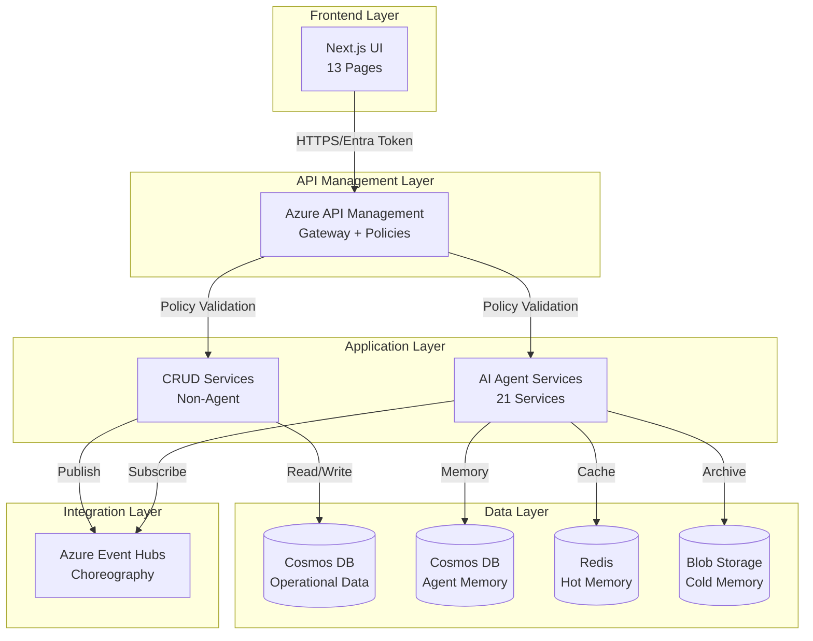

### Design Principles

**From ADRs**:
- **ADR-002**: Azure-native services (Cosmos DB, Event Hubs, AKS, Redis)
- **ADR-007**: SAGA choreography with Event Hubs for service coordination
- **ADR-009**: AKS deployment with KEDA autoscaling
- **ADR-019**: JWT-based authentication with RBAC (anonymous, customer, staff, admin)
- **ADR-020**: Layered API client with TanStack Query

**New Principles**:
- **Separation of Concerns**: CRUD operations separate from AI agent logic
- **Event-Driven**: All state changes publish events for agent consumption
- **Stateless APIs**: All CRUD services stateless, horizontally scalable
- **Cosmos DB First**: Operational data in Cosmos DB with proper partitioning
- **Cloud-Native**: Managed Identity, Key Vault, Private Endpoints, zero trust networking
- **Infrastructure as Code**: All resources provisioned via Bicep
- **Automated Deployment**: CI/CD pipelines for continuous delivery

---

## Cloud-Native Architecture

### Overview

This section defines the cloud-native infrastructure and security patterns that ensure the Holiday Peak Hub solution follows Azure best practices for enterprise applications.

### Security & Identity

#### Azure Key Vault

**Purpose**: Centralized secrets and certificate management

**Secrets Stored**:
- Stripe API keys
- SendGrid API keys
- Third-party service credentials
- SSL/TLS certificates
- OAuth client secrets

**Access Method**: Managed Identity (no passwords/keys in code)

**Implementation**:
```python
# CRUD service - using Managed Identity
from azure.identity import DefaultAzureCredential
from azure.keyvault.secrets import SecretClient

# Authenticate using Managed Identity
credential = DefaultAzureCredential()
vault_url = "https://holidaypeakhub-kv.vault.azure.net/"
client = SecretClient(vault_url=vault_url, credential=credential)

# Retrieve secrets
stripe_key = client.get_secret("stripe-secret-key").value
sendgrid_key = client.get_secret("sendgrid-api-key").value
```

**Bicep Configuration**:
```bicep
resource keyVault 'Microsoft.KeyVault/vaults@2023-07-01' = {
  name: 'holidaypeakhub-kv'
  location: location
  properties: {
    sku: {
      family: 'A'
      name: 'standard'
    }
    tenantId: subscription().tenantId
    enableRbacAuthorization: true
    enabledForDeployment: true
    enabledForTemplateDeployment: true
    publicNetworkAccess: 'Disabled'
    networkAcls: {
      defaultAction: 'Deny'
      bypass: 'AzureServices'
    }
  }
}

// Grant CRUD service access to Key Vault
resource keyVaultRoleAssignment 'Microsoft.Authorization/roleAssignments@2022-04-01' = {
  scope: keyVault
  name: guid(keyVault.id, crudServiceIdentity.id, 'Key Vault Secrets User')
  properties: {
    roleDefinitionId: subscriptionResourceId('Microsoft.Authorization/roleDefinitions', '4633458b-17de-408a-b874-0445c86b69e6')
    principalId: crudServiceIdentity.properties.principalId
    principalType: 'ServicePrincipal'
  }
}
```

---

#### Managed Identity

**Purpose**: Passwordless authentication to Azure services

**Services Using Managed Identity**:
- AKS pods → Cosmos DB (RBAC)
- AKS pods → Event Hubs (RBAC)
- AKS pods → Key Vault (RBAC)
- AKS pods → Redis (AAD authentication)
- AKS pods → Blob Storage (RBAC)
- AKS pods → Azure Container Registry (pull images)

**Implementation**:
```python
# No connection strings needed!
from azure.identity import DefaultAzureCredential
from azure.cosmos import CosmosClient

credential = DefaultAzureCredential()
cosmos_client = CosmosClient(
    url="https://holidaypeakhub.documents.azure.com:443/",
    credential=credential
)
```

**AKS Configuration** (Azure AD Workload Identity):
```yaml
apiVersion: v1
kind: ServiceAccount
metadata:
  name: crud-service
  namespace: holiday-peak
  annotations:
    azure.workload.identity/client-id: "<managed-identity-client-id>"
---
apiVersion: apps/v1
kind: Deployment
metadata:
  name: crud-service
spec:
  template:
    metadata:
      labels:
        azure.workload.identity/use: "true"
    spec:
      serviceAccountName: crud-service
      containers:
      - name: crud-service
        image: holidaypeakhub.azurecr.io/crud-service:latest
```

---

### Networking Architecture

#### Virtual Network Topology

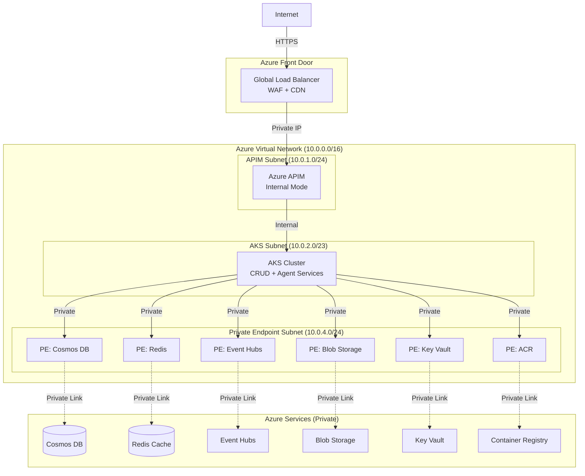

**Network Security**:
- **No public endpoints** for backend services
- **Private Endpoints** for all Azure PaaS services
- **Network Security Groups (NSG)** on all subnets
- **Azure Firewall** for outbound internet access (optional)
- **DDoS Protection** enabled on VNet

**NSG Rules** (example for AKS subnet):
```bicep
resource aksNsg 'Microsoft.Network/networkSecurityGroups@2023-09-01' = {
  name: 'aks-subnet-nsg'
  location: location
  properties: {
    securityRules: [
      {
        name: 'AllowAPIMInbound'
        properties: {
          priority: 100
          direction: 'Inbound'
          access: 'Allow'
          protocol: 'Tcp'
          sourceAddressPrefix: '10.0.1.0/24'  // APIM subnet
          sourcePortRange: '*'
          destinationAddressPrefix: '10.0.2.0/23'  // AKS subnet
          destinationPortRange: '443'
        }
      }
      {
        name: 'DenyInternetInbound'
        properties: {
          priority: 4096
          direction: 'Inbound'
          access: 'Deny'
          protocol: '*'
          sourceAddressPrefix: 'Internet'
          sourcePortRange: '*'
          destinationAddressPrefix: '*'
          destinationPortRange: '*'
        }
      }
    ]
  }
}
```

---

### Container Management

#### Azure Container Registry

**Purpose**: Store and manage Docker images

**Configuration**:
- **SKU**: Premium (for geo-replication and private endpoints)
- **Geo-replication**: Enabled (US East, West Europe)
- **Public network access**: Disabled
- **Managed Identity**: AKS pulls images using Managed Identity

**Image Naming Convention**:
```
holidaypeakhub.azurecr.io/<service-name>:<version>
holidaypeakhub.azurecr.io/crud-service:1.2.3
holidaypeakhub.azurecr.io/ecommerce-catalog-search:1.0.5
```

**ACR Tasks** (automated builds):
```bash
# Build on commit to main branch
az acr task create \
  --registry holidaypeakhub \
  --name build-crud-service \
  --image crud-service:{{.Run.ID}} \
  --context https://github.com/Azure-Samples/holiday-peak-hub.git \
  --file apps/crud-service/Dockerfile \
  --branch main \
  --commit-trigger-enabled true
```

**Bicep Configuration**:
```bicep
resource acr 'Microsoft.ContainerRegistry/registries@2023-07-01' = {
  name: 'holidaypeakhub'
  location: location
  sku: {
    name: 'Premium'
  }
  properties: {
    adminUserEnabled: false
    publicNetworkAccess: 'Disabled'
    networkRuleBypassOptions: 'AzureServices'
  }
}

// Enable geo-replication
resource acrReplication 'Microsoft.ContainerRegistry/registries/replications@2023-07-01' = {
  parent: acr
  name: 'westeurope'
  location: 'westeurope'
}
```

---

### Content Delivery

#### Azure CDN / Front Door

**Purpose**: Global content delivery and Web Application Firewall

**Configuration**:
- **Azure Front Door Premium** (includes WAF)
- **Origin**: Azure Blob Storage (product images, avatars)
- **Caching**: 24 hours for images, 1 hour for API responses
- **Compression**: Enabled (Brotli)
- **Custom Domain**: cdn.holidaypeakhub.com

**WAF Rules**:
- OWASP Core Rule Set 3.2
- Bot protection
- Rate limiting (per client IP)
- Geo-filtering (block high-risk countries)

**Bicep Configuration**:
```bicep
resource frontDoor 'Microsoft.Cdn/profiles@2023-05-01' = {
  name: 'holidaypeakhub-fd'
  location: 'global'
  sku: {
    name: 'Premium_AzureFrontDoor'
  }
  properties: {}
}

resource endpoint 'Microsoft.Cdn/profiles/afdEndpoints@2023-05-01' = {
  parent: frontDoor
  name: 'holidaypeakhub'
  location: 'global'
  properties: {
    enabledState: 'Enabled'
  }
}

// WAF Policy
resource wafPolicy 'Microsoft.Network/FrontDoorWebApplicationFirewallPolicies@2022-05-01' = {
  name: 'holidaypeakhubWaf'
  location: 'global'
  sku: {
    name: 'Premium_AzureFrontDoor'
  }
  properties: {
    policySettings: {
      enabledState: 'Enabled'
      mode: 'Prevention'
    }
    managedRules: {
      managedRuleSets: [
        {
          ruleSetType: 'Microsoft_DefaultRuleSet'
          ruleSetVersion: '2.1'
        }
        {
          ruleSetType: 'Microsoft_BotManagerRuleSet'
          ruleSetVersion: '1.0'
        }
      ]
    }
  }
}
```

---

### Configuration Management

#### Azure App Configuration

**Purpose**: Centralized configuration and feature flags

**Configuration Stored**:
- Feature flags (gradual rollout)
- Environment-specific settings
- Service endpoints
- Non-sensitive configuration

**Implementation**:
```python
from azure.identity import DefaultAzureCredential
from azure.appconfiguration import AzureAppConfigurationClient

credential = DefaultAzureCredential()
app_config_url = "https://holidaypeakhub-config.azconfig.io"
client = AzureAppConfigurationClient(app_config_url, credential)

# Get configuration
max_cart_items = int(client.get_configuration_setting("cart.max_items").value)

# Feature flag
if client.get_configuration_setting("feature.new_checkout").value == "true":
    # Use new checkout flow
    pass
```

**Bicep Configuration**:
```bicep
resource appConfig 'Microsoft.AppConfiguration/configurationStores@2023-03-01' = {
  name: 'holidaypeakhub-config'
  location: location
  sku: {
    name: 'Standard'
  }
  properties: {
    publicNetworkAccess: 'Disabled'
    disableLocalAuth: true
  }
}
```

---

### Observability

#### Application Insights

**Purpose**: Distributed tracing, metrics, and logs

**Features**:
- **Distributed Tracing**: Correlation across services
- **Live Metrics**: Real-time monitoring
- **Application Map**: Service dependencies visualization
- **Failures Analysis**: Exception tracking
- **Performance**: Slow query detection

**Implementation**:
```python
from azure.monitor.opentelemetry import configure_azure_monitor
from opentelemetry import trace

# Configure OpenTelemetry with Application Insights
configure_azure_monitor(
    connection_string="InstrumentationKey=..."
)

tracer = trace.get_tracer(__name__)

@app.get("/api/users/{user_id}")
async def get_user(user_id: str):
    with tracer.start_as_current_span("get_user") as span:
        span.set_attribute("user.id", user_id)
        user = await user_repository.get(user_id)
        return user
```

**Key Metrics to Track**:
- Request rate (requests/sec)
- Response time (p50, p95, p99)
- Error rate (%)
- Dependency calls duration
- Cosmos DB RU consumption
- Event Hub throughput

---

#### Log Analytics Workspace

**Purpose**: Centralized logging and querying

**Logs Collected**:
- AKS container logs
- APIM request/response logs
- Cosmos DB diagnostics
- Event Hubs diagnostics
- NSG flow logs

**Sample KQL Queries**:
```kusto
// Failed requests in last hour
requests
| where timestamp > ago(1h)
| where success == false
| summarize count() by operation_Name, resultCode
| order by count_ desc

// Slow Cosmos DB queries
AzureDiagnostics
| where ResourceProvider == "MICROSOFT.DOCUMENTDB"
| where Category == "DataPlaneRequests"
| where todouble(durationMs_s) > 1000
| project TimeGenerated, durationMs_s, OperationName, collectionName_s
```

---

### Disaster Recovery

#### Backup Strategy

**Cosmos DB**:
- Automatic continuous backups (default)
- Point-in-time restore (up to 30 days)
- Geo-redundant backup storage

**AKS**:
- Velero for cluster backup (etcd, persistent volumes)
- Daily automated backups to Blob Storage
- Restore tested monthly

**Recovery Objectives**:
- **RTO (Recovery Time Objective)**: 1 hour
- **RPO (Recovery Point Objective)**: 5 minutes

**Multi-Region Failover**:
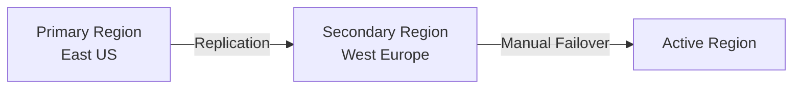

**Failover Procedure**:
1. Detect region outage via Azure Monitor
2. Trigger manual failover in Cosmos DB (30 seconds)
3. Update APIM backend URLs to secondary region
4. Update DNS to point to secondary Front Door endpoint
5. Verify all services operational

---

### Cost Management

#### Cost Optimization Strategies

**Cosmos DB**:
- Use autoscale RU/s (scale down during low traffic)
- Reserved capacity (1-year commitment for 25% discount)
- Monitor RU consumption via Application Insights

**AKS**:
- Use spot instances for non-critical workloads
- KEDA autoscaling (scale to zero when idle)
- Right-size node pools based on actual usage

**APIM**:
- Consumption tier for dev/test (pay per call)
- Standard tier for production (fixed cost)

**Storage**:
- Lifecycle management (move old blobs to Cool/Archive tier)
- Use Azure CDN to reduce egress costs

**Budget Alerts**:
```bicep
resource budget 'Microsoft.Consumption/budgets@2023-11-01' = {
  name: 'monthly-budget'
  properties: {
    category: 'Cost'
    amount: 10000
    timeGrain: 'Monthly'
    timePeriod: {
      startDate: '2026-01-01'
    }
    notifications: {
      actual_GreaterThan_80_Percent: {
        enabled: true
        operator: 'GreaterThan'
        threshold: 80
        contactEmails: ['admin@holidaypeakhub.com']
      }
    }
  }
}
```

---

## Existing Agent Services Inventory

### E-Commerce Domain (5 services)

| Service | Purpose | MCP Tools | Frontend Integration |
|---------|---------|-----------|---------------------|
| **ecommerce-catalog-search** | Product discovery with AI Search | `/catalog/search`, `/catalog/suggest` | Homepage, Category, Search |
| **ecommerce-product-detail-enrichment** | ACP metadata augmentation | `/product/enrich`, `/product/reviews` | Product Detail, Reviews |
| **ecommerce-cart-intelligence** | Personalized cart recommendations | `/cart/recommendations`, `/cart/upsell` | Cart, Checkout |
| **ecommerce-checkout-support** | Allocation validation, dynamic pricing | `/checkout/validate`, `/checkout/pricing` | Checkout |
| **ecommerce-order-status** | Proactive order tracking | `/order/status`, `/order/timeline` | Order Tracking, Dashboard |

### Product Management Domain (4 services)

| Service | Purpose | MCP Tools | Frontend Integration |
|---------|---------|-----------|---------------------|
| **product-management-normalization-classification** | Automated taxonomy alignment | `/product/normalize`, `/product/classify` | Admin Portal |
| **product-management-acp-transformation** | Standards-compliant catalog export | `/product/acp/transform` | Admin Portal |
| **product-management-consistency-validation** | Real-time data quality checks | `/product/validate` | Admin Portal |
| **product-management-assortment-optimization** | ML-driven SKU mix recommendations | `/assortment/optimize`, `/assortment/featured` | Homepage, Admin |

### CRM Domain (4 services)

| Service | Purpose | MCP Tools | Frontend Integration |
|---------|---------|-----------|---------------------|
| **crm-profile-aggregation** | Unified customer view | `/profile/context`, `/profile/summary` | Profile, Dashboard |
| **crm-segmentation-personalization** | Dynamic cohort building | `/segment/recommend`, `/segment/personalize` | Homepage, Dashboard |
| **crm-campaign-intelligence** | ROI-optimized marketing automation | `/campaign/analytics`, `/campaign/optimize` | Staff Sales Analytics |
| **crm-support-assistance** | Agent-augmented customer service | `/support/assist`, `/support/suggest` | Staff Requests |

### Inventory Domain (4 services)

| Service | Purpose | MCP Tools | Frontend Integration |
|---------|---------|-----------|---------------------|
| **inventory-health-check** | Predictive stock-out alerts | `/inventory/health`, `/inventory/availability` | Product Detail, Category |
| **inventory-jit-replenishment** | Demand-sensing reorder triggers | `/inventory/replenish` | Admin Portal |
| **inventory-reservation-validation** | Real-time allocation locking | `/inventory/reserve`, `/inventory/release` | Checkout |
| **inventory-alerts-triggers** | Exception-based notifications | `/inventory/alerts` | Admin Portal |

### Logistics Domain (4 services)

| Service | Purpose | MCP Tools | Frontend Integration |
|---------|---------|-----------|---------------------|
| **logistics-eta-computation** | Real-time delivery predictions | `/logistics/eta`, `/logistics/estimate` | Product Detail, Order Tracking |
| **logistics-carrier-selection** | Cost/speed trade-off optimization | `/logistics/carrier/select` | Checkout |
| **logistics-returns-support** | Reverse logistics automation | `/logistics/return/initiate`, `/logistics/return/status` | Staff Requests, My Orders |
| **logistics-route-issue-detection** | Proactive delay mitigation | `/logistics/route/issues` | Staff Logistics, Order Tracking |

---

## Page-to-Backend Mapping

### Anonymous Pages (6 pages)

#### 1. Homepage (`/`)

**Current State**: ✅ Frontend complete, needs CRUD APIs

**Agent Services Used**:
- `ecommerce-catalog-search` - Featured products search
- `crm-segmentation-personalization` - Personalized recommendations (if session exists)
- `product-management-assortment-optimization` - Featured categories

**Non-Agent Services Needed**:
- ❌ **Product CRUD API** - Get featured products (fallback if agent fails)
- ❌ **Category CRUD API** - Get all categories for showcase
- ❌ **Banner/Promotion API** - Get active banners for hero section

**API Endpoints Required**:
```
GET /api/products/featured (limit, offset)
GET /api/categories (limit, offset)
GET /api/banners/active
```

---

#### 2. Category Page (`/category/[slug]`)

**Current State**: ✅ Frontend complete, needs CRUD APIs

**Agent Services Used**:
- `ecommerce-catalog-search` - AI-powered product search and filtering
- `inventory-health-check` - Real-time stock status
- `product-management-assortment-optimization` - Sort by popularity

**Non-Agent Services Needed**:
- ❌ **Product CRUD API** - Basic product listing (fallback)
- ❌ **Category CRUD API** - Get category details by slug
- ❌ **Filter/Facet API** - Get available filters (price ranges, brands, attributes)

**API Endpoints Required**:
```
GET /api/categories/{slug}
GET /api/products?category={slug}&filters={json}&sort={field}&order={asc|desc}&page={n}&limit={n}
GET /api/products/filters?category={slug}
```

---

#### 3. Product Detail (`/product/[id]`)

**Current State**: ✅ Frontend complete, needs CRUD APIs

**Agent Services Used**:
- `ecommerce-product-detail-enrichment` - Full product details (ACP compliant)
- `inventory-health-check` - Real-time inventory status
- `logistics-eta-computation` - Delivery estimates
- `ecommerce-cart-intelligence` - Related products

**Non-Agent Services Needed**:
- ❌ **Product CRUD API** - Get product details by ID
- ❌ **Review CRUD API** - Get/create/update product reviews
- ❌ **Wishlist API** - Add/remove from wishlist
- ❌ **Inventory API** - Get stock levels and variants

**API Endpoints Required**:
```
GET /api/products/{id}
GET /api/products/{id}/reviews (page, limit, sort)
POST /api/products/{id}/reviews
GET /api/products/{id}/inventory
POST /api/wishlist
DELETE /api/wishlist/{product_id}
```

---

#### 4. Order Tracking (`/order/[id]`)

**Current State**: ✅ Frontend complete, needs CRUD APIs

**Agent Services Used**:
- `ecommerce-order-status` - Order details and status
- `logistics-eta-computation` - Delivery updates
- `logistics-route-issue-detection` - Delay alerts

**Non-Agent Services Needed**:
- ❌ **Order CRUD API** - Get order details by ID (public, requires email verification for anonymous)
- ❌ **Tracking API** - Get tracking events timeline

**API Endpoints Required**:
```
GET /api/orders/{id}?email={email} (anonymous - requires email verification)
GET /api/orders/{id}/tracking
```

---

#### 5. Login (`/auth/login`)

**Current State**: ✅ Frontend complete, needs Auth API

**Agent Services Used**: None (pure CRUD)

**Non-Agent Services Needed**:
- ❌ **Authentication API** - Redirect to Microsoft Entra ID login
- ❌ **OAuth Callback Handler** - Handle Entra ID callback and token exchange
- ❌ **Session Management** - Token storage and refresh

**API Endpoints Required**:
```
GET /api/auth/login (redirect to Entra ID)
GET /api/auth/callback (OAuth callback handler)
POST /api/auth/guest (create guest session)
```

---

#### 6. Signup (`/auth/signup`)

**Current State**: ✅ Frontend complete, needs Auth API

**Agent Services Used**: None (pure CRUD)

**Non-Agent Services Needed**:
- ❌ **User Registration** - Handled by Entra ID B2C user flows or self-service signup
- ❌ **User Profile Sync** - Sync Entra ID user to local database on first login
- ❌ **Newsletter Opt-in** - Store user preferences locally

**API Endpoints Required**:
```
GET /api/auth/signup (redirect to Entra ID B2C signup flow)
GET /api/auth/callback (handle callback and sync user)
PUT /api/users/me/preferences (store newsletter opt-in)
```

---

### Customer Pages (3 pages)

#### 7. Checkout (`/checkout`)

**Role**: `customer`

**Current State**: ✅ Frontend complete, needs CRUD APIs + Agent integration

**Agent Services Used**:
- `ecommerce-cart-intelligence` - Cart validation and upsell
- `ecommerce-checkout-support` - Checkout validation and pricing
- `inventory-reservation-validation` - Stock reservation
- `logistics-carrier-selection` - Shipping options

**Non-Agent Services Needed**:
- ❌ **Cart CRUD API** - Get/update cart items
- ❌ **Address API** - Validate and save shipping address
- ❌ **Payment API** - Process payment (Stripe/PayPal integration)
- ❌ **Order Creation API** - Create order from cart
- ❌ **Promo Code API** - Validate and apply promo codes

**API Endpoints Required**:
```
GET /api/cart
POST /api/cart/items (product_id, quantity, variant_id)
PUT /api/cart/items/{item_id} (quantity)
DELETE /api/cart/items/{item_id}
POST /api/addresses/validate (address_json)
POST /api/checkout/promo (code)
POST /api/orders (cart_id, shipping_address, payment_method, shipping_method)
POST /api/payments/create-intent (order_id, amount)
POST /api/payments/confirm (payment_intent_id)
```

**Event Choreography**:
1. User submits order → `OrderCreated` event published
2. `inventory-reservation-validation` subscribes → Reserves stock → `InventoryReserved` event
3. Payment API processes → `PaymentProcessed` event
4. `logistics-carrier-selection` subscribes → `ShipmentScheduled` event
5. Order status updated to "processing"

---

#### 8. Dashboard (`/dashboard`)

**Role**: `customer`

**Current State**: ✅ Frontend complete, needs CRUD APIs + Agent integration

**Agent Services Used**:
- `crm-profile-aggregation` - User profile summary
- `crm-segmentation-personalization` - Personalized recommendations
- `ecommerce-order-status` - Recent orders

**Non-Agent Services Needed**:
- ❌ **User Dashboard API** - Get user statistics (order count, rewards points)
- ❌ **Order History API** - Get recent orders for user
- ❌ **Wishlist API** - Get user wishlist with stock updates
- ❌ **Rewards API** - Get loyalty program status

**API Endpoints Required**:
```
GET /api/users/me/dashboard (includes stats, recent orders, recommendations)
GET /api/users/me/orders (page, limit, status_filter)
GET /api/users/me/wishlist
GET /api/users/me/rewards
```

---

#### 9. Profile (`/profile`)

**Role**: `customer`

**Current State**: ✅ Frontend complete, needs CRUD APIs + Agent integration

**Agent Services Used**:
- `crm-profile-aggregation` - User profile aggregation and context

**Non-Agent Services Needed**:
- ❌ **User Profile API** - Get/update personal information
- ❌ **Address Book API** - CRUD for saved addresses
- ❌ **Payment Methods API** - CRUD for saved payment methods
- ❌ **Security Settings API** - Change password, enable 2FA
- ❌ **Preferences API** - Update notification preferences

**API Endpoints Required**:
```
GET /api/users/me
PUT /api/users/me (name, phone, email)
GET /api/users/me/addresses
POST /api/users/me/addresses (address_json)
PUT /api/users/me/addresses/{id} (address_json)
DELETE /api/users/me/addresses/{id}
PUT /api/users/me/addresses/{id}/default
GET /api/users/me/payment-methods
POST /api/users/me/payment-methods (stripe_token, billing_address)
DELETE /api/users/me/payment-methods/{id}
GET /api/users/me/preferences
PUT /api/users/me/preferences (preferences_json)
```

**Note**: Password management and 2FA are handled by Microsoft Entra ID, not via API endpoints.

---

### Staff Pages (3 pages)

#### 10. Sales Analytics (`/staff/sales`)

**Role**: `staff`

**Current State**: ✅ Frontend complete, needs Analytics API + Agent integration

**Agent Services Used**:
- `crm-campaign-intelligence` - Campaign performance and ROI
- `ecommerce-catalog-search` - Product performance data

**Non-Agent Services Needed**:
- ❌ **Analytics API** - Aggregate sales data (revenue, orders, conversion)
- ❌ **Reporting API** - Generate sales reports (daily, weekly, monthly)
- ❌ **Product Performance API** - Top products, page views, add-to-cart rates
- ❌ **Category Performance API** - Sales by category

**API Endpoints Required**:
```
GET /api/staff/analytics/sales?start_date={date}&end_date={date} (revenue, orders, avg_order_value, new_customers)
GET /api/staff/analytics/products/top?limit={n}&sort_by={sales|revenue|views}
GET /api/staff/analytics/categories?start_date={date}&end_date={date}
GET /api/staff/analytics/conversion?start_date={date}&end_date={date}
GET /api/staff/reports/sales/export?format={csv|xlsx}&start_date={date}&end_date={date}
```

**Implementation Notes**:
- Use **read replicas** for analytics queries (high volume, read-heavy)
- Cache aggregated data in Redis (TTL: 5-15 minutes)
- Pre-compute daily/weekly/monthly aggregates (background job)

---

#### 11. Customer Requests (`/staff/requests`)

**Role**: `staff`

**Current State**: ✅ Frontend complete, needs Ticketing API + Agent integration

**Agent Services Used**:
- `logistics-returns-support` - Return request processing
- `crm-support-assistance` - Support ticket suggestions and responses

**Non-Agent Services Needed**:
- ❌ **Ticket CRUD API** - Create/read/update customer tickets
- ❌ **Return Management API** - Process return/exchange/refund requests
- ❌ **Ticket Assignment API** - Assign tickets to staff members
- ❌ **Status Workflow API** - Update ticket status (pending → in_progress → resolved)

**API Endpoints Required**:
```
GET /api/staff/tickets?status={status}&type={type}&priority={priority}&page={n}&limit={n}
GET /api/staff/tickets/{id}
PUT /api/staff/tickets/{id}/status (new_status)
PUT /api/staff/tickets/{id}/assign (staff_id)
POST /api/staff/tickets/{id}/response (message, internal_note)
POST /api/staff/returns (order_id, items, reason, type)
GET /api/staff/returns/{id}
PUT /api/staff/returns/{id}/approve
PUT /api/staff/returns/{id}/reject (reason)
```

**Event Choreography**:
1. Customer creates return request → `ReturnRequested` event
2. `logistics-returns-support` agent evaluates → Suggests approval/rejection
3. Staff approves → `ReturnApproved` event
4. `inventory-health-check` subscribes → Updates stock levels
5. Refund processed → `RefundProcessed` event

---

#### 12. Logistics Tracking (`/staff/logistics`)

**Role**: `staff`

**Current State**: ✅ Frontend complete, needs Shipment API + Agent integration

**Agent Services Used**:
- `logistics-eta-computation` - ETA predictions and updates
- `logistics-carrier-selection` - Carrier information
- `logistics-route-issue-detection` - Delay alerts and issue detection

**Non-Agent Services Needed**:
- ❌ **Shipment CRUD API** - Get/update shipment status
- ❌ **Carrier Integration API** - Track with carrier APIs (FedEx, UPS, USPS)
- ❌ **Notification API** - Send customer notifications (SMS, email)

**API Endpoints Required**:
```
GET /api/staff/shipments?status={status}&carrier={carrier}&page={n}&limit={n}
GET /api/staff/shipments/{id}
PUT /api/staff/shipments/{id}/status (new_status, location, notes)
POST /api/staff/shipments/{id}/notify-customer (notification_type)
GET /api/staff/shipments/{id}/carrier-tracking (fetch from carrier API)
POST /api/staff/shipments/{id}/contact-carrier (issue_description)
```

**Event Choreography**:
1. Shipment status updated → `ShipmentStatusUpdated` event
2. `logistics-eta-computation` recalculates ETA → `ETAUpdated` event
3. `logistics-route-issue-detection` detects delay → `RouteIssueDetected` event
4. Notification service sends customer alert

---

### Admin Pages (1 page)

#### 13. Admin Portal (`/admin`)

**Role**: `admin`

**Current State**: ✅ Frontend complete, needs Admin APIs + Agent management

**Agent Services Used**: All 21 agent services (management and monitoring)

**Non-Agent Services Needed**:
- ❌ **System Health API** - Monitor all services (uptime, response time, error rate)
- ❌ **User Management API** - CRUD for users, role assignment
- ❌ **Service Management API** - Start/stop/restart services, view logs
- ❌ **Configuration API** - Manage system settings and feature flags
- ❌ **Audit Log API** - View all admin actions and system events

**API Endpoints Required**:
```
GET /api/admin/health (all services status)
GET /api/admin/services (list all services with metrics)
GET /api/admin/services/{service_name}/logs?lines={n}
POST /api/admin/services/{service_name}/restart
GET /api/admin/users?role={role}&page={n}&limit={n}
POST /api/admin/users (create user with role)
PUT /api/admin/users/{id}/role (new_role)
DELETE /api/admin/users/{id}
GET /api/admin/config
PUT /api/admin/config/{key} (value)
GET /api/admin/audit-logs?start_date={date}&end_date={date}&actor={user_id}&action={action}
```

---

## Database Design

### Cosmos DB Strategy

**ADR-002 Compliance**: Use Azure Cosmos DB (NoSQL) for all operational data

**Database Structure**:
- **Database**: `holiday-peak-hub`
- **Containers**: Separate container per entity type
- **Consistency Level**: Session (default, balances consistency and performance)
- **Partitioning**: Strategic partition keys for optimal distribution

**Partition Key Strategy**:
- **Users**: `/user_id` (high cardinality, user-isolated queries)
- **Products**: `/category_slug` (enables category-level queries)
- **Orders**: `/user_id` (user-isolated queries, 90% of access pattern)
- **Order Items**: `/order_id` (always queried with order context)
- **Reviews**: `/product_id` (product-centric queries)
- **Cart**: `/user_id` (user-isolated)
- **Addresses**: `/user_id` (user-isolated)
- **Payment Methods**: `/user_id` (user-isolated)
- **Tickets**: `/user_id` (user and staff queries balanced)
- **Shipments**: `/order_id` (order-centric queries)

---

### Container Schemas

#### 1. Users Container

**Partition Key**: `/user_id`

```json
{
  "id": "user-uuid-12345",
  "user_id": "user-uuid-12345",
  "email": "customer@example.com",
  "name": "John Doe",
  "password_hash": "bcrypt-hash",
  "role": "customer",
  "phone": "+1234567890",
  "email_verified": true,
  "newsletter_opt_in": true,
  "created_at": "2026-01-15T10:30:00Z",
  "updated_at": "2026-01-20T14:45:00Z",
  "last_login": "2026-01-25T08:15:00Z",
  "profile": {
    "avatar_url": "https://storage.blob.core.windows.net/avatars/user-12345.jpg",
    "date_of_birth": "1990-05-15",
    "preferences": {
      "language": "en",
      "currency": "USD",
      "notifications": {
        "email_marketing": true,
        "email_orders": true,
        "sms_shipping": false
      }
    }
  },
  "rewards": {
    "points": 1250,
    "tier": "gold",
    "lifetime_spend": 15000.00
  },
  "_ts": 1706184300
}
```

**Indexes**:
- Primary: `user_id` (partition key)
- Secondary: `email` (unique, for login)
- Secondary: `role` (for admin user listing)

---

#### 2. Products Container

**Partition Key**: `/category_slug`

```json
{
  "id": "product-uuid-67890",
  "product_id": "product-uuid-67890",
  "category_slug": "electronics-laptops",
  "sku": "LAPTOP-MBA-M2-13",
  "name": "MacBook Air 13-inch M2",
  "slug": "macbook-air-13-m2",
  "description": "Powerful and portable laptop with M2 chip",
  "long_description": "Full product description with specs...",
  "brand": "Apple",
  "price": {
    "amount": 1199.00,
    "currency": "USD",
    "compare_at": 1299.00,
    "tax_rate": 0.0825
  },
  "images": [
    {
      "url": "https://storage.blob.core.windows.net/products/macbook-air-1.jpg",
      "alt": "MacBook Air front view",
      "order": 1
    }
  ],
  "variants": [
    {
      "variant_id": "variant-12345",
      "sku": "LAPTOP-MBA-M2-13-256-SILVER",
      "attributes": {
        "color": "Silver",
        "storage": "256GB",
        "ram": "8GB"
      },
      "price_adjustment": 0.00,
      "stock": 45
    }
  ],
  "attributes": {
    "processor": "Apple M2",
    "screen_size": "13.6 inches",
    "weight": "2.7 lbs"
  },
  "seo": {
    "meta_title": "MacBook Air 13-inch M2 - Best Price",
    "meta_description": "Buy MacBook Air with M2 chip...",
    "canonical_url": "/product/macbook-air-13-m2"
  },
  "status": "active",
  "created_at": "2025-12-01T00:00:00Z",
  "updated_at": "2026-01-20T16:30:00Z",
  "published_at": "2025-12-15T00:00:00Z",
  "analytics": {
    "views": 15420,
    "add_to_cart": 892,
    "purchases": 234,
    "conversion_rate": 0.262
  },
  "_ts": 1706198300
}
```

**Indexes**:
- Primary: `category_slug` (partition key)
- Secondary: `product_id` (unique)
- Secondary: `slug` (unique, for URL lookups)
- Secondary: `status` (for active product queries)

---

#### 3. Orders Container

**Partition Key**: `/user_id`

```json
{
  "id": "order-uuid-98765",
  "order_id": "order-uuid-98765",
  "user_id": "user-uuid-12345",
  "order_number": "HPH-2026-001234",
  "status": "processing",
  "payment_status": "paid",
  "fulfillment_status": "pending",
  "email": "customer@example.com",
  "totals": {
    "subtotal": 1199.00,
    "tax": 98.92,
    "shipping": 12.00,
    "discount": 0.00,
    "total": 1309.92,
    "currency": "USD"
  },
  "shipping_address": {
    "name": "John Doe",
    "line1": "123 Main St",
    "line2": "Apt 4B",
    "city": "San Francisco",
    "state": "CA",
    "postal_code": "94102",
    "country": "US",
    "phone": "+1234567890"
  },
  "billing_address": {
    "name": "John Doe",
    "line1": "123 Main St",
    "city": "San Francisco",
    "state": "CA",
    "postal_code": "94102",
    "country": "US"
  },
  "payment": {
    "method": "credit_card",
    "last4": "4242",
    "brand": "Visa",
    "stripe_payment_intent_id": "pi_abc123"
  },
  "shipping": {
    "method": "standard",
    "carrier": "FedEx",
    "tracking_number": "1Z999AA10123456784",
    "estimated_delivery": "2026-01-30T23:59:59Z"
  },
  "items": [
    {
      "order_item_id": "item-uuid-11111",
      "product_id": "product-uuid-67890",
      "variant_id": "variant-12345",
      "sku": "LAPTOP-MBA-M2-13-256-SILVER",
      "name": "MacBook Air 13-inch M2",
      "variant_name": "Silver / 256GB / 8GB",
      "quantity": 1,
      "unit_price": 1199.00,
      "line_total": 1199.00,
      "image_url": "https://storage.blob.core.windows.net/products/macbook-air-1.jpg"
    }
  ],
  "promo_code": null,
  "notes": "",
  "ip_address": "192.168.1.1",
  "user_agent": "Mozilla/5.0...",
  "created_at": "2026-01-25T10:45:00Z",
  "updated_at": "2026-01-25T11:00:00Z",
  "paid_at": "2026-01-25T10:46:30Z",
  "_ts": 1706185500
}
```

**Indexes**:
- Primary: `user_id` (partition key)
- Secondary: `order_id` (unique)
- Secondary: `order_number` (unique, for customer lookups)
- Secondary: `status` (for filtering)
- Secondary: `email` (for anonymous order tracking)

---

#### 4. Reviews Container

**Partition Key**: `/product_id`

```json
{
  "id": "review-uuid-55555",
  "review_id": "review-uuid-55555",
  "product_id": "product-uuid-67890",
  "user_id": "user-uuid-12345",
  "order_id": "order-uuid-98765",
  "rating": 5,
  "title": "Best laptop I've ever owned!",
  "comment": "The M2 chip is incredibly fast...",
  "verified_purchase": true,
  "helpful_count": 42,
  "not_helpful_count": 2,
  "images": [
    "https://storage.blob.core.windows.net/reviews/review-55555-1.jpg"
  ],
  "status": "published",
  "moderation_notes": "",
  "created_at": "2026-01-28T14:20:00Z",
  "updated_at": "2026-01-28T14:20:00Z",
  "published_at": "2026-01-28T15:00:00Z",
  "_ts": 1706452800
}
```

**Indexes**:
- Primary: `product_id` (partition key)
- Secondary: `user_id` (for user reviews)
- Secondary: `status` (for moderation)
- Secondary: `rating` (for filtering)

---

#### 5. Cart Container

**Partition Key**: `/user_id`

```json
{
  "id": "cart-user-uuid-12345",
  "cart_id": "cart-user-uuid-12345",
  "user_id": "user-uuid-12345",
  "items": [
    {
      "cart_item_id": "cartitem-uuid-11111",
      "product_id": "product-uuid-67890",
      "variant_id": "variant-12345",
      "sku": "LAPTOP-MBA-M2-13-256-SILVER",
      "name": "MacBook Air 13-inch M2",
      "variant_name": "Silver / 256GB / 8GB",
      "quantity": 1,
      "unit_price": 1199.00,
      "line_total": 1199.00,
      "image_url": "https://storage.blob.core.windows.net/products/macbook-air-1.jpg",
      "added_at": "2026-01-25T09:30:00Z"
    }
  ],
  "totals": {
    "subtotal": 1199.00,
    "tax_estimate": 98.92,
    "total_estimate": 1297.92,
    "currency": "USD"
  },
  "promo_code": null,
  "session_id": "session-uuid-99999",
  "created_at": "2026-01-25T09:30:00Z",
  "updated_at": "2026-01-25T10:15:00Z",
  "expires_at": "2026-02-08T09:30:00Z",
  "_ts": 1706180100
}
```

**Indexes**:
- Primary: `user_id` (partition key)
- Secondary: `session_id` (for guest carts)
- TTL: Set `expires_at` (14 days for guest, 90 days for authenticated)

---

#### 6. Addresses Container

**Partition Key**: `/user_id`

```json
{
  "id": "address-uuid-33333",
  "address_id": "address-uuid-33333",
  "user_id": "user-uuid-12345",
  "name": "John Doe",
  "line1": "123 Main St",
  "line2": "Apt 4B",
  "city": "San Francisco",
  "state": "CA",
  "postal_code": "94102",
  "country": "US",
  "phone": "+1234567890",
  "is_default": true,
  "type": "shipping",
  "created_at": "2026-01-10T12:00:00Z",
  "updated_at": "2026-01-10T12:00:00Z",
  "_ts": 1705838400
}
```

**Indexes**:
- Primary: `user_id` (partition key)
- Secondary: `address_id` (unique)

---

#### 7. Payment Methods Container

**Partition Key**: `/user_id`

```json
{
  "id": "payment-uuid-44444",
  "payment_method_id": "payment-uuid-44444",
  "user_id": "user-uuid-12345",
  "type": "credit_card",
  "stripe_payment_method_id": "pm_abc123",
  "last4": "4242",
  "brand": "Visa",
  "exp_month": 12,
  "exp_year": 2028,
  "billing_address_id": "address-uuid-33333",
  "is_default": true,
  "created_at": "2026-01-10T12:05:00Z",
  "updated_at": "2026-01-10T12:05:00Z",
  "_ts": 1705838700
}
```

**Indexes**:
- Primary: `user_id` (partition key)
- Secondary: `payment_method_id` (unique)

**Security**: Never store full card numbers, only Stripe payment method IDs

---

#### 8. Customer Tickets Container

**Partition Key**: `/user_id`

```json
{
  "id": "ticket-uuid-77777",
  "ticket_id": "ticket-uuid-77777",
  "ticket_number": "HPH-T-2026-005678",
  "user_id": "user-uuid-12345",
  "order_id": "order-uuid-98765",
  "type": "return",
  "subject": "Return request for MacBook Air",
  "description": "Product arrived with a small dent...",
  "status": "in_progress",
  "priority": "high",
  "assigned_to": "staff-uuid-22222",
  "category": "product_quality",
  "messages": [
    {
      "message_id": "msg-uuid-11111",
      "author_id": "user-uuid-12345",
      "author_type": "customer",
      "message": "Product arrived with a small dent...",
      "is_internal": false,
      "created_at": "2026-01-26T10:00:00Z"
    },
    {
      "message_id": "msg-uuid-22222",
      "author_id": "staff-uuid-22222",
      "author_type": "staff",
      "message": "I'm sorry to hear that. We'll process a return immediately.",
      "is_internal": false,
      "created_at": "2026-01-26T10:15:00Z"
    }
  ],
  "resolution": null,
  "tags": ["return", "product_damage"],
  "created_at": "2026-01-26T10:00:00Z",
  "updated_at": "2026-01-26T10:15:00Z",
  "resolved_at": null,
  "first_response_at": "2026-01-26T10:15:00Z",
  "_ts": 1706264100
}
```

**Indexes**:
- Primary: `user_id` (partition key)
- Secondary: `ticket_id` (unique)
- Secondary: `status` (for filtering)
- Secondary: `assigned_to` (for staff views)
- Secondary: `type` (for filtering)

---

#### 9. Shipments Container

**Partition Key**: `/order_id`

```json
{
  "id": "shipment-uuid-88888",
  "shipment_id": "shipment-uuid-88888",
  "order_id": "order-uuid-98765",
  "user_id": "user-uuid-12345",
  "carrier": "FedEx",
  "service_level": "standard",
  "tracking_number": "1Z999AA10123456784",
  "status": "in_transit",
  "origin": {
    "name": "Holiday Peak Warehouse",
    "line1": "500 Industrial Blvd",
    "city": "Memphis",
    "state": "TN",
    "postal_code": "38125",
    "country": "US"
  },
  "destination": {
    "name": "John Doe",
    "line1": "123 Main St",
    "line2": "Apt 4B",
    "city": "San Francisco",
    "state": "CA",
    "postal_code": "94102",
    "country": "US"
  },
  "estimated_delivery": "2026-01-30T23:59:59Z",
  "actual_delivery": null,
  "weight": {
    "value": 2.7,
    "unit": "lbs"
  },
  "dimensions": {
    "length": 12.0,
    "width": 9.0,
    "height": 1.0,
    "unit": "inches"
  },
  "events": [
    {
      "event_id": "event-uuid-11111",
      "status": "label_created",
      "location": "Memphis, TN",
      "timestamp": "2026-01-25T11:00:00Z",
      "description": "Shipping label created"
    },
    {
      "event_id": "event-uuid-22222",
      "status": "picked_up",
      "location": "Memphis, TN",
      "timestamp": "2026-01-25T14:30:00Z",
      "description": "Package picked up by carrier"
    },
    {
      "event_id": "event-uuid-33333",
      "status": "in_transit",
      "location": "Dallas, TX",
      "timestamp": "2026-01-26T08:15:00Z",
      "description": "Package in transit"
    }
  ],
  "current_location": {
    "city": "Dallas",
    "state": "TX",
    "country": "US",
    "updated_at": "2026-01-26T08:15:00Z"
  },
  "issues": [],
  "created_at": "2026-01-25T11:00:00Z",
  "updated_at": "2026-01-26T08:15:00Z",
  "_ts": 1706258100
}
```

**Indexes**:
- Primary: `order_id` (partition key)
- Secondary: `shipment_id` (unique)
- Secondary: `tracking_number` (for carrier tracking)
- Secondary: `status` (for filtering)

---

#### 10. Audit Logs Container

**Partition Key**: `/entity_type` (e.g., "user", "order", "product")

```json
{
  "id": "audit-uuid-99999",
  "audit_id": "audit-uuid-99999",
  "entity_type": "order",
  "entity_id": "order-uuid-98765",
  "action": "status_updated",
  "actor_id": "staff-uuid-22222",
  "actor_type": "staff",
  "actor_email": "staff@example.com",
  "changes": {
    "status": {
      "before": "pending",
      "after": "processing"
    }
  },
  "metadata": {
    "ip_address": "10.0.1.50",
    "user_agent": "Mozilla/5.0...",
    "session_id": "session-uuid-88888"
  },
  "timestamp": "2026-01-25T11:00:00Z",
  "_ts": 1706185200
}
```

**Indexes**:
- Primary: `entity_type` (partition key)
- Secondary: `entity_id` (for entity history)
- Secondary: `actor_id` (for user actions)
- Secondary: `timestamp` (for time-based queries)

**TTL**: Set TTL to 90 days (regulatory compliance, then archive to cold storage)

---

## API Design

### API Architecture

**ADR-020 Compliance**: Layered API client with REST + Agent invocation

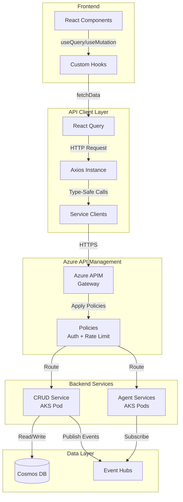

---

### Azure API Management Design

**Purpose**: Managed API gateway providing single entry point for all frontend requests

**Technology**: Azure API Management (Consumption tier for dev, Standard/Premium for prod)

**Endpoint**: `https://holidaypeakhub.azure-api.net`

**Features**:
- **Authentication**: Validate Entra ID tokens via `validate-jwt` policy
- **Authorization**: RBAC enforcement using token claims
- **Rate Limiting**: Request throttling per subscription key
- **CORS**: Managed CORS policies
- **Logging**: Azure Monitor integration for all requests
- **Caching**: Response caching for GET requests
- **Transformation**: Request/response transformation policies
- **Load Balancing**: Automatic routing to backend services
- **Circuit Breaker**: Fault tolerance for backend failures

**API Routes** (configured as APIM Operations):
```
/api/auth/*          → Auth Service (OAuth flows)
/api/users/*         → CRUD Service (User management)
/api/products/*      → CRUD Service (Product CRUD)
/api/orders/*        → CRUD Service (Order CRUD)
/api/cart/*          → CRUD Service (Cart management)
/api/checkout/*      → CRUD Service (Checkout flow)
/api/addresses/*     → CRUD Service (Address management)
/api/payments/*      → CRUD Service (Payment processing)
/api/reviews/*       → CRUD Service (Review CRUD)
/api/wishlist/*      → CRUD Service (Wishlist management)
/api/staff/*         → CRUD Service (Staff endpoints)
/api/admin/*         → CRUD Service (Admin endpoints)
/api/agents/*        → Agent Services (Direct invocation)
```

**APIM Policies** (applied at API/Operation level):

```xml
<policies>
    <inbound>
        <!-- Validate Entra ID JWT token -->
        <validate-jwt header-name="Authorization" failed-validation-httpcode="401">
            <openid-config url="https://login.microsoftonline.com/{tenant-id}/v2.0/.well-known/openid-configuration" />
            <audiences>
                <audience>api://holiday-peak-hub</audience>
            </audiences>
            <issuers>
                <issuer>https://login.microsoftonline.com/{tenant-id}/v2.0</issuer>
            </issuers>
            <required-claims>
                <claim name="roles" match="any">
                    <value>customer</value>
                    <value>staff</value>
                    <value>admin</value>
                </claim>
            </required-claims>
        </validate-jwt>
        
        <!-- Rate limiting -->
        <rate-limit-by-key calls="100" renewal-period="60" counter-key="@(context.Request.IpAddress)" />
        
        <!-- CORS -->
        <cors allow-credentials="true">
            <allowed-origins>
                <origin>https://holidaypeakhub.com</origin>
                <origin>https://admin.holidaypeakhub.com</origin>
            </allowed-origins>
            <allowed-methods>
                <method>GET</method>
                <method>POST</method>
                <method>PUT</method>
                <method>DELETE</method>
            </allowed-methods>
            <allowed-headers>
                <header>*</header>
            </allowed-headers>
        </cors>
        
        <!-- Add user context to backend request -->
        <set-header name="X-User-Id" exists-action="override">
            <value>@(context.Request.Headers.GetValueOrDefault("Authorization","").Split(' ')[1].AsJwt()?.Claims.GetValueOrDefault("oid", ""))</value>
        </set-header>
        <set-header name="X-User-Role" exists-action="override">
            <value>@(context.Request.Headers.GetValueOrDefault("Authorization","").Split(' ')[1].AsJwt()?.Claims.GetValueOrDefault("roles", ""))</value>
        </set-header>
        
        <!-- Route to backend service -->
        <set-backend-service base-url="http://crud-service.holiday-peak.svc.cluster.local" />
    </inbound>
    
    <backend>
        <base />
    </backend>
    
    <outbound>
        <!-- Response caching for GET requests -->
        <cache-store duration="300" />
        <base />
    </outbound>
    
    <on-error>
        <base />
    </on-error>
</policies>
```

---

### CRUD Service Design

**Purpose**: Handle all non-agent database operations

**Technology**: FastAPI (Python 3.13)

**Port**: 8001

**Database**: Cosmos DB (all containers)

**Key Components**:

1. **Repository Pattern**: One repository per container
   ```python
   class UserRepository:
       async def get_by_id(self, user_id: str) -> User | None
       async def get_by_email(self, email: str) -> User | None
       async def create(self, user: UserCreate) -> User
       async def update(self, user_id: str, updates: dict) -> User
       async def delete(self, user_id: str) -> bool
   ```

2. **Service Layer**: Business logic and validation
   ```python
   class UserService:
       def __init__(self, repo: UserRepository, event_publisher: EventPublisher):
           self.repo = repo
           self.events = event_publisher
       
       async def create_user(self, data: UserCreate) -> User:
           # Validate
           # Hash password
           user = await self.repo.create(data)
           # Publish UserCreated event
           await self.events.publish("UserCreated", user)
           return user
   ```

3. **API Routes**: FastAPI endpoints
   ```python
   @router.post("/users", status_code=201)
   async def create_user(
       data: UserCreate,
       service: UserService = Depends(get_user_service)
   ) -> User:
       return await service.create_user(data)
   ```

---

### REST API Specification

#### Authentication Endpoints

```
GET    /api/auth/login (redirect to Entra ID login)
GET    /api/auth/callback (OAuth callback handler)
POST   /api/auth/logout
POST   /api/auth/refresh
GET    /api/auth/me (get current user from token)
POST   /api/auth/guest (create guest session - non-Entra users)
```

#### User Endpoints

```
GET    /api/users/me
PUT    /api/users/me
DELETE /api/users/me
GET    /api/users/me/dashboard
GET    /api/users/me/orders
GET    /api/users/me/wishlist
POST   /api/users/me/wishlist
DELETE /api/users/me/wishlist/{product_id}
GET    /api/users/me/rewards
GET    /api/users/me/addresses
POST   /api/users/me/addresses
PUT    /api/users/me/addresses/{id}
DELETE /api/users/me/addresses/{id}
PUT    /api/users/me/addresses/{id}/default
GET    /api/users/me/payment-methods
POST   /api/users/me/payment-methods
DELETE /api/users/me/payment-methods/{id}
PUT    /api/users/me/password
POST   /api/users/me/2fa/enable
POST   /api/users/me/2fa/verify
GET    /api/users/me/preferences
PUT    /api/users/me/preferences
```

#### Product Endpoints

```
GET    /api/products?category={slug}&filters={json}&sort={field}&page={n}&limit={n}
GET    /api/products/featured
GET    /api/products/search?q={query}&filters={json}
GET    /api/products/{id}
GET    /api/products/{id}/reviews
POST   /api/products/{id}/reviews
GET    /api/products/{id}/inventory
GET    /api/products/{id}/related
```

#### Category Endpoints

```
GET    /api/categories
GET    /api/categories/{slug}
GET    /api/products/filters?category={slug}
```

#### Cart Endpoints

```
GET    /api/cart
POST   /api/cart/items
PUT    /api/cart/items/{id}
DELETE /api/cart/items/{id}
DELETE /api/cart
POST   /api/cart/merge (merge guest cart to user cart on login)
```

#### Checkout Endpoints

```
POST   /api/checkout/promo (validate promo code)
POST   /api/addresses/validate (validate shipping address)
POST   /api/orders (create order from cart)
```

#### Order Endpoints

```
GET    /api/orders/{id}?email={email} (anonymous with email verification)
GET    /api/orders/{id}/tracking
GET    /api/users/me/orders?page={n}&limit={n}&status={status}
POST   /api/orders/{id}/cancel
```

#### Payment Endpoints

```
POST   /api/payments/create-intent
POST   /api/payments/confirm
POST   /api/payments/refund
```

#### Staff Analytics Endpoints (Role: staff)

```
GET    /api/staff/analytics/sales?start_date={date}&end_date={date}
GET    /api/staff/analytics/products/top?limit={n}&sort_by={sales|revenue}
GET    /api/staff/analytics/categories?start_date={date}&end_date={date}
GET    /api/staff/analytics/conversion?start_date={date}&end_date={date}
GET    /api/staff/reports/sales/export?format={csv|xlsx}
```

#### Staff Ticket Endpoints (Role: staff)

```
GET    /api/staff/tickets?status={status}&type={type}&priority={priority}&page={n}
GET    /api/staff/tickets/{id}
PUT    /api/staff/tickets/{id}/status
PUT    /api/staff/tickets/{id}/assign
POST   /api/staff/tickets/{id}/response
```

#### Staff Return Endpoints (Role: staff)

```
POST   /api/staff/returns
GET    /api/staff/returns/{id}
PUT    /api/staff/returns/{id}/approve
PUT    /api/staff/returns/{id}/reject
```

#### Staff Shipment Endpoints (Role: staff)

```
GET    /api/staff/shipments?status={status}&carrier={carrier}&page={n}
GET    /api/staff/shipments/{id}
PUT    /api/staff/shipments/{id}/status
POST   /api/staff/shipments/{id}/notify-customer
GET    /api/staff/shipments/{id}/carrier-tracking
POST   /api/staff/shipments/{id}/contact-carrier
```

#### Admin Endpoints (Role: admin)

```
GET    /api/admin/health
GET    /api/admin/services
GET    /api/admin/services/{name}/logs
POST   /api/admin/services/{name}/restart
GET    /api/admin/users?role={role}&page={n}
POST   /api/admin/users
PUT    /api/admin/users/{id}/role
DELETE /api/admin/users/{id}
GET    /api/admin/config
PUT    /api/admin/config/{key}
GET    /api/admin/audit-logs?start_date={date}&end_date={date}&actor={id}
```

---

## Authentication & Authorization

### Microsoft Entra ID Strategy (ADR-019)

**Access Token**:
- **Provider**: Microsoft Entra ID (Azure AD)
- **Lifetime**: 1 hour (configurable via Entra ID token lifetime policies)
- **Storage**: httpOnly cookie or Authorization header (Bearer token)
- **Token Type**: OAuth 2.0 / OpenID Connect
- **Claims**:
  ```json
  {
    "oid": "00000000-0000-0000-0000-000000000000",
    "sub": "user-uuid-12345",
    "email": "customer@example.com",
    "name": "John Doe",
    "roles": ["customer"],
    "tid": "tenant-id",
    "iss": "https://login.microsoftonline.com/{tenant-id}/v2.0",
    "aud": "api://holiday-peak-hub",
    "iat": 1706185200,
    "exp": 1706188800
  }
  ```

**Refresh Token**:
- **Provider**: Microsoft Entra ID
- **Lifetime**: 90 days (default, configurable)
- **Storage**: httpOnly cookie (secure, SameSite=Strict)
- **Rotation**: Handled automatically by Entra ID
- **Revocation**: Managed via Entra ID admin portal or Graph API

**Token Refresh Flow**:
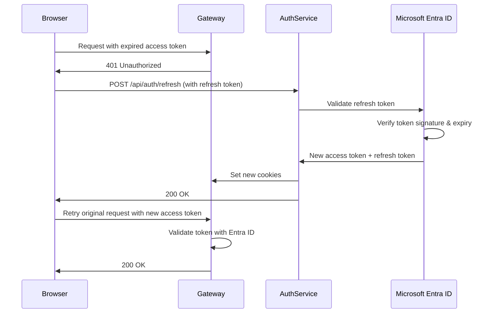

---

### RBAC Implementation

**Roles**:
1. **anonymous**: Public access (browse products, view orders with email)
2. **customer**: Authenticated users (checkout, profile, orders)
3. **staff**: Internal users (analytics, tickets, shipments)
4. **admin**: Full system access (user management, system config)

**Permissions Matrix**:

| Resource | anonymous | customer | staff | admin |
|----------|-----------|----------|-------|-------|
| Browse products | ✅ | ✅ | ✅ | ✅ |
| View product details | ✅ | ✅ | ✅ | ✅ |
| Add to cart | ✅ | ✅ | ✅ | ✅ |
| Checkout | ❌ (must login/guest) | ✅ | ✅ | ✅ |
| View own orders | ✅ (with email) | ✅ | ✅ | ✅ |
| View all orders | ❌ | ❌ | ✅ | ✅ |
| Manage profile | ❌ | ✅ | ✅ | ✅ |
| Write reviews | ❌ | ✅ (verified purchase) | ✅ | ✅ |
| Access analytics | ❌ | ❌ | ✅ | ✅ |
| Manage tickets | ❌ | ✅ (own tickets) | ✅ | ✅ |
| Manage shipments | ❌ | ❌ | ✅ | ✅ |
| Manage users | ❌ | ❌ | ❌ | ✅ |
| System config | ❌ | ❌ | ❌ | ✅ |

**Middleware Implementation**:

```python
from fastapi import Security, HTTPException, status
from fastapi.security import HTTPBearer
from azure.identity import DefaultAzureCredential
from msal import ConfidentialClientApplication
import jwt
from jwt import PyJWKClient

security = HTTPBearer()

# Configure MSAL for token validation
TENANT_ID = os.getenv("ENTRA_TENANT_ID")
CLIENT_ID = os.getenv("ENTRA_CLIENT_ID")
JWKS_URI = f"https://login.microsoftonline.com/{TENANT_ID}/discovery/v2.0/keys"

jwks_client = PyJWKClient(JWKS_URI)

async def get_current_user(token: str = Security(security)) -> User:
    """Validate Entra ID token and return current user."""
    try:
        # Get signing key from Entra ID
        signing_key = jwks_client.get_signing_key_from_jwt(token.credentials)
        
        # Decode and validate token
        payload = jwt.decode(
            token.credentials,
            signing_key.key,
            algorithms=["RS256"],
            audience=f"api://holiday-peak-hub",
            issuer=f"https://login.microsoftonline.com/{TENANT_ID}/v2.0"
        )
        
        user_id = payload.get("oid") or payload.get("sub")
        if not user_id:
            raise HTTPException(status_code=401, detail="Invalid token")
        
        # Get or create user in database
        user = await user_service.get_or_create_from_entra(payload)
        return user
        
    except jwt.InvalidTokenError as e:
        raise HTTPException(status_code=401, detail=f"Invalid token: {str(e)}")

def require_role(required_role: str):
    """Decorator to require specific role."""
    async def role_checker(current_user: User = Depends(get_current_user)):
        if current_user.role != required_role and current_user.role != "admin":
            raise HTTPException(status_code=403, detail="Insufficient permissions")
        return current_user
    return role_checker

# Usage:
@router.get("/staff/analytics")
async def get_analytics(user: User = Depends(require_role("staff"))):
    return await analytics_service.get_sales_data()
```

---

## Integration Patterns

### Pattern 1: Frontend → CRUD API (Synchronous)

**Use Case**: Simple CRUD operations (get user profile, update address)

**Flow**:
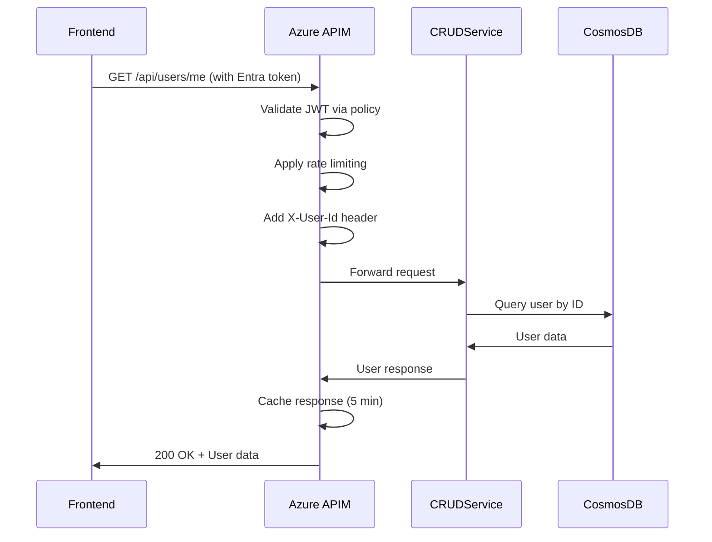

**Implementation**:
```typescript
// Frontend (custom hook)
export function useUserProfile() {
  return useQuery({
    queryKey: ['user', 'me'],
    queryFn: () => apiClient.get('/api/users/me'),
    staleTime: 5 * 60 * 1000, // 5 minutes
  });
}
```

```python
# Backend (CRUD service)
@router.get("/users/me")
async def get_current_user_profile(
    current_user: User = Depends(get_current_user)
) -> UserProfile:
    return await user_service.get_profile(current_user.user_id)
```

---

### Pattern 2: Frontend → CRUD API → Agent Service (Async via Events)

**Use Case**: Operations requiring AI agent processing (order creation, return request)

**Flow**:
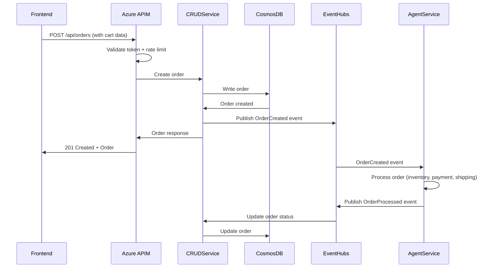

**Implementation**:
```typescript
// Frontend
export function useCreateOrder() {
  const queryClient = useQueryClient();
  
  return useMutation({
    mutationFn: (orderData: CreateOrderRequest) =>
      apiClient.post('/api/orders', orderData),
    onSuccess: (order) => {
      queryClient.invalidateQueries(['orders']);
      queryClient.invalidateQueries(['cart']);
      // Order processing happens asynchronously
      // Frontend can poll /api/orders/{id} or use WebSocket for updates
    },
  });
}
```

```python
# Backend (CRUD service)
@router.post("/orders", status_code=201)
async def create_order(
    data: CreateOrderRequest,
    current_user: User = Depends(get_current_user),
    event_publisher: EventPublisher = Depends(get_event_publisher)
) -> Order:
    # Create order in database
    order = await order_service.create_order(current_user.user_id, data)
    
    # Publish event for agent processing
    await event_publisher.publish("OrderCreated", {
        "order_id": order.order_id,
        "user_id": order.user_id,
        "items": order.items,
        "totals": order.totals,
        "shipping_address": order.shipping_address,
    })
    
    return order
```

```python
# Backend (Agent service - inventory-reservation-validation)
async def handle_order_created(event: dict):
    order_id = event["order_id"]
    items = event["items"]
    
    # Reserve inventory
    reservations = await reserve_inventory(items)
    
    if all(reservations):
        # Publish success event
        await event_publisher.publish("InventoryReserved", {
            "order_id": order_id,
            "reservations": reservations,
        })
    else:
        # Publish failure event (trigger compensating transaction)
        await event_publisher.publish("InventoryReservationFailed", {
            "order_id": order_id,
            "failed_items": [r for r in reservations if not r.success],
        })
```

---

### Pattern 3: Frontend → API Gateway → Agent Service (Direct Invocation)

**Use Case**: Real-time AI operations (catalog search, product recommendations)

**Flow**:
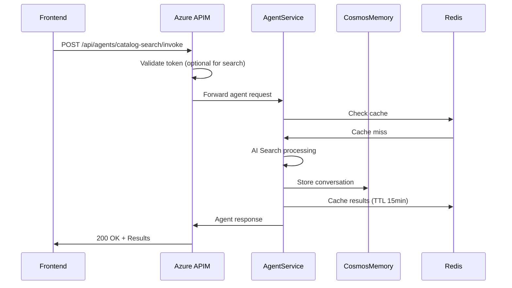

**Implementation**:
```typescript
// Frontend
export function useCatalogSearch(query: string) {
  return useQuery({
    queryKey: ['catalog', 'search', query],
    queryFn: () =>
      apiClient.post('/api/agents/catalog-search/invoke', {
        messages: [{ role: 'user', content: query }],
      }),
    enabled: query.length > 2,
    staleTime: 5 * 60 * 1000, // 5 minutes
  });
}
```

```python
# Backend (CRUD Service - Agent proxy endpoint)
# Note: APIM routes /api/agents/* directly to agent services
# This is only needed for internal service-to-service calls

@router.post("/agents/{service_name}/invoke")
async def invoke_agent(
    service_name: str,
    request: AgentInvokeRequest,
    user_id: str = Header(None, alias="X-User-Id"),  # From APIM policy
    user_role: str = Header(None, alias="X-User-Role")  # From APIM policy
) -> AgentResponse:
    # Route to appropriate agent service (internal K8s DNS)
    agent_url = f"http://{service_name}.holiday-peak.svc.cluster.local/invoke"
    
    # Add user context from APIM headers
    request.context = {
        "user_id": user_id,
        "user_role": user_role,
        "session_id": request.session_id,
    }
    
    # Forward to agent service
    async with httpx.AsyncClient() as client:
        response = await client.post(agent_url, json=request.dict())
        return response.json()
```

---

## Event Choreography

### Event Hub Configuration (ADR-007)

**Event Hub Namespace**: `holiday-peak-hub-events`

**Topics**:
1. **user-events**: UserCreated, UserUpdated, UserDeleted
2. **product-events**: ProductCreated, ProductUpdated, ProductDeleted, InventoryUpdated
3. **order-events**: OrderCreated, OrderUpdated, OrderCancelled, OrderCompleted
4. **inventory-events**: InventoryReserved, InventoryReleased, StockLevelChanged
5. **payment-events**: PaymentProcessed, PaymentFailed, RefundProcessed
6. **shipping-events**: ShipmentScheduled, ShipmentStatusUpdated, DeliveryCompleted
7. **support-events**: TicketCreated, TicketUpdated, TicketResolved, ReturnRequested

---

### SAGA Choreography: Order Creation

**Participants**:
- CRUD Service (order creation)
- inventory-reservation-validation (stock reservation)
- Payment Service (payment processing)
- logistics-carrier-selection (shipping)
- crm-profile-aggregation (customer updates)

**Happy Path**:

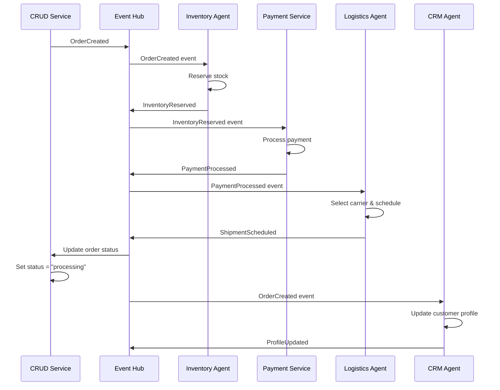

**Failure Scenario** (Payment Failed):

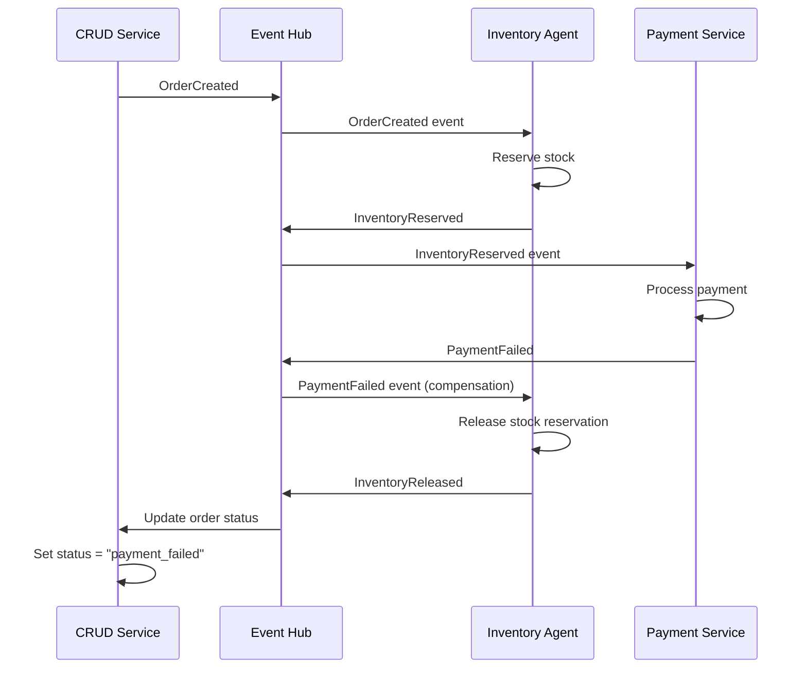

---

### Event Schema

**OrderCreated Event**:
```json
{
  "event_id": "event-uuid-12345",
  "event_type": "OrderCreated",
  "event_version": "1.0",
  "timestamp": "2026-01-25T10:45:00Z",
  "source": "crud-service",
  "data": {
    "order_id": "order-uuid-98765",
    "user_id": "user-uuid-12345",
    "order_number": "HPH-2026-001234",
    "items": [
      {
        "product_id": "product-uuid-67890",
        "variant_id": "variant-12345",
        "quantity": 1,
        "unit_price": 1199.00
      }
    ],
    "totals": {
      "subtotal": 1199.00,
      "tax": 98.92,
      "shipping": 12.00,
      "total": 1309.92
    },
    "shipping_address": {
      "line1": "123 Main St",
      "city": "San Francisco",
      "state": "CA",
      "postal_code": "94102"
    }
  },
  "correlation_id": "correlation-uuid-99999",
  "causation_id": "causation-uuid-88888"
}
```

---

## CI/CD Pipeline

### Overview

Automated continuous integration and deployment using GitHub Actions for all services and infrastructure.

### Pipeline Architecture

```mermaid
graph LR
    subgraph "Source Control"
        GitHub[GitHub Repository]
    end
    
    subgraph "CI Pipeline"
        Build[Build & Test]
        Lint[Lint & Security Scan]
        UnitTest[Unit Tests]
        IntegrationTest[Integration Tests]
    end
    
    subgraph "Container Registry"
        ACR[Azure Container Registry]
    end
    
    subgraph "CD Pipeline - Dev"
        DeployDev[Deploy to Dev AKS]
        E2ETestDev[E2E Tests]
    end
    
    subgraph "CD Pipeline - Staging"
        DeployStaging[Deploy to Staging]
        SmokeTest[Smoke Tests]
        Approval[Manual Approval]
    end
    
    subgraph "CD Pipeline - Production"
        DeployProd[Deploy to Prod AKS]
        CanaryDeploy[Canary Deployment]
        MonitorHealth[Monitor Health]
    end
    
    GitHub -->|Push/PR| Build
    Build --> Lint
    Lint --> UnitTest
    UnitTest --> IntegrationTest
    IntegrationTest -->|Build Image| ACR
    ACR --> DeployDev
    DeployDev --> E2ETestDev
    E2ETestDev -->|Auto| DeployStaging
    DeployStaging --> SmokeTest
    SmokeTest --> Approval
    Approval -->|Approved| DeployProd
    DeployProd --> CanaryDeploy
    CanaryDeploy --> MonitorHealth
```

---

### GitHub Actions Workflows

#### 1. **CI Workflow** (.github/workflows/ci.yml)

**Trigger**: Push to any branch, Pull Request

```yaml
name: Continuous Integration

on:
  push:
    branches: ['**']
  pull_request:
    branches: [main, develop]

env:
  PYTHON_VERSION: '3.13'
  NODE_VERSION: '20'

jobs:
  lint-python:
    runs-on: ubuntu-latest
    steps:
      - uses: actions/checkout@v4
      
      - name: Set up Python
        uses: actions/setup-python@v5
        with:
          python-version: ${{ env.PYTHON_VERSION }}
      
      - name: Install dependencies
        run: |
          pip install -e "lib[dev]"
          pip install pylint black isort mypy
      
      - name: Run linters
        run: |
          black --check lib apps
          isort --check lib apps
          pylint lib/src apps/**/src
          mypy lib/src apps/**/src

  security-scan:
    runs-on: ubuntu-latest
    steps:
      - uses: actions/checkout@v4
      
      - name: Run Trivy vulnerability scanner
        uses: aquasecurity/trivy-action@master
        with:
          scan-type: 'fs'
          scan-ref: '.'
          format: 'sarif'
          output: 'trivy-results.sarif'
      
      - name: Upload Trivy results to GitHub Security
        uses: github/codeql-action/upload-sarif@v3
        with:
          sarif_file: 'trivy-results.sarif'

  test-python:
    runs-on: ubuntu-latest
    services:
      cosmos-emulator:
        image: mcr.microsoft.com/cosmosdb/linux/azure-cosmos-emulator:latest
        ports:
          - 8081:8081
    
    steps:
      - uses: actions/checkout@v4
      
      - name: Set up Python
        uses: actions/setup-python@v5
        with:
          python-version: ${{ env.PYTHON_VERSION }}
      
      - name: Install dependencies
        run: |
          pip install -e "lib[test]"
          pip install -e "apps/crud-service[test]"
      
      - name: Run unit tests
        run: |
          pytest lib/tests apps/crud-service/tests/unit --cov --cov-report=xml
      
      - name: Run integration tests
        run: |
          pytest apps/crud-service/tests/integration
        env:
          COSMOS_EMULATOR_ENDPOINT: https://localhost:8081
      
      - name: Upload coverage to Codecov
        uses: codecov/codecov-action@v4
        with:
          files: ./coverage.xml

  test-frontend:
    runs-on: ubuntu-latest
    steps:
      - uses: actions/checkout@v4
      
      - name: Set up Node.js
        uses: actions/setup-node@v4
        with:
          node-version: ${{ env.NODE_VERSION }}
          cache: 'yarn'
          cache-dependency-path: apps/ui/yarn.lock
      
      - name: Install dependencies
        run: |
          cd apps/ui
          yarn install --frozen-lockfile
      
      - name: Run linter
        run: |
          cd apps/ui
          yarn lint
      
      - name: Run type check
        run: |
          cd apps/ui
          yarn type-check
      
      - name: Run unit tests
        run: |
          cd apps/ui
          yarn test:unit

  build-docker-images:
    runs-on: ubuntu-latest
    needs: [lint-python, test-python]
    if: github.event_name == 'push'
    
    strategy:
      matrix:
        service:
          - crud-service
          - ecommerce-catalog-search
          - ecommerce-cart-intelligence
          # ... other services
    
    steps:
      - uses: actions/checkout@v4
      
      - name: Set up Docker Buildx
        uses: docker/setup-buildx-action@v3
      
      - name: Build Docker image
        uses: docker/build-push-action@v5
        with:
          context: ./apps/${{ matrix.service }}
          file: ./apps/${{ matrix.service }}/Dockerfile
          push: false
          tags: ${{ matrix.service }}:${{ github.sha }}
          cache-from: type=gha
          cache-to: type=gha,mode=max
```

---

#### 2. **CD Workflow - Development** (.github/workflows/cd-dev.yml)

**Trigger**: Push to `develop` branch

```yaml
name: Deploy to Development

on:
  push:
    branches: [develop]
  workflow_dispatch:

env:
  AZURE_SUBSCRIPTION_ID: ${{ secrets.AZURE_SUBSCRIPTION_ID }}
  RESOURCE_GROUP: holiday-peak-hub-dev-rg
  AKS_CLUSTER: holiday-peak-hub-dev-aks
  ACR_NAME: holidaypeakhubdev

jobs:
  deploy-infrastructure:
    runs-on: ubuntu-latest
    steps:
      - uses: actions/checkout@v4
      
      - name: Azure Login
        uses: azure/login@v2
        with:
          creds: ${{ secrets.AZURE_CREDENTIALS }}
      
      - name: Deploy Bicep infrastructure
        uses: azure/arm-deploy@v2
        with:
          subscriptionId: ${{ env.AZURE_SUBSCRIPTION_ID }}
          resourceGroupName: ${{ env.RESOURCE_GROUP }}
          template: ./.infra/main.bicep
          parameters: ./.infra/parameters.dev.json
          failOnStdErr: false

  build-and-push:
    runs-on: ubuntu-latest
    needs: deploy-infrastructure
    
    strategy:
      matrix:
        service:
          - crud-service
          - ecommerce-catalog-search
    
    steps:
      - uses: actions/checkout@v4
      
      - name: Azure Login
        uses: azure/login@v2
        with:
          creds: ${{ secrets.AZURE_CREDENTIALS }}
      
      - name: Build and push to ACR
        run: |
          az acr build \\\n            --registry ${{ env.ACR_NAME }} \\\n            --image ${{ matrix.service }}:${{ github.sha }} \\\n            --image ${{ matrix.service }}:latest \\\n            --file ./apps/${{ matrix.service }}/Dockerfile \\\n            ./apps/${{ matrix.service }}

  deploy-to-aks:
    runs-on: ubuntu-latest
    needs: build-and-push
    
    steps:
      - uses: actions/checkout@v4
      
      - name: Azure Login
        uses: azure/login@v2
        with:
          creds: ${{ secrets.AZURE_CREDENTIALS }}
      
      - name: Get AKS credentials
        run: |
          az aks get-credentials \\\n            --resource-group ${{ env.RESOURCE_GROUP }} \\\n            --name ${{ env.AKS_CLUSTER }} \\\n            --overwrite-existing
      
      - name: Deploy with Helm
        run: |
          helm upgrade --install crud-service ./charts/crud-service \\\n            --namespace holiday-peak \\\n            --create-namespace \\\n            --set image.repository=${{ env.ACR_NAME }}.azurecr.io/crud-service \\\n            --set image.tag=${{ github.sha }} \\\n            --set environment=dev \\\n            --wait
      
      - name: Run E2E tests
        run: |
          kubectl wait --for=condition=ready pod -l app=crud-service -n holiday-peak --timeout=300s
          cd apps/ui
          yarn test:e2e --env=dev
```

---

#### 3. **CD Workflow - Production** (.github/workflows/cd-prod.yml)

**Trigger**: Tag with `v*` (e.g., v1.2.3)

```yaml
name: Deploy to Production

on:
  push:
    tags:
      - 'v*'
  workflow_dispatch:
    inputs:
      version:
        description: 'Version to deploy'
        required: true

env:
  AZURE_SUBSCRIPTION_ID: ${{ secrets.AZURE_SUBSCRIPTION_ID }}
  RESOURCE_GROUP: holiday-peak-hub-prod-rg
  AKS_CLUSTER: holiday-peak-hub-prod-aks
  ACR_NAME: holidaypeakhub

jobs:
  deploy-production:
    runs-on: ubuntu-latest
    environment:
      name: production
      url: https://holidaypeakhub.com
    
    steps:
      - uses: actions/checkout@v4
      
      - name: Azure Login
        uses: azure/login@v2
        with:
          creds: ${{ secrets.AZURE_CREDENTIALS_PROD }}
      
      - name: Get AKS credentials
        run: |
          az aks get-credentials \\\n            --resource-group ${{ env.RESOURCE_GROUP }} \\\n            --name ${{ env.AKS_CLUSTER }} \\\n            --overwrite-existing
      
      - name: Canary deployment (10%)
        run: |
          helm upgrade --install crud-service-canary ./charts/crud-service \\\n            --namespace holiday-peak \\\n            --set image.tag=${{ github.ref_name }} \\\n            --set replicaCount=1 \\\n            --set canary.enabled=true \\\n            --set canary.weight=10 \\\n            --wait
      
      - name: Monitor canary health
        run: |
          sleep 300  # 5 minutes
          ERROR_RATE=$(kubectl logs -l app=crud-service,version=canary -n holiday-peak | grep ERROR | wc -l)
          if [ $ERROR_RATE -gt 10 ]; then
            echo \"Canary error rate too high, rolling back\"
            exit 1
          fi
      
      - name: Promote canary to production
        run: |
          helm upgrade --install crud-service ./charts/crud-service \\\n            --namespace holiday-peak \\\n            --set image.tag=${{ github.ref_name }} \\\n            --set replicaCount=3 \\\n            --set canary.enabled=false \\\n            --wait
      
      - name: Run smoke tests
        run: |
          cd apps/ui
          yarn test:smoke --env=prod
      
      - name: Notify Slack
        if: always()
        uses: 8398a7/action-slack@v3
        with:
          status: ${{ job.status }}
          text: 'Production deployment ${{ job.status }} - Version ${{ github.ref_name }}'
          webhook_url: ${{ secrets.SLACK_WEBHOOK }}
```

---

#### 4. **Infrastructure as Code Workflow** (.github/workflows/infrastructure.yml)

**Trigger**: Changes to `.infra/` directory

```yaml
name: Infrastructure Validation

on:
  pull_request:
    paths:
      - '.infra/**'

jobs:
  validate-bicep:
    runs-on: ubuntu-latest
    steps:
      - uses: actions/checkout@v4
      
      - name: Azure Login
        uses: azure/login@v2
        with:
          creds: ${{ secrets.AZURE_CREDENTIALS }}
      
      - name: Bicep lint
        run: |
          az bicep build --file ./.infra/main.bicep
      
      - name: What-if deployment
        uses: azure/arm-deploy@v2
        with:
          subscriptionId: ${{ secrets.AZURE_SUBSCRIPTION_ID }}
          resourceGroupName: holiday-peak-hub-dev-rg
          template: ./.infra/main.bicep
          parameters: ./.infra/parameters.dev.json
          additionalArguments: --what-if
      
      - name: Run security checks
        run: |
          # Check for public endpoints
          grep -r \"publicNetworkAccess.*Enabled\" .infra/ && exit 1 || echo \"No public endpoints found\"
          
          # Check for Key Vault references
          grep -r \"COSMOS_KEY\\|REDIS_PASSWORD\" .infra/ && exit 1 || echo \"No hardcoded secrets found\"
```

---

### Deployment Strategies

#### Blue-Green Deployment

```mermaid
graph TB
    subgraph "APIM"
        APIM[Azure APIM]
    end
    
    subgraph "Blue Environment (Current)"
        BlueV1[Service v1.0<br/>100% traffic]
    end
    
    subgraph "Green Environment (New)"
        GreenV2[Service v2.0<br/>0% traffic]
    end
    
    APIM -->|100%| BlueV1
    APIM -.->|0%| GreenV2
    
    style GreenV2 fill:#90EE90
    style BlueV1 fill:#ADD8E6
```

**Steps**:
1. Deploy new version to Green environment
2. Run health checks and smoke tests
3. Switch APIM traffic to Green (100%)
4. Monitor for 15 minutes
5. If stable, decommission Blue
6. If issues, instant rollback to Blue

---

#### Canary Deployment

```mermaid
graph TB
    APIM[Azure APIM]
    
    subgraph "Stable"
        Stable[v1.0<br/>90% traffic]
    end
    
    subgraph "Canary"
        Canary[v2.0<br/>10% traffic]
    end
    
    APIM -->|90%| Stable
    APIM -->|10%| Canary
    
    style Canary fill:#FFD700
    style Stable fill:#87CEEB
```

**Steps**:
1. Deploy canary with 10% traffic
2. Monitor for 30 minutes:
   - Error rate
   - Response time
   - Resource usage
3. Gradually increase traffic (10% → 25% → 50% → 100%)
4. If errors spike, automatic rollback

---

### Secrets Management in CI/CD

**GitHub Secrets** (configured in repository settings):
```
AZURE_CREDENTIALS                  # Service Principal for Azure login
AZURE_SUBSCRIPTION_ID              # Subscription ID
AZURE_CREDENTIALS_PROD             # Separate SP for production
ACR_REGISTRY_URL                   # holidaypeakhub.azurecr.io
ENTRA_TENANT_ID                    # Entra ID tenant
SLACK_WEBHOOK                      # Deployment notifications
CODECOV_TOKEN                      # Code coverage uploads
```

**Service Principal Creation**:
```bash
az ad sp create-for-rbac \\\n  --name \"holiday-peak-hub-ci\" \\\n  --role contributor \\\n  --scopes /subscriptions/{subscription-id}/resourceGroups/holiday-peak-hub-dev-rg \\\n  --sdk-auth
```

---

### Monitoring Deployments

**Application Insights Annotations**:
```yaml
- name: Create deployment annotation
  run: |
    curl -X POST 'https://api.applicationinsights.io/v1/apps/{app-id}/Annotations' \\\n      -H 'x-api-key: ${{ secrets.APPINSIGHTS_API_KEY }}' \\\n      -H 'Content-Type: application/json' \\\n      -d '{
        \"Name\": \"Deployment\",
        \"EventTime\": \"'$(date -u +%Y-%m-%dT%H:%M:%S)'Z\",
        \"Category\": \"Deployment\",
        \"Properties\": {
          \"Version\": \"${{ github.ref_name }}\",
          \"Commit\": \"${{ github.sha }}\",
          \"Actor\": \"${{ github.actor }}\"
        }
      }'
```

---

## Implementation Roadmap

### Phase 1: Foundation (Weeks 1-2)

**Goal**: Set up cloud-native infrastructure, security, and authentication

**Tasks**:

**Infrastructure**:
- ✅ Create Azure Resource Group and Virtual Network
- ✅ Provision Azure Key Vault with RBAC
- ✅ Provision Azure Container Registry (Premium SKU)
- ✅ Create Azure API Management instance (internal VNet mode)
- ✅ Set up Private Endpoints (Cosmos DB, Redis, Event Hubs, Key Vault, ACR)
- ✅ Configure Network Security Groups
- ✅ Provision AKS cluster with Azure AD Workload Identity
- ✅ Set up Azure App Configuration
- ✅ Configure Application Insights and Log Analytics Workspace
- ✅ Create Cosmos DB database and containers (users, products, orders)
- ✅ Set up Event Hub namespace and topics
- ✅ Configure Azure Front Door with WAF

**Authentication & Authorization**:
- ✅ Configure Entra ID app registrations (API and frontend)
- ✅ Configure APIM policies for Entra ID token validation
- ✅ Set up APIM APIs and operations (routing rules)
- ✅ Build authentication service (OAuth redirect, callback handling)

**Services**:
- ✅ Create CRUD service structure (FastAPI)
- ✅ Configure Managed Identity for CRUD service
- ✅ Implement user repository with Managed Identity auth to Cosmos DB
- ✅ Implement Key Vault integration for secrets
- ✅ Implement user service layer
- ✅ Implement user API endpoints
- ✅ Deploy CRUD service to AKS
- ✅ Configure APIM backend services (point to AKS internal DNS)

**CI/CD**:
- ✅ Set up GitHub Actions workflows (CI, CD-dev, CD-prod)
- ✅ Configure GitHub secrets and service principals
- ✅ Create Helm charts for services
- ✅ Set up ACR Tasks for automated builds

**Frontend**:
- ✅ Create frontend API client with Axios + TanStack Query
- ✅ Integrate authentication flow (Entra ID OAuth 2.0)
- ✅ Configure API client to use APIM endpoint

**Deliverables**:
- Complete cloud-native infrastructure deployed (VNet, Private Endpoints, NSGs)
- Azure API Management instance configured with Entra ID policies
- Azure Key Vault storing all secrets
- CRUD service deployed to AKS with Managed Identity
- User CRUD endpoints functional (create, read, update, delete)
- Authentication working end-to-end (Entra ID → APIM → CRUD service)
- Event Hub configured for event choreography
- CI/CD pipelines operational (automated build, test, deploy)
- Frontend can call APIM endpoints securely
- Zero hardcoded secrets in code or configuration

**Testing**:
- Unit tests for user repository and service (75% coverage)
- Integration tests for auth flow with Cosmos DB emulator
- E2E test: User signup → Login → Get profile → Update profile
- Security scan: No secrets in code, all traffic via Private Endpoints
- Load test: 100 concurrent users on user endpoints

**Success Criteria**:
- ✅ All Azure resources provisioned via Bicep (IaC)
- ✅ No public endpoints exposed (except Front Door and APIM public IP)
- ✅ All secrets in Key Vault, accessed via Managed Identity
- ✅ CI/CD pipeline successfully deploys to dev environment
- ✅ User can authenticate and perform CRUD operations
- ✅ Application Insights shows distributed traces

---

### Phase 2: Product & Category Pages (Weeks 3-4)

**Goal**: Enable product browsing and search

**Tasks**:
- ✅ Create products and categories containers
- ✅ Implement product CRUD endpoints
- ✅ Implement category endpoints
- ✅ Integrate with `ecommerce-catalog-search` agent
- ✅ Build product listing page API integration
- ✅ Build product detail page API integration
- ✅ Implement fallback logic (agent → CRUD if agent fails)

**Deliverables**:
- Product and category CRUD APIs
- Homepage, category, and product pages fully functional
- Agent integration for catalog search

**Testing**:
- Unit tests for product repository
- Integration tests for product endpoints
- E2E test: Browse category → View product detail

---

### Phase 3: Cart & Checkout (Weeks 5-6)

**Goal**: Enable order creation flow

**Tasks**:
- ✅ Create cart and orders containers
- ✅ Implement cart CRUD endpoints
- ✅ Implement order creation endpoint
- ✅ Integrate with `inventory-reservation-validation` agent
- ✅ Integrate with `logistics-carrier-selection` agent
- ✅ Implement payment service (Stripe integration)
- ✅ Set up order creation SAGA choreography
- ✅ Build checkout page API integration

**Deliverables**:
- Cart and order CRUD APIs
- Checkout flow working end-to-end
- Order creation SAGA choreography
- Payment processing

**Testing**:
- Unit tests for cart and order repositories
- Integration tests for checkout flow
- E2E test: Add to cart → Checkout → Order created
- SAGA test: OrderCreated → InventoryReserved → PaymentProcessed → ShipmentScheduled

---

### Phase 4: Customer Dashboard & Profile (Weeks 7-8)

**Goal**: Enable customer account management

**Tasks**:
- ✅ Create addresses and payment_methods containers
- ✅ Implement address CRUD endpoints
- ✅ Implement payment methods endpoints
- ✅ Implement dashboard API (stats, recent orders, recommendations)
- ✅ Integrate with `crm-profile-aggregation` agent
- ✅ Integrate with `crm-segmentation-personalization` agent
- ✅ Build dashboard page API integration
- ✅ Build profile page API integration

**Deliverables**:
- Address and payment CRUD APIs
- Dashboard and profile pages fully functional
- CRM agent integration

**Testing**:
- Unit tests for address and payment repositories
- Integration tests for profile endpoints
- E2E test: Update profile → Add address → Save payment method

---

### Phase 5: Reviews & Wishlist (Week 9)

**Goal**: Enable user-generated content

**Tasks**:
- ✅ Create reviews and wishlist containers
- ✅ Implement review CRUD endpoints
- ✅ Implement wishlist endpoints
- ✅ Integrate with `ecommerce-product-detail-enrichment` agent
- ✅ Build reviews page API integration
- ✅ Build wishlist functionality

**Deliverables**:
- Review and wishlist CRUD APIs
- Reviews page fully functional
- Wishlist integrated into dashboard

**Testing**:
- Unit tests for review repository
- Integration tests for review endpoints
- E2E test: Write review → View reviews → Moderate review

---

### Phase 6: Staff Pages (Weeks 10-11)

**Goal**: Enable staff operations (analytics, tickets, logistics)

**Tasks**:
- ✅ Create tickets and shipments containers
- ✅ Implement analytics API (sales data, product performance)
- ✅ Implement ticket CRUD endpoints
- ✅ Implement shipment CRUD endpoints
- ✅ Integrate with `crm-campaign-intelligence` agent
- ✅ Integrate with `logistics-returns-support` agent
- ✅ Integrate with `logistics-eta-computation` agent
- ✅ Build staff pages API integration

**Deliverables**:
- Analytics, ticket, and shipment APIs
- Staff sales, requests, and logistics pages fully functional
- Agent integration for staff workflows

**Testing**:
- Unit tests for ticket and shipment repositories
- Integration tests for staff endpoints
- E2E test: View analytics → Process return request → Update shipment

---

### Phase 7: Admin Portal (Week 12)

**Goal**: Enable system administration

**Tasks**:
- ✅ Create audit_logs container
- ✅ Implement admin user management endpoints
- ✅ Implement system health API
- ✅ Implement configuration API
- ✅ Implement audit log API
- ✅ Build admin portal API integration

**Deliverables**:
- Admin APIs
- Admin portal fully functional
- Audit logging operational

**Testing**:
- Unit tests for admin repositories
- Integration tests for admin endpoints
- E2E test: Manage users → View audit logs → Update config

---

### Phase 8: Optimization & Monitoring (Week 13)

**Goal**: Performance optimization and observability

**Tasks**:
- ✅ Implement Redis caching for hot data
- ✅ Optimize Cosmos DB queries (indexing, partition keys)
- ✅ Add Azure Monitor integration
- ✅ Set up Application Insights
- ✅ Configure alerts (error rate, latency, RU consumption)
- ✅ Load testing and performance tuning

**Deliverables**:
- Redis caching operational
- Monitoring dashboards
- Performance benchmarks

**Testing**:
- Load tests (1000 concurrent users)
- Stress tests (5x normal load)
- Chaos engineering (service failures, network issues)

---

## Testing Strategy

### Unit Tests

**Target**: 75% code coverage minimum

**Scope**: Repository and service layer

**Tools**: pytest, pytest-asyncio

**Example**:
```python
# tests/repositories/test_user_repository.py
import pytest
from holiday_peak_lib.config import MemorySettings
from crud_service.repositories import UserRepository

@pytest.mark.asyncio
async def test_create_user(cosmos_client):
    repo = UserRepository(cosmos_client)
    user_data = {
        "email": "test@example.com",
        "name": "Test User",
        "password_hash": "hashed_password",
    }
    user = await repo.create(user_data)
    
    assert user.user_id is not None
    assert user.email == "test@example.com"
    assert user.name == "Test User"

@pytest.mark.asyncio
async def test_get_by_email(cosmos_client):
    repo = UserRepository(cosmos_client)
    user = await repo.get_by_email("test@example.com")
    
    assert user is not None
    assert user.email == "test@example.com"
```

---

### Integration Tests

**Scope**: API endpoints with real database (Cosmos DB Emulator)

**Tools**: pytest, httpx, Cosmos DB Emulator

**Example**:
```python
# tests/integration/test_auth_endpoints.py
import pytest
from httpx import AsyncClient

@pytest.mark.asyncio
async def test_signup_and_login(test_client: AsyncClient):
    # Signup
    signup_response = await test_client.post("/api/auth/signup", json={
        "email": "newuser@example.com",
        "name": "New User",
        "password": "SecurePassword123!",
    })
    assert signup_response.status_code == 201
    
    # Login
    login_response = await test_client.post("/api/auth/login", json={
        "email": "newuser@example.com",
        "password": "SecurePassword123!",
    })
    assert login_response.status_code == 200
    assert "access_token" in login_response.json()
    
    # Get profile with token
    token = login_response.json()["access_token"]
    profile_response = await test_client.get(
        "/api/users/me",
        headers={"Authorization": f"Bearer {token}"}
    )
    assert profile_response.status_code == 200
    assert profile_response.json()["email"] == "newuser@example.com"
```

---

### E2E Tests

**Scope**: Full user flows from frontend to backend

**Tools**: Playwright (frontend), pytest (backend)

**Example**:
```typescript
// tests/e2e/checkout.spec.ts
import { test, expect } from '@playwright/test';

test('complete checkout flow', async ({ page }) => {
  // Login
  await page.goto('/auth/login');
  await page.fill('input[name="email"]', 'customer@example.com');
  await page.fill('input[name="password"]', 'password123');
  await page.click('button[type="submit"]');
  
  // Add product to cart
  await page.goto('/product/laptop-123');
  await page.click('button:has-text("Add to Cart")');
  
  // Go to checkout
  await page.goto('/checkout');
  
  // Fill shipping address
  await page.fill('input[name="line1"]', '123 Main St');
  await page.fill('input[name="city"]', 'San Francisco');
  await page.fill('input[name="state"]', 'CA');
  await page.fill('input[name="postal_code"]', '94102');
  await page.click('button:has-text("Continue to Payment")');
  
  // Fill payment (test mode)
  await page.fill('input[name="card_number"]', '4242424242424242');
  await page.fill('input[name="exp_month"]', '12');
  await page.fill('input[name="exp_year"]', '2028');
  await page.fill('input[name="cvc"]', '123');
  await page.click('button:has-text("Place Order")');
  
  // Verify order confirmation
  await expect(page.locator('h1')).toContainText('Order Confirmed');
  await expect(page.locator('.order-number')).toBeVisible();
});
```

---

### Load Tests

**Scope**: Performance under realistic load

**Tools**: Locust, k6

**Scenarios**:
1. **Browse Products**: 1000 users, 5 products/min per user
2. **Search**: 500 users, 10 searches/min per user
3. **Checkout**: 100 users, 1 checkout/5min per user

**Example**:
```python
# tests/load/locustfile.py
from locust import HttpUser, task, between

class EcommerceUser(HttpUser):
    wait_time = between(1, 5)
    
    @task(3)
    def browse_products(self):
        self.client.get("/api/products?category=electronics&limit=20")
    
    @task(2)
    def view_product(self):
        self.client.get("/api/products/product-uuid-67890")
    
    @task(1)
    def add_to_cart(self):
        self.client.post("/api/cart/items", json={
            "product_id": "product-uuid-67890",
            "quantity": 1,
        })
```

**Performance Targets**:
- **Response Time (p95)**: < 500ms for reads, < 1s for writes
- **Throughput**: 1000 requests/sec sustained
- **Error Rate**: < 0.1%
- **Cosmos DB RU**: < 10,000 RU/s per container

---

## Appendix A: Technology Stack

| Layer | Technology | Version | Purpose |
|-------|-----------|---------|---------|
| **Frontend** | Next.js | 15.1.6 | React framework with App Router |
| | React | 19.0.0 | UI library |
| | TypeScript | 5.7.2 | Type safety |
| | Tailwind CSS | 4.0.0 | Styling |
| | TanStack Query | 5.x | Data fetching and caching |
| | Axios | 1.x | HTTP client |
| | Zod | 3.x | Schema validation |
| **Backend** | Python | 3.13 | Primary language (ADR-001) |
| | FastAPI | 0.115.x | API framework (ADR-005) |
| | Pydantic | 2.x | Data validation |
| | Azure SDK | Latest | Azure service clients |
| | Uvicorn | 0.32.x | ASGI server |
| **Database** | Cosmos DB | - | NoSQL database (ADR-002) |
| | Redis | 7.x | Hot memory tier (ADR-008) |
| | Blob Storage | - | Cold memory tier (ADR-008) |
| **Messaging** | Event Hubs | - | Event choreography (ADR-007) |
| **API Management** | Azure APIM | Consumption/Standard | Managed API gateway |
| **CDN & WAF** | Azure Front Door | Premium | Global load balancer, WAF, CDN |
| **Infrastructure** | AKS | 1.28+ | Kubernetes orchestration (ADR-009) |
| | KEDA | 2.x | Event-driven autoscaling (ADR-009) |
| | Helm | 3.x | Package management (ADR-009) |
| | Bicep | Latest | Infrastructure as Code (ADR-002) |
| **Container Registry** | Azure ACR | Premium | Container image storage |
| **Networking** | Azure VNet | - | Virtual network isolation |
| | Private Endpoints | - | Private connectivity to PaaS |
| | NSG | - | Network security groups |
| **Security** | Azure Key Vault | Standard | Secrets and certificate management |
| | Managed Identity | - | Passwordless authentication |
| | Azure AD Workload Identity | - | Pod identity for AKS |
| **Authentication** | Microsoft Entra ID | - | OAuth 2.0 / OpenID Connect (ADR-019) |
| | MSAL Python | Latest | Microsoft Authentication Library |
| | PyJWT | Latest | Token validation |
| **Configuration** | Azure App Configuration | Standard | Centralized configuration |
| **Monitoring** | Azure Monitor | - | Observability platform |
| | Application Insights | - | APM and distributed tracing |
| | Azure Log Analytics | - | Centralized logging and querying |
| **CI/CD** | GitHub Actions | - | Build, test, and deployment automation |
| | Azure DevOps | - | Alternative CI/CD platform |
| **Testing** | pytest | 8.x | Python unit and integration testing |
| | pytest-asyncio | Latest | Async test support |
| | Playwright | Latest | E2E browser testing |
| | Locust | Latest | Load and performance testing |
| | Trivy | Latest | Container vulnerability scanning |

---

## Appendix B: Environment Variables

### Azure API Management Configuration

**Configured via Azure Portal / Bicep**:
```bash
# APIM Instance
APIM_NAME=holidaypeakhub-apim
APIM_RESOURCE_GROUP=holiday-peak-hub-rg
APIM_SKU=Consumption  # or Standard/Premium for production
APIM_PUBLISHER_EMAIL=admin@holidaypeakhub.com
APIM_PUBLISHER_NAME=Holiday Peak Hub

# Named Values (APIM configuration)
ENTRA_TENANT_ID=00000000-0000-0000-0000-000000000000
ENTRA_CLIENT_ID=api://holiday-peak-hub
CRUD_SERVICE_URL=http://crud-service.holiday-peak.svc.cluster.local
AGENT_SERVICES_URL=http://{service-name}.holiday-peak.svc.cluster.local
```

### Authentication Service (for OAuth flows)

# Rate Limiting
RATE_LIMIT_PER_MINUTE=60
RATE_LIMIT_BURST=100

# Service URLs
CRUD_SERVICE_URL=http://crud-service:8001
AGENT_BASE_URL=http://{service-name}:8000
```

### CRUD Service

```bash
# Server
HOST=0.0.0.0
PORT=8001
ENV=production

# Azure Resources (using Managed Identity - no secrets needed)
COSMOS_ACCOUNT_URI=https://holiday-peak-hub.documents.azure.com:443/
COSMOS_DATABASE=holiday-peak-hub
# COSMOS_KEY not needed - uses Managed Identity

# Redis (using AAD authentication - no password needed)
REDIS_HOST=holiday-peak-redis.redis.cache.windows.net
REDIS_PORT=6380
REDIS_SSL=true
# REDIS_PASSWORD not needed - uses Managed Identity

# Event Hubs (using Managed Identity)
EVENT_HUB_NAMESPACE=holiday-peak-events.servicebus.windows.net
# EVENT_HUB_CONNECTION_STRING not needed - uses Managed Identity

# Azure Monitor (using Managed Identity)
APPLICATIONINSIGHTS_CONNECTION_STRING=InstrumentationKey=...;IngestionEndpoint=...

# Azure Key Vault
KEY_VAULT_URL=https://holidaypeakhub-kv.vault.azure.net/

# Secrets from Key Vault (fetched at runtime using Managed Identity)
# - stripe-secret-key
# - stripe-webhook-secret
# - sendgrid-api-key

# Email
FROM_EMAIL=noreply@holidaypeakhub.com
```

**Code Example - Using Key Vault**:
```python
from azure.identity import DefaultAzureCredential
from azure.keyvault.secrets import SecretClient
import os

# Initialize Key Vault client
credential = DefaultAzureCredential()
vault_url = os.getenv("KEY_VAULT_URL")
kv_client = SecretClient(vault_url=vault_url, credential=credential)

# Fetch secrets on startup
STRIPE_SECRET_KEY = kv_client.get_secret("stripe-secret-key").value
SENDGRID_API_KEY = kv_client.get_secret("sendgrid-api-key").value
```

---

## Appendix C: Database Indexes

### Users Container

```json
{
  "indexingPolicy": {
    "indexingMode": "consistent",
    "automatic": true,
    "includedPaths": [
      { "path": "/*" }
    ],
    "excludedPaths": [
      { "path": "/\"_etag\"/?" }
    ],
    "compositeIndexes": [
      [
        { "path": "/email", "order": "ascending" },
        { "path": "/role", "order": "ascending" }
      ]
    ]
  },
  "uniqueKeyPolicy": {
    "uniqueKeys": [
      { "paths": ["/email"] }
    ]
  }
}
```

### Products Container

```json
{
  "indexingPolicy": {
    "indexingMode": "consistent",
    "automatic": true,
    "includedPaths": [
      { "path": "/*" }
    ],
    "excludedPaths": [
      { "path": "/\"_etag\"/?" }
    ],
    "compositeIndexes": [
      [
        { "path": "/category_slug", "order": "ascending" },
        { "path": "/status", "order": "ascending" },
        { "path": "/price/amount", "order": "ascending" }
      ]
    ]
  },
  "uniqueKeyPolicy": {
    "uniqueKeys": [
      { "paths": ["/product_id"] },
      { "paths": ["/slug"] }
    ]
  }
}
```

### Orders Container

```json
{
  "indexingPolicy": {
    "indexingMode": "consistent",
    "automatic": true,
    "includedPaths": [
      { "path": "/*" }
    ],
    "excludedPaths": [
      { "path": "/\"_etag\"/?" }
    ],
    "compositeIndexes": [
      [
        { "path": "/user_id", "order": "ascending" },
        { "path": "/status", "order": "ascending" },
        { "path": "/created_at", "order": "descending" }
      ]
    ]
  },
  "uniqueKeyPolicy": {
    "uniqueKeys": [
      { "paths": ["/order_id"] },
      { "paths": ["/order_number"] }
    ]
  }
}
```

---

## Appendix D: API Error Responses

### Standard Error Format

```json
{
  "error": {
    "code": "RESOURCE_NOT_FOUND",
    "message": "User not found",
    "details": {
      "user_id": "user-uuid-12345"
    },
    "timestamp": "2026-01-25T10:45:00Z",
    "request_id": "req-uuid-99999"
  }
}
```

### Error Codes

| HTTP Status | Error Code | Description |
|-------------|-----------|-------------|
| 400 | INVALID_REQUEST | Request validation failed |
| 401 | UNAUTHORIZED | Missing or invalid authentication token |
| 403 | FORBIDDEN | Insufficient permissions |
| 404 | RESOURCE_NOT_FOUND | Requested resource doesn't exist |
| 409 | CONFLICT | Resource already exists (e.g., email taken) |
| 422 | UNPROCESSABLE_ENTITY | Business logic validation failed |
| 429 | RATE_LIMIT_EXCEEDED | Too many requests |
| 500 | INTERNAL_SERVER_ERROR | Unexpected server error |
| 503 | SERVICE_UNAVAILABLE | Service temporarily unavailable |

---

## Next Steps

1. **Review and Approve**: Architecture team to review this plan
2. **Create Tickets**: Break down roadmap into Jira/GitHub issues
3. **Set Up Infrastructure**: Provision Cosmos DB, Event Hubs, AKS cluster
4. **Start Phase 1**: Begin foundation implementation (authentication, basic CRUD)
5. **Weekly Reviews**: Track progress against roadmap, adjust as needed

---

**Document Prepared By**: GitHub Copilot  
**Date**: 2026-01-30  
**Version**: 2.0  
**Status**: Draft - Awaiting Approval

## Document Change Log

### Version 2.0 (2026-01-30)
- ✅ Updated authentication from JWT to **Microsoft Entra ID**
- ✅ Replaced custom API Gateway with **Azure API Management**
- ✅ Added comprehensive **Cloud-Native Architecture** section:
  - Azure Key Vault for secrets management
  - Managed Identity for passwordless authentication
  - Virtual Network with Private Endpoints
  - Azure Container Registry
  - Azure Front Door with WAF
  - Azure App Configuration
  - Network Security Groups and zero trust networking
- ✅ Added complete **CI/CD Pipeline** section with GitHub Actions workflows
- ✅ Updated Phase 1 to include full cloud-native infrastructure setup
- ✅ Updated environment variables to use Key Vault references (no hardcoded secrets)
- ✅ Added disaster recovery and cost management strategies
- ✅ Expanded technology stack with all Azure cloud-native services

### Version 1.0 (2026-01-30)
- Initial comprehensive backend plan
- Database schemas for all 10 containers
- 60+ REST API endpoints defined
- Integration patterns documented
- SAGA choreography for order creation
- 8-phase implementation roadmap

---

## Summary

This backend implementation plan provides a **production-ready, cloud-native architecture** for Holiday Peak Hub that follows Azure best practices:

### ✅ **Security First**
- No hardcoded secrets (all in Key Vault)
- Managed Identity for all Azure services
- Private Endpoints for network isolation
- Zero trust networking with NSGs
- Web Application Firewall (WAF)
- Entra ID authentication

### ✅ **Fully Automated**
- Infrastructure as Code (Bicep)
- CI/CD pipelines (GitHub Actions)
- Automated testing (unit, integration, E2E)
- Canary deployments for zero-downtime
- Security scanning in pipeline

### ✅ **Enterprise Grade**
- Global distribution with Azure Front Door
- Distributed tracing with Application Insights
- Centralized logging and monitoring
- Disaster recovery with multi-region
- Cost management and optimization

### ✅ **Developer Friendly**
- Comprehensive API documentation
- Type-safe APIs (Pydantic, Zod)
- Local development with emulators
- Clear separation of concerns
- Extensive test coverage (75%+)

The plan is ready for review and implementation. All services follow Azure-native patterns and ADR compliance.
