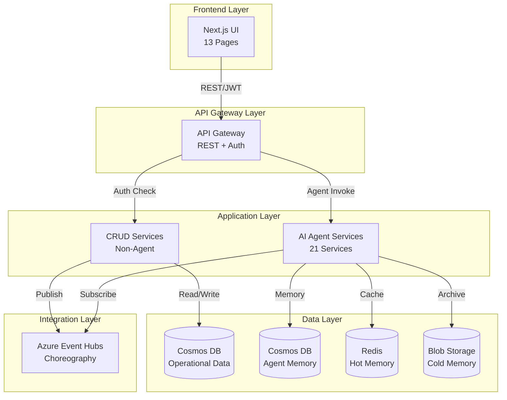
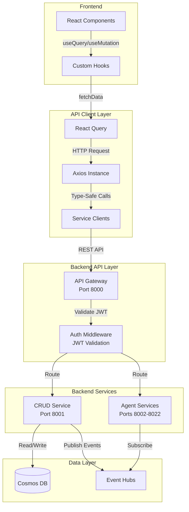
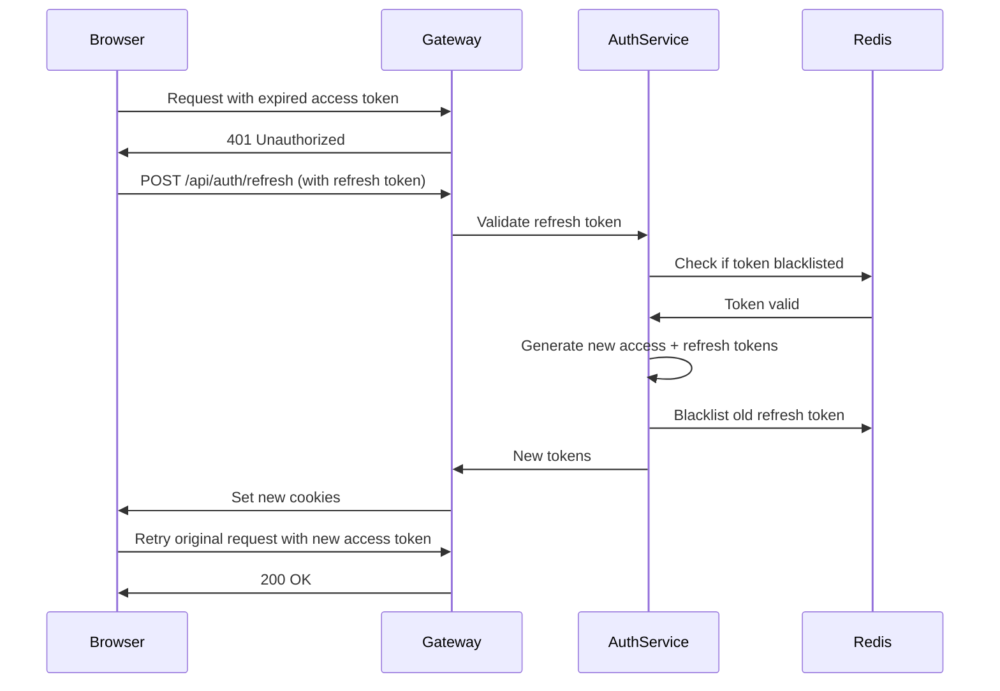
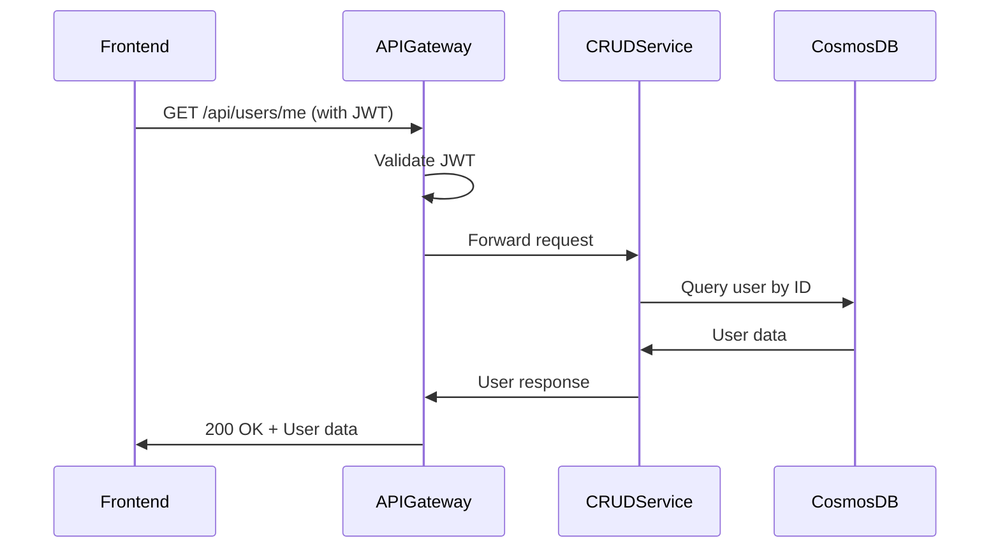
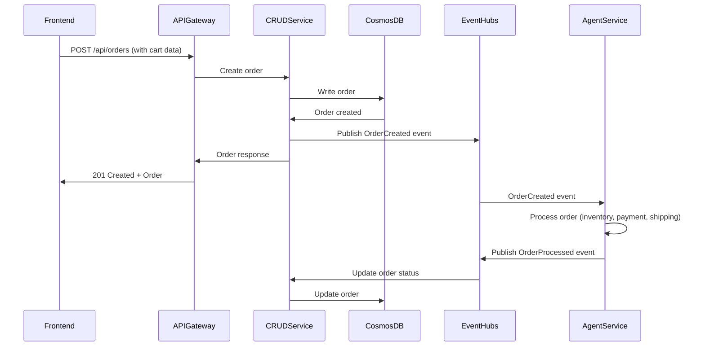
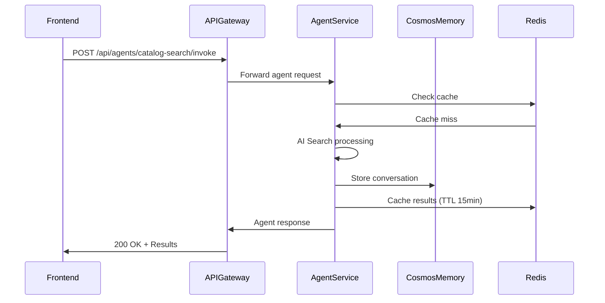
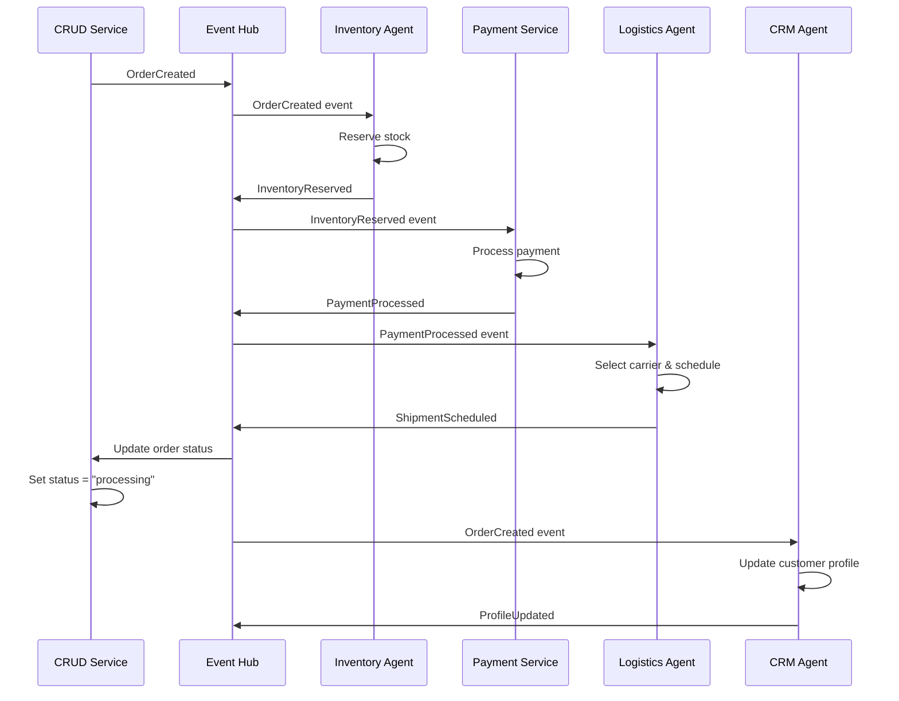
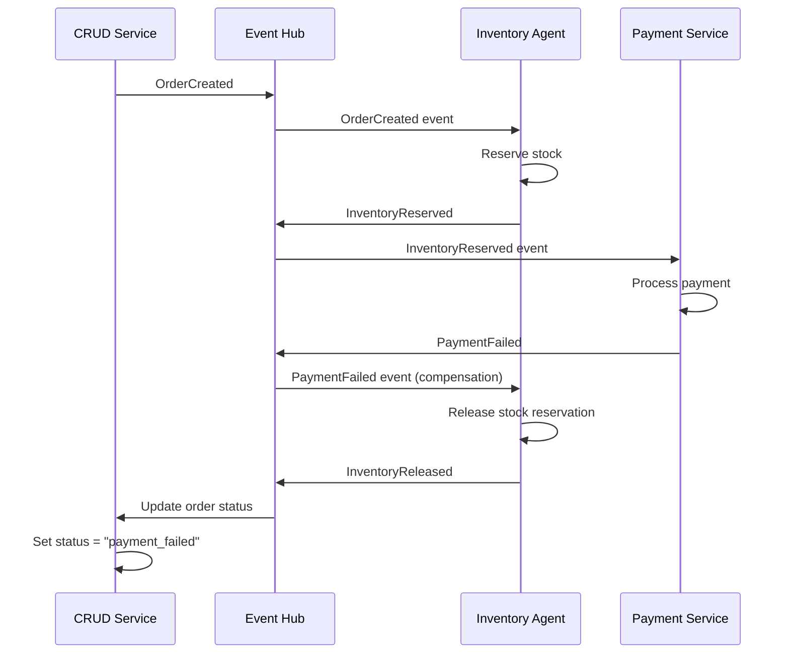

# Backend Implementation Plan

**Version**: 1.0  
**Date**: 2026-01-30  
**Status**: Draft

## Executive Summary

This document outlines the comprehensive backend implementation plan for Holiday Peak Hub, defining all **non-agent capabilities** (CRUD operations, authentication, database schemas, REST APIs) needed to support the 13 frontend pages while integrating with the existing 21 AI agent services.

**Key Objectives**:
1. Design database schemas for all operational data (users, products, orders, inventory, etc.)
2. Define REST API endpoints for CRUD operations
3. Implement authentication and authorization system (Microsoft Entra ID and Login with microsoft)
4. Create integration layer between frontend, CRUD APIs, and agent services
5. Ensure strict adherence to all ADRs (event-driven, AKS, Cosmos DB, Event Hubs)

---

## Table of Contents

1. [Architecture Overview](#architecture-overview)
2. [Existing Agent Services Inventory](#existing-agent-services-inventory)
3. [Page-to-Backend Mapping](#page-to-backend-mapping)
4. [Database Design](#database-design)
5. [API Design](#api-design)
6. [Authentication & Authorization](#authentication--authorization)
7. [Integration Patterns](#integration-patterns)
8. [Event Choreography](#event-choreography)
9. [Implementation Roadmap](#implementation-roadmap)
10. [Testing Strategy](#testing-strategy)

---

## Architecture Overview

### System Context



### Design Principles

**From ADRs**:
- **ADR-002**: Azure-native services (Cosmos DB, Event Hubs, AKS, Redis)
- **ADR-007**: SAGA choreography with Event Hubs for service coordination
- **ADR-009**: AKS deployment with KEDA autoscaling
- **ADR-019**: JWT-based authentication with RBAC (anonymous, customer, staff, admin)
- **ADR-020**: Layered API client with TanStack Query

**New Principles**:
- **Separation of Concerns**: CRUD operations separate from AI agent logic
- **Event-Driven**: All state changes publish events for agent consumption
- **Stateless APIs**: All CRUD services stateless, horizontally scalable
- **Cosmos DB First**: Operational data in Cosmos DB with proper partitioning

---

## Existing Agent Services Inventory

### E-Commerce Domain (5 services)

| Service | Purpose | MCP Tools | Frontend Integration |
|---------|---------|-----------|---------------------|
| **ecommerce-catalog-search** | Product discovery with AI Search | `/catalog/search`, `/catalog/suggest` | Homepage, Category, Search |
| **ecommerce-product-detail-enrichment** | ACP metadata augmentation | `/product/enrich`, `/product/reviews` | Product Detail, Reviews |
| **ecommerce-cart-intelligence** | Personalized cart recommendations | `/cart/recommendations`, `/cart/upsell` | Cart, Checkout |
| **ecommerce-checkout-support** | Allocation validation, dynamic pricing | `/checkout/validate`, `/checkout/pricing` | Checkout |
| **ecommerce-order-status** | Proactive order tracking | `/order/status`, `/order/timeline` | Order Tracking, Dashboard |

### Product Management Domain (4 services)

| Service | Purpose | MCP Tools | Frontend Integration |
|---------|---------|-----------|---------------------|
| **product-management-normalization-classification** | Automated taxonomy alignment | `/product/normalize`, `/product/classify` | Admin Portal |
| **product-management-acp-transformation** | Standards-compliant catalog export | `/product/acp/transform` | Admin Portal |
| **product-management-consistency-validation** | Real-time data quality checks | `/product/validate` | Admin Portal |
| **product-management-assortment-optimization** | ML-driven SKU mix recommendations | `/assortment/optimize`, `/assortment/featured` | Homepage, Admin |

### CRM Domain (4 services)

| Service | Purpose | MCP Tools | Frontend Integration |
|---------|---------|-----------|---------------------|
| **crm-profile-aggregation** | Unified customer view | `/profile/context`, `/profile/summary` | Profile, Dashboard |
| **crm-segmentation-personalization** | Dynamic cohort building | `/segment/recommend`, `/segment/personalize` | Homepage, Dashboard |
| **crm-campaign-intelligence** | ROI-optimized marketing automation | `/campaign/analytics`, `/campaign/optimize` | Staff Sales Analytics |
| **crm-support-assistance** | Agent-augmented customer service | `/support/assist`, `/support/suggest` | Staff Requests |

### Inventory Domain (4 services)

| Service | Purpose | MCP Tools | Frontend Integration |
|---------|---------|-----------|---------------------|
| **inventory-health-check** | Predictive stock-out alerts | `/inventory/health`, `/inventory/availability` | Product Detail, Category |
| **inventory-jit-replenishment** | Demand-sensing reorder triggers | `/inventory/replenish` | Admin Portal |
| **inventory-reservation-validation** | Real-time allocation locking | `/inventory/reserve`, `/inventory/release` | Checkout |
| **inventory-alerts-triggers** | Exception-based notifications | `/inventory/alerts` | Admin Portal |

### Logistics Domain (4 services)

| Service | Purpose | MCP Tools | Frontend Integration |
|---------|---------|-----------|---------------------|
| **logistics-eta-computation** | Real-time delivery predictions | `/logistics/eta`, `/logistics/estimate` | Product Detail, Order Tracking |
| **logistics-carrier-selection** | Cost/speed trade-off optimization | `/logistics/carrier/select` | Checkout |
| **logistics-returns-support** | Reverse logistics automation | `/logistics/return/initiate`, `/logistics/return/status` | Staff Requests, My Orders |
| **logistics-route-issue-detection** | Proactive delay mitigation | `/logistics/route/issues` | Staff Logistics, Order Tracking |

---

## Page-to-Backend Mapping

### Anonymous Pages (6 pages)

#### 1. Homepage (`/`)

**Current State**: ✅ Frontend complete, needs CRUD APIs

**Agent Services Used**:
- `ecommerce-catalog-search` - Featured products search
- `crm-segmentation-personalization` - Personalized recommendations (if session exists)
- `product-management-assortment-optimization` - Featured categories

**Non-Agent Services Needed**:
- ❌ **Product CRUD API** - Get featured products (fallback if agent fails)
- ❌ **Category CRUD API** - Get all categories for showcase
- ❌ **Banner/Promotion API** - Get active banners for hero section

**API Endpoints Required**:
```
GET /api/products/featured (limit, offset)
GET /api/categories (limit, offset)
GET /api/banners/active
```

---

#### 2. Category Page (`/category/[slug]`)

**Current State**: ✅ Frontend complete, needs CRUD APIs

**Agent Services Used**:
- `ecommerce-catalog-search` - AI-powered product search and filtering
- `inventory-health-check` - Real-time stock status
- `product-management-assortment-optimization` - Sort by popularity

**Non-Agent Services Needed**:
- ❌ **Product CRUD API** - Basic product listing (fallback)
- ❌ **Category CRUD API** - Get category details by slug
- ❌ **Filter/Facet API** - Get available filters (price ranges, brands, attributes)

**API Endpoints Required**:
```
GET /api/categories/{slug}
GET /api/products?category={slug}&filters={json}&sort={field}&order={asc|desc}&page={n}&limit={n}
GET /api/products/filters?category={slug}
```

---

#### 3. Product Detail (`/product/[id]`)

**Current State**: ✅ Frontend complete, needs CRUD APIs

**Agent Services Used**:
- `ecommerce-product-detail-enrichment` - Full product details (ACP compliant)
- `inventory-health-check` - Real-time inventory status
- `logistics-eta-computation` - Delivery estimates
- `ecommerce-cart-intelligence` - Related products

**Non-Agent Services Needed**:
- ❌ **Product CRUD API** - Get product details by ID
- ❌ **Review CRUD API** - Get/create/update product reviews
- ❌ **Wishlist API** - Add/remove from wishlist
- ❌ **Inventory API** - Get stock levels and variants

**API Endpoints Required**:
```
GET /api/products/{id}
GET /api/products/{id}/reviews (page, limit, sort)
POST /api/products/{id}/reviews
GET /api/products/{id}/inventory
POST /api/wishlist
DELETE /api/wishlist/{product_id}
```

---

#### 4. Order Tracking (`/order/[id]`)

**Current State**: ✅ Frontend complete, needs CRUD APIs

**Agent Services Used**:
- `ecommerce-order-status` - Order details and status
- `logistics-eta-computation` - Delivery updates
- `logistics-route-issue-detection` - Delay alerts

**Non-Agent Services Needed**:
- ❌ **Order CRUD API** - Get order details by ID (public, requires email verification for anonymous)
- ❌ **Tracking API** - Get tracking events timeline

**API Endpoints Required**:
```
GET /api/orders/{id}?email={email} (anonymous - requires email verification)
GET /api/orders/{id}/tracking
```

---

#### 5. Login (`/auth/login`)

**Current State**: ✅ Frontend complete, needs Auth API

**Agent Services Used**: None (pure CRUD)

**Non-Agent Services Needed**:
- ❌ **Authentication API** - Login with email/password
- ❌ **OAuth Integration** - Social login (Google, Facebook)
- ❌ **Session Management** - JWT token issuance

**API Endpoints Required**:
```
POST /api/auth/login (email, password)
POST /api/auth/social/{provider} (provider, token)
POST /api/auth/guest (create guest session)
```

---

#### 6. Signup (`/auth/signup`)

**Current State**: ✅ Frontend complete, needs Auth API

**Agent Services Used**: None (pure CRUD)

**Non-Agent Services Needed**:
- ❌ **User Registration API** - Create new user account
- ❌ **Email Verification API** - Send/verify email confirmation
- ❌ **Password Strength Validation** - Server-side validation

**API Endpoints Required**:
```
POST /api/auth/signup (name, email, password, newsletter_opt_in)
POST /api/auth/verify-email (token)
POST /api/auth/resend-verification (email)
```

---

### Customer Pages (3 pages)

#### 7. Checkout (`/checkout`)

**Role**: `customer`

**Current State**: ✅ Frontend complete, needs CRUD APIs + Agent integration

**Agent Services Used**:
- `ecommerce-cart-intelligence` - Cart validation and upsell
- `ecommerce-checkout-support` - Checkout validation and pricing
- `inventory-reservation-validation` - Stock reservation
- `logistics-carrier-selection` - Shipping options

**Non-Agent Services Needed**:
- ❌ **Cart CRUD API** - Get/update cart items
- ❌ **Address API** - Validate and save shipping address
- ❌ **Payment API** - Process payment (Stripe/PayPal integration)
- ❌ **Order Creation API** - Create order from cart
- ❌ **Promo Code API** - Validate and apply promo codes

**API Endpoints Required**:
```
GET /api/cart
POST /api/cart/items (product_id, quantity, variant_id)
PUT /api/cart/items/{item_id} (quantity)
DELETE /api/cart/items/{item_id}
POST /api/addresses/validate (address_json)
POST /api/checkout/promo (code)
POST /api/orders (cart_id, shipping_address, payment_method, shipping_method)
POST /api/payments/create-intent (order_id, amount)
POST /api/payments/confirm (payment_intent_id)
```

**Event Choreography**:
1. User submits order → `OrderCreated` event published
2. `inventory-reservation-validation` subscribes → Reserves stock → `InventoryReserved` event
3. Payment API processes → `PaymentProcessed` event
4. `logistics-carrier-selection` subscribes → `ShipmentScheduled` event
5. Order status updated to "processing"

---

#### 8. Dashboard (`/dashboard`)

**Role**: `customer`

**Current State**: ✅ Frontend complete, needs CRUD APIs + Agent integration

**Agent Services Used**:
- `crm-profile-aggregation` - User profile summary
- `crm-segmentation-personalization` - Personalized recommendations
- `ecommerce-order-status` - Recent orders

**Non-Agent Services Needed**:
- ❌ **User Dashboard API** - Get user statistics (order count, rewards points)
- ❌ **Order History API** - Get recent orders for user
- ❌ **Wishlist API** - Get user wishlist with stock updates
- ❌ **Rewards API** - Get loyalty program status

**API Endpoints Required**:
```
GET /api/users/me/dashboard (includes stats, recent orders, recommendations)
GET /api/users/me/orders (page, limit, status_filter)
GET /api/users/me/wishlist
GET /api/users/me/rewards
```

---

#### 9. Profile (`/profile`)

**Role**: `customer`

**Current State**: ✅ Frontend complete, needs CRUD APIs + Agent integration

**Agent Services Used**:
- `crm-profile-aggregation` - User profile aggregation and context

**Non-Agent Services Needed**:
- ❌ **User Profile API** - Get/update personal information
- ❌ **Address Book API** - CRUD for saved addresses
- ❌ **Payment Methods API** - CRUD for saved payment methods
- ❌ **Security Settings API** - Change password, enable 2FA
- ❌ **Preferences API** - Update notification preferences

**API Endpoints Required**:
```
GET /api/users/me
PUT /api/users/me (name, phone, email)
GET /api/users/me/addresses
POST /api/users/me/addresses (address_json)
PUT /api/users/me/addresses/{id} (address_json)
DELETE /api/users/me/addresses/{id}
PUT /api/users/me/addresses/{id}/default
GET /api/users/me/payment-methods
POST /api/users/me/payment-methods (stripe_token, billing_address)
DELETE /api/users/me/payment-methods/{id}
PUT /api/users/me/password (old_password, new_password)
POST /api/users/me/2fa/enable
POST /api/users/me/2fa/verify (code)
GET /api/users/me/preferences
PUT /api/users/me/preferences (preferences_json)
```

---

### Staff Pages (3 pages)

#### 10. Sales Analytics (`/staff/sales`)

**Role**: `staff`

**Current State**: ✅ Frontend complete, needs Analytics API + Agent integration

**Agent Services Used**:
- `crm-campaign-intelligence` - Campaign performance and ROI
- `ecommerce-catalog-search` - Product performance data

**Non-Agent Services Needed**:
- ❌ **Analytics API** - Aggregate sales data (revenue, orders, conversion)
- ❌ **Reporting API** - Generate sales reports (daily, weekly, monthly)
- ❌ **Product Performance API** - Top products, page views, add-to-cart rates
- ❌ **Category Performance API** - Sales by category

**API Endpoints Required**:
```
GET /api/staff/analytics/sales?start_date={date}&end_date={date} (revenue, orders, avg_order_value, new_customers)
GET /api/staff/analytics/products/top?limit={n}&sort_by={sales|revenue|views}
GET /api/staff/analytics/categories?start_date={date}&end_date={date}
GET /api/staff/analytics/conversion?start_date={date}&end_date={date}
GET /api/staff/reports/sales/export?format={csv|xlsx}&start_date={date}&end_date={date}
```

**Implementation Notes**:
- Use **read replicas** for analytics queries (high volume, read-heavy)
- Cache aggregated data in Redis (TTL: 5-15 minutes)
- Pre-compute daily/weekly/monthly aggregates (background job)

---

#### 11. Customer Requests (`/staff/requests`)

**Role**: `staff`

**Current State**: ✅ Frontend complete, needs Ticketing API + Agent integration

**Agent Services Used**:
- `logistics-returns-support` - Return request processing
- `crm-support-assistance` - Support ticket suggestions and responses

**Non-Agent Services Needed**:
- ❌ **Ticket CRUD API** - Create/read/update customer tickets
- ❌ **Return Management API** - Process return/exchange/refund requests
- ❌ **Ticket Assignment API** - Assign tickets to staff members
- ❌ **Status Workflow API** - Update ticket status (pending → in_progress → resolved)

**API Endpoints Required**:
```
GET /api/staff/tickets?status={status}&type={type}&priority={priority}&page={n}&limit={n}
GET /api/staff/tickets/{id}
PUT /api/staff/tickets/{id}/status (new_status)
PUT /api/staff/tickets/{id}/assign (staff_id)
POST /api/staff/tickets/{id}/response (message, internal_note)
POST /api/staff/returns (order_id, items, reason, type)
GET /api/staff/returns/{id}
PUT /api/staff/returns/{id}/approve
PUT /api/staff/returns/{id}/reject (reason)
```

**Event Choreography**:
1. Customer creates return request → `ReturnRequested` event
2. `logistics-returns-support` agent evaluates → Suggests approval/rejection
3. Staff approves → `ReturnApproved` event
4. `inventory-health-check` subscribes → Updates stock levels
5. Refund processed → `RefundProcessed` event

---

#### 12. Logistics Tracking (`/staff/logistics`)

**Role**: `staff`

**Current State**: ✅ Frontend complete, needs Shipment API + Agent integration

**Agent Services Used**:
- `logistics-eta-computation` - ETA predictions and updates
- `logistics-carrier-selection` - Carrier information
- `logistics-route-issue-detection` - Delay alerts and issue detection

**Non-Agent Services Needed**:
- ❌ **Shipment CRUD API** - Get/update shipment status
- ❌ **Carrier Integration API** - Track with carrier APIs (FedEx, UPS, USPS)
- ❌ **Notification API** - Send customer notifications (SMS, email)

**API Endpoints Required**:
```
GET /api/staff/shipments?status={status}&carrier={carrier}&page={n}&limit={n}
GET /api/staff/shipments/{id}
PUT /api/staff/shipments/{id}/status (new_status, location, notes)
POST /api/staff/shipments/{id}/notify-customer (notification_type)
GET /api/staff/shipments/{id}/carrier-tracking (fetch from carrier API)
POST /api/staff/shipments/{id}/contact-carrier (issue_description)
```

**Event Choreography**:
1. Shipment status updated → `ShipmentStatusUpdated` event
2. `logistics-eta-computation` recalculates ETA → `ETAUpdated` event
3. `logistics-route-issue-detection` detects delay → `RouteIssueDetected` event
4. Notification service sends customer alert

---

### Admin Pages (1 page)

#### 13. Admin Portal (`/admin`)

**Role**: `admin`

**Current State**: ✅ Frontend complete, needs Admin APIs + Agent management

**Agent Services Used**: All 21 agent services (management and monitoring)

**Non-Agent Services Needed**:
- ❌ **System Health API** - Monitor all services (uptime, response time, error rate)
- ❌ **User Management API** - CRUD for users, role assignment
- ❌ **Service Management API** - Start/stop/restart services, view logs
- ❌ **Configuration API** - Manage system settings and feature flags
- ❌ **Audit Log API** - View all admin actions and system events

**API Endpoints Required**:
```
GET /api/admin/health (all services status)
GET /api/admin/services (list all services with metrics)
GET /api/admin/services/{service_name}/logs?lines={n}
POST /api/admin/services/{service_name}/restart
GET /api/admin/users?role={role}&page={n}&limit={n}
POST /api/admin/users (create user with role)
PUT /api/admin/users/{id}/role (new_role)
DELETE /api/admin/users/{id}
GET /api/admin/config
PUT /api/admin/config/{key} (value)
GET /api/admin/audit-logs?start_date={date}&end_date={date}&actor={user_id}&action={action}
```

---

## Database Design

### Cosmos DB Strategy

**ADR-002 Compliance**: Use Azure Cosmos DB (NoSQL) for all operational data

**Database Structure**:
- **Database**: `holiday-peak-hub`
- **Containers**: Separate container per entity type
- **Consistency Level**: Session (default, balances consistency and performance)
- **Partitioning**: Strategic partition keys for optimal distribution

**Partition Key Strategy**:
- **Users**: `/user_id` (high cardinality, user-isolated queries)
- **Products**: `/category_slug` (enables category-level queries)
- **Orders**: `/user_id` (user-isolated queries, 90% of access pattern)
- **Order Items**: `/order_id` (always queried with order context)
- **Reviews**: `/product_id` (product-centric queries)
- **Cart**: `/user_id` (user-isolated)
- **Addresses**: `/user_id` (user-isolated)
- **Payment Methods**: `/user_id` (user-isolated)
- **Tickets**: `/user_id` (user and staff queries balanced)
- **Shipments**: `/order_id` (order-centric queries)

---

### Container Schemas

#### 1. Users Container

**Partition Key**: `/user_id`

```json
{
  "id": "user-uuid-12345",
  "user_id": "user-uuid-12345",
  "email": "customer@example.com",
  "name": "John Doe",
  "password_hash": "bcrypt-hash",
  "role": "customer",
  "phone": "+1234567890",
  "email_verified": true,
  "newsletter_opt_in": true,
  "created_at": "2026-01-15T10:30:00Z",
  "updated_at": "2026-01-20T14:45:00Z",
  "last_login": "2026-01-25T08:15:00Z",
  "profile": {
    "avatar_url": "https://storage.blob.core.windows.net/avatars/user-12345.jpg",
    "date_of_birth": "1990-05-15",
    "preferences": {
      "language": "en",
      "currency": "USD",
      "notifications": {
        "email_marketing": true,
        "email_orders": true,
        "sms_shipping": false
      }
    }
  },
  "rewards": {
    "points": 1250,
    "tier": "gold",
    "lifetime_spend": 15000.00
  },
  "_ts": 1706184300
}
```

**Indexes**:
- Primary: `user_id` (partition key)
- Secondary: `email` (unique, for login)
- Secondary: `role` (for admin user listing)

---

#### 2. Products Container

**Partition Key**: `/category_slug`

```json
{
  "id": "product-uuid-67890",
  "product_id": "product-uuid-67890",
  "category_slug": "electronics-laptops",
  "sku": "LAPTOP-MBA-M2-13",
  "name": "MacBook Air 13-inch M2",
  "slug": "macbook-air-13-m2",
  "description": "Powerful and portable laptop with M2 chip",
  "long_description": "Full product description with specs...",
  "brand": "Apple",
  "price": {
    "amount": 1199.00,
    "currency": "USD",
    "compare_at": 1299.00,
    "tax_rate": 0.0825
  },
  "images": [
    {
      "url": "https://storage.blob.core.windows.net/products/macbook-air-1.jpg",
      "alt": "MacBook Air front view",
      "order": 1
    }
  ],
  "variants": [
    {
      "variant_id": "variant-12345",
      "sku": "LAPTOP-MBA-M2-13-256-SILVER",
      "attributes": {
        "color": "Silver",
        "storage": "256GB",
        "ram": "8GB"
      },
      "price_adjustment": 0.00,
      "stock": 45
    }
  ],
  "attributes": {
    "processor": "Apple M2",
    "screen_size": "13.6 inches",
    "weight": "2.7 lbs"
  },
  "seo": {
    "meta_title": "MacBook Air 13-inch M2 - Best Price",
    "meta_description": "Buy MacBook Air with M2 chip...",
    "canonical_url": "/product/macbook-air-13-m2"
  },
  "status": "active",
  "created_at": "2025-12-01T00:00:00Z",
  "updated_at": "2026-01-20T16:30:00Z",
  "published_at": "2025-12-15T00:00:00Z",
  "analytics": {
    "views": 15420,
    "add_to_cart": 892,
    "purchases": 234,
    "conversion_rate": 0.262
  },
  "_ts": 1706198300
}
```

**Indexes**:
- Primary: `category_slug` (partition key)
- Secondary: `product_id` (unique)
- Secondary: `slug` (unique, for URL lookups)
- Secondary: `status` (for active product queries)

---

#### 3. Orders Container

**Partition Key**: `/user_id`

```json
{
  "id": "order-uuid-98765",
  "order_id": "order-uuid-98765",
  "user_id": "user-uuid-12345",
  "order_number": "HPH-2026-001234",
  "status": "processing",
  "payment_status": "paid",
  "fulfillment_status": "pending",
  "email": "customer@example.com",
  "totals": {
    "subtotal": 1199.00,
    "tax": 98.92,
    "shipping": 12.00,
    "discount": 0.00,
    "total": 1309.92,
    "currency": "USD"
  },
  "shipping_address": {
    "name": "John Doe",
    "line1": "123 Main St",
    "line2": "Apt 4B",
    "city": "San Francisco",
    "state": "CA",
    "postal_code": "94102",
    "country": "US",
    "phone": "+1234567890"
  },
  "billing_address": {
    "name": "John Doe",
    "line1": "123 Main St",
    "city": "San Francisco",
    "state": "CA",
    "postal_code": "94102",
    "country": "US"
  },
  "payment": {
    "method": "credit_card",
    "last4": "4242",
    "brand": "Visa",
    "stripe_payment_intent_id": "pi_abc123"
  },
  "shipping": {
    "method": "standard",
    "carrier": "FedEx",
    "tracking_number": "1Z999AA10123456784",
    "estimated_delivery": "2026-01-30T23:59:59Z"
  },
  "items": [
    {
      "order_item_id": "item-uuid-11111",
      "product_id": "product-uuid-67890",
      "variant_id": "variant-12345",
      "sku": "LAPTOP-MBA-M2-13-256-SILVER",
      "name": "MacBook Air 13-inch M2",
      "variant_name": "Silver / 256GB / 8GB",
      "quantity": 1,
      "unit_price": 1199.00,
      "line_total": 1199.00,
      "image_url": "https://storage.blob.core.windows.net/products/macbook-air-1.jpg"
    }
  ],
  "promo_code": null,
  "notes": "",
  "ip_address": "192.168.1.1",
  "user_agent": "Mozilla/5.0...",
  "created_at": "2026-01-25T10:45:00Z",
  "updated_at": "2026-01-25T11:00:00Z",
  "paid_at": "2026-01-25T10:46:30Z",
  "_ts": 1706185500
}
```

**Indexes**:
- Primary: `user_id` (partition key)
- Secondary: `order_id` (unique)
- Secondary: `order_number` (unique, for customer lookups)
- Secondary: `status` (for filtering)
- Secondary: `email` (for anonymous order tracking)

---

#### 4. Reviews Container

**Partition Key**: `/product_id`

```json
{
  "id": "review-uuid-55555",
  "review_id": "review-uuid-55555",
  "product_id": "product-uuid-67890",
  "user_id": "user-uuid-12345",
  "order_id": "order-uuid-98765",
  "rating": 5,
  "title": "Best laptop I've ever owned!",
  "comment": "The M2 chip is incredibly fast...",
  "verified_purchase": true,
  "helpful_count": 42,
  "not_helpful_count": 2,
  "images": [
    "https://storage.blob.core.windows.net/reviews/review-55555-1.jpg"
  ],
  "status": "published",
  "moderation_notes": "",
  "created_at": "2026-01-28T14:20:00Z",
  "updated_at": "2026-01-28T14:20:00Z",
  "published_at": "2026-01-28T15:00:00Z",
  "_ts": 1706452800
}
```

**Indexes**:
- Primary: `product_id` (partition key)
- Secondary: `user_id` (for user reviews)
- Secondary: `status` (for moderation)
- Secondary: `rating` (for filtering)

---

#### 5. Cart Container

**Partition Key**: `/user_id`

```json
{
  "id": "cart-user-uuid-12345",
  "cart_id": "cart-user-uuid-12345",
  "user_id": "user-uuid-12345",
  "items": [
    {
      "cart_item_id": "cartitem-uuid-11111",
      "product_id": "product-uuid-67890",
      "variant_id": "variant-12345",
      "sku": "LAPTOP-MBA-M2-13-256-SILVER",
      "name": "MacBook Air 13-inch M2",
      "variant_name": "Silver / 256GB / 8GB",
      "quantity": 1,
      "unit_price": 1199.00,
      "line_total": 1199.00,
      "image_url": "https://storage.blob.core.windows.net/products/macbook-air-1.jpg",
      "added_at": "2026-01-25T09:30:00Z"
    }
  ],
  "totals": {
    "subtotal": 1199.00,
    "tax_estimate": 98.92,
    "total_estimate": 1297.92,
    "currency": "USD"
  },
  "promo_code": null,
  "session_id": "session-uuid-99999",
  "created_at": "2026-01-25T09:30:00Z",
  "updated_at": "2026-01-25T10:15:00Z",
  "expires_at": "2026-02-08T09:30:00Z",
  "_ts": 1706180100
}
```

**Indexes**:
- Primary: `user_id` (partition key)
- Secondary: `session_id` (for guest carts)
- TTL: Set `expires_at` (14 days for guest, 90 days for authenticated)

---

#### 6. Addresses Container

**Partition Key**: `/user_id`

```json
{
  "id": "address-uuid-33333",
  "address_id": "address-uuid-33333",
  "user_id": "user-uuid-12345",
  "name": "John Doe",
  "line1": "123 Main St",
  "line2": "Apt 4B",
  "city": "San Francisco",
  "state": "CA",
  "postal_code": "94102",
  "country": "US",
  "phone": "+1234567890",
  "is_default": true,
  "type": "shipping",
  "created_at": "2026-01-10T12:00:00Z",
  "updated_at": "2026-01-10T12:00:00Z",
  "_ts": 1705838400
}
```

**Indexes**:
- Primary: `user_id` (partition key)
- Secondary: `address_id` (unique)

---

#### 7. Payment Methods Container

**Partition Key**: `/user_id`

```json
{
  "id": "payment-uuid-44444",
  "payment_method_id": "payment-uuid-44444",
  "user_id": "user-uuid-12345",
  "type": "credit_card",
  "stripe_payment_method_id": "pm_abc123",
  "last4": "4242",
  "brand": "Visa",
  "exp_month": 12,
  "exp_year": 2028,
  "billing_address_id": "address-uuid-33333",
  "is_default": true,
  "created_at": "2026-01-10T12:05:00Z",
  "updated_at": "2026-01-10T12:05:00Z",
  "_ts": 1705838700
}
```

**Indexes**:
- Primary: `user_id` (partition key)
- Secondary: `payment_method_id` (unique)

**Security**: Never store full card numbers, only Stripe payment method IDs

---

#### 8. Customer Tickets Container

**Partition Key**: `/user_id`

```json
{
  "id": "ticket-uuid-77777",
  "ticket_id": "ticket-uuid-77777",
  "ticket_number": "HPH-T-2026-005678",
  "user_id": "user-uuid-12345",
  "order_id": "order-uuid-98765",
  "type": "return",
  "subject": "Return request for MacBook Air",
  "description": "Product arrived with a small dent...",
  "status": "in_progress",
  "priority": "high",
  "assigned_to": "staff-uuid-22222",
  "category": "product_quality",
  "messages": [
    {
      "message_id": "msg-uuid-11111",
      "author_id": "user-uuid-12345",
      "author_type": "customer",
      "message": "Product arrived with a small dent...",
      "is_internal": false,
      "created_at": "2026-01-26T10:00:00Z"
    },
    {
      "message_id": "msg-uuid-22222",
      "author_id": "staff-uuid-22222",
      "author_type": "staff",
      "message": "I'm sorry to hear that. We'll process a return immediately.",
      "is_internal": false,
      "created_at": "2026-01-26T10:15:00Z"
    }
  ],
  "resolution": null,
  "tags": ["return", "product_damage"],
  "created_at": "2026-01-26T10:00:00Z",
  "updated_at": "2026-01-26T10:15:00Z",
  "resolved_at": null,
  "first_response_at": "2026-01-26T10:15:00Z",
  "_ts": 1706264100
}
```

**Indexes**:
- Primary: `user_id` (partition key)
- Secondary: `ticket_id` (unique)
- Secondary: `status` (for filtering)
- Secondary: `assigned_to` (for staff views)
- Secondary: `type` (for filtering)

---

#### 9. Shipments Container

**Partition Key**: `/order_id`

```json
{
  "id": "shipment-uuid-88888",
  "shipment_id": "shipment-uuid-88888",
  "order_id": "order-uuid-98765",
  "user_id": "user-uuid-12345",
  "carrier": "FedEx",
  "service_level": "standard",
  "tracking_number": "1Z999AA10123456784",
  "status": "in_transit",
  "origin": {
    "name": "Holiday Peak Warehouse",
    "line1": "500 Industrial Blvd",
    "city": "Memphis",
    "state": "TN",
    "postal_code": "38125",
    "country": "US"
  },
  "destination": {
    "name": "John Doe",
    "line1": "123 Main St",
    "line2": "Apt 4B",
    "city": "San Francisco",
    "state": "CA",
    "postal_code": "94102",
    "country": "US"
  },
  "estimated_delivery": "2026-01-30T23:59:59Z",
  "actual_delivery": null,
  "weight": {
    "value": 2.7,
    "unit": "lbs"
  },
  "dimensions": {
    "length": 12.0,
    "width": 9.0,
    "height": 1.0,
    "unit": "inches"
  },
  "events": [
    {
      "event_id": "event-uuid-11111",
      "status": "label_created",
      "location": "Memphis, TN",
      "timestamp": "2026-01-25T11:00:00Z",
      "description": "Shipping label created"
    },
    {
      "event_id": "event-uuid-22222",
      "status": "picked_up",
      "location": "Memphis, TN",
      "timestamp": "2026-01-25T14:30:00Z",
      "description": "Package picked up by carrier"
    },
    {
      "event_id": "event-uuid-33333",
      "status": "in_transit",
      "location": "Dallas, TX",
      "timestamp": "2026-01-26T08:15:00Z",
      "description": "Package in transit"
    }
  ],
  "current_location": {
    "city": "Dallas",
    "state": "TX",
    "country": "US",
    "updated_at": "2026-01-26T08:15:00Z"
  },
  "issues": [],
  "created_at": "2026-01-25T11:00:00Z",
  "updated_at": "2026-01-26T08:15:00Z",
  "_ts": 1706258100
}
```

**Indexes**:
- Primary: `order_id` (partition key)
- Secondary: `shipment_id` (unique)
- Secondary: `tracking_number` (for carrier tracking)
- Secondary: `status` (for filtering)

---

#### 10. Audit Logs Container

**Partition Key**: `/entity_type` (e.g., "user", "order", "product")

```json
{
  "id": "audit-uuid-99999",
  "audit_id": "audit-uuid-99999",
  "entity_type": "order",
  "entity_id": "order-uuid-98765",
  "action": "status_updated",
  "actor_id": "staff-uuid-22222",
  "actor_type": "staff",
  "actor_email": "staff@example.com",
  "changes": {
    "status": {
      "before": "pending",
      "after": "processing"
    }
  },
  "metadata": {
    "ip_address": "10.0.1.50",
    "user_agent": "Mozilla/5.0...",
    "session_id": "session-uuid-88888"
  },
  "timestamp": "2026-01-25T11:00:00Z",
  "_ts": 1706185200
}
```

**Indexes**:
- Primary: `entity_type` (partition key)
- Secondary: `entity_id` (for entity history)
- Secondary: `actor_id` (for user actions)
- Secondary: `timestamp` (for time-based queries)

**TTL**: Set TTL to 90 days (regulatory compliance, then archive to cold storage)

---

## API Design

### API Architecture

**ADR-020 Compliance**: Layered API client with REST + Agent invocation



---

### API Gateway Design

**Purpose**: Single entry point for all frontend requests

**Technology**: FastAPI (Python 3.13)

**Port**: 8000

**Features**:
- JWT token validation
- RBAC enforcement
- Request/response logging
- Rate limiting
- CORS configuration
- Request routing to CRUD service or agent services

**Routes**:
```
/api/auth/*          → Auth endpoints (login, signup, logout)
/api/users/*         → User management
/api/products/*      → Product CRUD
/api/orders/*        → Order CRUD
/api/cart/*          → Cart management
/api/checkout/*      → Checkout flow
/api/addresses/*     → Address management
/api/payments/*      → Payment processing
/api/reviews/*       → Review CRUD
/api/wishlist/*      → Wishlist management
/api/staff/*         → Staff-only endpoints (analytics, tickets, shipments)
/api/admin/*         → Admin-only endpoints (system management)
/api/agents/*        → Agent invocation proxy
```

---

### CRUD Service Design

**Purpose**: Handle all non-agent database operations

**Technology**: FastAPI (Python 3.13)

**Port**: 8001

**Database**: Cosmos DB (all containers)

**Key Components**:

1. **Repository Pattern**: One repository per container
   ```python
   class UserRepository:
       async def get_by_id(self, user_id: str) -> User | None
       async def get_by_email(self, email: str) -> User | None
       async def create(self, user: UserCreate) -> User
       async def update(self, user_id: str, updates: dict) -> User
       async def delete(self, user_id: str) -> bool
   ```

2. **Service Layer**: Business logic and validation
   ```python
   class UserService:
       def __init__(self, repo: UserRepository, event_publisher: EventPublisher):
           self.repo = repo
           self.events = event_publisher
       
       async def create_user(self, data: UserCreate) -> User:
           # Validate
           # Hash password
           user = await self.repo.create(data)
           # Publish UserCreated event
           await self.events.publish("UserCreated", user)
           return user
   ```

3. **API Routes**: FastAPI endpoints
   ```python
   @router.post("/users", status_code=201)
   async def create_user(
       data: UserCreate,
       service: UserService = Depends(get_user_service)
   ) -> User:
       return await service.create_user(data)
   ```

---

### REST API Specification

#### Authentication Endpoints

```
POST   /api/auth/login
POST   /api/auth/signup
POST   /api/auth/logout
POST   /api/auth/refresh
POST   /api/auth/verify-email
POST   /api/auth/resend-verification
POST   /api/auth/forgot-password
POST   /api/auth/reset-password
POST   /api/auth/social/{provider}
POST   /api/auth/guest
```

#### User Endpoints

```
GET    /api/users/me
PUT    /api/users/me
DELETE /api/users/me
GET    /api/users/me/dashboard
GET    /api/users/me/orders
GET    /api/users/me/wishlist
POST   /api/users/me/wishlist
DELETE /api/users/me/wishlist/{product_id}
GET    /api/users/me/rewards
GET    /api/users/me/addresses
POST   /api/users/me/addresses
PUT    /api/users/me/addresses/{id}
DELETE /api/users/me/addresses/{id}
PUT    /api/users/me/addresses/{id}/default
GET    /api/users/me/payment-methods
POST   /api/users/me/payment-methods
DELETE /api/users/me/payment-methods/{id}
PUT    /api/users/me/password
POST   /api/users/me/2fa/enable
POST   /api/users/me/2fa/verify
GET    /api/users/me/preferences
PUT    /api/users/me/preferences
```

#### Product Endpoints

```
GET    /api/products?category={slug}&filters={json}&sort={field}&page={n}&limit={n}
GET    /api/products/featured
GET    /api/products/search?q={query}&filters={json}
GET    /api/products/{id}
GET    /api/products/{id}/reviews
POST   /api/products/{id}/reviews
GET    /api/products/{id}/inventory
GET    /api/products/{id}/related
```

#### Category Endpoints

```
GET    /api/categories
GET    /api/categories/{slug}
GET    /api/products/filters?category={slug}
```

#### Cart Endpoints

```
GET    /api/cart
POST   /api/cart/items
PUT    /api/cart/items/{id}
DELETE /api/cart/items/{id}
DELETE /api/cart
POST   /api/cart/merge (merge guest cart to user cart on login)
```

#### Checkout Endpoints

```
POST   /api/checkout/promo (validate promo code)
POST   /api/addresses/validate (validate shipping address)
POST   /api/orders (create order from cart)
```

#### Order Endpoints

```
GET    /api/orders/{id}?email={email} (anonymous with email verification)
GET    /api/orders/{id}/tracking
GET    /api/users/me/orders?page={n}&limit={n}&status={status}
POST   /api/orders/{id}/cancel
```

#### Payment Endpoints

```
POST   /api/payments/create-intent
POST   /api/payments/confirm
POST   /api/payments/refund
```

#### Staff Analytics Endpoints (Role: staff)

```
GET    /api/staff/analytics/sales?start_date={date}&end_date={date}
GET    /api/staff/analytics/products/top?limit={n}&sort_by={sales|revenue}
GET    /api/staff/analytics/categories?start_date={date}&end_date={date}
GET    /api/staff/analytics/conversion?start_date={date}&end_date={date}
GET    /api/staff/reports/sales/export?format={csv|xlsx}
```

#### Staff Ticket Endpoints (Role: staff)

```
GET    /api/staff/tickets?status={status}&type={type}&priority={priority}&page={n}
GET    /api/staff/tickets/{id}
PUT    /api/staff/tickets/{id}/status
PUT    /api/staff/tickets/{id}/assign
POST   /api/staff/tickets/{id}/response
```

#### Staff Return Endpoints (Role: staff)

```
POST   /api/staff/returns
GET    /api/staff/returns/{id}
PUT    /api/staff/returns/{id}/approve
PUT    /api/staff/returns/{id}/reject
```

#### Staff Shipment Endpoints (Role: staff)

```
GET    /api/staff/shipments?status={status}&carrier={carrier}&page={n}
GET    /api/staff/shipments/{id}
PUT    /api/staff/shipments/{id}/status
POST   /api/staff/shipments/{id}/notify-customer
GET    /api/staff/shipments/{id}/carrier-tracking
POST   /api/staff/shipments/{id}/contact-carrier
```

#### Admin Endpoints (Role: admin)

```
GET    /api/admin/health
GET    /api/admin/services
GET    /api/admin/services/{name}/logs
POST   /api/admin/services/{name}/restart
GET    /api/admin/users?role={role}&page={n}
POST   /api/admin/users
PUT    /api/admin/users/{id}/role
DELETE /api/admin/users/{id}
GET    /api/admin/config
PUT    /api/admin/config/{key}
GET    /api/admin/audit-logs?start_date={date}&end_date={date}&actor={id}
```

---

## Authentication & Authorization

### JWT Token Strategy (ADR-019)

**Access Token**:
- **Lifetime**: 15 minutes
- **Storage**: httpOnly cookie (XSS protection)
- **Claims**:
  ```json
  {
    "sub": "user-uuid-12345",
    "email": "customer@example.com",
    "role": "customer",
    "permissions": ["read:products", "write:cart", "write:orders"],
    "iat": 1706185200,
    "exp": 1706186100
  }
  ```

**Refresh Token**:
- **Lifetime**: 7 days
- **Storage**: httpOnly cookie (separate cookie)
- **Rotation**: New refresh token issued on each refresh
- **Revocation**: Stored in Redis with TTL for blacklisting

**Token Refresh Flow**:


---

### RBAC Implementation

**Roles**:
1. **anonymous**: Public access (browse products, view orders with email)
2. **customer**: Authenticated users (checkout, profile, orders)
3. **staff**: Internal users (analytics, tickets, shipments)
4. **admin**: Full system access (user management, system config)

**Permissions Matrix**:

| Resource | anonymous | customer | staff | admin |
|----------|-----------|----------|-------|-------|
| Browse products | ✅ | ✅ | ✅ | ✅ |
| View product details | ✅ | ✅ | ✅ | ✅ |
| Add to cart | ✅ | ✅ | ✅ | ✅ |
| Checkout | ❌ (must login/guest) | ✅ | ✅ | ✅ |
| View own orders | ✅ (with email) | ✅ | ✅ | ✅ |
| View all orders | ❌ | ❌ | ✅ | ✅ |
| Manage profile | ❌ | ✅ | ✅ | ✅ |
| Write reviews | ❌ | ✅ (verified purchase) | ✅ | ✅ |
| Access analytics | ❌ | ❌ | ✅ | ✅ |
| Manage tickets | ❌ | ✅ (own tickets) | ✅ | ✅ |
| Manage shipments | ❌ | ❌ | ✅ | ✅ |
| Manage users | ❌ | ❌ | ❌ | ✅ |
| System config | ❌ | ❌ | ❌ | ✅ |

**Middleware Implementation**:

```python
from fastapi import Security, HTTPException, status
from fastapi.security import HTTPBearer

security = HTTPBearer()

async def get_current_user(token: str = Security(security)) -> User:
    """Validate JWT and return current user."""
    try:
        payload = jwt.decode(token, JWT_SECRET, algorithms=["HS256"])
        user_id = payload.get("sub")
        if not user_id:
            raise HTTPException(status_code=401, detail="Invalid token")
        return await user_service.get_by_id(user_id)
    except JWTError:
        raise HTTPException(status_code=401, detail="Invalid token")

def require_role(required_role: str):
    """Decorator to require specific role."""
    async def role_checker(current_user: User = Depends(get_current_user)):
        if current_user.role != required_role and current_user.role != "admin":
            raise HTTPException(status_code=403, detail="Insufficient permissions")
        return current_user
    return role_checker

# Usage:
@router.get("/staff/analytics")
async def get_analytics(user: User = Depends(require_role("staff"))):
    return await analytics_service.get_sales_data()
```

---

## Integration Patterns

### Pattern 1: Frontend → CRUD API (Synchronous)

**Use Case**: Simple CRUD operations (get user profile, update address)

**Flow**:


**Implementation**:
```typescript
// Frontend (custom hook)
export function useUserProfile() {
  return useQuery({
    queryKey: ['user', 'me'],
    queryFn: () => apiClient.get('/api/users/me'),
    staleTime: 5 * 60 * 1000, // 5 minutes
  });
}
```

```python
# Backend (CRUD service)
@router.get("/users/me")
async def get_current_user_profile(
    current_user: User = Depends(get_current_user)
) -> UserProfile:
    return await user_service.get_profile(current_user.user_id)
```

---

### Pattern 2: Frontend → CRUD API → Agent Service (Async via Events)

**Use Case**: Operations requiring AI agent processing (order creation, return request)

**Flow**:


**Implementation**:
```typescript
// Frontend
export function useCreateOrder() {
  const queryClient = useQueryClient();
  
  return useMutation({
    mutationFn: (orderData: CreateOrderRequest) =>
      apiClient.post('/api/orders', orderData),
    onSuccess: (order) => {
      queryClient.invalidateQueries(['orders']);
      queryClient.invalidateQueries(['cart']);
      // Order processing happens asynchronously
      // Frontend can poll /api/orders/{id} or use WebSocket for updates
    },
  });
}
```

```python
# Backend (CRUD service)
@router.post("/orders", status_code=201)
async def create_order(
    data: CreateOrderRequest,
    current_user: User = Depends(get_current_user),
    event_publisher: EventPublisher = Depends(get_event_publisher)
) -> Order:
    # Create order in database
    order = await order_service.create_order(current_user.user_id, data)
    
    # Publish event for agent processing
    await event_publisher.publish("OrderCreated", {
        "order_id": order.order_id,
        "user_id": order.user_id,
        "items": order.items,
        "totals": order.totals,
        "shipping_address": order.shipping_address,
    })
    
    return order
```

```python
# Backend (Agent service - inventory-reservation-validation)
async def handle_order_created(event: dict):
    order_id = event["order_id"]
    items = event["items"]
    
    # Reserve inventory
    reservations = await reserve_inventory(items)
    
    if all(reservations):
        # Publish success event
        await event_publisher.publish("InventoryReserved", {
            "order_id": order_id,
            "reservations": reservations,
        })
    else:
        # Publish failure event (trigger compensating transaction)
        await event_publisher.publish("InventoryReservationFailed", {
            "order_id": order_id,
            "failed_items": [r for r in reservations if not r.success],
        })
```

---

### Pattern 3: Frontend → API Gateway → Agent Service (Direct Invocation)

**Use Case**: Real-time AI operations (catalog search, product recommendations)

**Flow**:


**Implementation**:
```typescript
// Frontend
export function useCatalogSearch(query: string) {
  return useQuery({
    queryKey: ['catalog', 'search', query],
    queryFn: () =>
      apiClient.post('/api/agents/catalog-search/invoke', {
        messages: [{ role: 'user', content: query }],
      }),
    enabled: query.length > 2,
    staleTime: 5 * 60 * 1000, // 5 minutes
  });
}
```

```python
# Backend (API Gateway - Agent proxy)
@router.post("/agents/{service_name}/invoke")
async def invoke_agent(
    service_name: str,
    request: AgentInvokeRequest,
    current_user: Optional[User] = Depends(get_current_user_optional)
) -> AgentResponse:
    # Route to appropriate agent service
    agent_url = f"http://{service_name}:8000/invoke"
    
    # Add user context
    request.context = {
        "user_id": current_user.user_id if current_user else None,
        "session_id": request.session_id,
    }
    
    # Forward to agent service
    async with httpx.AsyncClient() as client:
        response = await client.post(agent_url, json=request.dict())
        return response.json()
```

---

## Event Choreography

### Event Hub Configuration (ADR-007)

**Event Hub Namespace**: `holiday-peak-hub-events`

**Topics**:
1. **user-events**: UserCreated, UserUpdated, UserDeleted
2. **product-events**: ProductCreated, ProductUpdated, ProductDeleted, InventoryUpdated
3. **order-events**: OrderCreated, OrderUpdated, OrderCancelled, OrderCompleted
4. **inventory-events**: InventoryReserved, InventoryReleased, StockLevelChanged
5. **payment-events**: PaymentProcessed, PaymentFailed, RefundProcessed
6. **shipping-events**: ShipmentScheduled, ShipmentStatusUpdated, DeliveryCompleted
7. **support-events**: TicketCreated, TicketUpdated, TicketResolved, ReturnRequested

---

### SAGA Choreography: Order Creation

**Participants**:
- CRUD Service (order creation)
- inventory-reservation-validation (stock reservation)
- Payment Service (payment processing)
- logistics-carrier-selection (shipping)
- crm-profile-aggregation (customer updates)

**Happy Path**:



**Failure Scenario** (Payment Failed):



---

### Event Schema

**OrderCreated Event**:
```json
{
  "event_id": "event-uuid-12345",
  "event_type": "OrderCreated",
  "event_version": "1.0",
  "timestamp": "2026-01-25T10:45:00Z",
  "source": "crud-service",
  "data": {
    "order_id": "order-uuid-98765",
    "user_id": "user-uuid-12345",
    "order_number": "HPH-2026-001234",
    "items": [
      {
        "product_id": "product-uuid-67890",
        "variant_id": "variant-12345",
        "quantity": 1,
        "unit_price": 1199.00
      }
    ],
    "totals": {
      "subtotal": 1199.00,
      "tax": 98.92,
      "shipping": 12.00,
      "total": 1309.92
    },
    "shipping_address": {
      "line1": "123 Main St",
      "city": "San Francisco",
      "state": "CA",
      "postal_code": "94102"
    }
  },
  "correlation_id": "correlation-uuid-99999",
  "causation_id": "causation-uuid-88888"
}
```

---

## Implementation Roadmap

### Phase 1: Foundation (Weeks 1-2)

**Goal**: Set up core infrastructure and authentication

**Tasks**:
- ✅ Create Cosmos DB database and containers (users, products, orders)
- ✅ Implement API Gateway with JWT middleware
- ✅ Build authentication service (login, signup, JWT issuance)
- ✅ Set up Event Hub namespace and topics
- ✅ Deploy CRUD service skeleton (FastAPI)
- ✅ Implement user CRUD endpoints
- ✅ Create frontend API client with Axios + TanStack Query
- ✅ Integrate authentication flow (login, signup)

**Deliverables**:
- API Gateway running on AKS
- CRUD service with user endpoints
- Authentication working end-to-end
- Event Hub configured

**Testing**:
- Unit tests for user repository and service
- Integration tests for login/signup flow
- E2E test: User signup → Login → Get profile

---

### Phase 2: Product & Category Pages (Weeks 3-4)

**Goal**: Enable product browsing and search

**Tasks**:
- ✅ Create products and categories containers
- ✅ Implement product CRUD endpoints
- ✅ Implement category endpoints
- ✅ Integrate with `ecommerce-catalog-search` agent
- ✅ Build product listing page API integration
- ✅ Build product detail page API integration
- ✅ Implement fallback logic (agent → CRUD if agent fails)

**Deliverables**:
- Product and category CRUD APIs
- Homepage, category, and product pages fully functional
- Agent integration for catalog search

**Testing**:
- Unit tests for product repository
- Integration tests for product endpoints
- E2E test: Browse category → View product detail

---

### Phase 3: Cart & Checkout (Weeks 5-6)

**Goal**: Enable order creation flow

**Tasks**:
- ✅ Create cart and orders containers
- ✅ Implement cart CRUD endpoints
- ✅ Implement order creation endpoint
- ✅ Integrate with `inventory-reservation-validation` agent
- ✅ Integrate with `logistics-carrier-selection` agent
- ✅ Implement payment service (Stripe integration)
- ✅ Set up order creation SAGA choreography
- ✅ Build checkout page API integration

**Deliverables**:
- Cart and order CRUD APIs
- Checkout flow working end-to-end
- Order creation SAGA choreography
- Payment processing

**Testing**:
- Unit tests for cart and order repositories
- Integration tests for checkout flow
- E2E test: Add to cart → Checkout → Order created
- SAGA test: OrderCreated → InventoryReserved → PaymentProcessed → ShipmentScheduled

---

### Phase 4: Customer Dashboard & Profile (Weeks 7-8)

**Goal**: Enable customer account management

**Tasks**:
- ✅ Create addresses and payment_methods containers
- ✅ Implement address CRUD endpoints
- ✅ Implement payment methods endpoints
- ✅ Implement dashboard API (stats, recent orders, recommendations)
- ✅ Integrate with `crm-profile-aggregation` agent
- ✅ Integrate with `crm-segmentation-personalization` agent
- ✅ Build dashboard page API integration
- ✅ Build profile page API integration

**Deliverables**:
- Address and payment CRUD APIs
- Dashboard and profile pages fully functional
- CRM agent integration

**Testing**:
- Unit tests for address and payment repositories
- Integration tests for profile endpoints
- E2E test: Update profile → Add address → Save payment method

---

### Phase 5: Reviews & Wishlist (Week 9)

**Goal**: Enable user-generated content

**Tasks**:
- ✅ Create reviews and wishlist containers
- ✅ Implement review CRUD endpoints
- ✅ Implement wishlist endpoints
- ✅ Integrate with `ecommerce-product-detail-enrichment` agent
- ✅ Build reviews page API integration
- ✅ Build wishlist functionality

**Deliverables**:
- Review and wishlist CRUD APIs
- Reviews page fully functional
- Wishlist integrated into dashboard

**Testing**:
- Unit tests for review repository
- Integration tests for review endpoints
- E2E test: Write review → View reviews → Moderate review

---

### Phase 6: Staff Pages (Weeks 10-11)

**Goal**: Enable staff operations (analytics, tickets, logistics)

**Tasks**:
- ✅ Create tickets and shipments containers
- ✅ Implement analytics API (sales data, product performance)
- ✅ Implement ticket CRUD endpoints
- ✅ Implement shipment CRUD endpoints
- ✅ Integrate with `crm-campaign-intelligence` agent
- ✅ Integrate with `logistics-returns-support` agent
- ✅ Integrate with `logistics-eta-computation` agent
- ✅ Build staff pages API integration

**Deliverables**:
- Analytics, ticket, and shipment APIs
- Staff sales, requests, and logistics pages fully functional
- Agent integration for staff workflows

**Testing**:
- Unit tests for ticket and shipment repositories
- Integration tests for staff endpoints
- E2E test: View analytics → Process return request → Update shipment

---

### Phase 7: Admin Portal (Week 12)

**Goal**: Enable system administration

**Tasks**:
- ✅ Create audit_logs container
- ✅ Implement admin user management endpoints
- ✅ Implement system health API
- ✅ Implement configuration API
- ✅ Implement audit log API
- ✅ Build admin portal API integration

**Deliverables**:
- Admin APIs
- Admin portal fully functional
- Audit logging operational

**Testing**:
- Unit tests for admin repositories
- Integration tests for admin endpoints
- E2E test: Manage users → View audit logs → Update config

---

### Phase 8: Optimization & Monitoring (Week 13)

**Goal**: Performance optimization and observability

**Tasks**:
- ✅ Implement Redis caching for hot data
- ✅ Optimize Cosmos DB queries (indexing, partition keys)
- ✅ Add Azure Monitor integration
- ✅ Set up Application Insights
- ✅ Configure alerts (error rate, latency, RU consumption)
- ✅ Load testing and performance tuning

**Deliverables**:
- Redis caching operational
- Monitoring dashboards
- Performance benchmarks

**Testing**:
- Load tests (1000 concurrent users)
- Stress tests (5x normal load)
- Chaos engineering (service failures, network issues)

---

## Testing Strategy

### Unit Tests

**Target**: 75% code coverage minimum

**Scope**: Repository and service layer

**Tools**: pytest, pytest-asyncio

**Example**:
```python
# tests/repositories/test_user_repository.py
import pytest
from holiday_peak_lib.config import MemorySettings
from crud_service.repositories import UserRepository

@pytest.mark.asyncio
async def test_create_user(cosmos_client):
    repo = UserRepository(cosmos_client)
    user_data = {
        "email": "test@example.com",
        "name": "Test User",
        "password_hash": "hashed_password",
    }
    user = await repo.create(user_data)
    
    assert user.user_id is not None
    assert user.email == "test@example.com"
    assert user.name == "Test User"

@pytest.mark.asyncio
async def test_get_by_email(cosmos_client):
    repo = UserRepository(cosmos_client)
    user = await repo.get_by_email("test@example.com")
    
    assert user is not None
    assert user.email == "test@example.com"
```

---

### Integration Tests

**Scope**: API endpoints with real database (Cosmos DB Emulator)

**Tools**: pytest, httpx, Cosmos DB Emulator

**Example**:
```python
# tests/integration/test_auth_endpoints.py
import pytest
from httpx import AsyncClient

@pytest.mark.asyncio
async def test_signup_and_login(test_client: AsyncClient):
    # Signup
    signup_response = await test_client.post("/api/auth/signup", json={
        "email": "newuser@example.com",
        "name": "New User",
        "password": "SecurePassword123!",
    })
    assert signup_response.status_code == 201
    
    # Login
    login_response = await test_client.post("/api/auth/login", json={
        "email": "newuser@example.com",
        "password": "SecurePassword123!",
    })
    assert login_response.status_code == 200
    assert "access_token" in login_response.json()
    
    # Get profile with token
    token = login_response.json()["access_token"]
    profile_response = await test_client.get(
        "/api/users/me",
        headers={"Authorization": f"Bearer {token}"}
    )
    assert profile_response.status_code == 200
    assert profile_response.json()["email"] == "newuser@example.com"
```

---

### E2E Tests

**Scope**: Full user flows from frontend to backend

**Tools**: Playwright (frontend), pytest (backend)

**Example**:
```typescript
// tests/e2e/checkout.spec.ts
import { test, expect } from '@playwright/test';

test('complete checkout flow', async ({ page }) => {
  // Login
  await page.goto('/auth/login');
  await page.fill('input[name="email"]', 'customer@example.com');
  await page.fill('input[name="password"]', 'password123');
  await page.click('button[type="submit"]');
  
  // Add product to cart
  await page.goto('/product/laptop-123');
  await page.click('button:has-text("Add to Cart")');
  
  // Go to checkout
  await page.goto('/checkout');
  
  // Fill shipping address
  await page.fill('input[name="line1"]', '123 Main St');
  await page.fill('input[name="city"]', 'San Francisco');
  await page.fill('input[name="state"]', 'CA');
  await page.fill('input[name="postal_code"]', '94102');
  await page.click('button:has-text("Continue to Payment")');
  
  // Fill payment (test mode)
  await page.fill('input[name="card_number"]', '4242424242424242');
  await page.fill('input[name="exp_month"]', '12');
  await page.fill('input[name="exp_year"]', '2028');
  await page.fill('input[name="cvc"]', '123');
  await page.click('button:has-text("Place Order")');
  
  // Verify order confirmation
  await expect(page.locator('h1')).toContainText('Order Confirmed');
  await expect(page.locator('.order-number')).toBeVisible();
});
```

---

### Load Tests

**Scope**: Performance under realistic load

**Tools**: Locust, k6

**Scenarios**:
1. **Browse Products**: 1000 users, 5 products/min per user
2. **Search**: 500 users, 10 searches/min per user
3. **Checkout**: 100 users, 1 checkout/5min per user

**Example**:
```python
# tests/load/locustfile.py
from locust import HttpUser, task, between

class EcommerceUser(HttpUser):
    wait_time = between(1, 5)
    
    @task(3)
    def browse_products(self):
        self.client.get("/api/products?category=electronics&limit=20")
    
    @task(2)
    def view_product(self):
        self.client.get("/api/products/product-uuid-67890")
    
    @task(1)
    def add_to_cart(self):
        self.client.post("/api/cart/items", json={
            "product_id": "product-uuid-67890",
            "quantity": 1,
        })
```

**Performance Targets**:
- **Response Time (p95)**: < 500ms for reads, < 1s for writes
- **Throughput**: 1000 requests/sec sustained
- **Error Rate**: < 0.1%
- **Cosmos DB RU**: < 10,000 RU/s per container

---

## Appendix A: Technology Stack

| Layer | Technology | Version | Purpose |
|-------|-----------|---------|---------|
| **Frontend** | Next.js | 15.1.6 | React framework with App Router |
| | React | 19.0.0 | UI library |
| | TypeScript | 5.7.2 | Type safety |
| | Tailwind CSS | 4.0.0 | Styling |
| | TanStack Query | 5.x | Data fetching and caching |
| | Axios | 1.x | HTTP client |
| | Zod | 3.x | Schema validation |
| **Backend** | Python | 3.13 | Primary language (ADR-001) |
| | FastAPI | 0.115.x | API framework (ADR-005) |
| | Pydantic | 2.x | Data validation |
| | Azure SDK | Latest | Azure service clients |
| | Uvicorn | 0.32.x | ASGI server |
| **Database** | Cosmos DB | - | NoSQL database (ADR-002) |
| | Redis | 7.x | Hot memory tier (ADR-008) |
| | Blob Storage | - | Cold memory tier (ADR-008) |
| **Messaging** | Event Hubs | - | Event choreography (ADR-007) |
| **Infrastructure** | AKS | 1.28+ | Kubernetes orchestration (ADR-009) |
| | KEDA | 2.x | Event-driven autoscaling (ADR-009) |
| | Helm | 3.x | Package management (ADR-009) |
| | Bicep | Latest | Infrastructure as Code (ADR-002) |
| **Authentication** | JWT | - | Token-based auth (ADR-019) |
| | bcrypt | - | Password hashing |
| **Monitoring** | Azure Monitor | - | Observability |
| | Application Insights | - | APM |
| | Azure Log Analytics | - | Centralized logging |
| **Testing** | pytest | 8.x | Python testing |
| | Playwright | Latest | E2E testing |
| | Locust | Latest | Load testing |

---

## Appendix B: Environment Variables

### API Gateway

```bash
# Server
HOST=0.0.0.0
PORT=8000
ENV=production

# JWT
JWT_SECRET=your-secret-key-min-32-chars
JWT_ALGORITHM=HS256
JWT_ACCESS_EXPIRY_MINUTES=15
JWT_REFRESH_EXPIRY_DAYS=7

# CORS
CORS_ORIGINS=https://holidaypeakhub.com,https://admin.holidaypeakhub.com
CORS_ALLOW_CREDENTIALS=true

# Rate Limiting
RATE_LIMIT_PER_MINUTE=60
RATE_LIMIT_BURST=100

# Service URLs
CRUD_SERVICE_URL=http://crud-service:8001
AGENT_BASE_URL=http://{service-name}:8000
```

### CRUD Service

```bash
# Server
HOST=0.0.0.0
PORT=8001
ENV=production

# Cosmos DB
COSMOS_ACCOUNT_URI=https://holiday-peak-hub.documents.azure.com:443/
COSMOS_DATABASE=holiday-peak-hub
COSMOS_KEY=<primary-key>

# Redis
REDIS_URL=redis://holiday-peak-redis:6379
REDIS_PASSWORD=<password>
REDIS_SSL=true

# Event Hubs
EVENT_HUB_NAMESPACE=holiday-peak-events
EVENT_HUB_CONNECTION_STRING=Endpoint=sb://...

# Azure Monitor
APPLICATIONINSIGHTS_CONNECTION_STRING=InstrumentationKey=...

# Stripe (Payment)
STRIPE_SECRET_KEY=sk_test_...
STRIPE_WEBHOOK_SECRET=whsec_...

# Email (SendGrid)
SENDGRID_API_KEY=SG...
FROM_EMAIL=noreply@holidaypeakhub.com
```

---

## Appendix C: Database Indexes

### Users Container

```json
{
  "indexingPolicy": {
    "indexingMode": "consistent",
    "automatic": true,
    "includedPaths": [
      { "path": "/*" }
    ],
    "excludedPaths": [
      { "path": "/\"_etag\"/?" }
    ],
    "compositeIndexes": [
      [
        { "path": "/email", "order": "ascending" },
        { "path": "/role", "order": "ascending" }
      ]
    ]
  },
  "uniqueKeyPolicy": {
    "uniqueKeys": [
      { "paths": ["/email"] }
    ]
  }
}
```

### Products Container

```json
{
  "indexingPolicy": {
    "indexingMode": "consistent",
    "automatic": true,
    "includedPaths": [
      { "path": "/*" }
    ],
    "excludedPaths": [
      { "path": "/\"_etag\"/?" }
    ],
    "compositeIndexes": [
      [
        { "path": "/category_slug", "order": "ascending" },
        { "path": "/status", "order": "ascending" },
        { "path": "/price/amount", "order": "ascending" }
      ]
    ]
  },
  "uniqueKeyPolicy": {
    "uniqueKeys": [
      { "paths": ["/product_id"] },
      { "paths": ["/slug"] }
    ]
  }
}
```

### Orders Container

```json
{
  "indexingPolicy": {
    "indexingMode": "consistent",
    "automatic": true,
    "includedPaths": [
      { "path": "/*" }
    ],
    "excludedPaths": [
      { "path": "/\"_etag\"/?" }
    ],
    "compositeIndexes": [
      [
        { "path": "/user_id", "order": "ascending" },
        { "path": "/status", "order": "ascending" },
        { "path": "/created_at", "order": "descending" }
      ]
    ]
  },
  "uniqueKeyPolicy": {
    "uniqueKeys": [
      { "paths": ["/order_id"] },
      { "paths": ["/order_number"] }
    ]
  }
}
```

---

## Appendix D: API Error Responses

### Standard Error Format

```json
{
  "error": {
    "code": "RESOURCE_NOT_FOUND",
    "message": "User not found",
    "details": {
      "user_id": "user-uuid-12345"
    },
    "timestamp": "2026-01-25T10:45:00Z",
    "request_id": "req-uuid-99999"
  }
}
```

### Error Codes

| HTTP Status | Error Code | Description |
|-------------|-----------|-------------|
| 400 | INVALID_REQUEST | Request validation failed |
| 401 | UNAUTHORIZED | Missing or invalid authentication token |
| 403 | FORBIDDEN | Insufficient permissions |
| 404 | RESOURCE_NOT_FOUND | Requested resource doesn't exist |
| 409 | CONFLICT | Resource already exists (e.g., email taken) |
| 422 | UNPROCESSABLE_ENTITY | Business logic validation failed |
| 429 | RATE_LIMIT_EXCEEDED | Too many requests |
| 500 | INTERNAL_SERVER_ERROR | Unexpected server error |
| 503 | SERVICE_UNAVAILABLE | Service temporarily unavailable |

---

## Next Steps

1. **Review and Approve**: Architecture team to review this plan
2. **Create Tickets**: Break down roadmap into Jira/GitHub issues
3. **Set Up Infrastructure**: Provision Cosmos DB, Event Hubs, AKS cluster
4. **Start Phase 1**: Begin foundation implementation (authentication, basic CRUD)
5. **Weekly Reviews**: Track progress against roadmap, adjust as needed

---

**Document Prepared By**: GitHub Copilot  
**Date**: 2026-01-30  
**Version**: 1.0  
**Status**: Draft - Awaiting Approval
