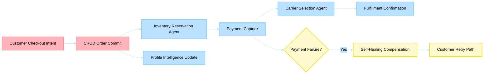

# Business Scenario 01: Order-to-Fulfillment

> **Last Updated**: 2026-04-30 | **Domain Owner**: E-commerce + Logistics Agents | **Bounded Context**: Purchase → Payment → Fulfillment

---

## Business Problem

High-throughput commerce pipelines face three simultaneous challenges during peak demand: protecting revenue from cart abandonment, enforcing stock integrity to prevent overselling, and delivering near-real-time order confirmation. Traditional microservices handle these with static orchestration (Saga pattern), but cannot adapt to novel failure scenarios or optimize carrier selection in real-time based on contextual signals.

## Agentic Difference

| Aspect | Traditional Microservice | Holiday Peak Hub Agent |
|---|---|---|
| **Carrier selection** | Rule-based cheapest/fastest | `carrier-selection` agent evaluates cost-speed-reliability tradeoff using LLM reasoning per shipment |
| **Payment failure** | Fixed retry → compensate | Self-healing kernel adapts retry strategy based on failure type; `checkout-support` agent handles edge cases |
| **Inventory hold** | Timeout-based release | `reservation-validation` agent monitors hold health and signals early release on abandonment detection |
| **Post-purchase intelligence** | Batch ETL overnight | `profile-aggregation` agent updates customer 360 in real-time via Event Hub |

## KPIs Impacted

| North-Star KPI | Target | Measurement |
|---|---|---|
| Order-to-confirmation latency | < 5s p95 | CRUD order commit + reservation + payment capture |
| Reservation integrity | > 99.9% | Zero oversell rate on confirmed orders |
| Payment-to-shipment continuity | > 97% | Orders reaching fulfillment without manual intervention |
| Compensation cycle (failure path) | < 2s | Inventory release on payment failure |

## Stakeholder Value

| Stakeholder | Value |
|---|---|
| **VP Commerce** | Revenue protection during peak; zero-downtime checkout |
| **Ops Manager** | Automated carrier optimization saves 8–15% shipping cost |
| **CTO** | Event-driven architecture scales linearly with demand |
| **Developer** | Clear CRUD contract with typed reservation lifecycle |

## Executive Flow

## Non-Functional Requirements

| Requirement | Target | Mechanism |
|---|---|---|
| Availability | 99.9% | Circuit breakers on payment + carrier APIs |
| Throughput | 1,000 orders/min peak | Event Hub partitioned consumers + KEDA scaling |
| Data consistency | Strong (reservations) | CRUD transactional guarantees + 409 on invalid transitions |
| Compliance | PCI DSS (payments) | Stripe integration; no card data stored |

## Implementation Status (Live)

### Checkout Contract

1. `POST /api/checkout/validate` — validates cart + inventory warnings/errors
2. `POST /api/orders` — creates order record
3. `POST /api/payments/intent` — creates Stripe PaymentIntent
4. Frontend confirms payment with Stripe.js
5. `POST /api/payments/confirm-intent` — reconciles PaymentIntent, sets status `paid`, publishes `payment-processed` event
6. `GET /api/payments/{payment_id}` — post-checkout payment retrieval

### Reservation Lifecycle

- `POST /api/inventory/reservations` — create holds (`status=created`)
- `POST /api/inventory/reservations/{id}/release` — rollback on failure
- `POST /api/inventory/reservations/{id}/confirm` — finalize on payment success
- Terminal states: `confirmed`, `released` (invalid transitions return `409`)

## Detailed Walkthroughs

- [Customer Cart, Checkout, and Order Confirmation](customer-cart-checkout-and-order-confirmation.md)
