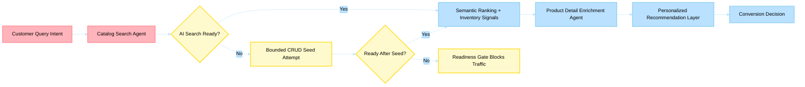

# Business Scenario 02: Product Discovery & Enrichment

> **Last Updated**: 2026-04-30 | **Domain Owner**: E-commerce + Search + Truth Layer Agents | **Bounded Context**: Query → Discovery → Enrichment → Conversion

---

## Business Problem

Retailers lose 30–40% of potential conversions due to poor search relevance, incomplete product data, and stale catalog content. Traditional keyword search returns irrelevant results for complex queries (e.g., "lightweight waterproof jacket for hiking in cold weather"). Manual product enrichment at 22 min/product cannot scale for catalogs exceeding 50K SKUs.

## Agentic Difference

| Aspect | Traditional Microservice | Holiday Peak Hub Agent |
|---|---|---|
| **Search** | Keyword matching + manual boost rules | `catalog-search` agent decomposes complex queries via LLM, executes vector + hybrid retrieval on Azure AI Search |
| **Enrichment** | Manual data entry by catalog team | `truth-enrichment` agent extracts attributes from images + descriptions using GPT-4o; proposes via `ProposedAttribute` with reasoning |
| **Index maintenance** | Batch reindex (overnight) | `search-enrichment-agent` generates `use_cases`, `complementary_products`, `substitutes` on catalog changes via Event Hub |
| **Quality gate** | Manual QA sampling | `consistency-validation` agent + auto-approve threshold (0.95) + HITL for low confidence |
| **Readiness** | Best-effort | Strict mode: `/ready` returns 503 until AI Search is configured, reachable, and non-empty |

## KPIs Impacted

| North-Star KPI | Target | Measurement |
|---|---|---|
| Search response latency | < 1.2s p95 | Azure AI Search + Redis query cache |
| Search-to-product click-through | > 35% | Semantic ranking + inventory signals |
| Enriched catalog coverage | > 98% | Truth layer completeness scoring |
| Strict readiness compliance | > 99% | AKS readiness probe pass rate |

## Stakeholder Value

| Stakeholder | Value |
|---|---|
| **VP Commerce** | 15–30% conversion lift from semantic search; catalog always complete |
| **Ops Manager** | Zero manual enrichment backlog; HITL only for edge cases (<20%) |
| **CTO** | Vector search scales to 200K+ products on S1/S2 tier |
| **Developer** | Clear seeding contract; Event Hub-driven index updates |

## Executive Flow

## Non-Functional Requirements

| Requirement | Target | Mechanism |
|---|---|---|
| Search availability | 99.9% | AI Search replicas + CRUD fallback seeding |
| Enrichment throughput | 50K products/month | Event Hub parallelism + Cosmos DB autoscale RUs |
| Index freshness | < 5 min lag | Event-driven indexer on product change events |
| Compliance | GDPR (search queries) | Query anonymization + 30-day TTL on telemetry |

## Implementation Status (Operational)

- **Provisioning**: Shared infra provisions Azure AI Search; `azd` `postprovision` ensures `catalog-products` index
- **Environment propagation**: `AI_SEARCH_ENDPOINT`, `AI_SEARCH_INDEX`, `AI_SEARCH_AUTH_MODE`, `CATALOG_SEARCH_REQUIRE_AI_SEARCH` flow from Bicep into Helm
- **Runtime query path**: `ecommerce-catalog-search` queries Azure AI Search when configured
- **Startup seeding**: When Search is configured but empty, bounded CRUD-based seeding executes during startup/readiness
- **Strict enforcement**: In AKS, strict mode is enabled; `/ready` fails closed (503) until AI Search is configured, reachable, and non-empty
- **Index maintenance**: Product event handlers upsert/delete AI Search documents on catalog changes

### Planned Hardening

- Vector embeddings + weighted hybrid query tuning (current: keyword/SKU retrieval)
- Index relevance/load evaluation suites with SLO-driven alerts
- Index/schema drift validation in CI pre-deploy checks

## Detailed Walkthroughs

- [Intelligent Search and Agent Comparison](intelligent-search-and-agent-comparison.md)
- [Category Browsing and Product Detail Exploration](category-browsing-and-product-detail.md)
