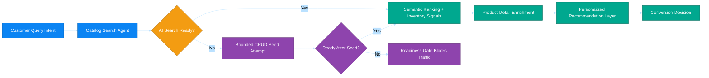

# Business Scenario 02: Product Discovery & Enrichment

## Executive Statement

Conversion acceleration engine that combines semantic discovery, AI enrichment, and strict AI Search readiness enforcement to keep search quality deterministic during peak traffic.

## Capability Mapping

| Capability | Business Leverage |
| --- | --- |
| Catalog search intelligence | High-relevance results and lower bounce |
| Product detail enrichment | Better content quality and conversion lift |
| Cart intelligence | Incremental AOV through contextual upsell |
| CRUD bootstrap source | Controlled AI Search index seeding for strict runtime readiness |

## Outcome Targets

| North-Star KPI | Target |
| --- | --- |
| Search response latency | < 1.2s p95 |
| Search-to-product click-through | > 35% |
| Enriched catalog coverage | > 98% |
| Strict readiness compliance in AKS runtime | > 99% |

## Executive Flow

## Issue #32 / #675 Implementation Status (2026-04-05)

Implemented and operational in platform deployment/runtime paths:

- **Provisioning**: Shared infrastructure provisions Azure AI Search, and `azd` `postprovision` ensures the `catalog-products` index after the service is reachable.
- **Environment propagation**: `AI_SEARCH_ENDPOINT`, `AI_SEARCH_INDEX`, `AI_SEARCH_AUTH_MODE`, and `CATALOG_SEARCH_REQUIRE_AI_SEARCH` flow from Bicep/workflow outputs into Helm-rendered service environment variables.
- **Runtime query path**: `ecommerce-catalog-search` queries Azure AI Search when configured.
- **Startup/readiness seeding**: When Search is configured but empty, runtime executes bounded CRUD-based seeding during startup and readiness checks.
- **Strict runtime enforcement**: In AKS/image deployments, strict mode is explicitly enabled and `/ready` fails closed (`503`) until AI Search is configured, reachable, and non-empty.
- **Index maintenance**: Product event handlers attempt AI Search document upsert/delete when AI Search configuration is present.

### Optional Hardening (Non-blocking)

- Add vector embeddings + weighted hybrid query tuning (current path is keyword/SKU retrieval).
- Add index relevance/load evaluation suites and SLO-driven alert thresholds.
- Add stricter index/schema drift validation in CI pre-deploy checks.

## Detailed Walkthroughs

- [Intelligent Search and Agent Comparison](intelligent-search-and-agent-comparison.md)
- [Category Browsing and Product Detail Exploration](category-browsing-and-product-detail.md)
