# Business Scenario 03: Returns & Refund Processing

> **Last Updated**: 2026-04-30 | **Domain Owner**: Logistics + CRM Agents | **Bounded Context**: Return Request → Evaluation → Restock → Refund

---

## Business Problem

Returns cost retailers 3–5% of revenue annually. Manual return evaluation creates bottlenecks (average 48h decision time), damages customer trust, and delays inventory recovery. Traditional systems apply rigid policy rules that cannot handle edge cases (partial damage, loyalty tier exceptions, fraud patterns) without human escalation for 40–60% of cases.

## Agentic Difference

| Aspect | Traditional Microservice | Holiday Peak Hub Agent |
|---|---|---|
| **Policy evaluation** | Static rule engine (if/else) | `returns-support` agent evaluates policy + customer history + product condition using LLM reasoning |
| **Fraud detection** | Batch ML scoring | Real-time pattern detection via three-tier memory (customer return frequency in Redis) |
| **Restock decision** | Manual warehouse inspection | `health-check` agent assesses condition + demand signals to determine restock vs. liquidation |
| **Customer communication** | Template emails | `support-assistance` agent generates contextual, empathetic responses based on customer 360 |

## KPIs Impacted

| North-Star KPI | Target | Measurement |
|---|---|---|
| Return decision latency | < 10 min (auto-eligible) | Agent policy evaluation time |
| Refund cycle time | < 72h (approved returns) | End-to-end lifecycle from approval to refund |
| Restock recovery time | < 24h | Time from received to available inventory |
| Manual review rate | < 20% of total returns | Agent auto-resolution rate |

## Stakeholder Value

| Stakeholder | Value |
|---|---|
| **VP Commerce** | Margin recovery through faster restock; reduced refund leakage |
| **Ops Manager** | 80% auto-resolution frees staff for complex cases |
| **CTO** | Event-driven lifecycle eliminates polling; complete audit trail |
| **Developer** | Typed state machine with 409 on invalid transitions |

## Executive Flow

```mermaid
%%{init: {'theme':'base', 'themeVariables': {
  'primaryColor':'#FFB3BA',
  'primaryTextColor':'#000',
  'primaryBorderColor':'#FF8B94',
  'lineColor':'#BAE1FF',
  'secondaryColor':'#BAE1FF',
  'tertiaryColor':'#FFFFFF'
}}}%%
flowchart LR
   A[Return Request Created] --> B[Returns Support Agent]
   B --> C{Policy Eligible?}
   C -->|Yes| D[Auto Approval + Label Generation]
   C -->|No / Complex| E[Staff Review Queue]
   E --> F[Approve or Reject]
   D --> G[Return Received + Condition Check]
   F --> G
   G --> H[Inventory Restock Signal]
   H --> I[Refund Issuance]
   I --> J[Customer Resolution Closure]

   classDef primary fill:#FFB3BA,stroke:#FF8B94,stroke-width:2px,color:#000
   classDef secondary fill:#BAE1FF,stroke:#89CFF0,stroke-width:2px,color:#000
   classDef alert fill:#FFFACD,stroke:#FFD700,stroke-width:2px,color:#000

   class A,B primary
   class D,G,H,I,J secondary
   class C,E,F alert
```

## Non-Functional Requirements

| Requirement | Target | Mechanism |
|---|---|---|
| Lifecycle consistency | ACID per transition | CRUD state machine; 409 on invalid transitions |
| Event delivery | At-least-once | Event Hub with checkpoint; idempotent handlers |
| Audit completeness | 100% lifecycle events | `return-events` + `payment-events` topics |
| SLA | 99.9% | Circuit breakers on payment provider calls |

## Implementation Status (Live)

### Canonical Return Lifecycle

`requested → approved|rejected → received → restocked → refunded`

- Terminal states: `rejected`, `refunded`
- Invalid transitions return `409 Conflict`

### Customer APIs
- `POST /api/returns` — create return request (`requested` status)
- `GET /api/returns` — list customer-owned returns
- `GET /api/returns/{return_id}` — lifecycle timeline + refund snapshot
- `GET /api/returns/{return_id}/refund` — refund progression

### Staff APIs
- `GET /api/staff/returns/` — shared read model
- Transition endpoints: `POST /approve`, `POST /reject`, `POST /receive`, `POST /restock`, `POST /refund`

### Event Outcomes
- Return events → `return-events` topic: `ReturnRequested`, `ReturnApproved`, `ReturnRejected`, `ReturnReceived`, `ReturnRestocked`, `ReturnRefunded`
- Refund issuance → `payment-events` topic: `RefundIssued`

## Detailed Walkthroughs

- [Customer Return Request and Refund Status](customer-return-request-and-refund-status.md)
