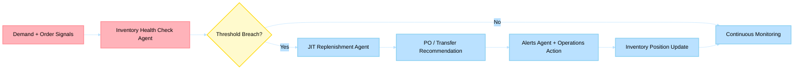

# Business Scenario 04: Inventory Optimization

> **Last Updated**: 2026-04-30 | **Domain Owner**: Inventory Agents | **Bounded Context**: Demand Signals → Health Assessment → Replenishment → Allocation

---

## Business Problem

Retailers lose $1.75 trillion globally to out-of-stocks and overstock annually (IHL Group). Traditional inventory management relies on periodic batch reviews, static reorder points, and manual threshold adjustments — resulting in 8–12% stockout rates on priority SKUs and 25–30% excess inventory carrying costs. During peak events (Black Friday, holiday season), these systems cannot react fast enough to demand spikes.

## Agentic Difference

| Aspect | Traditional Microservice | Holiday Peak Hub Agent |
|---|---|---|
| **Health monitoring** | Periodic batch check (hourly/daily) | `health-check` agent continuously evaluates stock integrity via Event Hub demand signals |
| **Replenishment** | Fixed reorder point (ROP) formula | `jit-replenishment` agent considers demand velocity, supplier lead time, and seasonality via LLM reasoning |
| **Alert prioritization** | All alerts equal | `alerts-triggers` agent scores urgency based on revenue impact, stockout probability, and customer segment |
| **Checkout scarcity** | Static "low stock" badge | `reservation-validation` agent provides real-time urgency context based on hold rate and conversion signals |

## KPIs Impacted

| North-Star KPI | Target | Measurement |
|---|---|---|
| Stockout rate (priority SKUs) | < 1.5% | Continuous health-check monitoring |
| Replenishment lead-time adherence | > 95% | JIT recommendations vs. actual PO timing |
| Inventory anomaly detection precision | > 90% | True positive rate on alert-triggered interventions |
| Working-capital efficiency uplift | +10% YoY | Reduced excess inventory carrying costs |

## Stakeholder Value

| Stakeholder | Value |
|---|---|
| **VP Commerce** | Fewer lost sales; scarcity signals drive 5–8% conversion uplift |
| **Ops Manager** | Prioritized alerts reduce noise; automated PO recommendations |
| **CTO** | Event-driven architecture scales to millions of SKU-location combinations |
| **Developer** | Explicit reservation lifecycle with typed state machine |

## Executive Flow

## Non-Functional Requirements

| Requirement | Target | Mechanism |
|---|---|---|
| Reservation consistency | ACID | CRUD state machine; `409` on invalid transitions |
| Event processing latency | < 1s median | Event Hub partitioned consumers |
| Scaling | 1M+ SKU-location pairs | Cosmos DB partitioned by SKU; Redis hot cache |
| Alert delivery | < 30s from detection | Redis pub/sub + push notification |

## Implementation Status (Live)

### Reservation Lifecycle

1. `POST /api/inventory/reservations` — create per-item holds (`status=created`, reason `checkout_hold`)
2. If checkout setup fails: `POST /api/inventory/reservations/{id}/release` (rollback)
3. After payment confirmation: `POST /api/inventory/reservations/{id}/confirm` (finalize)
4. On abandonment: outstanding holds released on page teardown

### State Model
- `created → confirmed` (successful payment)
- `created → released` (rollback/abandonment)
- `confirmed` and `released` are terminal states
- Invalid transitions return `409`

## Detailed Walkthroughs

- [Checkout Inventory Signals and Reservation Protection](checkout-inventory-signals-and-reservations.md)
