# Business Scenario 05: Shipment & Delivery Tracking

> **Last Updated**: 2026-04-30 | **Domain Owner**: Logistics Agents | **Bounded Context**: Dispatch → Transit → Delivery → Exception Handling

---

## Business Problem

"Where Is My Order?" (WISMO) accounts for 30–50% of inbound customer service contacts, costing $5–$8 per inquiry. Traditional tracking systems are reactive — they report delays after customers notice them. Carrier selection is typically rule-based (cheapest or fastest), ignoring real-time reliability signals, route disruptions, and customer segment expectations.

## Agentic Difference

| Aspect | Traditional Microservice | Holiday Peak Hub Agent |
|---|---|---|
| **Carrier selection** | Static cost/speed rules | `carrier-selection` agent evaluates cost, speed, reliability, and carbon footprint per shipment using contextual LLM reasoning |
| **ETA prediction** | Carrier-provided estimate (often inaccurate) | `eta-computation` agent combines carrier data + weather + traffic + historical performance for 92%+ accuracy |
| **Route monitoring** | Polling carrier APIs every 30 min | `route-issue-detection` agent processes real-time transit signals via Event Hub; detects disruptions proactively |
| **Customer notification** | Template emails on status change | CRM agents generate proactive, contextual notifications before customer inquires |

## KPIs Impacted

| North-Star KPI | Target | Measurement |
|---|---|---|
| ETA prediction accuracy | > 92% | Predicted vs. actual delivery time |
| WISMO ticket reduction | > 60% | Pre/post proactive notification implementation |
| Late-delivery incident rate | < 5% | Orders delivered after promised ETA |
| Carrier cost optimization | 8–15% savings | AI-selected vs. rule-based carrier cost delta |

## Stakeholder Value

| Stakeholder | Value |
|---|---|
| **VP Commerce** | WISMO deflection saves $5–$8/ticket × 60% reduction = massive cost savings |
| **Ops Manager** | Proactive disruption detection enables pre-emptive rerouting |
| **CTO** | Event-driven architecture; no polling overhead |
| **Developer** | Clean carrier abstraction; MCP tools for cross-agent logistics data |

## Executive Flow

```mermaid
%%{init: {'theme':'base', 'themeVariables': {
  'primaryColor':'#FFB3BA',
  'primaryTextColor':'#000',
  'primaryBorderColor':'#FF8B94',
  'lineColor':'#BAE1FF',
  'secondaryColor':'#BAE1FF',
  'tertiaryColor':'#FFFFFF'
}}}%%
flowchart LR
   A[Order Ready to Ship] --> B[Carrier Selection Agent]
   B --> C[Shipment Dispatch]
   C --> D[ETA Computation Agent]
   D --> E[Route Issue Detection Agent]
   E --> F{Route Risk Detected?}
   F -->|Yes| G[Delay Prediction + Replan]
   G --> H[Proactive Customer Notification]
   F -->|No| I[On-Time Tracking Updates]
   H --> J[Delivery Confirmation]
   I --> J

   classDef primary fill:#FFB3BA,stroke:#FF8B94,stroke-width:2px,color:#000
   classDef secondary fill:#BAE1FF,stroke:#89CFF0,stroke-width:2px,color:#000
   classDef alert fill:#FFFACD,stroke:#FFD700,stroke-width:2px,color:#000

   class A,B,C,D primary
   class E,G,H,I,J secondary
   class F alert
```

## Non-Functional Requirements

| Requirement | Target | Mechanism |
|---|---|---|
| Tracking update latency | < 5 min from carrier signal | Event Hub real-time processing |
| Carrier API resilience | 99.9% | Circuit breakers per carrier + fallback to cached ETA |
| Notification delivery | < 2 min from detection | Redis pub/sub + notification service |
| Scaling | 100K concurrent shipments | Partitioned Event Hub consumers + KEDA |

## Detailed Walkthroughs

- [Customer Order Tracking and Logistics Enrichment](customer-order-tracking-and-logistics-enrichment.md)
- [Staff Logistics Tracking Console](staff-logistics-tracking-console.md)
