# Business Scenario 06: Customer 360 & Personalization

> **Last Updated**: 2026-04-30 | **Domain Owner**: CRM Agents | **Bounded Context**: Behavior Signals → Profile → Segmentation → Activation

---

## Business Problem

Retailers with fragmented customer data deliver generic experiences that underperform by 2–3× vs. personalized alternatives. Traditional CRM systems batch-process segments overnight, missing real-time behavioral signals. Campaign targeting relies on static rules rather than dynamic customer context, resulting in 15–20% lower CTR and wasted marketing spend.

## Agentic Difference

| Aspect | Traditional Microservice | Holiday Peak Hub Agent |
|---|---|---|
| **Profile building** | Batch ETL (overnight sync) | `profile-aggregation` agent builds unified view in real-time via Event Hub behavioral signals |
| **Segmentation** | Static SQL queries (daily refresh) | `segmentation-personalization` agent dynamically assigns segments using LLM + three-tier memory context |
| **Campaign targeting** | Rule-based audience builder | `campaign-intelligence` agent optimizes timing, channel, and message using customer 360 context |
| **Personalization** | Pre-computed recommendations | Real-time context from Hot memory (Redis) enables sub-50ms personalization decisions |

## KPIs Impacted

| North-Star KPI | Target | Measurement |
|---|---|---|
| Personalized conversion uplift | 2–3× vs. generic | A/B test: personalized vs. control |
| Segment refresh latency | < 5 min | Time from behavior event to segment update |
| Campaign CTR improvement | +30% | AI-targeted vs. rule-based campaigns |
| Churn-risk interception | > 25% uplift | Proactive retention action success rate |

## Stakeholder Value

| Stakeholder | Value |
|---|---|
| **VP Commerce** | 2–3× conversion from personalization; 30% better campaign ROI |
| **Ops Manager** | Real-time segments eliminate overnight batch dependencies |
| **CTO** | Three-tier memory architecture optimizes cost vs. latency |
| **Developer** | Clean `/api` contracts; versioned with additive-only changes |

## Executive Flow

```mermaid
%%{init: {'theme':'base', 'themeVariables': {
  'primaryColor':'#FFB3BA',
  'primaryTextColor':'#000',
  'primaryBorderColor':'#FF8B94',
  'lineColor':'#BAE1FF',
  'secondaryColor':'#BAE1FF',
  'tertiaryColor':'#FFFFFF'
}}}%%
flowchart LR
   A[Behavior + Transaction Events] --> B[Profile Aggregation Agent]
   B --> C[Customer 360 in Cosmos DB]
   C --> D[Segmentation Agent]
   D --> E[Campaign Intelligence Agent]
   E --> F[Personalized Experience Delivery]
   F --> G[Engagement Feedback Loop]
   G --> B

   classDef primary fill:#FFB3BA,stroke:#FF8B94,stroke-width:2px,color:#000
   classDef secondary fill:#BAE1FF,stroke:#89CFF0,stroke-width:2px,color:#000

   class A,B,C primary
   class D,E,F,G secondary
```

## Non-Functional Requirements

| Requirement | Target | Mechanism |
|---|---|---|
| Profile read latency | < 50ms (hot) | Redis cached customer profiles |
| Profile durability | 99.999% | Cosmos DB with multi-region writes |
| Segment computation | < 5 min from event | Event Hub trigger + agent processing |
| Privacy compliance | GDPR Article 17 | Right-to-erasure endpoint; data TTLs |

## Implementation Status (Live)

### Personalization API Contract (v1)
1. `GET /api/catalog/products/{sku}` — product context
2. `GET /api/customers/{customer_id}/profile` — customer 360
3. `POST /api/pricing/offers` — deterministic offer computation
4. `POST /api/recommendations/rank` — ML-scored ranking
5. `POST /api/recommendations/compose` — final recommendation cards

### Dashboard/Profile Alignment
- Dashboard and profile UI flows consume supported data paths via API hooks
- Where no backend contract exists (rewards, saved addresses, payment methods): UI renders explicit unavailable states
- Versioning: `v1` on `/api` with additive-only changes; breaking changes require `/api/v2/` parallel path

## Detailed Walkthroughs

- [Customer Dashboard Personalization](customer-dashboard-personalization.md)
- [Profile Management](profile-management.md)
