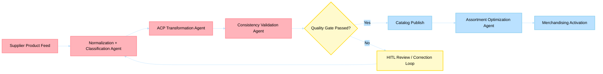

# Business Scenario 07: Product Lifecycle Management

> **Last Updated**: 2026-04-30 | **Domain Owner**: Product Management + Truth Layer Agents | **Bounded Context**: Supplier Feed → Normalization → Validation → Publish → Merchandising

---

## Business Problem

Product onboarding is the #1 bottleneck for catalog expansion. Suppliers deliver inconsistent data formats, missing attributes (30–50% incomplete on first submission), and non-compliant product descriptions. Traditional PIM workflows require manual normalization (15–30 min/product), creating a backlog that delays time-to-shelf by weeks. Data quality defects that reach production cause 5–10% higher return rates due to mismatched expectations.

## Agentic Difference

| Aspect | Traditional Microservice | Holiday Peak Hub Agent |
|---|---|---|
| **Normalization** | Manual mapping rules per supplier | `normalization-classification` agent applies LLM-driven taxonomy alignment with learned supplier patterns |
| **ACP compliance** | Manual schema validation | `acp-transformation` agent auto-generates ACP-compliant product contracts |
| **Quality validation** | Rule-based field checks | `consistency-validation` agent detects semantic inconsistencies (e.g., "waterproof" + "hand wash only") using LLM reasoning |
| **Enrichment** | Manual attribute filling | `truth-enrichment` agent extracts attributes from images + descriptions; proposes with confidence + reasoning |
| **HITL workflow** | Email-based approval | `truth-hitl` service provides review queue with evidence panel, bulk approval, and audit trail |
| **Assortment** | Spreadsheet-based planning | `assortment-optimization` agent recommends SKU mix based on demand signals + margin targets |

## KPIs Impacted

| North-Star KPI | Target | Measurement |
|---|---|---|
| Product onboarding cycle time | < 30 min (vs. days traditional) | Feed receipt to catalog publish |
| Catalog data quality score | > 98% | Truth layer completeness + consistency validation pass rate |
| Validation pass-through rate | > 95% | First-submission acceptance rate |
| Assortment yield uplift | +10% | Revenue per category after optimization |

## Stakeholder Value

| Stakeholder | Value |
|---|---|
| **VP Commerce** | 10× faster time-to-shelf; 10% revenue uplift from optimized assortment |
| **Ops Manager** | 80% reduction in manual enrichment effort; clear HITL queue |
| **CTO** | Event-sourced truth layer with complete provenance; EU AI Act ready |
| **Developer** | Pydantic v2 schemas; Event Hub-driven pipeline; typed state machines |

## Executive Flow

## Non-Functional Requirements

| Requirement | Target | Mechanism |
|---|---|---|
| Enrichment throughput | 50K products/month | Event Hub parallelism + Cosmos DB autoscale |
| Truth store durability | 99.999% | Cosmos DB with provenance versioning |
| HITL response time | < 4h (staff review) | Priority queue with urgency scoring |
| Compliance | EU AI Act Articles 12–14 | Reasoning field, audit trail, mandatory HITL for regulated fields |

## Detailed Walkthroughs

- [Admin Enrichment Trigger and Monitor](admin-enrichment-trigger-and-monitor.md)
- [Staff HITL Review and Decisioning](staff-hitl-review-and-decisioning.md)
- [Admin Schema and Tenant Configuration](admin-schema-and-tenant-configuration.md)
- [Admin Truth Analytics and Observability](admin-truth-analytics-and-observability.md)
