# Business Scenario 08: Customer Support Resolution

> **Last Updated**: 2026-04-30 | **Domain Owner**: CRM Support Agent + E-commerce Agents | **Bounded Context**: Ticket → Triage → Resolution → Knowledge Feedback

---

## Business Problem

Customer support costs retailers $5–$15 per ticket, with first-contact resolution rates averaging 40–50% in traditional setups. Agents spend 60% of their time on context gathering (order lookup, return status, payment history) rather than resolution. High-complexity cases require 3–5 system lookups, creating 8–12 minute handle times that erode CSAT.

## Agentic Difference

| Aspect | Traditional Microservice | Holiday Peak Hub Agent |
|---|---|---|
| **Triage** | Keyword-based routing rules | `support-assistance` agent classifies intent + sentiment using LLM; routes by complexity |
| **Context gathering** | Agent manually queries 3–5 systems | MCP tools auto-retrieve order status, payment history, return timeline, customer 360 in <2s |
| **Resolution drafting** | Template responses | Agent generates contextual, empathetic response drafts grounded in customer history |
| **Escalation** | Threshold-based (time/transfers) | Agent packages full context + reasoning for human handoff; staff sees complete picture immediately |
| **Knowledge feedback** | Manual KB article creation | Resolution patterns feed back into agent knowledge; deflection improves over time |

## KPIs Impacted

| North-Star KPI | Target | Measurement |
|---|---|---|
| First-contact resolution | 60–80% | Tickets resolved without transfer or callback |
| Initial response latency | < 30s | Time from ticket creation to first agent response |
| Cost per resolved ticket | -50% vs. baseline | Total support cost / resolved tickets |
| CSAT trend | > 4.2/5 | Post-resolution survey score |

## Stakeholder Value

| Stakeholder | Value |
|---|---|
| **VP Commerce** | 50% cost reduction; higher CSAT drives repeat purchases |
| **Ops Manager** | 60–80% FCR means fewer escalations; staff handles only complex cases |
| **CTO** | MCP-based context retrieval eliminates system-hopping; clean audit trail |
| **Developer** | Typed ticket lifecycle; role-based access; auditable mutations |

## Executive Flow

```mermaid
%%{init: {'theme':'base', 'themeVariables': {
  'primaryColor':'#FFB3BA',
  'primaryTextColor':'#000',
  'primaryBorderColor':'#FF8B94',
  'lineColor':'#BAE1FF',
  'secondaryColor':'#BAE1FF',
  'tertiaryColor':'#FFFFFF'
}}}%%
flowchart LR
   A[Support Ticket Created] --> B[Intent + Sentiment Classification]
   B --> C{Complexity Level}
   C -->|Low/Medium| D[AI Resolution Draft]
   D --> E[MCP Context Retrieval]
   E --> F[Customer Response Sent]
   C -->|High/Risk| G[Human Escalation Package]
   G --> H[Staff Resolution with Full Context]
   F --> I[Outcome Capture]
   H --> I
   I --> J[Knowledge Base Feedback Loop]

   classDef primary fill:#FFB3BA,stroke:#FF8B94,stroke-width:2px,color:#000
   classDef secondary fill:#BAE1FF,stroke:#89CFF0,stroke-width:2px,color:#000
   classDef alert fill:#FFFACD,stroke:#FFD700,stroke-width:2px,color:#000

   class A,B primary
   class D,E,F,I,J secondary
   class C,G,H alert
```

## Non-Functional Requirements

| Requirement | Target | Mechanism |
|---|---|---|
| Response latency | < 30s (AI), < 2 min (escalation) | SLM-first routing; pre-fetched context in Redis |
| Ticket lifecycle audit | 100% mutations logged | `status_history` + `audit_log` on every transition |
| Role enforcement | staff/admin for mutations | RBAC middleware; 403 on unauthorized access |
| Availability | 99.9% | Circuit breakers on external service calls |

## Implementation Status (Live)

### Staff Resolution APIs
- `POST /api/staff/tickets` — create ticket
- `PATCH /api/staff/tickets/{id}` — update ticket
- `POST /api/staff/tickets/{id}/escalate` — escalate with context package
- `POST /api/staff/tickets/{id}/resolve` — resolve with outcome capture

### Lifecycle Metadata
- Every mutation includes: `status_history`, `audit_log`, actor, timestamp, reason
- Payment context: `GET /api/payments/{payment_id}` (ownership + staff/admin override)

### Access Control
- Staff operations require `staff|admin` role
- Admin-only routes require `admin` role
- Production: mock login endpoints return `403`; never enabled

### Remaining Gap
<!-- TODO: verify against production metrics -->
- Customer self-service ticket creation (`/api/tickets`) not yet implemented in CRUD

## Detailed Walkthroughs

- [Staff Ticket Resolution and Escalation](staff-ticket-resolution-and-escalation.md)
