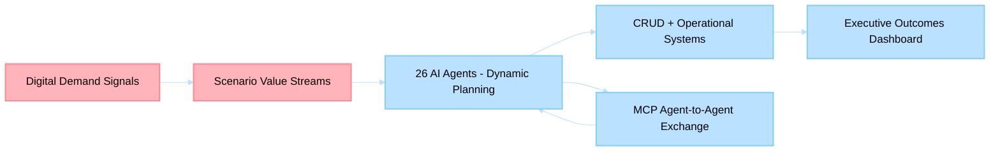

# Business Scenarios

> **Last Updated**: 2026-04-30 | **Classification**: Internal — Executive Playbook

Executive scenario playbook for Holiday Peak Hub: each scenario is a value stream mapping business outcomes to agentic capabilities. The platform deploys 26 AI agents + 1 CRUD service + 1 Next.js UI on AKS, coordinated via Event Hub choreography and MCP agent-to-agent communication.

---

## Why Agentic Retail?

Traditional microservices execute predetermined logic. Holiday Peak Hub's agents **plan dynamically**, **reason contextually**, and **adapt in real-time** — delivering measurably better outcomes across all eight retail value streams.

| Traditional Approach | Agentic Approach | Business Outcome |
|---|---|---|
| Static routing rules | SLM/LLM complexity-based routing | 70-85% inference cost reduction |
| Batch personalization | Real-time three-tier memory context | 2-3x conversion uplift |
| Fixed error handling | Self-healing kernel + adaptive retry | 40% fewer manual interventions |
| Polling-based updates | Event Hub choreography | Eliminates wasteful API overhead |
| Siloed service data | MCP agent-to-agent data exchange | Cross-domain intelligence |

---

## Scenario Portfolio

| # | Scenario | Outcome Theme | Flow Model | Primary Agents |
|---|---|---|---|---|
| 1 | [Order-to-Fulfillment](01-order-to-fulfillment/) | Revenue Protection + Fulfillment Velocity | SAGA Orchestration | checkout-support, reservation-validation, carrier-selection |
| 2 | [Product Discovery & Enrichment](02-product-discovery-enrichment/) | Conversion Acceleration + Catalog Intelligence | Hybrid Sync/Async | catalog-search, product-detail-enrichment, search-enrichment |
| 3 | [Returns & Refund Processing](03-returns-refund-processing/) | Margin Recovery + Trust Retention | Event-Driven Reverse Logistics | returns-support, health-check, support-assistance |
| 4 | [Inventory Optimization](04-inventory-optimization/) | Availability Precision + Working-Capital Efficiency | Predictive Control Loop | health-check, jit-replenishment, alerts-triggers, reservation-validation |
| 5 | [Shipment & Delivery Tracking](05-shipment-delivery-tracking/) | On-Time Confidence + WISMO Deflection | Proactive Logistics Intelligence | carrier-selection, eta-computation, route-issue-detection |
| 6 | [Customer 360 & Personalization](06-customer-360-personalization/) | LTV Expansion + Segment Intelligence | Real-Time CRM Mesh | profile-aggregation, segmentation-personalization, campaign-intelligence |
| 7 | [Product Lifecycle Management](07-product-lifecycle-management/) | Data Quality at Scale + Time-to-Shelf Speed | Quality-Gated Product Pipeline | normalization-classification, acp-transformation, consistency-validation, truth-* |
| 8 | [Customer Support Resolution](08-customer-support-resolution/) | Cost-to-Serve Reduction + CSAT Lift | AI-First Resolution Loop | support-assistance, order-status, profile-aggregation |

---

## Capability-to-Platform Mapping

| Capability Cluster | Primary Scenario | Supporting Azure Services |
|---|---|---|
| CRUD transactional core | 1 | APIM, PostgreSQL, Event Hubs |
| Catalog search + enrichment | 2 | Azure AI Search, AI Foundry, Redis |
| Returns + refund automation | 3 | Event Hubs, Cosmos DB, logistics agents |
| Inventory health + JIT + alerts | 4 | Event Hubs, Redis, Cosmos DB |
| ETA + route detection + carrier strategy | 5 | Carrier APIs, logistics telemetry, Redis |
| Profile + segmentation + campaign intelligence | 6 | Cosmos DB, AI Foundry, CRM adapters |
| Normalization + ACP + validation + assortment | 7 | Truth layer services, Event Hubs, Cosmos DB |
| Support assistance + escalation intelligence | 8 | CRM support agent, order-status, AI Foundry |

---

## Non-Functional Targets (Cross-Scenario)

| Requirement | Target | Verification |
|---|---|---|
| Test coverage | >= 75% (current: 89%) | 1,796 tests via pytest |
| Availability SLA | 99.9% | Circuit breakers + bulkheads + multi-replica |
| Agent response latency | < 3-5s p95 (user-facing) | SLM-first routing + Redis hot cache |
| Event processing | < 1s median | Event Hub partitioned consumers |
| Compliance | SOC 2, GDPR, PCI DSS, EU AI Act | Governance framework + audit trails |

---

## Demo Access Modes

| Mode | Use Case | Security |
|---|---|---|
| Microsoft Entra ID | Production and staging | RBAC roles: customer, staff, dmin |
| Dev mock login | Local development only | Role-selectable at /auth/login; disabled in production |

---

## Detailed Walkthrough Index

### 01 Order-to-Fulfillment
- [Customer Cart, Checkout, and Order Confirmation](01-order-to-fulfillment/customer-cart-checkout-and-order-confirmation.md)

### 02 Product Discovery & Enrichment
- [Intelligent Search and Agent Comparison](02-product-discovery-enrichment/intelligent-search-and-agent-comparison.md)
- [Category Browsing and Product Detail Exploration](02-product-discovery-enrichment/category-browsing-and-product-detail.md)

### 03 Returns & Refund Processing
- [Customer Return Request and Refund Status](03-returns-refund-processing/customer-return-request-and-refund-status.md)

### 04 Inventory Optimization
- [Checkout Inventory Signals and Reservation Protection](04-inventory-optimization/checkout-inventory-signals-and-reservations.md)

### 05 Shipment & Delivery Tracking
- [Customer Order Tracking and Logistics Enrichment](05-shipment-delivery-tracking/customer-order-tracking-and-logistics-enrichment.md)
- [Staff Logistics Tracking Console](05-shipment-delivery-tracking/staff-logistics-tracking-console.md)

### 06 Customer 360 & Personalization
- [Customer Dashboard Personalization](06-customer-360-personalization/customer-dashboard-personalization.md)
- [Profile Management](06-customer-360-personalization/profile-management.md)

### 07 Product Lifecycle Management
- [Admin Enrichment Trigger and Monitor](07-product-lifecycle-management/admin-enrichment-trigger-and-monitor.md)
- [Staff HITL Review and Decisioning](07-product-lifecycle-management/staff-hitl-review-and-decisioning.md)
- [Admin Schema and Tenant Configuration](07-product-lifecycle-management/admin-schema-and-tenant-configuration.md)
- [Admin Truth Analytics and Observability](07-product-lifecycle-management/admin-truth-analytics-and-observability.md)

### 08 Customer Support Resolution
- [Staff Ticket Resolution and Escalation](08-customer-support-resolution/staff-ticket-resolution-and-escalation.md)

---

## Executive Flow Map

---

## Related Documentation

- [Architecture Business Summary](../architecture/business-summary.md) — Platform overview and financial model
- [Competitive Intelligence](competitive-intelligence-enrichment-search.md) — Market positioning analysis
- [Cost-Benefit Model](cost-benefit-enrichment-search.md) — ROI/NPV for enrichment + search
- [Risk Assessment](risk-assessment-enrichment-search.md) — 28-risk register with mitigations
