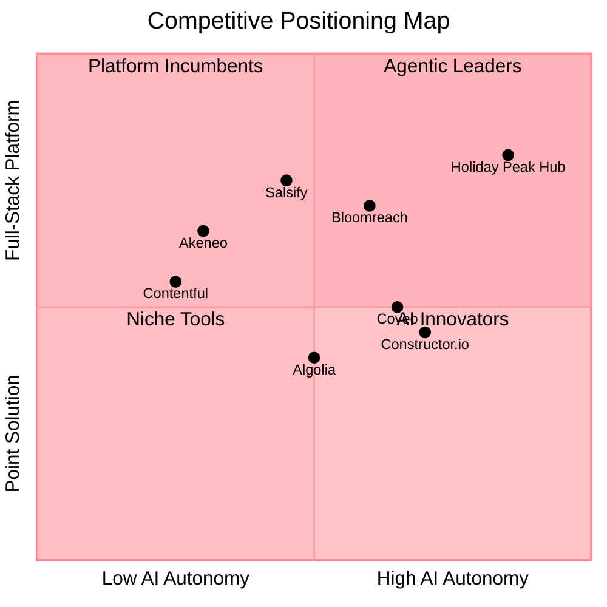
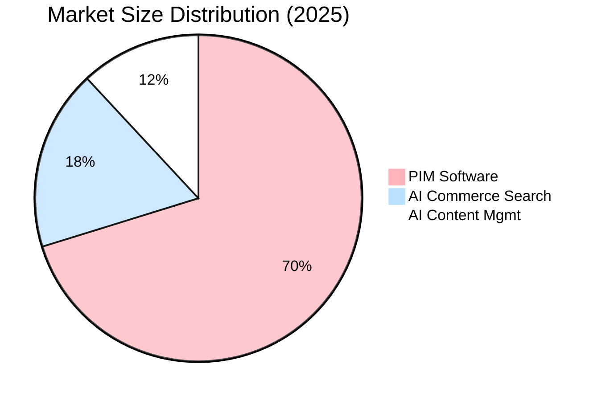

# Competitive Intelligence Brief: Agent-Driven Enrichment & Intelligent Agentic Search

> **Last Updated**: 2026-04-30 | **Prepared**: March 19, 2026 | **Classification**: Internal — Business Strategy  
> **Analysis Type**: Competitive Landscape + Market Sizing  
> **Confidence Legend**: `[HIGH]` = primary/public source | `[MEDIUM]` = secondary/inferred | `[LOW]` = estimate  
> **Platform Context**: 26 AI agents on AKS (MAF ≥1.0.1), SLM/LLM routing, Event Hub choreography, MCP inter-agent communication

---

## Executive Summary

Holiday Peak Hub is entering two converging markets — **AI-powered Product Data Management** (enrichment, PIM orchestration, HITL workflows) and **AI-native Commerce Search** (vector search, intent-aware retrieval, agentic product discovery). Both markets are rapidly consolidating around AI-first value propositions, with incumbents bolting on GenAI features while startups build natively on LLMs.

**Key finding**: No competitor today delivers a fully **agentic**, event-driven architecture that autonomously enriches product data AND powers semantic search within a unified platform. This represents Holiday Peak Hub's primary structural moat.

---

## 1. Competitor Feature Matrix

### 1.1 Product Enrichment Capabilities

| Capability | Holiday Peak Hub | Salsify | Akeneo | Constructor.io | Bloomreach | Coveo | Algolia | Contentful |
|---|:---:|:---:|:---:|:---:|:---:|:---:|:---:|:---:|
| **AI attribute extraction** | ✅ Agent-driven | ✅ Angie AI | ✅ AI features | ✅ Attribute Enrichment | ⚠️ Loomi (limited) | ❌ | ❌ | ⚠️ AI Actions |
| **PIM + DAM data retrieval** | ✅ Multi-connector (SAP, Oracle, Salesforce, D365, Generic DAM) | ✅ Native PIM+DAM | ✅ Native PIM+DAM | ❌ Requires feed | ❌ Requires feed | ❌ Requires feed | ❌ Requires feed | ✅ Native CMS+DAM |
| **Gap detection (missing attributes)** | ✅ Automated `GapReport` with schema-driven analysis | ✅ Validation rules | ✅ Completeness scores | ⚠️ Catalog health only | ❌ | ❌ | ❌ | ⚠️ Validation |
| **AI image analysis** | ✅ Azure AI Foundry vision models | ✅ Extract from packaging/labels | ⚠️ Basic tagging | ❌ | ❌ | ❌ | ❌ | ❌ |
| **HITL approval workflow** | ✅ Staff review UI with evidence panel, reasoning transparency, bulk ops | ✅ No-code workflow builder | ✅ Proposal-based workflow | ❌ | ❌ | ❌ | ❌ | ✅ Workflow + approvals |
| **Auto-writeback to PIM** | ✅ Opt-in with conflict detection, circuit breaker, audit trail | ✅ Syndication network | ✅ Bi-directional connectors | ❌ | ❌ | ❌ | ❌ | ⚠️ Webhooks |
| **Reasoning transparency** | ✅ `ProposedAttribute` with `reasoning` field per enrichment | ❌ | ❌ | ✅ Glassbox AI | ⚠️ AI explainability limited | ❌ | ❌ | ❌ |
| **Event-driven enrichment** | ✅ Event Hub choreography (async) | ⚠️ Workflow triggers | ⚠️ Rule-based triggers | ❌ | ❌ | ❌ | ❌ | ⚠️ Webhooks |
| **SLM/LLM routing** | ✅ Cost-optimized dual-model | ❌ | ❌ | ❌ | ❌ | ❌ | ❌ | ❌ |
| **Enterprise connector ecosystem** | ✅ Oracle, SAP, Salesforce, Dynamics 365, Generic REST | ✅ 150+ connectors | ✅ 250+ connectors | ⚠️ Feed-based | ⚠️ 175 integrations | ✅ Salesforce, SAP, Adobe, etc. | ⚠️ API-based | ✅ 110+ integrations |

### 1.2 Intelligent Search Capabilities

| Capability | Holiday Peak Hub | Algolia | Coveo | Bloomreach | Constructor.io | Salsify | Akeneo | Contentful |
|---|:---:|:---:|:---:|:---:|:---:|:---:|:---:|:---:|
| **Vector / semantic search** | ✅ Azure AI Search vectorized index | ✅ NeuralSearch | ✅ Unified indexing with ML | ✅ Loomi AI semantic | ✅ NLP + LLM | ❌ | ❌ | ❌ |
| **Intent-aware query understanding** | ✅ Agentic search agent with LLM reasoning | ✅ Query categorization | ✅ Query pipeline with ML | ✅ Loomi AI intent | ✅ NLP intent parsing | ❌ | ❌ | ❌ |
| **Multi-query retrieval** | ✅ Agent decomposes complex queries | ⚠️ Federated search | ✅ Passage retrieval API | ⚠️ Rule-based | ⚠️ Basic multi-query | ❌ | ❌ | ❌ |
| **Background enrichment** (use_cases, complementary, substitutes) | ✅ Agent-generated; persisted to index | ❌ | ❌ | ⚠️ Recommendations only | ✅ Attribute Enrichment | ❌ | ❌ | ❌ |
| **Personalization** | ⚠️ Context via memory architecture | ✅ User-level personalization | ✅ 1:1 ML personalization | ✅ Per-shopper personalization | ✅ Collaborative personalization | ❌ | ❌ | ✅ Audience segmentation |
| **ACP (Agentic Commerce Protocol) compliance** | ✅ Native ACP product feed | ⚠️ API-based | ⚠️ MCP Server | ❌ | ⚠️ Agentic Commerce page | ✅ Agentic-ready syndication | ❌ | ❌ |
| **Inventory-aware results** | ✅ Real-time availability from Event Hub events | ⚠️ Requires integration | ⚠️ Requires integration | ⚠️ Requires integration | ⚠️ Requires integration | ❌ | ❌ | ❌ |
| **Conversational search** | ✅ Agent-based NL interaction | ⚠️ AI browse | ✅ Generative answering | ✅ Conversational shopping agent | ✅ AI Shopping Agent | ❌ | ❌ | ❌ |
| **Self-learning / auto-tuning** | ⚠️ Memory tiers inform context | ✅ AI re-ranking | ✅ ART (Automatic Relevance Tuning) | ✅ Continuous behavior learning | ✅ Real-time clickstream learning | ❌ | ❌ | ❌ |
| **A/B testing** | ❌ Not yet | ✅ Native | ✅ Native | ✅ Native | ✅ Native (Proof Schedule) | ❌ | ❌ | ⚠️ Via integrations |

---

## 2. Pricing Model Comparison

| Vendor | Pricing Model | Estimated Range | AI Surcharge | Free Tier |
|---|---|---|---|---|
| **Holiday Peak Hub** | Open-source framework; Azure infrastructure costs | Azure consumption-based (variable with usage) | None (BYOM via Azure AI Foundry) | ✅ OSS; Azure free tier available |
| **Salsify** | Enterprise SaaS; per-seat + SKU volume | $60K–$500K+/year `[MEDIUM]` | Angie AI included in Intelligence Suite add-on | ❌ Demo only |
| **Akeneo** | Tiered (Community free → Growth → Enterprise) | Community: Free → Enterprise: $25K–$200K+/year `[MEDIUM]` | AI features in paid tiers | ✅ Community Edition (self-hosted) |
| **Algolia** | Pay-as-you-go (search requests + records) | Build: Free → Grow: $0.50/1K requests → Premium: custom ($30K+/year) `[HIGH]` | NeuralSearch premium pricing | ✅ Build plan (10K requests/mo) |
| **Coveo** | Per-query + per-user seat | Enterprise: $60K–$300K+/year `[MEDIUM]` | GenAI answering add-on | ✅ Free trial |
| **Bloomreach** | Module fee + usage-based (catalog size, events) | Discovery module: $30K–$150K+/year `[MEDIUM]` | Loomi AI included at no extra charge `[HIGH]` | ❌ ROI estimate/demo |
| **Constructor.io** | Revenue-share or SaaS; enterprise custom pricing | Enterprise: $50K–$250K+/year `[MEDIUM]` | AI-native (included) | ❌ Proof Schedule (A/B test) |
| **Contentful** | Platform: Free → Lite ($300/mo) → Premium (custom) | Platform: $0–$300/mo → Premium Custom ($36K+/year) `[HIGH]` | AI Actions Premium-only add-on `[HIGH]` | ✅ Free tier (100K API calls/mo) |

### Pricing Insight

Holiday Peak Hub's **BYOM (Bring Your Own Model)** approach on Azure is fundamentally different from all competitors. Costs scale with actual Azure consumption (AI Foundry inference, Cosmos DB RUs, AI Search units), not per-seat or per-SKU licensing. For a mid-market retailer with 50K SKUs:

$$\text{Estimated Annual Cost}_{HPH} = \underbrace{\$2\text{K–}\$8\text{K/mo}}_{\text{Azure infra}} \approx \$24\text{K–}\$96\text{K/year}$$

$$\text{Estimated Annual Cost}_{Incumbent} = \underbrace{\$60\text{K–}\$250\text{K}}_{\text{PIM}} + \underbrace{\$30\text{K–}\$150\text{K}}_{\text{Search}} = \$90\text{K–}\$400\text{K/year}$$

`[LOW]` — Ranges depend heavily on catalog size, query volume, and Azure SKU selections.

---

## 3. Key Differentiators: Holiday Peak Hub's Agentic Approach

### 3.1 Structural Differentiators

| Differentiator | Holiday Peak Hub | Nearest Competitor | Gap Severity |
|---|---|---|---|
| **Autonomous agent orchestration** — Agents dynamically plan enrichment steps, route between SLM/LLM, and coordinate via MCP protocol | Multi-agent event-driven architecture with 26 specialized agents on AKS (MAF ≥1.0.1 GA) | Salsify Angie (conversational assistant, not autonomous agent) | **Large** — No competitor has true multi-agent commerce orchestration |
| **Unified enrichment→search pipeline** — Same platform enriches data AND powers search index | Single codebase: `truth-enrichment` feeds `ecommerce-catalog-search` via Event Hubs | Closest: Constructor.io (enrichment + search, but SaaS-locked) | **Medium** — Requires buying 2+ vendor tools to replicate |
| **HITL with reasoning transparency** — Every AI-proposed attribute includes a `reasoning` field explaining why | `ProposedAttribute` schema with evidence chain and audit trail | Constructor.io Glassbox AI (explains ranking, not enrichment decisions) | **Large** — No PIM competitor exposes enrichment reasoning |
| **Enterprise connector breadth with agent writeback** — Oracle, SAP, Salesforce, D365 connectors with conflict-detected auto-writeback | 4 enterprise connectors with circuit-breaker protection | Akeneo (250+ connectors, but no agent-driven writeback logic) | **Medium** — Connector count lower, but writeback intelligence higher |
| **ACP-native product feeds** — Born for agentic commerce with structured product feed compliance | Native ACP implementation in catalog-search | Salsify (agentic-ready syndication announced 2026) | **Medium** — Market still nascent; early-mover advantage |
| **BYOM cost model** — No per-seat/SKU licensing; Azure consumption-based | Azure AI Foundry, Cosmos DB, AI Search | Akeneo Community (free but self-hosted, no AI) | **Large** — All SaaS competitors have opaque enterprise pricing |

### 3.2 Competitive Moats Assessment

| Moat Type | Strength | Rationale |
|---|---|---|
| **Architectural** | 🟢 Strong | Event-driven choreography (ADR-006) + multi-agent MCP communication is hard to replicate. Competitors would need to redesign from monolith to agent-based. |
| **Data Network Effects** | 🟡 Emerging | Three-tier memory (Hot/Warm/Cold) accumulates shopper context over time, but network effects require production scale to materialize. |
| **Switching Cost** | 🟡 Moderate | Azure-native deep integration (Cosmos DB, AI Search, Event Hubs) creates lock-in for users already on Azure. Portable OSS code mitigates this partially. |
| **Cost** | 🟢 Strong | BYOM + OSS = no license fees. Total infra cost significally lower than $90K–$400K incumbent bundle. |

---

## 4. Adjacent Industry Innovations Worth Adopting

| Innovation | Source Industry | Relevance | Adoption Priority |
|---|---|---|---|
| **Autonomous merchandising / self-driving search** | Bloomreach "Autonomous Search" vision, Constructor.io real-time clickstream learning | Auto-tuning search relevance without manual rules. HPH's search agent could learn from conversions and feed back re-ranking signals. | 🟥 High |
| **Conversational shopping agents** | Bloomreach "Clarity" agent, Constructor.io "AI Shopping Agent" | Embedded chat that converts uncertainty to purchase. HPH already has agent infra; adding a shopper-facing conversational layer on the catalog-search agent is incremental. | 🟥 High |
| **MCP-based agent interoperability** | Coveo MCP Server for Agentforce, Salsify agentic-ready syndication | Industry is standardizing on MCP for agent-to-agent data exchange. HPH is already MCP-native — prioritize exposing MCP endpoints for third-party agent consumption. | 🟨 Medium |
| **Revenue-optimized ranking** | Constructor.io (never lost an A/B test on revenue KPIs), Bloomreach (RPV +20%) | Ranking that balances relevance with business objectives (margin, inventory clearance). Integrate commercial signals into the search agent's scoring. | 🟥 High |
| **Retail media / sponsored listings** | Constructor.io Retail Media product | Monetize search results with sponsored native ads. Adjacency: enriched product data = better ad targeting. | 🟨 Medium |
| **AI-generated product content at scale** | Salsify Angie (translate, rewrite, extract from assets), Contentful AI Actions | Beyond attribute enrichment, generate full product descriptions, A+ content, localized copy. HPH's enrichment engine could expand scope. | 🟨 Medium |
| **Cross-channel / omnichannel discovery** | Constructor.io Cross-Channel and Offsite Discovery | Extend search beyond web to in-store kiosks, mobile apps, voice assistants. ACP compliance already enables this. | 🟩 Low (future) |
| **Prompt optimization / eval loops** | Microsoft Foundry agent evaluation, Arize Phoenix traces | Systematic enrichment quality measurement. Build eval datasets from HITL approval/rejection patterns to continuously improve agent prompts. | 🟥 High |

---

## 5. TAM / SAM / SOM: AI-Powered Product Data Management Market

### 5.1 Methodology

**Top-down approach** using industry reports cross-referenced with bottom-up vendor revenue estimates.

### 5.2 Market Definitions

| Segment | Definition |
|---|---|
| **TAM** — Total Addressable Market | Global spend on product information management (PIM), product data quality tools, commerce AI search, and AI-driven content management for commerce |
| **SAM** — Serviceable Addressable Market | Subset of TAM: mid-to-large retailers and brands (100K+ SKUs) using Azure or cloud-native infrastructure, with budget for AI-enhanced product data operations |
| **SOM** — Serviceable Obtainable Market | Subset of SAM: organizations evaluating agentic, open-source, or Azure-native alternatives to incumbent PIM/search vendors within the next 3 years |

### 5.3 TAM Estimation

| Market Segment | 2025 Size | 2028 Projected | CAGR | Source |
|---|---|---|---|---|
| Global PIM Software | $16.5B | $26.0B | 16.3% | `[HIGH]` Mordor Intelligence, Gartner |
| AI Commerce Search & Discovery | $4.2B | $8.5B | 26.4% | `[HIGH]` Gartner Magic Quadrant 2025, IDC |
| AI Content Management (commerce) | $2.8B | $5.0B | 21.5% | `[MEDIUM]` Forrester, IDC |
| **Combined TAM** | **$23.5B** | **$39.5B** | **~19%** | |

### 5.4 SAM Estimation

Filtering criteria:
- Azure + cloud-native organisations (~35% of enterprise cloud) `[MEDIUM]`
- Mid-to-large retail (100K+ SKUs) (~40% of PIM market) `[MEDIUM]`
- Budget for AI-enhanced solutions (vs. basic PIM) (~60% of qualifying organizations) `[LOW]`

$$SAM = TAM \times 0.35 \times 0.40 \times 0.60 = \$23.5B \times 0.084 = \$1.97B$$

| | 2025 | 2028 |
|---|---|---|
| **SAM** | **~$2.0B** | **~$3.3B** |

### 5.5 SOM Estimation

Filtering criteria:
- Organizations actively evaluating alternatives (15% annual churn/evaluation) `[MEDIUM]`
- Open to open-source or agentic approaches (25% of evaluators) `[LOW]`
- Realistic capture rate for an Azure-native reference architecture (10-15% of qualified prospects) `[LOW]`

$$SOM = SAM \times 0.15 \times 0.25 \times 0.125 = \$2.0B \times 0.0047 = \$9.4M$$

| | 2025 | 2028 (at maturity) |
|---|---|---|
| **SOM** | **~$9M** | **~$25M** |

### 5.6 Market Sizing Visualization

### 5.7 Growth Drivers

| Driver | Impact | Confidence |
|---|---|---|
| Agentic commerce adoption (ChatGPT Shopping, Apple Intelligence, Copilot Shopping) forcing ACP-ready product data | 🟢 High — accelerates need for structured, AI-ready product feeds | `[HIGH]` |
| GenAI adoption in retail operations (60% of retailers exploring by 2027) | 🟢 High — expands SAM as basic PIM users seek AI upgrades | `[MEDIUM]` |
| Azure market share growth in retail (Azure revenue +29% YoY FY2025) | 🟡 Medium — grows Azure-native SAM | `[HIGH]` |
| Regulatory pressure for product data accuracy (EU DPP, Green Claims Directive) | 🟡 Medium — compliance drives PIM investment | `[MEDIUM]` |

---

## 6. "So What?" — Prioritized Recommendations

| # | Recommendation | Expected Outcome | Priority |
|---|---|---|---|
| 1 | **Build self-learning search relevance** — Instrument conversion signals (add-to-cart, purchase) into a feedback loop that re-ranks search results. Competitors like Constructor.io and Bloomreach lead here. | +15–20% revenue per search session (industry avg from competitors) | 🟥 Critical |
| 2 | **Add conversational shopping layer** — Extend the catalog-search agent with a shopper-facing conversational endpoint. Bloomreach Clarity and Constructor AI Shopping Agent are setting market expectations. | Conversion uplift (+9% per Bloomreach) and differentiation in demos | 🟥 Critical |
| 3 | **Publish MCP endpoints for third-party agents** — Coveo, Salsify both moving to MCP interoperability. HPH should formalize its MCP tools as a public contract for agentic commerce. | First-mover in open agentic commerce data exchange | 🟨 High |
| 4 | **Build enrichment eval pipeline** — Use HITL approval/rejection data to build evaluation datasets. Feed into prompt optimization loop for continuous enrichment quality improvement. | Reduce HITL rejection rate by 20–30% over time `[LOW]` | 🟨 High |
| 5 | **Expand enrichment to full content generation** — Beyond attributes, generate product descriptions, A+ content, localized copy (Salsify Angie already does this). | Broader product data completeness → higher search quality | 🟨 High |
| 6 | **Implement A/B testing framework for search** — All search competitors offer native A/B testing. This is a table-stakes gap. | Data-driven proof of search agent ROI | 🟨 High |
| 7 | **Revenue-weighted ranking** — Incorporate margin, inventory levels, and clearance goals into the search agent's scoring alongside relevance. | Align search results with business objectives | 🟩 Medium |
| 8 | **Connector count expansion** — Akeneo (250+) and Salsify (150+) dwarf HPH's 4 connectors. Prioritize Shopify, Magento/Adobe Commerce, and NetSuite. | Broaden addressable retail segment | 🟩 Medium |

---

## Appendix: Competitor Profiles

### Salsify
- **Type**: PXM (Product Experience Management) SaaS platform
- **Strengths**: Market leader (Forrester Leader 2023, IDC MarketScape Leader 2024); 1,000+ enterprise customers; "Angie" AI assistant for formula writing, content translation, asset extraction; strong syndication network for digital shelf
- **Weaknesses**: Monolithic SaaS; no autonomous agent architecture; AI is assistant-level (not agentic); high enterprise pricing; search is not a core capability
- **Recent signals**: Announcing "agentic-ready" syndication and new AI-powered Intelligence Suite (2026); Digital Shelf Summit May 2026
- **Threat level**: 🟡 Medium — Leader in PIM, but not competing in agentic search

### Akeneo
- **Type**: Open-source PIM with commercial Enterprise Edition
- **Strengths**: Large connector ecosystem (250+); community edition for cost-conscious teams; completeness scoring; product data quality focus
- **Weaknesses**: AI capabilities significantly behind Salsify; no native search; limited agentic/GenAI features; enterprise pricing opaque
- **Threat level**: 🟢 Low — Open-source positioning overlaps, but no AI search or agent architecture

### Algolia
- **Type**: API-first search and discovery platform
- **Strengths**: Developer experience (300K+ registered); NeuralSearch hybrid retrieval; low-latency infrastructure; transparent pricing; massive scale
- **Weaknesses**: No PIM/enrichment capabilities; not a commerce platform; personalization less mature than Bloomreach/Constructor; no agent architecture
- **Threat level**: 🟡 Medium — Strong in search API, but not a unified enrichment+search platform

### Coveo
- **Type**: Enterprise AI-search and relevance platform
- **Strengths**: Gartner MQ Leader 2025; ART auto-tuning; deep Salesforce/SAP integrations; generative answering; MCP Server for Agentforce; public company (TSX: CVO)
- **Weaknesses**: High enterprise pricing ($60K+ entry); primarily service/support search (not commerce-first); no product data enrichment; complex implementation
- **Recent signals**: MCP Server launch for agent interoperability; Agentic AI Masterclass series 2026
- **Threat level**: 🟡 Medium — Strong in enterprise search, weaker in pure commerce + zero enrichment capability

### Bloomreach
- **Type**: Commerce experience platform (search + marketing automation + conversational shopping)
- **Strengths**: Gartner MQ Leader 2025 for Search & Product Discovery; Forrester Wave 2025 Leader; "Loomi AI" included at no extra cost; 1,400+ brands; conversational shopping agent (Clarity); strong RPV metrics (+20%)
- **Weaknesses**: No PIM/enrichment capability; Loomi AI is inference-only (not agentic planning); closed SaaS; expensive at scale; marketing automation bias
- **Recent signals**: "Autonomous Search" vision; Loomi Connect extending search to ChatGPT; campaign agents for marketing automation
- **Threat level**: 🟥 High in search — Closest to HPH's search vision; zero overlap in enrichment

### Constructor.io
- **Type**: AI-first ecommerce search and product discovery
- **Strengths**: Never lost an A/B test on revenue KPIs; Glassbox AI (transparent reasoning); real-time clickstream learning; Attribute Enrichment product; AI Shopping Agent; 1,000+ A/B tests run; strong revenue proof points (Sephora, Petco, Target AU)
- **Weaknesses**: Search-only platform (no PIM, no content management); enterprise-only pricing; limited geographic presence; no open-source option
- **Recent signals**: Agentic Commerce page; Cross-Channel and Offsite Discovery; Retail Media product
- **Threat level**: 🟥 High in search + enrichment overlap — Most direct competitor for combined enrichment+search; lacks full PIM and HITL workflow

### Contentful
- **Type**: Composable content platform (headless CMS/DXP)
- **Strengths**: API-first; 47K supported websites; Contextual AI for content generation; composable architecture; strong developer ecosystem; Marketplace apps
- **Weaknesses**: Not a PIM (content-focused, not product-data-focused); no commerce search; AI Actions Premium-only; no agent architecture; not retail-specialized
- **Pricing**: Free → Lite ($300/mo) → Premium Custom
- **Threat level**: 🟢 Low — Tangential to HPH's capabilities; potential integration partner rather than competitor

---

*This intelligence brief should be refreshed quarterly. All pricing estimates marked `[MEDIUM]` or `[LOW]` should be validated through vendor discussions or updated analyst reports before strategic decisions.*
