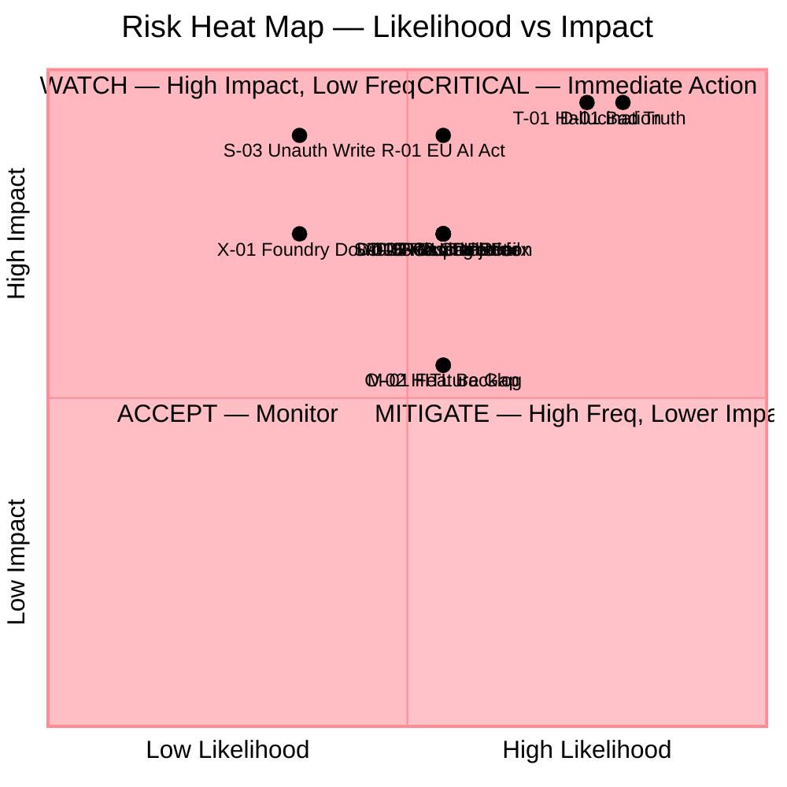
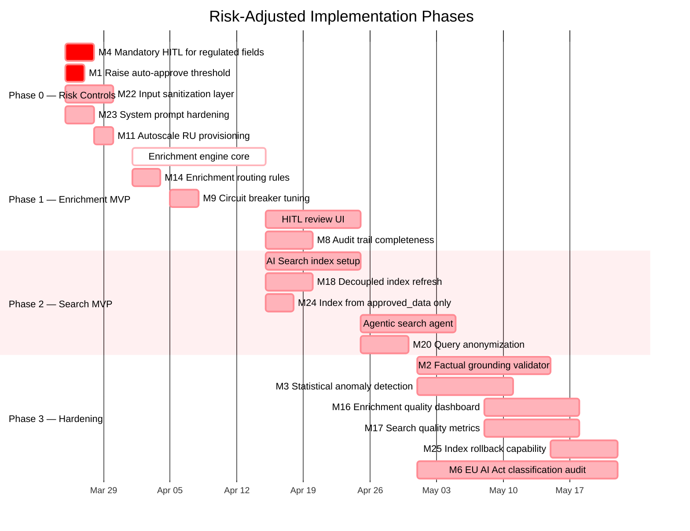
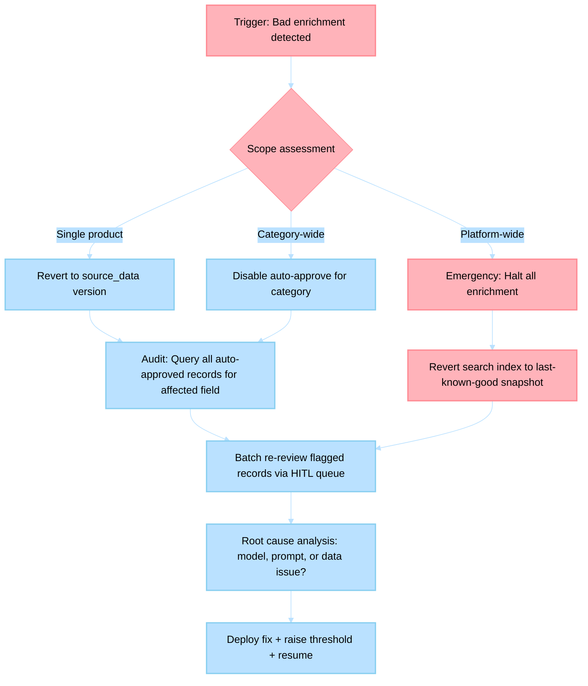
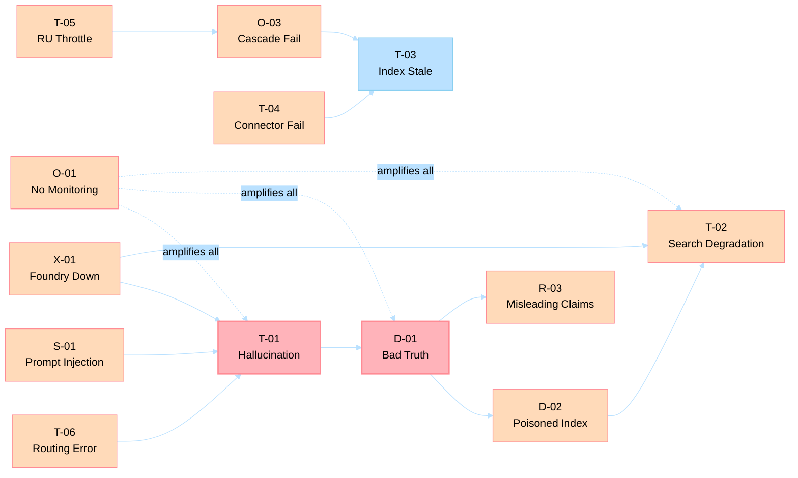

# Risk Assessment: Product Enrichment Flow & Intelligent Search System

> **Date**: March 19, 2026 | **Classification**: Internal — Risk Management  
> **Framework**: ISO 31000 + COSO ERM | **Risk Appetite**: Moderate  
> **Assessor**: Risk Analysis Agent  
> **Scope**: Capabilities 1 (End-to-End Product Enrichment) and 2 (Intelligent Product Search)

---

## Executive Summary

This assessment identifies **28 risks** across 7 categories for the two capabilities under development. Of these, **5 are Critical** (score ≥ 16), **9 are High** (score 10–15), **10 are Medium** (score 5–9), and **4 are Low** (score ≤ 4). The top risks concentrate in **data quality propagation**, **model hallucination**, and **regulatory compliance**. The enrichment→search pipeline coupling creates a unique amplification vector: a single bad enrichment can poison both the truth layer and the search index simultaneously.

**Key finding**: The existing architecture (ADR-020 truth layer, ADR-019 resilience patterns, ADR-003 connector registry) provides strong structural mitigation for operational risks, but **data quality and regulatory risks** require new controls not yet present in the codebase.

$$\text{Portfolio Risk Score} = \sum_{i=1}^{28} P_i \times I_i = 256 \quad \text{(max theoretical: 700)}$$

$$\text{Risk Efficiency Ratio} = \frac{\text{Critical + High risks}}{\text{Total risks}} = \frac{14}{28} = 50\%$$

---

## 1. Risk Register

### Scoring Methodology

| Score | Likelihood (L) | Impact (I) |
|-------|----------------|------------|
| 1 | Rare (<5%) | Negligible |
| 2 | Unlikely (5–20%) | Minor |
| 3 | Possible (20–50%) | Moderate |
| 4 | Likely (50–80%) | Major |
| 5 | Almost Certain (>80%) | Catastrophic |

$$\text{Risk Score} = L \times I$$

| Rating | Score Range | Action Required |
|--------|------------|-----------------|
| **Critical** | 16–25 | Immediate mitigation; consider blocking deployment |
| **High** | 10–15 | Mitigation plan required before GA |
| **Medium** | 5–9 | Monitor and address in next sprint cycle |
| **Low** | 1–4 | Accept and monitor |

---

### 1.1 Technical Risks

| ID | Risk | Capability | L | I | Score | Rating | Owner |
|----|------|-----------|---|---|-------|--------|-------|
| T-01 | **Model hallucination in enrichment**: AI generates factually incorrect product specifications (e.g., wrong voltage, false allergen claims) that pass confidence threshold | Cap 1 | 4 | 5 | **20** | Critical | AI/ML Lead |
| T-02 | **Search relevance degradation**: Vector index quality erodes over time due to accumulated enrichment noise or embedding model drift | Cap 2 | 3 | 4 | **12** | High | Search Lead |
| T-03 | **Index staleness**: Background enrichment agent falls behind ingestion rate; search returns outdated product data | Cap 2 | 3 | 3 | **9** | Medium | Platform Eng |
| T-04 | **Enterprise connector adapter failures**: PIM/DAM connectors (Oracle, SAP, Salesforce, D365) experience intermittent failures during peak enrichment | Cap 1 | 4 | 3 | **12** | High | Connector Eng |
| T-05 | **Cosmos DB RU throttling**: Enrichment burst writes during bulk ingestion exceed provisioned RUs, causing 429 errors across truth layer | Cap 1+2 | 3 | 4 | **12** | High | Platform Eng |
| T-06 | **SLM/LLM routing misclassification**: Complexity assessor routes complex enrichment tasks to SLM, producing low-quality outputs that auto-approve above threshold | Cap 1 | 3 | 4 | **12** | High | AI/ML Lead |
| T-07 | **AI Search indexer MCP failure**: AI Search Indexing MCP tool fails silently, leaving search index inconsistent with truth store | Cap 2 | 2 | 4 | **8** | Medium | Search Lead |
| T-08 | **Embedding model version skew**: Background enrichment uses a different embedding model version than live search queries, causing semantic mismatch | Cap 2 | 2 | 3 | **6** | Medium | AI/ML Lead |

### 1.2 Operational Risks

| ID | Risk | Capability | L | I | Score | Rating | Owner |
|----|------|-----------|---|---|-------|--------|-------|
| O-01 | **Monitoring blind spots**: No observability for enrichment quality metrics (hallucination rate, HITL rejection rate, time-to-approval) | Cap 1+2 | 4 | 3 | **12** | High | SRE Lead |
| O-02 | **On-call burden escalation**: HITL approval queue backlog during peak periods overwhelms reviewers, creating approval bottleneck | Cap 1 | 3 | 3 | **9** | Medium | Ops Lead |
| O-03 | **Cascading failure: enrichment→search pipeline**: Enrichment service failure stops index updates, search degrades silently while appearing operational | Cap 1+2 | 3 | 4 | **12** | High | Platform Eng |
| O-04 | **Bulk enrichment runaway**: Event-driven trigger on mass product ingestion creates unbounded enrichment job queue, exhausting Azure AI Foundry quotas | Cap 1 | 3 | 3 | **9** | Medium | Platform Eng |

### 1.3 Data Quality Risks

| ID | Risk | Capability | L | I | Score | Rating | Owner |
|----|------|-----------|---|---|-------|--------|-------|
| D-01 | **Bad enrichment propagates to approved truth**: Auto-approved records (confidence ≥ 0.95) contain subtle errors that bypass HITL and reach customer-facing data | Cap 1 | 4 | 5 | **20** | Critical | Data Quality Lead |
| D-02 | **Poisoned search index**: Hallucinated `use_cases`, `complementary_products`, or `substitute_products` fields degrade search result quality at scale | Cap 2 | 3 | 4 | **12** | High | Search Lead |
| D-03 | **PIM writeback conflict**: Approved enrichment overwrites legitimately changed PIM data due to race condition in sync timing | Cap 1 | 2 | 4 | **8** | Medium | Connector Eng |
| D-04 | **Training data contamination loop**: AI-enriched data feeds back into model training/fine-tuning, amplifying initial errors | Cap 1+2 | 2 | 5 | **10** | High | AI/ML Lead |

### 1.4 Security Risks

| ID | Risk | Capability | L | I | Score | Rating | Owner |
|----|------|-----------|---|---|-------|--------|-------|
| S-01 | **Prompt injection via product descriptions**: Malicious product data from PIM contains instructions that manipulate the enrichment agent's behavior | Cap 1 | 3 | 4 | **12** | High | Security Lead |
| S-02 | **PII leakage in product data**: Customer reviews, supplier contacts, or internal notes in PIM data get enriched/indexed without sanitization | Cap 1+2 | 2 | 4 | **8** | Medium | Security Lead |
| S-03 | **Unauthorized PIM writeback**: Compromised or misconfigured enrichment agent writes to production PIM without proper authorization checks | Cap 1 | 2 | 5 | **10** | High | Security Lead |
| S-04 | **Search query exfiltration**: User search queries containing sensitive intent (e.g., medical, legal) are logged without anonymization | Cap 2 | 2 | 3 | **6** | Medium | Security Lead |

### 1.5 Market Risks

| ID | Risk | Capability | L | I | Score | Rating | Owner |
|----|------|-----------|---|---|-------|--------|-------|
| M-01 | **Feature parity gap with incumbents**: Salsify Angie AI and Constructor.io release self-learning search before HPH, eroding early-mover advantage | Cap 2 | 3 | 3 | **9** | Medium | Product Lead |
| M-02 | **Adoption barrier — HITL complexity**: Enterprise customers reject enrichment workflow as too manual compared to Salsify's no-code workflow builder | Cap 1 | 3 | 3 | **9** | Medium | Product Lead |

### 1.6 Regulatory Risks

| ID | Risk | Capability | L | I | Score | Rating | Owner |
|----|------|-----------|---|---|-------|--------|-------|
| R-01 | **EU AI Act non-compliance**: Automated product content modification may classify as "high-risk AI" under EU AI Act Article 6, requiring conformity assessment | Cap 1 | 3 | 5 | **15** | High | Legal/Compliance |
| R-02 | **GDPR violation on search data**: User search queries stored in AI Search or Cosmos DB without proper consent, retention limits, or right-to-erasure support | Cap 2 | 3 | 4 | **12** | High | Legal/Compliance |
| R-03 | **Misleading product claims**: AI-enriched content generates health, safety, or performance claims that violate consumer protection regulations | Cap 1 | 2 | 5 | **10** | High | Legal/Compliance |

### 1.7 Dependency Risks

| ID | Risk | Capability | L | I | Score | Rating | Owner |
|----|------|-----------|---|---|-------|--------|-------|
| X-01 | **Azure AI Foundry availability**: Regional outage or quota exhaustion prevents enrichment and search agent inference | Cap 1+2 | 2 | 4 | **8** | Medium | Platform Eng |
| X-02 | **AI Search pricing changes**: Microsoft increases AI Search pricing for vector workloads, making semantic search cost-prohibitive | Cap 2 | 2 | 3 | **6** | Medium | Finance |
| X-03 | **Model deprecation**: GPT-5-nano or GPT-5 gets deprecated or behavior-changes, requiring prompt revalidation across all 21+ agents | Cap 1+2 | 3 | 3 | **9** | Medium | AI/ML Lead |

---

## 2. Top 10 Risks Ranked by Score

| Rank | ID | Risk | Score | Rating | Capability |
|------|-----|------|-------|--------|------------|
| 1 | **D-01** | Bad enrichment propagates to approved truth | **20** | Critical | Cap 1 |
| 2 | **T-01** | Model hallucination in enrichment | **20** | Critical | Cap 1 |
| 3 | **R-01** | EU AI Act non-compliance | **15** | High | Cap 1 |
| 4 | **T-02** | Search relevance degradation | **12** | High | Cap 2 |
| 5 | **T-04** | Enterprise connector adapter failures | **12** | High | Cap 1 |
| 6 | **T-05** | Cosmos DB RU throttling | **12** | High | Cap 1+2 |
| 7 | **T-06** | SLM/LLM routing misclassification | **12** | High | Cap 1 |
| 8 | **O-01** | Monitoring blind spots | **12** | High | Cap 1+2 |
| 9 | **O-03** | Cascading failure: enrichment→search | **12** | High | Cap 1+2 |
| 10 | **R-02** | GDPR violation on search data | **12** | High | Cap 2 |

### Risk Heat Map

---

## 3. Mitigation Strategies for High and Critical Risks

### D-01 / T-01: Hallucination & Bad Truth Propagation (Critical — Score 20)

These two risks form a **compound threat**: hallucination (T-01) creates the data, and auto-approval (D-01) propagates it.

| Mitigation | Description | Cost Est. | Residual Risk |
|------------|-------------|-----------|---------------|
| **M1: Raise auto-approve threshold** | Increase `AUTO_APPROVE_THRESHOLD_DEFAULT` from 0.95 → 0.98 for safety-critical categories (health, electronics, food). Add per-category thresholds. | Low (code change) | Score: 12 (L:3, I:4) |
| **M2: Factual grounding validator** | Post-enrichment validation step that cross-references proposed values against source PIM data and known product ontologies. Reject claims not grounded in source evidence. | Medium (2–3 sprints) | Score: 10 (L:2, I:5) |
| **M3: Statistical anomaly detection** | Monitor enrichment output distributions per category; flag proposals that deviate >2σ from historical norms (e.g., a "$5 TV" or "1000kg phone"). | Medium (1–2 sprints) | Score: 8 (L:2, I:4) |
| **M4: Mandatory HITL for regulated fields** | Fields like `allergens`, `safety_warnings`, `nutritional_info`, `voltage`, `medical_claims` always route to HITL regardless of confidence score. | Low (config change) | Score: 6 (L:1, I:5 — residual impact remains high but likelihood drops dramatically) |
| **M5: Dual-model verification** | For high-risk fields, run enrichment through both SLM and LLM independently; only auto-approve if both agree within tolerance. | Medium (1 sprint) | Score: 8 (L:2, I:4) |

**Recommended implementation order**: M4 → M1 → M2 → M3 → M5

### R-01: EU AI Act Non-Compliance (High — Score 15)

| Mitigation | Description | Cost Est. | Residual Risk |
|------------|-------------|-----------|---------------|
| **M6: AI Act classification audit** | Engage legal counsel to classify the enrichment system under EU AI Act risk tiers. The `reasoning` field in `ProposedAttribute` provides transparency (Article 13 alignment). | Medium (legal cost) | Score: 9 (L:3, I:3) |
| **M7: Human oversight enforcement** | Ensure HITL is mandatory (not bypassable) for all customer-facing content. Document compliance with Article 14 (human oversight). | Low (architecture validation) | Score: 6 (L:2, I:3) |
| **M8: Audit trail completeness** | Extend `build_audit_event` to capture full lineage: source data version, model ID, prompt hash, reviewer identity, timestamp. Satisfies Article 12 (record-keeping). | Low (1 sprint) | Score: 6 (L:2, I:3) |

### T-04: Enterprise Connector Adapter Failures (High — Score 12)

| Mitigation | Description | Cost Est. | Residual Risk |
|------------|-------------|-----------|---------------|
| **M9: Circuit breaker tuning** | ADR-019 circuit breakers are implemented. Tune thresholds per connector based on observed error rates. Add bulkhead isolation per PIM vendor. | Low (config) | Score: 6 (L:2, I:3) |
| **M10: Stale-data fallback** | When PIM connector fails, use last-known-good data from Cosmos DB truth store (`source_data` layer) with a `data_freshness: stale` flag. | Low (1 sprint) | Score: 4 (L:2, I:2) |

### T-05: Cosmos DB RU Throttling (High — Score 12)

| Mitigation | Description | Cost Est. | Residual Risk |
|------------|-------------|-----------|---------------|
| **M11: Autoscale RU provisioning** | Switch from fixed to autoscale throughput on truth store containers. Set max RU ceiling with cost alerts. | Low (infra config) | Score: 6 (L:2, I:3) |
| **M12: Write batching** | Batch enrichment writes using transactional batch operations within the same partition key (SKU + tenant). Reduces per-write RU cost. | Medium (1 sprint) | Score: 4 (L:1, I:4) |
| **M13: Hot partition monitoring** | Implement partition key distribution monitoring per ADR-007. Alert on partitions exceeding 20% of total RU consumption. | Low (monitoring) | Score: 4 (L:1, I:4) |

### T-06: SLM/LLM Routing Misclassification (High — Score 12)

| Mitigation | Description | Cost Est. | Residual Risk |
|------------|-------------|-----------|---------------|
| **M14: Enrichment-specific routing rules** | Override complexity assessor for enrichment tasks: fields requiring domain knowledge (technical specs, safety data) always route to LLM regardless of lexical simplicity. | Low (config) | Score: 6 (L:2, I:3) |
| **M15: Confidence-triggered re-routing** | If SLM produces confidence < 0.7, automatically re-route to LLM before presenting result. Currently only checked post-response. | Low (1 sprint) | Score: 4 (L:1, I:4) |

### O-01: Monitoring Blind Spots (High — Score 12)

| Mitigation | Description | Cost Est. | Residual Risk |
|------------|-------------|-----------|---------------|
| **M16: Enrichment quality dashboard** | Track: HITL rejection rate (target <15%), auto-approval rate, average confidence by category, median review time, queue depth. | Medium (1–2 sprints) | Score: 4 (L:1, I:4) |
| **M17: Search quality metrics** | Track: NDCG@10, MRR, click-through rate, zero-result rate, query-to-click latency. Alert on 10%+ degradation over 7-day rolling window. | Medium (1–2 sprints) | Score: 4 (L:1, I:4) |

### O-03: Cascading Failure enrichment→search (High — Score 12)

| Mitigation | Description | Cost Est. | Residual Risk |
|------------|-------------|-----------|---------------|
| **M18: Decoupled index refresh** | Search index population runs on independent schedule (not synchronous with enrichment). AI Search indexer operates on Cosmos DB change feed, not enrichment events. | Low (architecture) | Score: 6 (L:2, I:3) |
| **M19: Search degradation circuit breaker** | If enrichment service is down >5 min, search falls back to last-good index snapshot. Display `results_freshness: approximate` in API response. | Medium (1 sprint) | Score: 4 (L:1, I:4) |

### R-02: GDPR Violation on Search Data (High — Score 12)

| Mitigation | Description | Cost Est. | Residual Risk |
|------------|-------------|-----------|---------------|
| **M20: Query anonymization** | Hash or tokenize user identifiers before logging search queries. Implement 30-day TTL on search telemetry in Cosmos DB. | Low (1 sprint) | Score: 4 (L:1, I:4) |
| **M21: Right-to-erasure endpoint** | Implement GDPR Article 17 endpoint that purges user search history from AI Search analytics and Cosmos DB. | Medium (1–2 sprints) | Score: 4 (L:1, I:4) |

### S-01: Prompt Injection via Product Descriptions (High — Score 12)

| Mitigation | Description | Cost Est. | Residual Risk |
|------------|-------------|-----------|---------------|
| **M22: Input sanitization layer** | Sanitize PIM product data before passing to enrichment prompts. Strip control characters, detect instruction-like patterns, enforce max field lengths. | Low (1 sprint) | Score: 6 (L:2, I:3) |
| **M23: System prompt hardening** | Use structured prompt separators and instruction hierarchy in `build_prompt`. Prefix user data with explicit boundary markers (`[PRODUCT DATA START]`/`[END]`). | Low (code change) | Score: 4 (L:1, I:4) |

### D-02: Poisoned Search Index (High — Score 12)

| Mitigation | Description | Cost Est. | Residual Risk |
|------------|-------------|-----------|---------------|
| **M24: Index from approved_data only** | Search index exclusively reads from the `approved_data` layer in truth store (never from `enriched_data`). Background enrichment fields (`use_cases`, etc.) require separate approval gate. | Low (architecture) | Score: 6 (L:2, I:3) |
| **M25: Index rollback capability** | Maintain 2 index aliases (active + previous). If quality metrics breach threshold, swap alias to previous index within <5 min. | Medium (1 sprint) | Score: 4 (L:1, I:4) |

---

## 4. Risk-Adjusted Implementation Recommendations

### Phased Rollout Strategy

### Key Recommendations

1. **Deploy Phase 0 risk controls before any capability goes to production**. Mitigations M4, M1, M22, M23, and M11 are low-cost, high-impact and should gate the Enrichment MVP.

2. **Enforce approved-data-only indexing (M24) from day one**. Never allow the search index to read directly from `enriched_data`. The truth layer's three-tier architecture (ADR-020) already supports this — it must be enforced at the indexer level.

3. **Decouple enrichment from search (M18)** to prevent cascading failures. Use Cosmos DB change feed for index population rather than synchronous event-driven triggers.

4. **Begin EU AI Act compliance review (M6) in parallel with Phase 1**. The regulation timeline (August 2026 for high-risk provisions) does not allow deferral.

5. **Instrument before scaling**. Deploy monitoring (M16, M17) before increasing enrichment throughput. Running blind at scale amplifies every risk in the register.

6. **Set per-category risk profiles**. Not all product categories carry equal enrichment risk:

   | Category Risk Tier | Examples | Auto-Approve | HITL Required |
   |---|---|---|---|
   | **Tier 1 (Critical)** | Food, pharma, electronics, children's products | Disabled | Always |
   | **Tier 2 (High)** | Apparel, beauty, home appliances | Threshold 0.98 | Safety fields |
   | **Tier 3 (Standard)** | Office supplies, books, accessories | Threshold 0.95 | Sampling (10%) |

---

## 5. Contingency Plans for Top 3 Risks

### Contingency 1: D-01 — Bad Enrichment Reaches Customers

**Trigger**: HITL rejection rate exceeds 25% for any category OR customer reports factually incorrect product information traced to AI enrichment.

**Recovery actions**:
1. **Immediate (< 1 hour)**: Query Cosmos DB for all `auto_approved` records matching the affected entity/category/field. Set status to `pending_review`.
2. **Short-term (< 4 hours)**: Swap search index to previous alias. Disable enrichment for affected category.
3. **Medium-term (< 48 hours)**: Complete manual re-review of all flagged records. Deploy updated confidence thresholds and validation rules.
4. **Post-incident**: Publish incident report. Update category risk tier. Add regression test to enrichment test suite.

**RPO (Recovery Point Objective)**: Last approved version (available via `version` field in `TruthRecord`).  
**RTO (Recovery Time Objective)**: < 1 hour for index rollback; < 4 hours for enrichment halt.

---

### Contingency 2: T-01 — Systematic Model Hallucination

**Trigger**: Model produces demonstrably false outputs for >5% of enrichment requests in any 24-hour window, detected by factual grounding validator (M2) or manual audit.

**Recovery actions**:
1. **Immediate**: Switch all enrichment routing to LLM-only (disable SLM for enrichment). This increases cost but improves quality.
2. **Short-term**: Enable mandatory dual-model verification (M5) for all fields. No auto-approve until verified.
3. **Medium-term**: If LLM also hallucinates, halt AI enrichment entirely. Fall back to rule-based enrichment (template fill from PIM canonical fields only).
4. **Escalation**: If Azure AI Foundry models are systematically degraded, engage Microsoft support. Evaluate alternative model deployment (self-hosted via AKS).

**Fallback architecture**:

$$\text{Enrichment mode} = \begin{cases} \text{AI-assisted (normal)} & \text{if hallucination rate} < 5\% \\ \text{LLM-only + dual verification} & \text{if } 5\% \leq \text{rate} < 15\% \\ \text{Rule-based only} & \text{if rate} \geq 15\% \end{cases}$$

**Cost impact of fallback**: LLM-only mode increases inference cost by ~$3\times$. Rule-based mode eliminates AI cost but reduces enrichment coverage to ~30% of fields.

---

### Contingency 3: R-01 — EU AI Act Classification as High-Risk

**Trigger**: Legal review classifies the enrichment system as "high-risk AI" under EU AI Act Annex III, requiring conformity assessment before deployment in EU markets.

**Recovery actions**:
1. **Immediate**: Pause EU-facing enrichment deployment. Continue development for non-EU markets.
2. **Short-term (< 30 days)**:
   - Commission conformity assessment with notified body.
   - Compile technical documentation (Article 11): training data description, model architecture, validation methodology, bias testing results.
   - Ensure HITL cannot be bypassed (Article 14 compliance).
   - Verify audit trail captures all required lineage (Article 12).
3. **Medium-term (< 90 days)**:
   - Implement risk management system per Article 9.
   - Deploy bias and fairness testing for enrichment across product categories.
   - Establish post-market monitoring plan (Article 72).
4. **Alternative path**: If conformity assessment timeline is incompatible with launch, deploy enrichment in **"AI-assisted" mode** where AI proposes but HITL is mandatory for all records (not just low-confidence). This likely falls under "limited risk" classification.

**Existing architectural advantages**:
- `reasoning` field in `ProposedAttribute` (transparency — Article 13)
- `build_audit_event` in enrichment engine (record-keeping — Article 12)
- HITL workflow in truth-hitl service (human oversight — Article 14)
- Three-tier truth store with version history (traceability)

**Gaps to close**:
- Bias testing across product categories (not yet implemented)
- Formal risk management system documentation
- Post-market monitoring plan
- Data governance documentation for training data

---

## Risk Summary Matrix

| Category | Critical | High | Medium | Low | Avg Score |
|----------|----------|------|--------|-----|-----------|
| Technical | 1 | 3 | 3 | 0 | 10.1 |
| Operational | 0 | 2 | 2 | 0 | 10.5 |
| Data Quality | 1 | 2 | 1 | 0 | 12.5 |
| Security | 0 | 2 | 2 | 0 | 9.0 |
| Market | 0 | 0 | 2 | 0 | 9.0 |
| Regulatory | 0 | 3 | 0 | 0 | 12.3 |
| Dependency | 0 | 0 | 3 | 0 | 7.7 |
| **Total** | **2** | **12** | **13** | **0** | **10.0** |

---

## Appendix: Risk Interdependency Map

The interdependency map reveals the **critical chain**: `T-06 (Routing Error) → T-01 (Hallucination) → D-01 (Bad Truth) → D-02 (Poisoned Index) → T-02 (Search Degradation)`. This is the highest-severity propagation path and should receive the most mitigation investment. Breaking any link in this chain significantly reduces overall portfolio risk.
