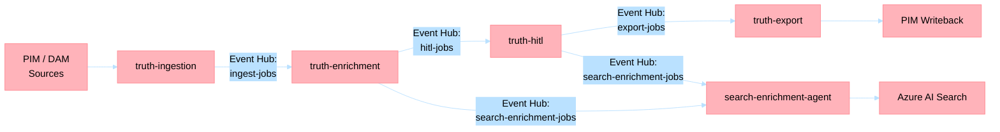
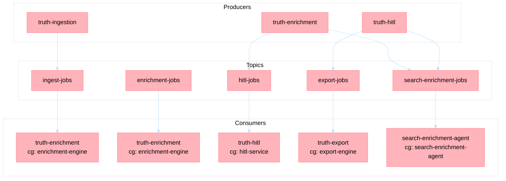

# Product Truth Layer — Agent Operations Guide

This guide explains each agent in the Product Truth Layer pipeline: what it does, why it exists, what configuration and data it requires, and how it communicates with the rest of the system.

## Pipeline Overview

The Product Truth Layer is a multi-agent pipeline that transforms raw product data from PIM/DAM systems into enriched, validated, and search-optimized product attributes. Each agent handles one responsibility in the workflow.



### Why Each Agent Exists

| Agent | Pipeline Stage | Business Purpose |
|-------|--------------|-----------------|
| **truth-ingestion** | Data Entry | Normalizes heterogeneous PIM/DAM feeds into a canonical product schema |
| **truth-enrichment** | Gap Fill | Detects missing attributes and proposes AI-generated values using text/vision models |
| **truth-hitl** | Quality Gate | Ensures human review of AI proposals before they become truth |
| **truth-export** | PIM Sync | Pushes approved truth back to source PIM in protocol-compliant formats |
| **search-enrichment-agent** | Discovery | Generates search-optimized content (keywords, facets, marketing copy) for AI Search |

### Data Flow Summary

1. **Ingestion**: Raw product arrives from PIM webhook or API call → normalized to canonical schema → stored in Cosmos DB → emits `ingest-jobs` event
2. **Enrichment**: Reads product from Blob Storage + category schema → detects missing fields → calls AI Foundry to propose values → emits `hitl-jobs` event
3. **HITL Review**: Queues proposals for human reviewers → captures approve/reject/edit → emits `export-jobs` + `search-enrichment-jobs`
4. **Export**: Transforms approved truth to UCP/ACP format → writes back to source PIM
5. **Search Enrichment**: Generates keywords, facets, marketing copy → pushes to Azure AI Search index

---

## 1. Truth Ingestion Agent

**Path**: `apps/truth-ingestion/`

### What It Does

Ingests raw product data from PIM (Product Information Management) and DAM (Digital Asset Management) sources into a canonical truth store. Normalizes field names, applies schema validation, and persists the result as `ProductStyle`/`ProductVariant` records in Cosmos DB.

### Why It Exists

Retail platforms integrate with dozens of PIM/DAM vendors, each with proprietary schemas. This agent creates a **single normalized data format** that all downstream agents can rely on without coupling to specific vendor APIs.

### Endpoints

| Method | Path | Purpose |
|--------|------|---------|
| POST | `/ingest/product` | Ingest a single product from raw PIM payload |
| POST | `/ingest/bulk` | Batch ingest 1-50 products concurrently |
| POST | `/ingest/sync` | Trigger full paginated PIM sync (background) |
| GET | `/ingest/status/{job_id}` | Check ingestion job status |
| POST | `/ingest/webhook` | Receive PIM webhook notifications |
| POST | `/invoke` | Agent-standard entry point (actions: `ingest_single`, `ingest_bulk`, `get_status`) |
| GET | `/health`, `/ready` | Health probes |

**MCP Tools** (agent-to-agent):
- `/ingest/product`, `/ingest/status`, `/ingest/sources`

### Configuration

| Variable | Required | Description |
|----------|----------|-------------|
| `PROJECT_ENDPOINT` or `FOUNDRY_ENDPOINT` | Yes | Azure AI Foundry endpoint |
| `FOUNDRY_AGENT_ID_FAST` | Yes | SLM agent ID for field mapping |
| `MODEL_DEPLOYMENT_NAME_FAST` | Yes | SLM deployment name |
| `FOUNDRY_AGENT_ID_RICH` | Yes | LLM agent ID for complex resolution |
| `MODEL_DEPLOYMENT_NAME_RICH` | Yes | LLM deployment name |
| `COSMOS_ACCOUNT_URI` | Yes | Cosmos DB endpoint |
| `COSMOS_DATABASE` | Yes | Database name (default: `truth-store`) |
| `COSMOS_CONTAINER` | Yes | Product container (default: `products`) |
| `COSMOS_AUDIT_CONTAINER` | Optional | Audit events container (default: `audit-events`) |
| `PLATFORM_JOBS_EVENT_HUB_NAMESPACE_ENV` | Yes | Event Hub namespace FQDN |
| `PLATFORM_JOBS_EVENT_HUB_CONNECTION_STRING_ENV` | Optional | Connection string (if no workload identity) |
| `PIM_BASE_URL` | Yes | PIM source REST endpoint |
| `PIM_AUTH_TYPE` | Yes | Auth type: `bearer`, `basic`, or `custom` |
| `PIM_AUTH_TOKEN` | Conditional | Bearer token (when `PIM_AUTH_TYPE=bearer`) |
| `PIM_AUTH_USERNAME`, `PIM_AUTH_PASSWORD` | Conditional | Basic auth credentials |
| `DAM_BASE_URL` | Optional | DAM source REST endpoint |
| `DAM_AUTH_TYPE`, `DAM_AUTH_*` | Optional | DAM authentication |
| `REDIS_URL` | Optional | Redis hot cache (degrades gracefully) |
| `BLOB_ACCOUNT_URL`, `BLOB_CONTAINER` | Optional | Cold storage for audit |
| `APPLICATIONINSIGHTS_CONNECTION_STRING` | Optional | Telemetry |
| `APP_NAME` | Recommended | Set to `truth-ingestion` |

### Data Requirements

**Input Data** — Product payloads from PIM in vendor-specific format:
```json
{
  "product": {
    "id": "vendor-sku-123",
    "name": "Explorer Waterproof Jacket",
    "category": "outerwear",
    "attributes": { "brand": "Alpine Co", "season": "winter" }
  },
  "field_mapping": { "category": "product_type", "name": "title" }
}
```

**Output** — Canonical `ProductStyle` written to Cosmos DB:
```json
{
  "entity_id": "vendor-sku-123",
  "name": "Explorer Waterproof Jacket",
  "category": "outerwear",
  "source": "pim",
  "record_type": "product_style",
  "attributes": { "brand": "Alpine Co", "season": "winter" }
}
```

### Event Production

Publishes to `ingest-jobs` topic on completion:
```json
{
  "event_type": "ingestion.completed",
  "entity_id": "vendor-sku-123",
  "status": "success",
  "result": { "product_count": 1, "fields_mapped": ["name", "category", "brand"] }
}
```

### Key Design Decisions

- **Cosmos DB as canonical store** — Partition key is `entity_id` for point reads.
- **Field mapping is per-request** — Different PIM sources can use different mappings.
- **AI is optional** — SLM is used only when field mapping is ambiguous; most mappings are deterministic.

---

## 2. Truth Enrichment Agent

**Path**: `apps/truth-enrichment/`

### What It Does

Detects missing product attributes by comparing the ingested product against a category-specific schema, then uses AI Foundry models (text reasoning + vision analysis) to propose values for each gap. Proposals are persisted and forwarded to HITL for human review.

### Why It Exists

Products arrive from PIM with incomplete data — missing colors, materials, dimensions, care instructions. Manual data entry is expensive and slow. This agent **automates attribute gap-fill using AI** while maintaining a human review checkpoint for quality assurance.

### Endpoints

| Method | Path | Purpose |
|--------|------|---------|
| POST | `/invoke` | Full product enrichment — detect gaps + enrich all |
| POST | `/enrich/product/{entity_id}` | Enrich all gaps for a specific product |
| POST | `/enrich/field` | Enrich a single field (targeted) |
| GET | `/enrich/status/{job_id}` | Check job status |
| GET | `/health`, `/ready` | Health probes |

**MCP Tools**: `/enrich/product`

### Configuration

| Variable | Required | Description |
|----------|----------|-------------|
| `PROJECT_ENDPOINT` or `FOUNDRY_ENDPOINT` | Yes | Azure AI Foundry endpoint |
| `FOUNDRY_AGENT_ID_FAST` | Yes | SLM agent ID (per-field simple enrichment) |
| `MODEL_DEPLOYMENT_NAME_FAST` | Yes | SLM deployment (e.g., `gpt-4-1-nano`) |
| `FOUNDRY_AGENT_ID_RICH` | Yes | LLM agent ID (multi-tool orchestration) |
| `MODEL_DEPLOYMENT_NAME_RICH` | Yes | LLM deployment (e.g., `gpt-4-1`) |
| `BLOB_ACCOUNT_URL` | Yes | Blob Storage URL for product data |
| `TRUTH_PRODUCT_BLOB_CONTAINER` | Yes | Container name (e.g., `products`) |
| `PLATFORM_JOBS_EVENT_HUB_NAMESPACE_ENV` | Yes | Event Hub namespace |
| `PLATFORM_JOBS_EVENT_HUB_CONNECTION_STRING_ENV` | Optional | Connection string |
| `COSMOS_ACCOUNT_URI`, `COSMOS_DATABASE` | Yes | Cosmos DB for proposed/truth attributes |
| `DAM_MAX_IMAGES` | Optional | Max images for vision analysis (default: 4) |
| `REDIS_URL` | Optional | Hot cache |
| `APPLICATIONINSIGHTS_CONNECTION_STRING` | Optional | Telemetry |
| `APP_NAME` | Recommended | Set to `truth-enrichment` |

### Data Requirements

**Product Data** — Stored in Blob Storage as `{entity_id}.json`:
```json
{
  "entity_id": "TEST-LIVE-001",
  "name": "Explorer Waterproof Jacket",
  "category": "outerwear",
  "attributes": {
    "brand": "Alpine Co",
    "color": null,
    "material": null
  },
  "images": ["https://dam.example.com/jacket-front.jpg"]
}
```

**Category Schema** — Stored in Blob as `_schemas/{category}.json`:
```json
{
  "category": "outerwear",
  "required_fields": ["color", "material", "weight_kg", "care_instructions"],
  "optional_fields": ["season", "water_resistance_rating"],
  "field_definitions": {
    "color": { "type": "string", "description": "Primary color visible in product images" },
    "material": { "type": "string", "description": "Primary fabric/material composition" }
  }
}
```

### How Enrichment Works

1. **Load product** from Blob Storage via `BlobProductStoreAdapter`
2. **Load schema** from `_schemas/{category}.json`
3. **Detect gaps** — Compare product attributes against `required_fields`
4. **Enrich each gap** — Two strategies:
   - **Agentic** (default): LLM orchestrates enrichment via tool calling
   - **Sequential fallback**: SLM enriches each field independently
5. **For each field**:
   - Build prompt with product context + field definition
   - Invoke AI model (text + optional vision from product images)
   - Score confidence
   - Persist proposed attribute to Cosmos DB
   - Emit HITL event (resilient — failure is logged, not fatal)
6. **Return** list of proposed attributes

### Event Production

Publishes to `hitl-jobs`:
```json
{
  "event_type": "attribute.proposed",
  "entity_id": "TEST-LIVE-001",
  "field_name": "color",
  "proposed_value": "Navy Blue",
  "confidence": 0.92,
  "source": "ai_text"
}
```

Publishes to `search-enrichment-jobs` on completion:
```json
{
  "event_type": "enrichment.completed",
  "entity_id": "TEST-LIVE-001",
  "proposed_count": 2
}
```

### Key Design Decisions

- **Blob Storage for products** — Decoupled from ingestion's Cosmos store; allows independent scaling.
- **Schema-driven gap detection** — Only enriches fields defined in the category schema; no hallucination of unnecessary attributes.
- **HITL publish is resilient** — If Event Hub is unreachable, enrichment still succeeds and the proposal is persisted. HITL delivery is best-effort.
- **Confidence threshold** — All proposals go to HITL regardless of confidence (conservative strategy).

---

## 3. Truth HITL Agent

**Path**: `apps/truth-hitl/`

### What It Does

Manages the human-in-the-loop review queue for AI-proposed product attributes. Receives proposals from truth-enrichment, presents them to reviewers, captures decisions (approve/reject/edit), and publishes approved changes downstream.

### Why It Exists

AI-generated product attributes cannot be trusted blindly — incorrect values damage catalog quality and customer trust. This agent provides a **governance checkpoint** ensuring human validation before any AI-proposed value becomes canonical truth.

### Endpoints

| Method | Path | Purpose |
|--------|------|---------|
| GET | `/review/queue` | List pending review items (paginated) |
| GET | `/review/stats` | Queue statistics (pending/approved/rejected) |
| GET | `/review/{entity_id}` | Proposals for a specific product |
| POST | `/review/{entity_id}/approve` | Approve proposal(s) |
| POST | `/review/{entity_id}/reject` | Reject with reason |
| POST | `/review/{entity_id}/edit` | Edit value and approve |
| POST | `/review/approve/batch` | Batch approve |
| POST | `/review/reject/batch` | Batch reject |
| POST | `/invoke` | Agent entry (actions: `stats`, `queue`, `detail`, `audit`) |
| GET | `/health`, `/ready` | Health probes |

**MCP Tools**: `/hitl/queue`, `/hitl/stats`, `/hitl/audit`, `/review/get_proposal`

### Configuration

| Variable | Required | Description |
|----------|----------|-------------|
| `PROJECT_ENDPOINT` or `FOUNDRY_ENDPOINT` | Yes | Azure AI Foundry endpoint |
| `FOUNDRY_AGENT_ID_FAST` | Yes | SLM for confidence re-evaluation |
| `MODEL_DEPLOYMENT_NAME_FAST` | Yes | SLM deployment |
| `FOUNDRY_AGENT_ID_RICH` | Yes | LLM for disputed proposal reasoning |
| `MODEL_DEPLOYMENT_NAME_RICH` | Yes | LLM deployment |
| `PLATFORM_JOBS_EVENT_HUB_NAMESPACE_ENV` | Yes | Event Hub namespace |
| `PLATFORM_JOBS_EVENT_HUB_CONNECTION_STRING_ENV` | Optional | Connection string |
| `COSMOS_ACCOUNT_URI`, `COSMOS_DATABASE`, `COSMOS_CONTAINER` | Optional | Warm memory tier |
| `REDIS_URL` | Optional | Hot cache |
| `APPLICATIONINSIGHTS_CONNECTION_STRING` | Optional | Telemetry |
| `APP_NAME` | Recommended | Set to `truth-hitl` |

### Data Requirements

**Inbound** — Subscribes to `hitl-jobs` Event Hub topic (consumer group: `hitl-service`):
```json
{
  "event_type": "attribute.proposed",
  "entity_id": "TEST-LIVE-001",
  "field_name": "color",
  "proposed_value": "Navy Blue",
  "confidence": 0.92,
  "source": "ai_text",
  "reasoning": "Based on product image analysis and description"
}
```

**Review Decision** — POST payload:
```json
{
  "attr_ids": ["attr-uuid-1"],
  "reason": "Correct based on product photography",
  "reviewed_by": "reviewer@company.com"
}
```

### Event Production

On approval, publishes to `export-jobs`:
```json
{
  "event_type": "hitl.approved",
  "entity_id": "TEST-LIVE-001",
  "approved_fields": ["color"],
  "reviewer_id": "reviewer@company.com",
  "protocol": "pim",
  "status": "approved"
}
```

On approval, publishes to `search-enrichment-jobs`:
```json
{
  "event_type": "hitl.approved.search",
  "entity_id": "TEST-LIVE-001",
  "approved_fields": ["color"],
  "status": "approved"
}
```

### Key Design Decisions

- **In-memory ReviewManager** — Current implementation uses in-memory state for the review queue. Production deployments should back this with Cosmos DB for persistence across restarts.
- **All proposals require review** — No auto-approve threshold; this is intentional for maximum catalog quality.
- **Dual downstream events** — Approval triggers both PIM writeback (export) and search re-indexing independently.

---

## 4. Truth Export Agent

**Path**: `apps/truth-export/`

### What It Does

Transforms approved product truth into protocol-specific formats (UCP — Universal Content Protocol, ACP — Agent Communication Protocol) and manages PIM writeback — pushing approved AI-enriched attributes back to the source PIM system.

### Why It Exists

Once attributes are validated, they must flow back to the systems of record. Different downstream consumers require different formats (UCP for universal distribution, ACP for agent interoperability). This agent **ensures approved truth reaches source systems** in their expected format.

### Endpoints

| Method | Path | Purpose |
|--------|------|---------|
| POST | `/export/acp/{entity_id}` | Export as ACP format |
| POST | `/export/ucp/{entity_id}` | Export as UCP format |
| POST | `/export/bulk` | Bulk export multiple products |
| POST | `/export/pim/{entity_id}` | PIM writeback (single) |
| POST | `/export/pim/batch` | PIM writeback (batch up to 100) |
| GET | `/export/status/{job_id}` | Export job status |
| GET | `/export/protocols` | List supported protocols |
| POST | `/invoke` | Agent entry point |
| GET | `/health`, `/ready` | Health probes |

**MCP Tools**: `/export/product`, `/export/status`, `/export/protocols`

### Configuration

| Variable | Required | Description |
|----------|----------|-------------|
| `PROJECT_ENDPOINT` or `FOUNDRY_ENDPOINT` | Yes | Azure AI Foundry endpoint |
| `FOUNDRY_AGENT_ID_FAST` | Yes | SLM for protocol validation |
| `MODEL_DEPLOYMENT_NAME_FAST` | Yes | SLM deployment |
| `FOUNDRY_AGENT_ID_RICH` | Yes | LLM for complex mapping |
| `MODEL_DEPLOYMENT_NAME_RICH` | Yes | LLM deployment |
| `PLATFORM_JOBS_EVENT_HUB_NAMESPACE_ENV` | Yes | Event Hub namespace |
| `PLATFORM_JOBS_EVENT_HUB_CONNECTION_STRING_ENV` | Optional | Connection string |
| `PIM_CONNECTOR_TYPE` | Yes | Connector type: `akeneo`, `salsify`, or `generic` |
| `PIM_BASE_URL` | Yes | PIM REST endpoint |
| `PIM_AUTH_TYPE` | Yes | Auth: `bearer` or `basic` |
| `PIM_AUTH_TOKEN` | Conditional | Bearer token |
| `PIM_WRITEBACK_ENABLED` | Yes | Enable PIM writeback (`true`/`false`) |
| `PIM_WRITEBACK_DRY_RUN` | Optional | Dry-run mode (no actual writes) |
| `PIM_WRITEBACK_FIELDS` | Optional | Comma-separated list of writeable fields |
| `PIM_PRODUCT_ENDPOINT` | Optional | PIM product API path (default: `/api/products`) |
| `PIM_RATE_LIMIT_RPS` | Optional | Rate limit (default: 10 req/s) |
| `PIM_MAX_RETRIES` | Optional | Retry attempts (default: 3) |
| `PIM_TIMEOUT_SECONDS` | Optional | Request timeout (default: 30s) |
| `PIM_FIELD_MAPPING_JSON` | Optional | Custom field mapping overrides |
| `COSMOS_ACCOUNT_URI`, `COSMOS_DATABASE` | Optional | Truth store read access |
| `REDIS_URL` | Optional | Hot cache |
| `APPLICATIONINSIGHTS_CONNECTION_STRING` | Optional | Telemetry |
| `APP_NAME` | Recommended | Set to `truth-export` |

### Data Requirements

**Inbound** — Subscribes to `export-jobs` Event Hub (consumer group: `export-engine`):
```json
{
  "event_type": "hitl.approved",
  "entity_id": "TEST-LIVE-001",
  "approved_fields": ["color", "material"],
  "reviewer_id": "reviewer@company.com",
  "protocol": "pim"
}
```

**UCP Export Output**:
```json
{
  "entity_id": "TEST-LIVE-001",
  "protocol": "ucp",
  "status": "completed",
  "exported_payload": {
    "sku": "TEST-LIVE-001",
    "title": "Explorer Waterproof Jacket",
    "attributes": { "color": "Navy Blue", "material": "Gore-Tex" }
  },
  "validation": { "status": "valid", "missing_required_fields": [] }
}
```

### Key Design Decisions

- **Dry-run mode** — `PIM_WRITEBACK_DRY_RUN=true` validates the export without mutating the source PIM.
- **Field allowlist** — `PIM_WRITEBACK_FIELDS` restricts which attributes can be written back, preventing unintended overwrites.
- **Rate limiting** — Built-in rate limiter prevents overwhelming source PIM APIs.
- **Terminal agent** — Export does not produce downstream events; it is the final pipeline stage for PIM sync.

---

## 5. Search Enrichment Agent

**Path**: `apps/search-enrichment-agent/`

### What It Does

Generates search-optimized content for products — keywords, use cases, marketing bullets, facet tags, sustainability signals — and pushes the enriched documents to Azure AI Search for customer-facing discovery.

### Why It Exists

Raw product attributes (even enriched ones) are insufficient for high-quality search. Customers search using natural language, synonyms, and intent-based queries. This agent **transforms structured product data into discovery-optimized content** that powers semantic and keyword search.

### Endpoints

| Method | Path | Purpose |
|--------|------|---------|
| POST | `/invoke` | Synchronous enrichment request |
| GET | `/health`, `/ready` | Health probes |

### Configuration

| Variable | Required | Description |
|----------|----------|-------------|
| `PROJECT_ENDPOINT` or `FOUNDRY_ENDPOINT` | Yes | Azure AI Foundry endpoint |
| `FOUNDRY_AGENT_ID_FAST` | Yes | SLM for simple strategy enrichment |
| `MODEL_DEPLOYMENT_NAME_FAST` | Yes | SLM deployment |
| `FOUNDRY_AGENT_ID_RICH` | Yes | LLM for complex/agentic enrichment |
| `MODEL_DEPLOYMENT_NAME_RICH` | Yes | LLM deployment |
| `AI_SEARCH_ENDPOINT` | Yes | Azure AI Search endpoint URL |
| `AI_SEARCH_ADMIN_KEY` or `AI_SEARCH_CREDENTIAL` | Yes | Search admin credentials |
| `AI_SEARCH_INDEX_NAME` | Yes | Target search index name |
| `AI_SEARCH_INDEXER_NAME` | Optional | Indexer name (for pull-mode sync) |
| `AI_SEARCH_PUSH_IMMEDIATE` | Optional | Push docs directly (`true`) vs. trigger indexer (`false`, default) |
| `TRUTH_PRODUCT_BLOB_CONTAINER` | Optional | Blob container for approved truth |
| `BLOB_ACCOUNT_URL` | Optional | Blob Storage URL |
| `PLATFORM_JOBS_EVENT_HUB_NAMESPACE_ENV` | Yes | Event Hub namespace |
| `PLATFORM_JOBS_EVENT_HUB_CONNECTION_STRING_ENV` | Optional | Connection string |
| `COSMOS_ACCOUNT_URI`, `COSMOS_DATABASE`, `COSMOS_CONTAINER` | Yes | Cosmos DB for enriched product storage |
| `SEARCH_ENRICHMENT_SEEDED_SKU` | Optional | Seeded SKU for local testing |
| `REDIS_URL` | Optional | Hot cache |
| `APPLICATIONINSIGHTS_CONNECTION_STRING` | Optional | Telemetry |
| `APP_NAME` | Recommended | Set to `search-enrichment-agent` |

### Data Requirements

**Inbound** — Subscribes to `search-enrichment-jobs` Event Hub (consumer group: `search-enrichment-agent`):
```json
{
  "event_type": "enrichment.completed",
  "data": { "entity_id": "TEST-LIVE-001", "proposed_count": 2 }
}
```
or:
```json
{
  "event_type": "hitl.approved.search",
  "data": { "entity_id": "TEST-LIVE-001", "approved_fields": ["color", "material"] }
}
```

**Enrichment Output** — `SearchEnrichedProduct` stored in Cosmos DB and pushed to AI Search:
```json
{
  "id": "TEST-LIVE-001",
  "sku": "TEST-LIVE-001",
  "score": 1.0,
  "sourceType": "AI_REASONING",
  "enrichedData": {
    "use_cases": ["Winter hiking", "Urban commute in rain"],
    "search_keywords": ["waterproof jacket", "gore-tex", "navy", "rain coat"],
    "enriched_description": "Premium waterproof jacket with Gore-Tex membrane...",
    "complementary_products": ["hiking boots", "rain pants"],
    "marketing_bullets": ["100% waterproof", "Breathable Gore-Tex", "Sealed seams"],
    "seo_title": "Explorer Waterproof Jacket | Navy Blue Gore-Tex | Alpine Co",
    "target_audience": ["outdoor_enthusiasts", "urban_commuters"],
    "seasonal_relevance": ["fall", "winter", "spring"],
    "facet_tags": ["color:navy", "material:gore-tex", "waterproof:yes"],
    "sustainability_signals": ["bluesign_certified"],
    "care_guidance": "Machine wash cold, hang dry",
    "completeness_pct": 0.95
  }
}
```

### Enrichment Strategies

The agent uses three strategies based on product complexity:

| Strategy | When Used | Model |
|----------|-----------|-------|
| **Simple** | Product has complete attributes, low complexity | SLM (fast) |
| **Complex** | Product needs reasoning about multiple attributes | LLM (rich) |
| **Agentic** | Model orchestrates tool calls to decide enrichment approach | LLM with function calling |

### Key Design Decisions

- **Two indexing modes** — Direct push (`AI_SEARCH_PUSH_IMMEDIATE=true`) for real-time updates, or indexer trigger (default) for batch efficiency.
- **Cosmos DB as intermediate store** — Enriched products are persisted before indexing, enabling retry without re-computation.
- **Dual trigger sources** — Receives events from both truth-enrichment (new proposals) and truth-hitl (approved attributes), ensuring search stays current regardless of HITL latency.
- **Terminal consumer** — Does not produce downstream events; search indexing is the final destination.

---

## Event Hub Topology



All Event Hub topics live under the `PLATFORM_JOBS_EVENT_HUB_NAMESPACE_ENV` namespace. Authentication uses **workload identity** by default; set `PLATFORM_JOBS_EVENT_HUB_CONNECTION_STRING_ENV` only when workload identity is unavailable (e.g., local development).

---

## Shared Infrastructure Requirements

All five agents share these common dependencies:

| Resource | Purpose | Env Var |
|----------|---------|---------|
| Azure AI Foundry | AI model inference (SLM + LLM) | `PROJECT_ENDPOINT`, `FOUNDRY_AGENT_*` |
| Event Hub Namespace | Inter-agent communication | `PLATFORM_JOBS_EVENT_HUB_NAMESPACE_ENV` |
| Cosmos DB | Persistent data storage | `COSMOS_ACCOUNT_URI`, `COSMOS_DATABASE` |
| Redis | Hot-tier memory cache | `REDIS_URL` |
| Blob Storage | Product data and schemas | `BLOB_ACCOUNT_URL` |
| App Insights | Observability and telemetry | `APPLICATIONINSIGHTS_CONNECTION_STRING` |
| AKS | Runtime platform | Deployed via Helm charts |

### AI Foundry Model Configuration

Each agent uses **SLM-first routing**: simple operations use the fast/cheap model, complex reasoning escalates to the rich model.

| Config | Typical Value | Purpose |
|--------|--------------|---------|
| `FOUNDRY_AGENT_ID_FAST` | Agent ID from Foundry | Lightweight SLM agent |
| `MODEL_DEPLOYMENT_NAME_FAST` | `gpt-4-1-nano` | Fast inference |
| `FOUNDRY_AGENT_ID_RICH` | Agent ID from Foundry | Full LLM agent |
| `MODEL_DEPLOYMENT_NAME_RICH` | `gpt-4-1` | Rich reasoning |

---

## Local Development Setup

### Minimal: Single Agent

```bash
cd apps/truth-enrichment/src
uv sync
export PROJECT_ENDPOINT="https://your-foundry.cognitiveservices.azure.com/"
export FOUNDRY_AGENT_ID_FAST="agent-fast-id"
export MODEL_DEPLOYMENT_NAME_FAST="gpt-4-1-nano"
export FOUNDRY_AGENT_ID_RICH="agent-rich-id"
export MODEL_DEPLOYMENT_NAME_RICH="gpt-4-1"
export BLOB_ACCOUNT_URL="https://yourstorage.blob.core.windows.net"
export TRUTH_PRODUCT_BLOB_CONTAINER="products"
uv run uvicorn truth_enrichment.main:app --reload --port 8000
```

### Full Pipeline (Docker Compose)

Ensure all agents are running and connected to the same Event Hub namespace. The pipeline processes in sequence:

1. Start truth-ingestion on port 8001
2. Start truth-enrichment on port 8002
3. Start truth-hitl on port 8003
4. Start truth-export on port 8004
5. Start search-enrichment-agent on port 8005

Each agent connects to the shared Event Hub namespace and subscribes to its respective topic.

### Testing Against Live AKS

Port-forward to test against deployed agents:

```bash
kubectl port-forward -n holiday-peak-agents svc/truth-enrichment-truth-enrichment 8881:80
curl -X POST http://localhost:8881/invoke \
  -H "Content-Type: application/json" \
  -d '{"entity_id":"YOUR-PRODUCT-ID"}'
```

---

## Troubleshooting

| Symptom | Likely Cause | Fix |
|---------|-------------|-----|
| "no enrichable gaps found" | No category schema uploaded | Upload `_schemas/{category}.json` to blob container |
| "Product not found" (enrichment) | Product not in blob storage | Ensure ingestion wrote product or upload manually |
| HITL publish 500 | Event Hub DNS unreachable | Verify `PLATFORM_JOBS_EVENT_HUB_NAMESPACE_ENV`; HITL publish is now resilient (logs warning, continues) |
| Empty `/review/queue` | No proposals sent to HITL | Check enrichment ran successfully; verify Event Hub connectivity |
| Export "not found" | Product not in truth store | Ensure HITL approved the proposal first |
| Search index stale | Indexer not triggered | Set `AI_SEARCH_PUSH_IMMEDIATE=true` or manually trigger indexer |
