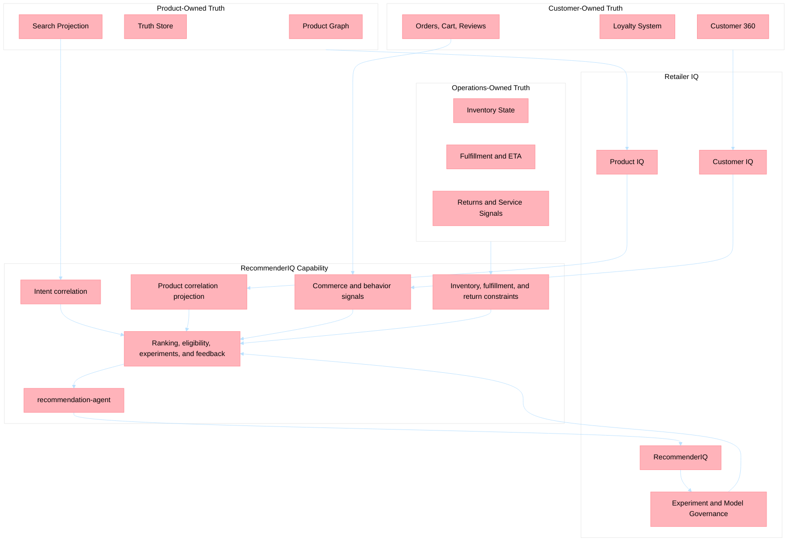
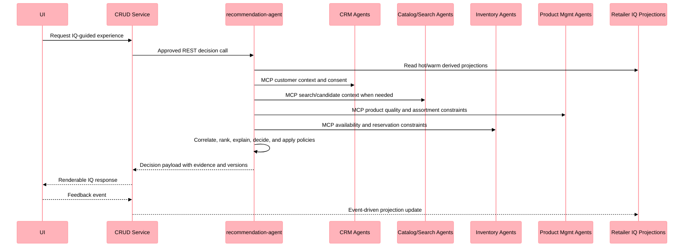
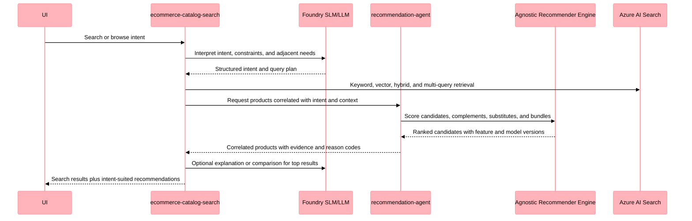

# Retailer IQ Intelligence Platform Plan

**Date**: 2026-05-03  
**Status**: Proposed  
**Scope**: Retailer IQ, Product IQ, Customer IQ, RecommenderIQ, product correlation enrichment, agnostic recommender engine, recommendation decisioning, model lifecycle  
**Related docs**: [Business Scenarios](../business_scenarios/README.md), [Solution Architecture](../architecture/solution-architecture-overview.md), [Components](../architecture/components.md), [ADR-020 Product Truth Layer](../architecture/adrs/adr-020-product-truth-layer.md), [ADR-023 Search Enrichment Bounded Context](../architecture/adrs/adr-023-search-enrichment-bounded-context.md), [ADR-024 Agent Communication Policy](../architecture/adrs/adr-024-agent-communication-policy.md)

---

## 1. Executive Decision

Create **Retailer IQ** as the umbrella intelligence plane for retail context, product truth, customer context, discovery, personalization, operational signals, decisioning, and governed model optimization. This repository is not literally Retailer IQ; Holiday Peak Hub is the framework and reference implementation where the Retailer IQ system can be defined and implemented.

Define **RecommenderIQ** as the Retailer IQ capability that correlates products with explicit and inferred customer intent. RecommenderIQ includes product correlation enrichment, commerce behavior signals, operational constraints, ranking, experimentation, feedback, and model lifecycle. It is bigger than a single agent.

Define the recommender as a decoupled, platform-agnostic classical ML decision system managed by agents, not as an extension of the Product Graph and not as the center of Retailer IQ.

Retailer IQ is not a shared source-of-truth database. It is a business-facing and architecture-facing system composed from existing bounded contexts using Event Hubs, MCP, approved REST contracts, and derived read models.

This plan does **not** reframe all intelligence under Product Graph or under a recommender service. Product Graph is one Product IQ data product. It supplies product facts, relationships, attributes, evidence, and eligibility signals. RecommenderIQ owns product-intent correlation, ranking decisions, model lifecycle, feedback learning, experiments, and explanation orchestration only for recommendation-style decisions.

The current `search-enrichment-agent` is the best existing service to evolve into `recommendation-agent`, because recommendation here is closer to an enrichment and correlation process than to online catalog filtering. The `ecommerce-catalog-search` service remains the online search/query experience that consumes recommendation outputs.

| Name | Meaning | Owner | Boundary Rule |
| --- | --- | --- | --- |
| **Retailer IQ** | Umbrella intelligence plane for retail context, operations, discovery, personalization, and decisions | Architecture and platform governance | Coordinates intelligence; does not own all data or collapse all capabilities into recommendation |
| **Product IQ** | Product truth, enrichment, search context, assortment context | Product Management, Truth Layer, Search | Product truth remains product-owned |
| **Product Graph** | Technical product model for styles, variants, truth attributes, evidence, schemas, and lineage | Truth Layer | Input to Retailer IQ decisions; not the intelligence or recommendation owner |
| **Customer IQ** | Customer 360 context, segments, preferences, consent, loyalty state, and behavior signals | CRM plus CRUD/loyalty systems | Customer truth remains customer-owned |
| **Customer Graph** | Optional CRM-owned derived profile graph/read model | CRM bounded context | Must not become shared mutable customer persistence |
| **RecommenderIQ** | Retail recommendation and correlation capability: intent-product correlation, ranking, explanations, experiments, and feedback learning | Recommendation bounded context | Owns recommendation decisions and model lifecycle, not Retailer IQ itself |
| **`recommendation-agent`** | Agent/service that manages recommendation enrichment, correlation projections, and recommender engine orchestration | Evolves from `search-enrichment-agent` | It is the agent boundary, not the entire recommendation system |

This gives the team one story to tell: **Retailer IQ connects Product IQ and Customer IQ; RecommenderIQ uses product-intent correlation, retail behavior signals, operational constraints, and an agnostic recommender engine to make governed, explainable recommendations.**

---

## 2. Architecture Boundary



Boundary rules:

1. Product Graph remains product-owned technical truth, governed by the Product Truth Layer.
2. Customer profiles, loyalty, consent, and orders remain owned by CRM, loyalty, and CRUD systems.
3. Retailer IQ stores only derived, consent-aware intelligence projections needed for decisions.
4. Retailer IQ services must not directly read another service's database or cache.
5. Cross-agent calls use MCP. CRUD-to-agent synchronous decisions use approved REST with circuit breakers. Background projection uses Event Hubs.

---

## 3. Existing Agent Map

This map is an inventory of what already exists in the platform. It is not proposing that every service become a recommender service. Each agent contributes a Retailer IQ capability. RecommenderIQ consumes those capabilities through contracts when it needs product truth, customer context, commerce behavior, or operational constraints.

### CRM Domain

| Agent | Existing Responsibility | Retailer IQ Capability Contribution | Primary Intelligence Surface |
| --- | --- | --- | --- |
| `crm-profile-aggregation` | Builds unified customer profiles from CRM and behavior data | Customer IQ profile, consent, preference, and identity context | Personalization, service, loyalty, search, and recommendation decisions |
| `crm-segmentation-personalization` | Segments customers and suggests personalization actions | Customer IQ segment, cohort, churn, propensity, and policy signals | Personalization strategy, campaign targeting, eligibility, and next-best-action |
| `crm-campaign-intelligence` | Generates campaign intelligence from CRM and funnel context | Activation, exposure, response, and channel feedback intelligence | Campaign optimization, engagement planning, and downstream decision feedback |
| `crm-support-assistance` | Produces support-assist context and recommended actions | Trust, service risk, complaint pattern, and recovery context | Service recovery, customer care, exclusion rules, and retention decisions |

### eCommerce Domain

| Agent | Existing Responsibility | Retailer IQ Capability Contribution | Primary Intelligence Surface |
| --- | --- | --- | --- |
| `ecommerce-catalog-search` | Delivers catalog discovery through Azure AI Search | Online query, search, and browse experience provider | Search, browse, comparison, and consumption of recommendation/correlation outputs |
| `ecommerce-product-detail-enrichment` | Enriches product detail context for shopping experiences | Product explanation, PDP context, comparison, and content intelligence | PDP explanation, product confidence, guided selling, and compatibility decisions |
| `ecommerce-cart-intelligence` | Scores cart risk and recommends conversion improvements | Cart conversion friction and active-session purchase context | Cart recovery, bundle suitability, promotion fit, and checkout readiness |
| `ecommerce-checkout-support` | Evaluates checkout blockers and completion guidance | Checkout constraint, policy, and completion intelligence | Checkout assistance, eligibility, payment/shipping constraints, and conversion support |
| `ecommerce-order-status` | Provides order and shipment status intelligence | Post-purchase lifecycle context and satisfaction signals | Retention, repeat purchase timing, delivery experience, and support prioritization |

### Inventory Domain

| Agent | Existing Responsibility | Retailer IQ Capability Contribution | Primary Intelligence Surface |
| --- | --- | --- | --- |
| `inventory-health-check` | Assesses inventory health and anomaly signals | Availability, stock confidence, and anomaly context | Fulfillment confidence, operational risk, search eligibility, and merchandising decisions |
| `inventory-jit-replenishment` | Recommends just-in-time replenishment actions | Supply pressure, replenishment horizon, and demand-readiness intelligence | Replenishment planning, assortment availability, promise quality, and operational prioritization |
| `inventory-alerts-triggers` | Detects inventory alerts and trigger conditions | Inventory exception and alert intelligence | Suppression, operational escalation, availability-aware search, and decision guardrails |
| `inventory-reservation-validation` | Validates reservations against stock conditions | Reservation feasibility and commitment intelligence | Checkout feasibility, inventory reservation, fulfillment promise, and hard eligibility gates |

### Logistics Domain

| Agent | Existing Responsibility | Retailer IQ Capability Contribution | Primary Intelligence Surface |
| --- | --- | --- | --- |
| `logistics-carrier-selection` | Recommends carrier options and trade-offs | Carrier cost, service level, speed, and capacity context | Delivery promise, shipping strategy, checkout support, and margin-aware decisions |
| `logistics-eta-computation` | Computes ETA projections and delay risk signals | ETA, delay risk, and delivery confidence intelligence | Product promise, customer expectation setting, search filtering, and service recovery |
| `logistics-returns-support` | Guides returns-related operational decisions | Return friction, policy, and recovery intelligence | Return prevention, support routing, product confidence, and retention decisions |
| `logistics-route-issue-detection` | Detects route issues and recovery recommendations | Route risk, geography, and disruption intelligence | Delivery confidence, exception handling, checkout constraints, and proactive service |

### Product Management Domain

| Agent | Existing Responsibility | Retailer IQ Capability Contribution | Primary Intelligence Surface |
| --- | --- | --- | --- |
| `product-management-normalization-classification` | Normalizes and classifies product attributes | Product IQ taxonomy, canonical attribute, category, and similarity context | Search relevance, product comparability, assortment intelligence, and recommendation features |
| `product-management-acp-transformation` | Transforms product data into ACP-aligned payloads | Product IQ protocol and payload projection intelligence | ACP/UCP-compatible product experiences, downstream agent contracts, and UI readiness |
| `product-management-consistency-validation` | Evaluates product consistency and completeness signals | Product quality, completeness, consistency, and approval confidence | Content governance, search eligibility, guided selling, and decision guardrails |
| `product-management-assortment-optimization` | Ranks and optimizes assortment decisions | Assortment strategy, SKU mix, and featured-policy context | Assortment planning, category strategy, search shelves, and recommendation policy |

### Search Domain

| Agent | Existing Responsibility | Retailer IQ Capability Contribution | Primary Intelligence Surface |
| --- | --- | --- | --- |
| `search-enrichment-agent` | Enriches search-oriented product content asynchronously | Best existing boundary to evolve into `recommendation-agent` because it already owns asynchronous enrichment, complements, substitutes, and product correlation metadata | Product-intent correlation, complements, substitutes, bundles, candidate-generation projections, and recommender engine orchestration |

### Truth Layer Domain

| Agent | Existing Responsibility | Retailer IQ Capability Contribution | Primary Intelligence Surface |
| --- | --- | --- | --- |
| `truth-ingestion` | Ingests source product data into truth workflows | Product Graph source ingestion, source lineage, and identity context | Product governance, traceability, search eligibility, and downstream intelligence inputs |
| `truth-enrichment` | Generates proposed truth-layer attribute enrichments | Product IQ enrichment and evidence generation | Product completeness, guided selling, search content, and decision evidence after validation |
| `truth-hitl` | Supports human-in-the-loop review and approval queues | Product governance, review, approval, and risk gating | Prevents unapproved product facts from powering search, recommendation, and customer-facing decisions |
| `truth-export` | Exports approved truth-layer attributes downstream | Product publication and contract-aligned export intelligence | Keeps downstream Product IQ, RecommenderIQ, search, and UI payloads aligned to approved truth |

### Platform Components

| Component | Existing Responsibility | Retailer IQ Capability Contribution | Primary Intelligence Surface |
| --- | --- | --- | --- |
| `crud-service` | Owns transactional APIs and publishes domain events | System-of-record gateway for orders, cart, reviews, and user-facing CRUD events | Event source for behavior intelligence and approved REST gateway for synchronous IQ decisions |
| `ui` | Next.js portal for retail workflows | Experience shell for Retailer IQ surfaces | Renders search, recommendations, explanations, feedback, experiments, operations views, and operator controls |

---

## 4. Architectural Pattern Map

| Pattern | Existing Use | Retailer IQ Use |
| --- | --- | --- |
| DDD Bounded Contexts | CRM, eCommerce, Inventory, Logistics, Product Management, Search, Truth Layer | Keep Product IQ, Customer IQ, and RecommenderIQ as separate responsibilities |
| Database per Service | ADR-023 and ADR-024 prohibit direct cross-service storage coupling | Retailer IQ projections are derived; no direct reads of product/customer/operations persistence |
| CQRS / Materialized Read Model | Read-optimized projections exist for search and truth exports | Retailer IQ creates derived capability/read models from events; recommendation features are one projection type |
| Event-Carried State Transfer | CRUD publishes domain events to Event Hubs | Product, customer, order, inventory, shipment, return, and feedback events update derived features |
| MCP Tool Protocol | Agents expose `/mcp/*` tools for agent-to-agent communication | Retailer IQ agents call owning agents for capabilities instead of reaching into their stores |
| Approved REST Decision Calls | Frontend/CRUD invoke agents through APIM/REST | CRUD and UI invoke Retailer IQ decision endpoints for synchronous user experiences |
| Adapter Pattern | Enterprise connectors integrate CRM, loyalty, PIM, DAM, SCM | Retailer IQ uses adapters for loyalty, CRM, experimentation, and model registry integrations |
| Strategy Pattern | Model routing, evaluation, and ranking policies | Candidate generation, rankers, constraints, experiments, and explanation strategies are swappable |
| Builder Pattern | Agent and memory assembly through `AgentBuilder` and memory builder | Retailer IQ agents use standard builder composition and tiered memory configuration |
| Factory Pattern | `create_standard_app()` bootstraps services | Retailer IQ services follow the same FastAPI app factory pattern |
| Tiered Caching | Redis, Cosmos DB, Blob Storage memory tiers | Redis for session features, Cosmos for warm projections, Blob for offline training/evaluation sets |
| SLM-First Routing | GPT-5-nano fast path with LLM escalation | Fast policy/explanation path by default, LLM escalation for complex preference and offer reasoning |
| Circuit Breaker / Bulkhead / Rate Limiter | Enterprise hardening utilities in lib | Protect CRM, search, inventory, model, and loyalty dependencies from cascading failures |
| HITL Governance | Truth proposals require review before publication | Model promotion, high-risk recommendation policies, and generated explanations require review gates |
| Enrichment Guardrails | Agent output schema and confidence validation | Retailer IQ outputs, including recommendations, must include evidence, constraints, confidence, and fallback behavior |
| Self-Healing / Observer | Incident lifecycle and remediation state | Monitor projection lag, model drift, ranking anomalies, and dependency degradation |

---

## 5. Retailer IQ System Design

Retailer IQ is the proposed system architecture implemented by this repository's services; the repository itself remains Holiday Peak Hub. RecommenderIQ is the retail recommendation and correlation capability inside that architecture.

The plan should therefore avoid treating every existing service as a recommender dependency. Existing agents remain capability providers. RecommenderIQ consumes them through contracts when it needs product truth, customer context, commerce behavior, or operational constraints.

### 5.1 Retailer IQ Capability Plane

Retailer IQ should organize the platform into reusable intelligence capabilities:

1. **Customer IQ**: profile, consent, segment, preference, loyalty, support, and lifecycle context.
2. **Product IQ**: truth, product graph, taxonomy, enrichment, quality, assortment, search content, and evidence.
3. **RecommenderIQ**: intent interpretation, product correlation, commerce behavior signals, operational constraints, ranking, eligibility, experimentation, explanation, and feedback loops.

Each capability is backed by an owning service or agent. Retailer IQ composes them through Event Hubs, MCP, approved REST contracts, and derived projections. It does not replace the existing bounded contexts.

### 5.2 Decoupled RecommenderIQ Capability

Create **RecommenderIQ** as a decoupled bounded context when the platform needs recommendation behavior beyond the current fragmented flows. This is one Retailer IQ capability, not the entire Retailer IQ system. RecommenderIQ is composed of three separate responsibilities:

1. **Agnostic classical ML recommender engine**: owns ranking algorithms, feature contracts, inference adapters, calibration, and model versioning. This is the primary scoring mechanism.
2. **Recommendation enrichment and correlation agent**: evolves the current `search-enrichment-agent` into `recommendation-agent`, using `BaseRetailAgent`, `AgentBuilder`, MCP, memory, Foundry SLM/LLM routing, and resilience patterns to manage enrichment, product-intent correlations, explanations, fallback behavior, and model lifecycle governance.
3. **Online search consumption surface**: keeps `ecommerce-catalog-search` as the search and browse experience that interprets the user's query and consumes correlated products from RecommenderIQ.

The recommender engine must be provider-agnostic. It should be callable through stable Python/service interfaces and should support deterministic baselines, classical ML rankers, and later tenant-calibrated models without depending on Product Graph internals, Foundry prompts, or one retailer's data shape.

The first standard code boundary for recommender systems lives inside the `recommendation-agent` host package, currently `apps/search-enrichment-agent/src/search_enrichment_agent/recommender_standard.py`. That local package owns candidate/evidence/card contracts, the ranking strategy protocol, deterministic baseline ranking strategy, model lifecycle metadata, merge/tokenization helpers, and a synchronous rank/explain engine for recommender systems under this agent. Service-specific orchestration stays in `recommendations.py`: product fetching, REST/MCP exposition, feedback sink adapters, and UI composition.

Do not promote this code to `holiday_peak_lib` until at least two independent services need the same stable recommender contract. The shared library should remain a framework layer for agents, adapters, messaging, memory, schemas, and platform utilities rather than a home for one bounded-context capability.

Recommended service name:

```text
recommendation-agent
```

This agent manages recommendation enrichment and the recommender engine. It is not the model itself and it is not the entire recommendation system.

The current `search-enrichment-agent` should be upgraded, and eventually renamed, as **`recommendation-agent`**. It already sits on the asynchronous enrichment side of the platform, so it is the right owner for product-intent correlation, complements, substitutes, bundles, candidate-generation projections, model/version metadata, and recommendation feedback projections.

The `ecommerce-catalog-search` agent should remain the online **intent-aware search experience**. It should use the LLM more than it does today for intent interpretation, query expansion, multi-query planning, comparison, and explanation. It should call `recommendation-agent` or consume its projections when it needs products correlated with the user's intent. Final product correlation and cross-domain recommendation ranking remain owned by RecommenderIQ and the agnostic ranker behind it.

`recommendation-agent` owns:

1. Candidate orchestration.
2. Ranking and reranking.
3. Product-intent correlation enrichment.
4. Explanation generation.
5. Feedback capture.
6. Experiment assignment.
7. Model evaluation and promotion recommendations.

It does not own:

1. Product truth.
2. Customer profile truth.
3. Loyalty ledger truth.
4. Cart/order transaction truth.
5. Inventory truth.

The online search agent owns search-time query handling and result composition. It consumes recommendation outputs such as:

1. Products that match the explicit query.
2. Products that satisfy the inferred intent even when they do not lexically match the query.
3. Complementary products, substitutes, bundles, and next-best alternatives.
4. Explanations of why a product suits the user's stated or inferred intent.

The online search agent must not become the owner of customer truth, product truth, product correlation enrichment, or model lifecycle. It composes those capabilities through contracts.

### 5.3 Retailer IQ Decision Flow

The runtime shape below is a generic Retailer IQ decision flow. Recommendation uses this shape, but so can guided selling, service recovery, assortment decisions, fulfillment-aware offers, and operator workflows.



### 5.4 Search-Time Recommendation Flow

Search is the first recommendation surface because it begins with explicit user intent. The search agent should become a richer agentic experience for intent interpretation and result composition, while `recommendation-agent` owns the correlated products and ranking logic behind the recommendation surface.



This flow uses the existing nature of agents in `lib`:

1. `BaseRetailAgent` supplies `invoke_model()` for Foundry-backed SLM/LLM use.
2. `AgentBuilder` injects memory, MCP, tools, routing, and model targets.
3. `RoutingStrategy` supports SLM-first escalation for simple versus complex search intents.
4. MCP exposes owned capabilities from other agents without direct storage coupling.
5. Search and recommendation evaluation metrics such as precision@k, MRR, NDCG, intent accuracy, correlation quality, and attach/add-to-cart lift can become acceptance metrics for search-time recommendations.

### 5.5 Browsing Recommendation Pipeline

The browsing experience must not wait for an LLM to perform final ranking. The user-facing hot path is a deterministic and model-inference pipeline with bounded latency. The LLM is still useful before and after ranking: before ranking for intent expansion and adjacent-need discovery, and after ranking for comparison, explanation, and recovery.

```mermaid
%%{init: {'theme':'base', 'themeVariables': {
    'primaryColor':'#FFB3BA',
    'primaryTextColor':'#000',
    'primaryBorderColor':'#FF8B94',
    'lineColor':'#BAE1FF',
    'secondaryColor':'#BAE1FF',
    'tertiaryColor':'#FFFFFF'
}}}%%
flowchart LR
        Browse[Browse request] --> Context[Resolve tenant, session, consent, page context]
        Context --> Intent[Interpret intent and adjacent needs]
        Intent --> Features[Read Redis hot features and Cosmos warm projections]
        Features --> Candidates[Retrieve explicit and correlated candidates]
        Candidates --> Filters[Apply hard filters and policy gates]
        Filters --> Ranker[Run classical ML ranker or deterministic baseline]
        Ranker --> Compose[Compose UI-ready recommendation cards]
        Compose --> Ready{Ready for UI?}
        Ready -->|Yes| Response[Return cards with evidence and versions]
        Ready -->|No| Fallback[Return safe fallback shelf]
        Response --> Feedback[Publish impression and action feedback]
        Fallback --> Feedback
        Feedback --> Events[Event Hubs update projections asynchronously]
```



The pipeline stages are:

1. **Context resolution**: Resolve `tenant_id`, `customer_ref` or anonymous `session_id`, consent version, page type, category, cart state, correlation ID, and experiment assignment.
2. **Intent interpretation**: Use the search agent's SLM/LLM path to extract explicit intent, inferred use case, constraints, complementary needs, and substitute intent when the query is complex enough to justify it.
3. **Feature read**: Read hot session intent from Redis and warm recommendation features from Cosmos DB. `recommendation-agent` may read only its own RecommenderIQ projections.
4. **Candidate retrieval**: Call catalog/search through MCP tools such as `/catalog/search` for explicit matches, and call `recommendation-agent` for correlated products, complements, substitutes, and bundles. Retrieval uses Azure AI Search keyword, vector, hybrid, and multi-query indexes owned by search and Product IQ.
5. **Hard filters**: Remove products that fail consent, eligibility, truth approval, availability, reservation, geography, compliance, or assortment constraints.
6. **Ranking**: Run the active classical ML ranker as read-only inference. If the ranker is unavailable, fall back to deterministic baseline scoring.
7. **Composition**: Produce product cards with product identity, display fields, reason codes, evidence, model version, feature version, policy version, experiment ID, and fallback state.
8. **Feedback**: Publish impressions, clicks, dismissals, add-to-cart events, purchases, and explanation interactions to Event Hubs for projection refresh and offline evaluation.

### 5.6 Model Placement and Runtime Use

Retailer IQ uses several model classes. They do not all live in the same place, and they are not all called the same way. RecommenderIQ is one runtime consumer of this broader model landscape.

| Model or Intelligence Layer | Runtime Use | Where It Lives or Is Referenced | Request-Path Rule |
| --- | --- | --- | --- |
| Azure AI Search retrieval and embeddings | Candidate retrieval, semantic similarity, hybrid search | Search service and Product IQ Azure AI Search index, vector fields, vectorizer configuration, embedding deployment reference | RecommenderIQ calls search and Product IQ; it does not own the search index |
| Deterministic baseline ranker | Safe default ranking, tie-breaking, business boosts, freshness fallback | RecommenderIQ ranking strategy code and tenant policy/calibration projections | Always allowed in the hot path |
| Classical ML ranker or propensity model | Conversion, affinity, loyalty, return-risk, margin-aware scoring | Agnostic recommender engine artifact, model registry metadata, or immutable Blob URI; active version referenced by RecommenderIQ metadata | Inference only; no training or weight mutation in live requests |
| Foundry SLM fast agent | Intent interpretation, compact explanation, reason-code wording, simple policy interpretation | `FOUNDRY_AGENT_ID_FAST`, `MODEL_DEPLOYMENT_NAME_FAST`, service prompts, Foundry fast agent | Use through `BaseRetailAgent.invoke_model()` only; search should use this more for query planning and adjacent-need extraction |
| Foundry LLM rich agent | Complex explanations, comparisons, policy conflicts, operator analysis | `FOUNDRY_AGENT_ID_RICH`, `MODEL_DEPLOYMENT_NAME_RICH`, service prompts, Foundry rich agent | Escalation path for complex search/recommendation reasoning and operator workflows |
| Offline training and evaluation jobs | Train, evaluate, calibrate, compare, and promote model versions | Blob snapshots, evaluation outputs, Foundry evaluations/model registry metadata, `model-evaluation-events` | Batch/offline only; promotion requires governed gates and rollback |

The search agent and `recommendation-agent` use the models together in this order:

1. `ecommerce-catalog-search` uses Foundry SLM/LLM to interpret intent, expand queries, identify adjacent needs, and decide when correlated products are needed.
2. `ecommerce-catalog-search` retrieves explicit matches through Azure AI Search and Product IQ/search projections.
3. `recommendation-agent` retrieves or generates correlated candidates, complements, substitutes, and bundles from RecommenderIQ projections.
4. The recommendation engine scores candidates with deterministic features and the active classical ML ranker.
5. `recommendation-agent` applies policy, availability, consent, and assortment gates before returning correlated products to the online search surface.
6. Agents generate deterministic reason codes from evidence.
7. Agents invoke Foundry SLM/LLM for natural-language explanation, comparison, and policy interpretation when the latency budget allows it.

This means the recommender model is not a per-customer fine-tuned model. The customer-specific behavior comes from request-time features, consent-aware projections, loyalty context, tenant policies, and experiment assignment.

### 5.7 Communication Paths to Leverage

| Need | Existing Communication Path | How Retailer IQ Uses It |
| --- | --- | --- |
| UI wants IQ-guided experiences for homepage, category, PDP, cart, search, checkout, service, or dashboard | UI to CRUD or UI to agent through approved REST via APIM | Call page-specific decision endpoints; return renderable cards, explanations, controls, or operator insights |
| CRUD needs fast decision assist during cart or checkout | CRUD to agent through approved REST with circuit breaker | Call decisioning endpoints such as `/recommendations/rank` or `/recommendations/compose`; CRUD remains transaction owner |
| Retailer IQ capability needs another agent's capability | Agent to agent through MCP | Call CRM, catalog/search, product management, inventory, logistics, and truth-layer tools |
| Search agent needs intent-suited recommendations | Agent to agent through MCP | Call `recommendation-agent`; that agent calls Customer IQ, Product IQ, inventory, logistics, and policy tools according to the intent plan |
| Retailer IQ projections must stay fresh | Event Hubs | Consume product, user, order, inventory, shipment, return, search, feedback, and operational events into derived projections |
| Model and experiment lifecycle must be audited | Event Hubs plus Foundry/model registry metadata | Publish `model-evaluation-events`, `experiment-events`, and model status changes after ADR approval |
| UI needs streaming or progressive results | REST/SSE from recommendation or catalog services | Return deterministic cards first; stream optional generated explanation after cards are renderable |

Do not introduce direct reads from another service's database, Redis cache, Cosmos container, Blob container, or private endpoint. RecommenderIQ may persist only its own derived projections and decision state.

### 5.8 Shared Responsibility and State Ownership

| Responsibility | Primary Owner | Retailer IQ Use | State Rule |
| --- | --- | --- | --- |
| Product truth, variants, approved attributes, evidence, lineage | Truth Layer / Product IQ | Product eligibility and display evidence | Read through Product IQ/Search/Truth contracts; do not mutate product truth |
| Product retrieval index | Search service / Product IQ | Candidate set and semantic similarity | Use MCP/approved retrieval contracts; index population remains search-owned |
| Intent-aware search experience | `ecommerce-catalog-search` | Query planning, explicit retrieval, online composition, and explanation for search/browse contexts | Consumes RecommenderIQ outputs; does not own product correlation enrichment or model lifecycle |
| Customer profile, consent, preferences, segments | CRM / Customer IQ | Consent-aware customer and segment features | Store pseudonymous derived features only; no PII in Retailer IQ decisioning projections |
| Loyalty tier, benefits, eligibility snapshot | CRM/loyalty owner | Loyalty boosts, offers, eligibility | Use snapshots or capability calls; points ledger remains outside Retailer IQ decisioning projections |
| Cart, orders, reviews, transactional facts | CRUD service | Behavior events, cart context, conversion feedback | CRUD publishes events and calls agent REST; recommender does not own transactions |
| Inventory and reservation feasibility | Inventory agents | Hard availability gates and stock risk | Use inventory MCP/capability contracts and projection freshness metadata |
| Fulfillment promise and return friction | Logistics agents | ETA, route risk, carrier constraints, return-risk penalties | Use logistics MCP/capability contracts |
| Product-intent correlation, classical ML ranking, reason codes, experiments, fallback decisions | RecommenderIQ / `recommendation-agent` | Final recommendation decisioning and model lifecycle | Persist decision state, feature versions, score versions, and feedback projections |

Retailer IQ state is managed in three layers:

1. **Hot state in Redis**: session intent, active cart context, recently viewed products, short-lived candidate cache, and explanation cache.
2. **Warm state in Cosmos DB**: decisioning features, behavior edges, consent/version references, score snapshots, experiment assignment, projection freshness, and decision audit records.
3. **Cold state in Blob Storage**: offline training snapshots, evaluation datasets, model comparison artifacts, and long-term audit exports.

Each item must include tenant and namespace context. Retailer IQ decision responses, including recommendations, must include enough version metadata to explain what state was used: `model_version`, `feature_version`, `policy_version`, `experiment_id`, `projection_watermark`, and `fallback_reason` when applicable.

### 5.9 UI Readiness Contract

Retailer IQ data is ready for the final customer only when the response passes all readiness gates below. Recommendation shelves are the first target surface, but the same gates should apply to search, personalization, offer, service, and operator-facing outputs.

| Gate | Required Evidence | Failure Behavior |
| --- | --- | --- |
| Contract gate | Response matches versioned recommendation schema | Return deterministic fallback schema or an empty shelf with reason |
| Product card gate | `sku`, title, image or safe placeholder, price/display eligibility, category, URL, and availability status are present | Drop incomplete card or replace with approved fallback candidate |
| Product truth gate | Product is approved or eligible for the current experience | Exclude product from ranking output |
| Customer consent gate | Consent and privacy policy allow the feature use | Use anonymous/session-only ranking or non-personalized shelf |
| Freshness gate | Product, inventory, loyalty, and feature projections are within SLA watermarks | Use cached safe shelf, popular/category fallback, or mark degraded state |
| Policy gate | Assortment, eligibility, compliance, and inventory constraints passed | Exclude or downrank with recorded reason |
| Explanation gate | Reason codes or generated explanation cite available evidence | Use deterministic reason codes; never fabricate unsupported explanation |
| Observability gate | Correlation, tenant, model, feature, policy, experiment, latency, and fallback metadata are emitted | Treat as not production-ready until telemetry is fixed |

The UI should treat recommendation responses as renderable only when `ready_for_ui=true` or an equivalent versioned status is present. Otherwise it should render the provided fallback shelf or an explicit unavailable state rather than attempting to infer missing fields.

### 5.10 Data Products

| Data Product | Store Type | Owner | Notes |
| --- | --- | --- | --- |
| Product Graph | Cosmos DB truth containers | Product IQ / Truth Layer | Product facts, approved attributes, variants, evidence, schemas |
| Search Projection | Azure AI Search | Search / Product IQ | Search text, facets, embeddings, retrieval metadata |
| Customer 360 | CRM memory/projection | Customer IQ / CRM | Profile, consent, preferences, segments |
| Loyalty Snapshot | CRM/loyalty projection | Customer IQ / loyalty owner | Tier, benefits, eligibility snapshot; not the points ledger |
| Decisioning Features | Cosmos DB warm projection | Retailer IQ / RecommenderIQ | Edge weights, recency, affinity, response features, operational signals, consent version |
| Session Feature Cache | Redis hot projection | Retailer IQ / RecommenderIQ | Short-lived cart/session/intent context |
| Offline Training Set | Blob or analytical store | Retailer IQ + platform | Versioned snapshots for training and evaluation |
| Model Registry Metadata | Foundry/model registry integration | Retailer IQ + platform | Version, tenant calibration, eval results, promotion state |

Cosmos DB modeling rules:

1. Store one edge or compact aggregate per item. Do not embed unbounded histories inside a product or customer item.
2. Use high-cardinality partition keys such as `tenantId`, `customerRef`, `productId`, or hierarchical combinations by access pattern.
3. Keep PII out of Retailer IQ decisioning projections. Use pseudonymous subject references and consent/version metadata.
4. Use TTL for behavior edges where retention is not required.
5. Keep product facts and customer facts in their owning systems; Retailer IQ stores decision-ready projections.

---

## 6. Model Strategy

### 6.1 Model Inventory

Retailer IQ has several model responsibilities. RecommenderIQ is the first decoupled decisioning capability that uses them together:

1. **Retrieval models**: embeddings, vector search, keyword search, and hybrid retrieval owned by search and Product IQ.
2. **Classical ML decisioning models**: deterministic baselines first, then collaborative filtering, content-based similarity, learning-to-rank, propensity, uplift, contextual-bandit, or operations scoring models owned by the relevant Retailer IQ model lifecycle.
3. **Language models**: Foundry SLM/LLM agents for intent expansion, query planning, explanation, policy interpretation, comparison, and operator reasoning.

For recommendation shelves, only the ranking model directly determines final recommendation order. The language model can expand the user's intent, discover adjacent needs, explain, summarize, compare, or interpret policy, but it must not be the only ranking mechanism for a high-volume browsing shelf.

### 6.2 Base Model

Start with a shared Retailer IQ decisioning model family, with recommendation ranking as the first concrete use case:

1. Candidate retrieval from Azure AI Search, Product IQ, and behavior edges.
2. Classical ML ranking model trained on product, customer, loyalty, cart, inventory, search-intent, and conversion features.
3. Rule and policy layer for compliance, consent, availability, assortment, margin, and brand constraints.
4. LLM/SLM layer for search intent expansion, explanation, comparison, and policy interpretation, not as the sole ranking engine.

### 6.3 Tenant Adaptation

Prefer tenant adaptation before fine-tuning:

1. Tenant-specific catalogs and search indexes.
2. Tenant-specific feature projections.
3. Tenant-specific loyalty rules and benefit policies.
4. Tenant-specific merchandising weights.
5. Tenant-specific calibration, thresholds, and experiment baselines.
6. Tenant-specific prompt and explanation templates.

### 6.4 Fine-Tuning Policy

Fine-tuning is optional, tenant-level, and governed. It is not per-user and not performed inline during live recommendations.

Fine-tuning requires:

1. Sufficient clean and consented tenant data.
2. Offline training pipeline.
3. Reproducible feature snapshot.
4. Bias, privacy, and performance evaluation.
5. Shadow or A/B test before promotion.
6. Rollback path.
7. Human or policy-controlled approval for production promotion.

The recommendation agent may trigger retraining jobs, compare evaluation results, and recommend model promotion, but it must not mutate production model weights in the request path.

---

## 7. API and Event Contracts

These contracts begin with recommendation decisioning because it is the first high-value Retailer IQ surface. They should be treated as the initial decisioning contracts, not as the complete Retailer IQ API surface.

### Initial Decisioning REST Endpoints

| Method | Path | Purpose |
| --- | --- | --- |
| POST | `/recommendations/candidates` | Return candidate products with source evidence |
| POST | `/recommendations/rank` | Rank supplied candidates for a customer/session context |
| POST | `/recommendations/compose` | Build final cards with explanation, offer context, and guardrails |
| POST | `/recommendations/feedback` | Capture impressions, clicks, dismissals, cart additions, and purchases |
| POST | `/recommendations/explain` | Explain why a recommendation was made |
| GET | `/models/status` | Report active model, calibration, experiment, and drift state |

Minimum `/recommendations/compose` response fields:

| Field | Purpose |
| --- | --- |
| `ready_for_ui` | Boolean contract that tells UI whether cards can be rendered directly |
| `recommendation_set_id` | Stable decision identifier for feedback correlation |
| `tenant_id` | Tenant boundary for audit and partitioning |
| `customer_ref` or `session_id` | Pseudonymous personalization subject |
| `cards[]` | Renderable recommendation cards |
| `cards[].sku` | Product identity used by cart, PDP, and checkout |
| `cards[].display` | Title, image, URL, category, price/display eligibility, and availability state |
| `cards[].score` | Final score or rank bucket exposed for audit, not UI decoration |
| `cards[].reason_codes` | Deterministic evidence-backed recommendation reasons |
| `cards[].evidence` | Candidate source, product quality, customer/segment signal, inventory, logistics, and policy evidence |
| `model_version` | Active ranker or baseline model version |
| `feature_version` | Feature/projection version used for scoring |
| `policy_version` | Assortment, consent, eligibility, and business policy version |
| `experiment_id` | Active experiment assignment when applicable |
| `projection_watermark` | Freshness marker for product/customer/inventory projections |
| `fallback_reason` | Present when deterministic fallback or safe shelf was used |

### MCP Tools

| Tool | Owner | Purpose |
| --- | --- | --- |
| `get_customer_iq_context` | CRM / Customer IQ | Consent-aware profile, segment, preference, loyalty snapshot |
| `get_product_iq_context` | Product IQ | Product facts, category, quality, truth status, content signals |
| `get_candidate_products` | Search / Catalog | Search and retrieval candidates |
| `get_assortment_policy` | Product Management | Merchandising and SKU mix constraints |
| `get_availability_constraints` | Inventory | Availability and reservation constraints |
| `get_fulfillment_constraints` | Logistics | Delivery promise, route risk, carrier constraints |

### Event Inputs

Retailer IQ consumes existing events first:

1. `user-events`
2. `product-events`
3. `order-events`
4. `payment-events`
5. `return-events`
6. `inventory-events`
7. `shipment-events`
8. `search-enrichment-jobs`
9. Truth-layer job events where product approval state affects Retailer IQ decision eligibility

New events may be added after ADR approval:

1. `recommendation-events`
2. `model-evaluation-events`
3. `experiment-events`

---

## 8. Delivery Plan

### Phase 0 - Decision and Naming

1. Create an ADR for Retailer IQ boundaries, data ownership, decisioning scope, and model lifecycle.
2. Adopt Retailer IQ as the umbrella brand.
3. Keep Product Graph and Customer 360 as technical ownership terms.
4. Define Product IQ, Customer IQ, and RecommenderIQ in docs.

### Phase 1 - Contract Inventory

1. Document all existing REST, MCP, and Event Hub contracts used by Retailer IQ flows.
2. Identify missing consent, loyalty, operations, search, and feedback fields.
3. Define canonical Retailer IQ decision request/response schemas, starting with recommendation payloads.
4. Add telemetry fields: tenant, correlation, model version, feature version, experiment ID, policy ID.
5. Define the agnostic recommender engine interface: `rank`, `similar`, `complements`, `substitutes`, `bundle`, `explain_features`, and `health`.

### Phase 2 - Retailer IQ Projections

1. Build derived behavior-edge and operations-edge projections from existing events.
2. Create consent-aware Retailer IQ feature containers.
3. Build Redis hot feature cache for active sessions.
4. Backfill from safe historical order/cart/search data.
5. Add erasure and TTL policy for customer-derived projections.

### Phase 3 - Recommendation-Agent and Decisioning Engine

1. Evolve `search-enrichment-agent` into `recommendation-agent` as the owner of product-intent correlation enrichment, complements, substitutes, bundles, and recommendation projections.
2. Keep `ecommerce-catalog-search` as the online search and browse experience that consumes `recommendation-agent` outputs.
3. Increase LLM use in `ecommerce-catalog-search` for intent interpretation, query expansion, adjacent-need detection, comparison, and explanation through `BaseRetailAgent.invoke_model()`.
4. Implement the agnostic classical ML recommender engine behind a stable adapter/interface.
5. Support candidate orchestration, ranking, compose, explain, complements, substitutes, bundles, and feedback endpoints in `recommendation-agent`.
6. Register MCP tools for search-time recommendation composition.
7. Add circuit breakers for CRM, search, inventory, logistics, model, and policy dependencies.
8. Add tests for ownership boundaries, prohibited storage coupling, and search/recommendation/decision quality metrics.

### Phase 3B - Recommendation-Agent Migration Boundary

1. Rename or graduate `search-enrichment-agent` to `recommendation-agent` when recommendation contracts, model lifecycle ownership, and cross-surface orchestration are ready.
2. Keep the agent as manager of the recommender engine, not as the recommender model or the entire recommendation system.
3. Expose model status, experiment assignment, model promotion recommendations, and feedback projection health.
4. Keep search-time recommendations available through `ecommerce-catalog-search` as the online consumer of `recommendation-agent` outputs.

### Phase 4 - Model Lifecycle

1. Start with deterministic and heuristic baselines.
2. Add shared base decisioning/ranking model.
3. Add tenant calibration and experiment assignment.
4. Add offline evaluation jobs.
5. Add model promotion gates and rollback.
6. Evaluate fine-tuning only after tenant data quality and volume justify it.

### Phase 5 - User and Operator Experience

1. Add Retailer IQ explanations and recommendation cards to dashboard, PDP, cart, search, and checkout paths.
2. Add operator controls for experiments, model status, and policy tuning.
3. Add demo script for Retailer IQ in the demos folder.
4. Add staff/admin views for feature freshness, drift, and recommendation quality.

### Phase 6 - Validation and Governance

1. Unit tests for ranking strategies, policy filters, and schema contracts.
2. Integration tests for REST, MCP, and Event Hub projection paths.
3. Privacy tests for PII exclusion, consent enforcement, TTL, and erasure.
4. Load tests for high-read Retailer IQ and recommendation traffic.
5. A/B metrics for conversion, add-to-cart, margin, return rate, and loyalty engagement.

---

## 9. Acceptance Criteria

1. Every existing agent has a documented Retailer IQ capability contribution without being framed as a recommender service.
2. Product truth, customer truth, loyalty truth, and transaction truth remain with their owning bounded contexts.
3. Retailer IQ stores derived projections only.
4. Retailer IQ decisions, including recommendations, include evidence, model version, policy version, and fallback behavior.
5. The first release works without fine-tuning.
6. Tenant-specific adaptation is supported through feature projections, policies, calibration, and experiments.
7. Fine-tuning is an offline governed path, not a live agent behavior.
8. Tests prove no direct cross-service database access is introduced.
9. Product Graph is documented as an input data product, not the Retailer IQ or recommender boundary.
10. The recommender engine has a stable, provider-agnostic classical ML interface before any agent-specific prompt logic is added.
11. `recommendation-agent` owns product-intent correlation enrichment, complements, substitutes, bundles, recommendation projections, and model lifecycle orchestration.
12. `ecommerce-catalog-search` remains the online search/browse surface and consumes `recommendation-agent` outputs for intent-aware recommendations and explanation.
13. Documentation includes ADR, implementation guide, demo walkthrough, and operations runbook before production rollout.

---

## 10. Key Risks

| Risk | Mitigation |
| --- | --- |
| Retailer IQ becomes a shared mutable database | Treat Retailer IQ as an intelligence plane with derived projections only |
| Product/customer ownership is blurred | Keep Product Graph product-owned and Customer IQ CRM/customer-owned |
| Product Graph or recommendation becomes the Retailer IQ frame | State explicitly that Product Graph is an input and RecommenderIQ is one Retailer IQ decisioning capability |
| Retailer IQ duplicates existing agents | Use existing agents as capability providers; create new services only for missing cross-domain decisioning and model lifecycle responsibilities |
| Search and RecommenderIQ duplicate ranking ownership | Let `ecommerce-catalog-search` own online retrieval and result composition; let `recommendation-agent` own correlation enrichment, ranking, and model lifecycle |
| Per-user model sprawl | Use request-time features and context; never fine-tune per user |
| Privacy leakage | Pseudonymous references, consent versioning, TTL, erasure, and no PII in recommendation projections |
| Low-quality recommendations | Start with baselines, evaluate offline, then promote through experiments |
| Operational complexity | Reuse standard agent service pattern, Event Hubs, MCP, and existing resilience utilities |

---

## 11. Immediate Next Steps

1. Draft `ADR-028: Retailer IQ Intelligence Boundary and Decoupled Decisioning`.
2. Create `docs/architecture/design-retailer-iq-platform.md` with C4 container and component views for Retailer IQ capability composition, `recommendation-agent`, `ecommerce-catalog-search`, and the agnostic decisioning engine.
3. Create `docs/implementation/retailer-iq-guide.md` with API, MCP, event, data, model, and test contracts.
4. Update [Customer 360 & Personalization](../business_scenarios/06-customer-360-personalization/README.md) to reference Retailer IQ.
5. Update the intelligent search architecture to show `ecommerce-catalog-search` consuming recommendations from `recommendation-agent`.
6. Define the migration path from `search-enrichment-agent` to `recommendation-agent`, including service naming, data contracts, projections, and backward compatibility for existing search enrichment jobs.
