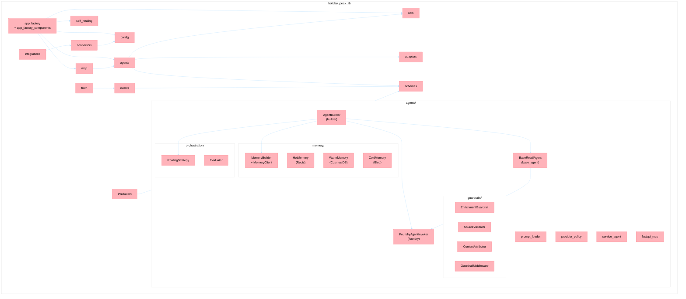
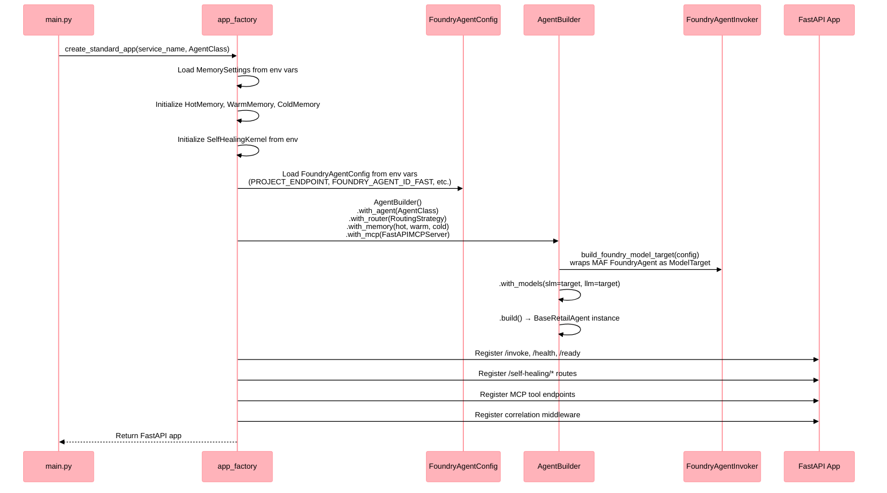
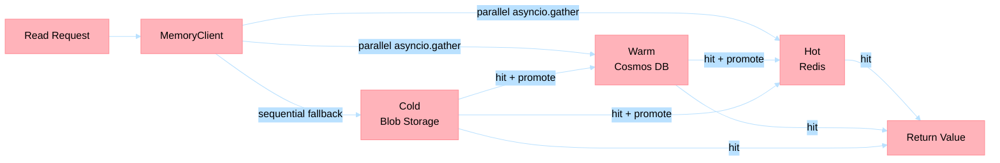

# `holiday-peak-lib` — Core Micro-Framework for Agentic Retail Services

> Last Updated: 2026-04-30


`holiday-peak-lib` is the shared micro-framework that powers every retail agent service in this repository. It provides a single, cohesive abstraction layer over Microsoft Agent Framework (MAF), Azure AI Foundry, three-tier memory, enterprise connectors, resilience patterns, and structured telemetry — enabling 26 domain-specific agent services to stay thin, consistent, and independently deployable while sharing battle-tested infrastructure code.

---

## Why Microsoft Agent Framework (MAF) Lives Here

[Microsoft Agent Framework](https://learn.microsoft.com/en-us/python/api/overview/azure/agent-framework) (`agent-framework>=1.0.1` GA) is the Python runtime that executes [Azure AI Foundry](https://learn.microsoft.com/en-us/azure/ai-studio/) agents. It handles the protocol-level details of agent invocation, tool forwarding, message streaming, and lifecycle management.

Rather than having each of the 26 service apps depend on MAF directly, the lib **wraps MAF behind `FoundryAgentInvoker`** — a thin adapter that turns a Foundry Agent into a `ModelTarget` invoker consumed by `BaseRetailAgent`. This architectural choice delivers concrete benefits:

| Benefit | Detail |
|---------|--------|
| **Single point of upgrade** | When MAF releases a breaking change or a new GA version, **one `pyproject.toml` update** in `lib/src` propagates to all services. In PR #802 (migrating from `FoundryInvoker` to `FoundryAgentInvoker`), all 27 `pyproject.toml` files were updated in a single pass because the abstraction boundary held. |
| **SDK-agnostic base class** | `BaseRetailAgent` extends MAF's `BaseAgent` but adds retail-specific concerns: SLM/LLM routing, three-tier memory, MCP tool exposure, guardrails, and structured telemetry. Agent services never need to understand MAF internals. |
| **Consistent tool forwarding** | Tools registered via `AgentBuilder.with_tool()` are forwarded to the Foundry agent through a standardized interface, avoiding per-service wiring. |
| **Centralized telemetry** | `FoundryTracer` wraps OpenTelemetry with Foundry-aware span attributes, ensuring every agent invocation emits consistent traces to Azure Monitor. |
| **Import isolation** | Agent services import **only from `holiday_peak_lib`** — never directly from `agent_framework` or `agent_framework_foundry`. The lazy import in `base_agent.py` even provides a fallback shim when MAF is unavailable (CI resilience). |

**Reference links:**
- [Microsoft Agent Framework Python API](https://learn.microsoft.com/en-us/python/api/overview/azure/agent-framework)
- [Azure AI Foundry documentation](https://learn.microsoft.com/en-us/azure/ai-studio/)

---

## Architecture Overview



---

## Module Reference

### `agents/` — Agent Runtime

| File / Submodule | Key Exports | Purpose |
|------------------|-------------|---------|
| `base_agent.py` | `BaseRetailAgent`, `AgentDependencies`, `ModelTarget` | Abstract base extending MAF `BaseAgent` with SLM/LLM model selection, complexity heuristics, and retail-specific lifecycle hooks |
| `builder.py` | `AgentBuilder` | Fluent builder composing agents with memory tiers, routing strategy, MCP server, tools, and model targets |
| `foundry.py` | `FoundryAgentConfig`, `FoundryAgentInvoker`, `build_foundry_model_target`, `ensure_foundry_agent` | MAF integration: lazy-imports `agent_framework_foundry.FoundryAgent`, normalizes project endpoints, wraps invocation as `ModelTarget` |
| `prompt_loader.py` | `load_service_prompt_instructions` | Loads structured prompt instruction files per service |
| `provider_policy.py` | `sanitize_messages_for_provider`, `should_use_local_routing_prompt` | Provider-specific message sanitization and routing decision policies |
| `service_agent.py` | `ServiceAgent` | Concrete agent implementation for standard service patterns |
| `fastapi_mcp.py` | MCP-FastAPI bridge | Glue module for MCP tool registration within FastAPI request lifecycle |

### `agents/memory/` — Three-Tier Memory

| File | Key Exports | Purpose |
|------|-------------|---------|
| `hot.py` | `HotMemory` | Redis-backed short-lived context with fail-open degradation |
| `warm.py` | `WarmMemory` | Cosmos DB-backed conversation thread and session state |
| `cold.py` | `ColdMemory` | Azure Blob Storage-backed long-term archival state |
| `builder.py` | `MemoryBuilder`, `MemoryClient`, `MemoryRules` | Unified client with cascading read/write rules, parallel I/O via `asyncio.gather`, and promotion policies |
| `namespace.py` | `NamespaceContext`, `build_canonical_memory_key`, `resolve_namespace_context` | Canonical key construction and namespace isolation for multi-tenant memory |

### `agents/guardrails/` — Enrichment Guardrails

| File | Key Exports | Purpose |
|------|-------------|---------|
| `enrichment_guardrail.py` | `EnrichmentGuardrail`, `SourceValidator`, `ContentAttributor`, `GuardrailMiddleware`, `SourceRef`, `SourceValidationResult` | Validates AI-generated enrichments against source evidence, attributes content provenance, and enforces quality gates in enrichment pipelines |

### `agents/orchestration/` — Routing and Evaluation

| File | Key Exports | Purpose |
|------|-------------|---------|
| `router.py` | `RoutingStrategy` | SLM-first intent routing with complexity-based escalation to LLM; supports tiered handler registration |
| `evaluator.py` | `Evaluator`, `EvaluationResult` | Collects latency and success metrics for agent invocations |

### `adapters/` — Domain Adapters

| File | Key Exports | Purpose |
|------|-------------|---------|
| `base.py` | `BaseAdapter`, `BaseConnector`, `AdapterError` | Abstract adapter and connector contracts |
| `crud_adapter.py` | `BaseCRUDAdapter` | Base adapter for CRUD service interactions |
| `crm_adapter.py` | CRM domain adapter | Customer relationship management operations |
| `inventory_adapter.py` | Inventory domain adapter | Stock levels, warehouse lookups |
| `logistics_adapter.py` | Logistics domain adapter | Shipment tracking, carrier operations |
| `pricing_adapter.py` | Pricing domain adapter | Price retrieval, dynamic pricing |
| `product_adapter.py` | Product domain adapter | Product catalog operations |
| `acp_mapper.py` | `AcpCatalogMapper` | Akeneo Connector Protocol (ACP) mapping |
| `ucp_mapper.py` | `UcpProtocolMapper` | Unified Commerce Protocol (UCP) mapping |
| `protocol_mapper.py` | `ProtocolMapper` | Generic protocol mapping contract |
| `mcp_adapter.py` | `BaseMCPAdapter` | Adapter for agent-to-agent MCP communication |
| `external_api_adapter.py` | `BaseExternalAPIAdapter` | Adapter for external REST API integrations |
| `dam_image_analysis.py` | `DAMImageAnalysisAdapter` | Digital asset management image analysis |
| `truth_store.py` | Truth store adapter | Adapter interface for truth layer persistence |
| `mock_adapters.py` | `MockCRMAdapter`, `MockInventoryAdapter`, `MockLogisticsAdapter`, `MockPricingAdapter`, `MockProductAdapter`, `MockFunnelAdapter` | Test doubles for all domain adapters |

### `app_factory.py` + `app_factory_components/` — Service Assembly

| File | Key Exports | Purpose |
|------|-------------|---------|
| `app_factory.py` | `create_standard_app`, `build_service_app` | FastAPI app assembly with Foundry lifecycle, memory, MCP, self-healing, and event subscriptions |
| `app_factory_components/endpoints.py` | `register_standard_endpoints` | Registers `/invoke`, `/health`, `/ready` and self-healing routes |
| `app_factory_components/foundry_lifecycle.py` | `FoundryLifecycleManager`, `FoundryReadinessSnapshot` | Manages Foundry agent provisioning and readiness checks on startup |
| `app_factory_components/middleware.py` | `register_correlation_middleware` | Correlation ID propagation middleware for distributed tracing |

### `config/` — Configuration

| File | Key Exports | Purpose |
|------|-------------|---------|
| `settings.py` | `MemorySettings`, `ServiceSettings` | Pydantic `BaseSettings` models for memory tiers, AI Search, Event Hub, and Azure Monitor |
| `tenant_config.py` | Tenant configuration | Per-tenant configuration resolution |

### `connectors/` — Enterprise Connector Registry

| File / Submodule | Key Exports | Purpose |
|------------------|-------------|---------|
| `registry.py` | `ConnectorRegistry` | Tenant-aware connector resolution with KeyVault secret integration |
| `tenant_resolver.py` | Tenant resolver | Resolves connector instances per tenant context |
| `tenant_config.py` | Tenant configuration | Connector-level tenant configuration |
| `common/` | Shared connector utilities | Cross-connector helpers |
| `pim/` | PIM connectors | Product Information Management connectors (Akeneo, Salsify) |
| `dam/` | DAM connectors | Digital Asset Management connectors (Cloudinary) |
| `crm_loyalty/` | CRM/Loyalty connectors | CRM and loyalty program connectors |
| `inventory_scm/` | Inventory/SCM connectors | Inventory and supply chain connectors |

### `evaluation/` — Quality Evaluation

| File | Key Exports | Purpose |
|------|-------------|---------|
| `enrichment_evaluator.py` | Enrichment evaluator | Evaluates AI enrichment quality against ground truth |
| `search_evaluator.py` | Search evaluator | Evaluates search relevance and ranking quality |
| `eval_runner.py` | Evaluation runner | Orchestrates evaluation runs across multiple evaluators |

### `events/` — Event Contracts

| File | Key Exports | Purpose |
|------|-------------|---------|
| `connector_events.py` | `ConnectorEvent`, `ProductChanged`, `InventoryUpdated`, `CustomerUpdated`, `OrderStatusChanged`, `PriceUpdated` | Typed event models for connector integrations |
| `retail_events.py` | `RetailEvent`, `OrderEventEnvelope`, `InventoryEventEnvelope`, `ShipmentEventEnvelope`, `PaymentEventEnvelope`, `ProductEventEnvelope`, `UserEventEnvelope`, `ReturnEventEnvelope` | Domain event envelopes with topic routing |
| `versioning.py` | `SchemaCompatibilityPolicy`, `CURRENT_EVENT_SCHEMA_VERSION` | Event schema versioning and compatibility enforcement |

### `integrations/` — Enterprise System Contracts

| File | Key Exports | Purpose |
|------|-------------|---------|
| `contracts.py` | `PIMConnectorBase`, `DAMConnectorBase`, `CRMConnectorBase`, `CommerceConnectorBase`, `InventoryConnectorBase`, `AnalyticsConnectorBase`, `IdentityConnectorBase`, `WorkforceConnectorBase` | Abstract base classes for all enterprise system integrations |
| `pim_generic_rest.py` | `GenericRestPIMConnector`, `PIMConnectionConfig` | Generic REST-based PIM connector for any PIM system |
| `pim_writeback.py` | `PIMWritebackManager`, `WritebackResult`, `WritebackStatus` | Manages product data writeback to PIM systems with circuit breaking |
| `dam_generic.py` | `GenericDAMConnector`, `DAMConnectionConfig` | Generic DAM connector for asset management systems |

### `mcp/` — Model Context Protocol

| File | Key Exports | Purpose |
|------|-------------|---------|
| `server.py` | `FastAPIMCPServer`, `MCPToolSchemaRef` | MCP tool server integrated with FastAPI for agent-to-agent tool exposure |
| `ai_search_indexing.py` | `AISearchIndexingClient`, `register_ai_search_indexing_tools` | AI Search indexing operations exposed as MCP tools |

### `messaging/` — Async Messaging Contracts

| File | Key Exports | Purpose |
|------|-------------|---------|
| `async_contract.py` | `AgentAsyncContract`, `TopicDeclaration` | Observer-based async messaging contract for declaring agent event subscriptions |
| `contract_endpoint.py` | `build_contract_router` | Generates FastAPI router exposing the messaging contract as REST |
| `topic_subject.py` | `TopicSubject` | Reactive subject pattern for topic-based event dispatch |

### `schemas/` — Pydantic v2 Models

| Submodule | Coverage |
|-----------|----------|
| `core.py` | `Product`, `UserContext`, `RecommendationRequest`, `RecommendationResponse` |
| `crm.py` | `CRMAccount`, `CRMContact`, `CRMContext`, `CRMInteraction` |
| `product.py` | `CanonicalProduct`, `CatalogProduct`, `ProductContext` |
| `inventory.py` | `InventoryContext`, `InventoryItem`, `WarehouseStock` |
| `pricing.py` | `PriceContext`, `PriceEntry` |
| `logistics.py` | `LogisticsContext`, `Shipment`, `ShipmentEvent` |
| `search.py` | `IntentClassification`, `SearchEnrichedProduct` |
| `funnel.py` | `FunnelContext`, `FunnelMetric` |
| `truth.py` | `TruthAttribute`, `ProductEnrichmentProposal`, `ProposedAttribute`, `Provenance`, `AuditEvent`, `ExportJob`, `GapReport`, `ProductStyle`, `ProductVariant` |
| `acp.py` | `AcpProduct`, `AcpPartnerProfile` |
| `ucp.py` | `UcpProduct`, `UcpPricing`, `UcpImage`, `UcpMetadata`, `UcpCompliance` |
| `canonical/` | Canonical category and field definitions |
| `categories/` | Category taxonomy schemas |
| `mappings/` | Field mapping definitions (Salsify, Akeneo) |
| `protocols/` | Protocol-specific schema extensions |

### `self_healing/` — Autonomous Self-Healing Runtime

| File | Key Exports | Purpose |
|------|-------------|---------|
| `kernel.py` | `SelfHealingKernel` | Incident lifecycle state machine: detect → classify → remediate → verify → escalate/closed |
| `manifest.py` | `ServiceSurfaceManifest`, `SurfaceEdgeReference` | Declares service surfaces (`api`, `apim`, `aks_ingress`, `mcp`, `messaging`) covered by healing |
| `models.py` | `Incident`, `IncidentState`, `IncidentClass`, `FailureSignal`, `RemediationActionResult`, `SurfaceType` | Domain models for the incident lifecycle |

Feature flags: `SELF_HEALING_ENABLED`, `SELF_HEALING_DETECT_ONLY`, `SELF_HEALING_SURFACE_MANIFEST_JSON`, `SELF_HEALING_RECONCILE_ON_MESSAGING_ERROR`.

Operational routes: `GET /self-healing/status`, `GET /self-healing/incidents`, `POST /self-healing/reconcile`.

### `truth/` — Truth Layer

| File | Key Exports | Purpose |
|------|-------------|---------|
| `models.py` | Truth layer domain models | Core truth layer entity models |
| `schemas.py` | Truth layer schemas | Pydantic schemas for truth layer API contracts |
| `evidence.py` | `EvidenceExtractor`, `EvidenceConfig`, `EnrichmentEvidence` | Extracts and structures evidence for enrichment proposals |
| `store.py` | `TruthStore` | Persistence layer for truth layer entities |
| `event_hub.py` | Truth Event Hub helpers | Event Hub integration for truth layer change events |

### `utils/` — Reliability and Observability

| File | Key Exports | Purpose |
|------|-------------|---------|
| `circuit_breaker.py` | `CircuitBreaker`, `CircuitBreakerOpenError`, `CircuitState` | Async circuit breaker with CLOSED → OPEN → HALF_OPEN recovery |
| `bulkhead.py` | `Bulkhead`, `BulkheadFullError` | Per-workload concurrency isolation via semaphores |
| `rate_limiter.py` | `RateLimiter`, `RateLimitExceededError` | Sliding-window per-tenant rate limiting |
| `retry.py` | `async_retry` | Decorator-based async retry with configurable attempts and delay |
| `compensation.py` | `CompensationAction`, `CompensationResult`, `execute_compensation` | Saga-style compensating transaction framework |
| `event_hub.py` | `EventHubSubscriber`, `EventHubSubscription`, `create_eventhub_lifespan` | Azure Event Hub consumer lifecycle management |
| `correlation.py` | `get_correlation_id`, `set_correlation_id`, `CORRELATION_HEADER` | Distributed correlation ID propagation |
| `telemetry.py` | `FoundryTracer`, `get_foundry_tracer`, `get_tracer`, `get_meter`, `record_metric` | OpenTelemetry wrapper with Foundry-aware span attributes and Azure Monitor integration |
| `logging.py` | `configure_logging`, `log_async_operation` | Structured logging with async operation instrumentation |
| `truth_event_hub.py` | Truth-specific Event Hub helpers | Event Hub utilities for truth layer pipelines |

---

## Agent Lifecycle

The following sequence shows how an agent service boots when `create_standard_app()` is called in each app's `main.py`:



**Step-by-step:**

1. **`create_standard_app()`** is called in each app's `main.py` with the service name and agent class.
2. **`FoundryAgentConfig`** is loaded from environment variables (`PROJECT_ENDPOINT`, `FOUNDRY_AGENT_ID_FAST`, `MODEL_DEPLOYMENT_NAME_FAST`, `FOUNDRY_AGENT_ID_RICH`, `MODEL_DEPLOYMENT_NAME_RICH`).
3. **`AgentBuilder`** composes the agent with tools, memory tiers, routing strategy, guardrails, and MCP server.
4. **`FoundryAgentInvoker`** wraps MAF's `FoundryAgent` as a `ModelTarget` — the agent never touches MAF directly.
5. **FastAPI app** is returned with `/invoke`, `/health`, `/ready`, self-healing routes, and MCP tool endpoints registered.

---

## Three-Tier Memory Architecture



| Tier | Backing Store | Latency | TTL | Use Case |
|------|--------------|---------|-----|----------|
| **Hot** | Azure Cache for Redis | Sub-millisecond | 300s (configurable) | Active conversation context, recent lookups |
| **Warm** | Azure Cosmos DB | Single-digit ms | Configurable | Session history, user profiles, conversation threads |
| **Cold** | Azure Blob Storage | Tens of ms | Indefinite | Long-term archival, audit trails, bulk state snapshots |

**Behavior:**
- **Reads** issue Hot + Warm lookups in **parallel** via `asyncio.gather`. Cold is a sequential fallback for archival data.
- **Cascading promotion**: A warm-only hit promotes the value to hot. A cold-only hit promotes to both hot and warm.
- **Writes** are write-through by default: hot + warm updated in parallel; cold is opt-in via `MemoryRules.write_cold`.
- **Fail-open**: Hot memory degrades gracefully on Redis connection failures — agents continue operating with warm/cold tiers.

### Configuration Environment Variables

| Variable | Description |
|----------|-------------|
| `REDIS_URL` | Full Redis connection URL (e.g., `rediss://:password@host:6380/0`) |
| `REDIS_HOST` | Azure Redis hostname (auto-suffixed with `.redis.cache.windows.net`) |
| `REDIS_PASSWORD` | Redis authentication password |
| `KEY_VAULT_URI` | Azure Key Vault URI for secret resolution (Redis password) |
| `COSMOS_ACCOUNT_URI` | Azure Cosmos DB account endpoint |
| `COSMOS_DATABASE` | Cosmos DB database name |
| `COSMOS_CONTAINER` | Cosmos DB container name |
| `BLOB_ACCOUNT_URL` | Azure Blob Storage account URL |
| `BLOB_CONTAINER` | Blob Storage container name |

---

## Resilience Patterns

### Circuit Breaker

Prevents cascading failures by short-circuiting calls to degraded downstream services. Transitions through CLOSED → OPEN → HALF_OPEN states based on consecutive failure counts and recovery timeouts.

```python
from holiday_peak_lib.utils import CircuitBreaker

breaker = CircuitBreaker(name="catalog-api", failure_threshold=5, recovery_timeout=30.0)

result = await breaker.call(fetch_catalog, product_id="SKU-001")
```

### Bulkhead

Isolates concurrent workloads with per-pipeline semaphores, preventing one slow pipeline from consuming all available threads.

```python
from holiday_peak_lib.utils import Bulkhead

enrichment_bulkhead = Bulkhead(name="enrichment", concurrency_limit=10, queue_timeout=5.0)

result = await enrichment_bulkhead.execute(enrich_product, product_id="SKU-001")
```

### Rate Limiter

Sliding-window per-tenant rate limiting to protect shared resources from noisy neighbors.

```python
from holiday_peak_lib.utils import RateLimiter

limiter = RateLimiter(limit=100, window_seconds=60.0)

await limiter.check(tenant_id="tenant-123")  # raises RateLimitExceededError if over limit
```

### Async Retry

Decorator-based retry with configurable attempts and backoff delay for transient failures.

```python
from holiday_peak_lib.utils import async_retry

@async_retry(times=3, delay_seconds=0.5)
async def fetch_inventory(sku: str) -> dict:
    ...
```

### Compensation (Saga Rollback)

Saga-style compensating transaction framework for multi-step operations that need rollback on partial failure.

```python
from holiday_peak_lib.utils import CompensationAction, execute_compensation

actions = [
    CompensationAction(name="release-reservation", execute=release_reservation),
    CompensationAction(name="refund-payment", execute=refund_payment),
]
result = await execute_compensation(actions, continue_on_error=False)
```

---

## Dependencies

| Package | Version Constraint | Purpose |
|---------|--------------------|---------|
| `agent-framework` | `>=1.0.1` | Microsoft Agent Framework (MAF) GA — Foundry agent execution runtime |
| `azure-ai-projects` | `>=2.0.0b4` | Azure AI Foundry project client for agent provisioning and invocation |
| `fastapi` | latest | Web framework for service endpoints and MCP tool exposition |
| `fastapi-mcp` | latest | FastAPI integration for Model Context Protocol server |
| `uvicorn` | latest | ASGI server for FastAPI services |
| `pydantic` | `>=2` | Data validation and schema modeling (v2) |
| `pydantic-settings` | `>=2` | Environment-based configuration management |
| `httpx` | latest | Async HTTP client for inter-service communication |
| `azure-identity` | latest | Azure credential management (DefaultAzureCredential) |
| `azure-keyvault-secrets` | latest | Key Vault secret resolution for connector credentials |
| `azure-search-documents` | latest | Azure AI Search indexing and querying |
| `azure-cosmos` | latest | Azure Cosmos DB SDK for warm memory tier |
| `azure-storage-blob` | latest | Azure Blob Storage SDK for cold memory tier |
| `azure-eventhub` | latest | Azure Event Hub producer/consumer for event-driven pipelines |
| `azure-monitor-opentelemetry` | `>=1.7.0` | Azure Monitor OpenTelemetry exporter |
| `opentelemetry-api` | `>=1.27.0` | OpenTelemetry tracing and metrics API |
| `opentelemetry-sdk` | `>=1.27.0` | OpenTelemetry SDK implementation |
| `redis` | latest | Redis async client for hot memory tier |
| `asyncpg` | latest | Async PostgreSQL driver |
| `aiohttp` | latest | Async HTTP utilities |
| `pyyaml` | latest | YAML configuration parsing |
| `typing-extensions` | latest | Backported typing features |
| `python-dotenv` | latest | `.env` file loading for local development |

---

## Testing

The lib test suite contains **1,136 tests** (of 1,796 total across the repository) with **89% code coverage**, run via `pytest` with `pytest-asyncio` for async test support.

### Running Tests

From repository root:

```bash
python -m pytest lib/tests
```

Or from the `lib/src` package directory:

```bash
cd lib/src
python -m pytest
```

### Test Module Mapping

| Test File | Module Covered |
|-----------|---------------|
| `test_agents_base.py` | `agents/base_agent.py` — BaseRetailAgent, ModelTarget, AgentDependencies |
| `test_agents_builder.py` | `agents/builder.py` — AgentBuilder composition |
| `test_foundry.py` | `agents/foundry.py` — FoundryAgentInvoker, endpoint normalization |
| `test_prompt_loader.py` | `agents/prompt_loader.py` — Prompt instruction loading |
| `test_provider_policy.py` | `agents/provider_policy.py` — Provider message sanitization |
| `test_service_agent.py` | `agents/service_agent.py` — ServiceAgent implementation |
| `test_memory.py` | `agents/memory/hot.py`, `warm.py`, `cold.py` — Individual memory tiers |
| `test_memory_builder.py` | `agents/memory/builder.py` — MemoryClient cascading logic |
| `test_memory_namespace.py` | `agents/memory/namespace.py` — Canonical key construction |
| `test_guardrails.py` | `agents/guardrails/` — EnrichmentGuardrail, SourceValidator |
| `test_router.py` | `agents/orchestration/router.py` — RoutingStrategy, SLM-first escalation |
| `test_adapters.py` | `adapters/` — BaseAdapter, domain adapter contracts |
| `test_acp_mapper.py` | `adapters/acp_mapper.py` — ACP protocol mapping |
| `test_protocol_mappers.py` | `adapters/protocol_mapper.py`, `ucp_mapper.py` — Protocol mappers |
| `test_app_factory.py` | `app_factory.py` — Service assembly |
| `test_app_factory_endpoints.py` | `app_factory_components/endpoints.py` — Standard endpoints |
| `test_app_factory_foundry_lifecycle.py` | `app_factory_components/foundry_lifecycle.py` — Foundry lifecycle |
| `test_app_factory_middleware.py` | `app_factory_components/middleware.py` — Correlation middleware |
| `test_config.py` | `config/settings.py` — MemorySettings, ServiceSettings |
| `test_tenant_config.py` | `config/tenant_config.py` — Tenant configuration |
| `test_connectors/` | `connectors/` — ConnectorRegistry, tenant resolver |
| `test_tenant_resolver.py` | `connectors/tenant_resolver.py` — Tenant-aware connector resolution |
| `test_connector_events.py` | `events/connector_events.py` — Connector event models |
| `test_retail_events.py` | `events/retail_events.py` — Retail event envelopes |
| `test_schema_registry_guard.py` | `events/versioning.py` — Schema compatibility policy |
| `test_evaluation_metrics.py` | `evaluation/` — Enrichment and search evaluators |
| `test_pim_generic_rest.py` | `integrations/pim_generic_rest.py` — Generic REST PIM connector |
| `test_pim_writeback.py` | `integrations/pim_writeback.py` — PIM writeback manager |
| `test_dam_generic.py` | `integrations/dam_generic.py` — Generic DAM connector |
| `test_akeneo_connector.py` | `connectors/pim/` — Akeneo PIM connector |
| `test_cloudinary_connector.py` | `connectors/dam/` — Cloudinary DAM connector |
| `test_salsify_mappings.py` | `schemas/mappings/` — Salsify field mappings |
| `test_mcp_server.py` | `mcp/server.py` — FastAPIMCPServer |
| `test_ai_search_indexing_mcp.py` | `mcp/ai_search_indexing.py` — AI Search indexing tools |
| `test_schemas.py` | `schemas/` — Core and domain Pydantic models |
| `test_canonical_schemas.py` | `schemas/canonical/` — Canonical category schemas |
| `test_search_schemas.py` | `schemas/search.py` — Search-specific schemas |
| `test_truth_schemas.py` | `truth/schemas.py` — Truth layer schemas |
| `test_truth_evidence.py` | `truth/evidence.py` — Evidence extraction |
| `test_truth_event_hub.py` | `truth/event_hub.py` — Truth Event Hub integration |
| `test_ucp_schema.py` | `schemas/ucp.py` — UCP schema validation |
| `test_self_healing_core.py` | `self_healing/kernel.py`, `models.py` — Core incident lifecycle |
| `test_self_healing_aks_strategy.py` | `self_healing/` — AKS-specific healing strategies |
| `test_self_healing_apim_strategy.py` | `self_healing/` — APIM-specific healing strategies |
| `test_self_healing_messaging_strategy.py` | `self_healing/` — Messaging healing strategies |
| `test_self_healing_verification_escalation.py` | `self_healing/` — Verification and escalation flows |
| `test_circuit_breaker.py` | `utils/circuit_breaker.py` — Circuit breaker states and recovery |
| `test_bulkhead.py` | `utils/bulkhead.py` — Bulkhead concurrency isolation |
| `test_rate_limiter.py` | `utils/rate_limiter.py` — Sliding-window rate limiting |
| `test_retry.py` | `utils/retry.py` — Async retry decorator |
| `test_compensation.py` | `utils/compensation.py` — Saga compensation framework |
| `test_event_hub.py` | `utils/event_hub.py` — Event Hub subscriber lifecycle |
| `test_telemetry.py` | `utils/telemetry.py` — FoundryTracer, metrics, spans |
| `test_utils.py` | `utils/` — General utility helpers |

---

## Installation

From the repository root:

```bash
uv pip install -e "lib/src[dev,test]"
```

Or with all optional groups:

```bash
uv sync --directory lib/src --extra dev --extra test --extra lint
```

For pip-based environments:

```bash
pip install -e "lib/src[dev,test,lint]"
```

---

## Related Documentation

| Resource | Link |
|----------|------|
| Agent architecture (lib) | [docs/architecture/components/libs/agents.md](../docs/architecture/components/libs/agents.md) |
| Memory architecture (lib) | [docs/architecture/components/libs/memory.md](../docs/architecture/components/libs/memory.md) |
| Microsoft Agent Framework | [learn.microsoft.com — Agent Framework Python API](https://learn.microsoft.com/en-us/python/api/overview/azure/agent-framework) |
| Azure AI Foundry | [learn.microsoft.com — Azure AI Studio](https://learn.microsoft.com/en-us/azure/ai-studio/) |
| Azure Cosmos DB | [learn.microsoft.com — Azure Cosmos DB](https://learn.microsoft.com/en-us/azure/cosmos-db/) |
| Azure AI Search | [learn.microsoft.com — Azure AI Search](https://learn.microsoft.com/en-us/azure/search/) |
| Platform architecture | [docs/architecture/](../docs/architecture/) |
